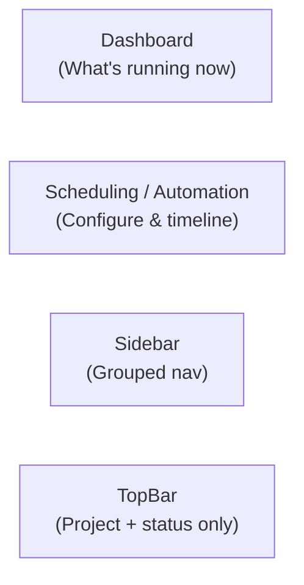

# PRD: Web UI UX Revamp

**Complexity: 7 → HIGH mode**

Score breakdown: +3 (10+ files) +2 (new components) +2 (complex state/real-time data)

---

## 1. Context

**Problem:** The Dashboard is overwhelming (too many widgets, duplicate info) and the Scheduling page is hard to understand (3 tabs with unclear purpose distinctions).

**Files Analyzed:**
- `web/pages/Dashboard.tsx`
- `web/pages/Scheduling.tsx`
- `web/components/Sidebar.tsx`
- `web/components/TopBar.tsx`
- `web/App.tsx`
- `web/components/scheduling/ScheduleTimeline.tsx`
- `web/components/ui/{Button,Card,Badge,Tabs,Switch}.tsx`

**Current Behavior:**
- Dashboard has 7 distinct sections (stat cards, System Status card, Process Status card with 5 rows, Scheduling summary card with 5 rows, Board widget) — all visible simultaneously
- "System Status" card shows Project/Provider/Last Updated — info redundant with the TopBar
- "Scheduling" summary widget on Dashboard duplicates the Scheduling page
- Scheduling page uses 3 tabs named "Overview", "Schedules", "Jobs" — "Overview" and "Schedules" sound nearly identical, causing confusion
- "Jobs" tab is a tiny page (just 5 toggles) that doesn't warrant its own tab
- Sidebar has 7 flat items with no grouping or labels — everything appears equally important
- **Process state is not shared:** Dashboard owns the only SSE subscription (`useStatusStream`) and a local `streamedStatus` state. `Logs.tsx` makes its own independent `useApi(fetchStatus)` HTTP poll. These two can show contradictory process status (e.g., Executor running on Dashboard, Idle in Logs). Any future page that needs process status adds yet another independent poll.

---

## 2. Solution

**Approach:**
- **Shared state (Phase 0):** Lift `IStatusSnapshot` into the Zustand store. Single SSE subscription in `App.tsx` via `useStatusSync` hook. All pages read from the store — no contradictory process status across pages.
- **Dashboard**: Remove low-value widgets (System Status card, Scheduling summary), compress the 5-process list into a compact Agent Status bar with inline controls. Make the page answer: "What's happening right now?"
- **Scheduling**: Replace 3 ambiguous tabs with a single scrollable page. Extract the schedule editor from Settings into a shared `ScheduleConfig` component used by both pages (DRY). No more hidden redirect to Settings to edit schedules.
- **Sidebar**: Add section labels to group nav items visually, rename "Scheduling" to "Automation" (it controls enablement too, not just timing)
- **TopBar**: Remove the redundant Settings icon (Settings is already in the sidebar)

**Architecture Diagram:**


**Key Decisions:**
- Keep all existing data-fetching logic (`useApi`, `useStatusStream`, SSE) — only restructure the render layer
- No new API calls needed; all data is already fetched
- Reuse all existing `ui/` components (Card, Button, Switch, etc.)
- Move Job toggles into the Agent cards on the Scheduling page (inline toggle = enable/disable right next to schedule)

**Data Changes:** None — store gains `status: IStatusSnapshot | null`, no schema changes

---

## 3. Integration Points

```
How will this feature be reached?
✅ Entry point: existing routes (/, /scheduling, sidebar)
✅ No new routes needed
✅ No new API surface needed
✅ User-facing: YES — all changes are visual
```

---

## 4. Execution Phases

---

### Phase 0: Shared status state — single source of truth for process/system status

**Why first:** Phases 1 and 2 both render process status. If the state is not unified before those rewrites, each page will continue managing its own poll/SSE independently and showing different values.

**Files (max 5):**
- `web/store/useStore.ts` — add `status` + `setStatus` to the store
- `web/hooks/useStatusSync.ts` — new hook: owns SSE subscription + polling, writes to store
- `web/App.tsx` — call `useStatusSync()` at app root (single subscription for the whole app)
- `web/pages/Dashboard.tsx` — remove local SSE/polling, read `status` from store
- `web/pages/Logs.tsx` — remove independent `fetchStatus` call, read `status` from store

**Implementation:**

- [ ] `useStore.ts`: add two fields to `AppState`:
  ```ts
  status: IStatusSnapshot | null;
  setStatus: (s: IStatusSnapshot) => void;
  ```
  Initialize `status: null`. `setStatus` uses `pickLatestSnapshot` to only update when the incoming snapshot is newer than the stored one (prevents stale SSE payload overwriting a fresher poll result). Import `IStatusSnapshot` from `@shared/types`.

- [ ] `useStatusSync.ts`: new hook that extracts the logic currently in `Dashboard.tsx`:
  ```ts
  export const useStatusSync = () => {
    const { setStatus, setProjectName, selectedProjectId, globalModeLoading } = useStore();
    // 1. useApi(fetchStatus) with 30s polling + window focus refetch → calls setStatus
    // 2. useStatusStream(snapshot => setStatus(snapshot)) for SSE fast path
    // 3. useEffect on status: update projectName when status.projectName changes
  };
  ```
  This is a direct move of the relevant `useEffect`/`useApi`/`useStatusStream` calls from Dashboard — no logic changes.

- [ ] `App.tsx`: add `useStatusSync()` call at the top of the `App` component (after `useGlobalMode()`). This ensures the subscription is alive regardless of which route is active.

- [ ] `Dashboard.tsx`:
  - Remove `useApi(fetchStatus, ...)`, the `streamedStatus` local state, `useStatusStream`, `pickLatestSnapshot`, the 30s polling `useEffect`, and the window-focus `useEffect`
  - Replace with: `const currentStatus = useStore((s) => s.status);`
  - Remove `loading`/`error` from fetchStatus (status is now always available from store after first load; handle `status === null` with a loading state)
  - Keep all handlers (`handleCancelProcess`, `handleForceClear`, `handleStartProcess`) — they call `refetch` after; replace that refetch with a store read (status auto-updates via SSE)

- [ ] `Logs.tsx`:
  - Remove `useApi(fetchStatus, ...)`
  - Replace with: `const status = useStore((s) => s.status);`
  - The `isProcessRunning` check reads from the same shared state

**Tests Required:**
| Test File | Test Name | Assertion |
|-----------|-----------|-----------|
| `web/src/__tests__/useStatusSync.test.ts` | `writes SSE snapshot to store` | `setStatus` called with snapshot payload |
| `web/src/__tests__/useStatusSync.test.ts` | `does not downgrade to older snapshot` | Store retains newer timestamp when stale SSE arrives |
| `web/src/__tests__/Dashboard.test.tsx` | `reads process status from store, not local state` | No `useState(streamedStatus)` — uses store value |

**User Verification:**
- Action: Open Dashboard (Executor shows "Running"), then navigate to Logs tab
- Expected: Logs page shows Executor as "Running" — same state, no flicker or contradiction

**Checkpoint:** Run `prd-work-reviewer` agent after this phase.

---

### Phase 1: Dashboard Cleanup — Focused overview of what's happening right now

**Files (max 5):**
- `web/pages/Dashboard.tsx` — major rewrite of render section only
- `web/components/dashboard/AgentStatusBar.tsx` — new compact component

**Implementation:**

- [ ] Create `web/components/dashboard/AgentStatusBar.tsx`:
  - Props: `processes: IStatusSnapshot['processes']`, `activePrd: string | null`, handlers for run/stop/clear
  - Renders a horizontal grid (2-col on mobile, 5-col on desktop) of agent pills
  - Each pill: colored status dot (pulsing if running) + agent name + either "Idle" or truncated PID/PRD info
  - Action on click: shows a small inline popover/dropdown with "Run" or "Stop" + "View Log" links
  - Or simpler: each pill has a tiny Run/Stop icon button directly inline (no popover)
  - Keep all existing handler logic, just change the visual layout

- [ ] Rewrite `Dashboard.tsx` render section:
  - **Keep:** 4 stat cards (top row) — but rename "Cron Status" → "Automation" and show Active/Paused status
  - **Remove:** "System Status" card (project/provider/lastUpdated) — this info is in TopBar and is low-value
  - **Replace:** The 5-row verbose "Process Status" card → `<AgentStatusBar>` (compact, same data)
  - **Remove:** The "Scheduling" summary card (5-row list of next run times) — users go to /scheduling for this
  - **Keep:** "GitHub Board" widget (already compact, useful at-a-glance)
  - **Add:** Under stat cards, a single "Next Automation Run" line (1 line: "Next: Executor in 12 min") as a teaser linking to /scheduling

**Result layout:**
```
[Board Ready] [In Progress] [Open PRs] [Automation: Active]
[AgentStatusBar: Executor ●  Reviewer ●  QA ●  Auditor ●  Planner ●]
[Next automation: Executor in 12 min → Manage Schedules]
[GitHub Board widget]
```

**Tests Required:**
| Test File | Test Name | Assertion |
|-----------|-----------|-----------|
| `web/src/__tests__/AgentStatusBar.test.tsx` | `renders idle state for all agents when none running` | All pills show idle state |
| `web/src/__tests__/AgentStatusBar.test.tsx` | `shows running state with pulse when process is running` | Pulse class present, PID shown |
| `web/src/__tests__/AgentStatusBar.test.tsx` | `calls onStop handler when stop button clicked` | Mock called once |

**User Verification:**
- Action: Open `/` (Dashboard)
- Expected: Page no longer shows "System Status" card or "Scheduling" summary card. Agent status is compact (one row or small grid, not 5 separate full-width cards). Cron status card now shows "Active" or "Paused".

**Checkpoint:** Run `prd-work-reviewer` agent after this phase.

---

### Phase 2: Extract `ScheduleConfig` component (DRY) — shared schedule editor for Scheduling + Settings

**Root problem:** Settings has a fully-featured schedule editing UI (Template/Custom mode, `CronScheduleInput` for all 5 jobs, Scheduling Priority, Global Queue toggle, Extra Start Delay). The Scheduling page's "Edit" buttons silently redirect to `Settings?tab=schedules` — a hidden, jarring flow. Users on the Scheduling page have no obvious way to know where schedule editing lives.

**Solution:** Extract the schedule editor from `Settings.tsx` into a standalone `ScheduleConfig` component. Both the Scheduling page and Settings use it — same component, no duplication.

**Files (max 5):**
- `web/components/scheduling/ScheduleConfig.tsx` — new shared component (extracted from Settings)
- `web/pages/Settings.tsx` — replace schedule tab inline JSX with `<ScheduleConfig />`
- `web/pages/Scheduling.tsx` — embed `<ScheduleConfig />` directly as a page section (no redirect)

**Component interface for `ScheduleConfig`:**
```tsx
interface IScheduleConfigProps {
  form: ConfigForm;                        // the editable config form state
  scheduleMode: 'template' | 'custom';
  selectedTemplateId: string | null;
  onFieldChange: (field: keyof ConfigForm, value: unknown) => void;
  onSwitchToTemplate: () => void;
  onSwitchToCustom: () => void;
  onApplyTemplate: (tpl: IScheduleTemplate) => void;
  allProjectConfigs: Array<{ projectId: string; config: INightWatchConfig }>;
  currentProjectId: string | null;
  onEditJob: (projectId: string, jobType: string) => void;  // for ScheduleTimeline click-through
}
```

**What to extract into `ScheduleConfig`:**
- The Template / Custom toggle buttons
- The `SCHEDULE_TEMPLATES` grid (template picker)
- The `CronScheduleInput` grid (custom cron editors for all 5 jobs)
- The Scheduling Priority `<Select>`, Global Queue `<Switch>`, Extra Start Delay `<Input>`
- The `<ScheduleTimeline>` (currently duplicated — Settings has it in schedules tab, Scheduling has it in the Overview tab)

**Settings.tsx changes:**
- Replace the inline JSX inside the `schedules` tab `content:` with `<ScheduleConfig ...>` passing existing state/handlers
- No logic changes, just moves JSX into the component

**Scheduling.tsx changes (flat layout):**

Replace the `<Tabs>` component entirely. New page structure:

```
Section A: Global Controls
  [Automation: Active/Paused]  [Schedule Bundle label]  [Pause/Resume button]

Section B: Agents (merged Schedules + Jobs)
  5 cards (2-col grid): icon + name + Switch toggle + schedule desc + next run + delay note

Section C: Configure Schedules  ← NEW — was hidden in Settings
  <ScheduleConfig /> — shows template picker or custom cron inputs + priority/queue/delay settings
  With a "Save & Install" button below it

Section D: Queue Analytics (collapsible, hidden by default)
  [Running] [Pending] [Avg Wait] [Throttled]
  <ProviderBucketSummary />
```

**Form state in Scheduling.tsx:**
- The Scheduling page needs its own local `form` state (copy from current config on load, same pattern as Settings)
- On "Save & Install": call `updateConfig(form)` then `triggerInstallCron()` (same as Settings save flow)
- Reuse `scheduleMode`, `selectedTemplateId`, `applyTemplate`, `switchToTemplateMode`, `switchToCustomMode` logic — copy the same state shape from Settings

**Implementation steps:**
- [ ] Create `web/components/scheduling/ScheduleConfig.tsx` with the interface above; move JSX from Settings `schedules` tab content into it
- [ ] Update `Settings.tsx`: replace the inlined schedule tab JSX with `<ScheduleConfig ...>`; verify Settings still works identically
- [ ] In `Scheduling.tsx`: add `form` state (mirror Settings pattern), add `scheduleMode`/`selectedTemplateId` state
- [ ] Delete `overviewTab`, `schedulesTab`, `jobsTab` variables
- [ ] Write new flat `return` JSX: Section A (global controls) → Section B (agent cards with Switch+schedule+nextRun) → Section C (`<ScheduleConfig />` + Save button) → Section D (collapsible queue)
- [ ] Remove the `navigate('/settings?tab=schedules...')` redirect from `handleEditJobOnTimeline` — it now scrolls to Section C instead
- [ ] Add `expandedQueue` local state (default `false`) for the collapsible queue section

**Tests Required:**
| Test File | Test Name | Assertion |
|-----------|-----------|-----------|
| `web/src/__tests__/ScheduleConfig.test.tsx` | `renders template picker by default` | Template cards visible |
| `web/src/__tests__/ScheduleConfig.test.tsx` | `switches to custom cron inputs on Custom click` | CronScheduleInput fields visible |
| `web/src/__tests__/Scheduling.test.tsx` | `shows all 5 agent cards` | 5 agent name elements rendered |
| `web/src/__tests__/Scheduling.test.tsx` | `agent toggle calls handleJobToggle` | Mock API called with correct job |
| `web/src/__tests__/Scheduling.test.tsx` | `ScheduleConfig section visible without clicking tabs` | Schedule config rendered directly on page |

**User Verification:**
- Action: Open `/scheduling`
- Expected: No tabs. Scroll down past agents → see "Configure Schedules" section inline. Can edit schedules without going to Settings. Settings → Schedules tab still works identically (same component).

**Checkpoint:** Run `prd-work-reviewer` agent after this phase.

---

### Phase 3: Sidebar Navigation Grouping — Visual hierarchy for nav items

**Files (max 5):**
- `web/components/Sidebar.tsx` — add section labels, rename one item

**Implementation:**

- [ ] Rename "Scheduling" nav item label to **"Automation"** and update its `path` to `/scheduling` (path stays the same, only label changes)
- [ ] Add section labels between nav groups. Current flat list becomes:

```
── OVERVIEW ──
  Home (Dashboard)
  Logs

── WORK ──
  Board
  Pull Requests
  Roadmap

── AUTOMATION ──
  Automation (was: Scheduling)

── CONFIG ──
  Settings
```

- [ ] In `navItems` array, add a `section?: string` field to mark where section headers appear:
  ```ts
  { icon: Home, label: 'Dashboard', path: '/', section: 'Overview' },
  { icon: Terminal, label: 'Logs', path: '/logs' },
  { icon: Kanban, label: 'Board', path: '/board', section: 'Work' },
  { icon: GitPullRequest, label: 'Pull Requests', path: '/prs', badge: openPrCount },
  { icon: Map, label: 'Roadmap', path: '/roadmap' },
  { icon: Calendar, label: 'Automation', path: '/scheduling', section: 'Automation' },
  { icon: Settings, label: 'Settings', path: '/settings', section: 'Config' },
  ```
- [ ] Render section labels as `<li>` with `text-[10px] font-bold text-slate-600 uppercase tracking-widest px-3.5 pt-4 pb-1` only when sidebar is NOT collapsed
- [ ] Section labels hidden when sidebar is collapsed (collapsed mode shows only icons)

**Tests Required:**
| Test File | Test Name | Assertion |
|-----------|-----------|-----------|
| `web/src/__tests__/Sidebar.test.tsx` | `shows section labels when expanded` | "OVERVIEW", "WORK", "AUTOMATION", "CONFIG" visible |
| `web/src/__tests__/Sidebar.test.tsx` | `hides section labels when collapsed` | No section label text visible in collapsed state |
| `web/src/__tests__/Sidebar.test.tsx` | `Scheduling item label is now Automation` | Nav link text is "Automation" |

**User Verification:**
- Action: Open any page, look at the sidebar
- Expected: 4 clear group labels visible. "Scheduling" is now labeled "Automation". Groups make it immediately obvious where Board/PRs live vs configuration vs logs.

**Checkpoint:** Run `prd-work-reviewer` agent after this phase.

---

### Phase 4: TopBar Cleanup — Remove redundant icons

**Files (max 5):**
- `web/components/TopBar.tsx`

**Implementation:**

- [ ] Read `TopBar.tsx` first to confirm what the Settings icon currently does (likely just `navigate('/settings')`)
- [ ] Remove the Settings icon button from TopBar (Settings is already the bottom nav item in sidebar — duplicate)
- [ ] If the Bell (notifications) icon has no implementation behind it, remove it too (or keep as placeholder — confirm with codebase)
- [ ] Keep: Project name + connection status (left) + search box (center)
- [ ] The search box can remain as a placeholder (do not implement search — YAGNI)

**Tests Required:**
| Test File | Test Name | Assertion |
|-----------|-----------|-----------|
| `web/src/__tests__/TopBar.test.tsx` | `does not render Settings icon button` | No button with Settings icon |

**User Verification:**
- Action: Look at the TopBar on any page
- Expected: Cleaner header. No redundant Settings icon. Project name + connection status clearly visible on the left.

**Checkpoint:** Run `prd-work-reviewer` agent after this phase.

---

## 5. Verification Strategy

Each phase runs `yarn verify` and the phase-specific tests. The prd-work-reviewer agent is spawned after each phase.

**Running tests:**
```bash
cd /home/joao/projects/night-watch-cli
yarn verify
yarn workspace night-watch-web test --run
```

---

## 6. Acceptance Criteria

- [ ] Phase 0: Single SSE subscription in App; `status` in Zustand store; Dashboard + Logs read from store — process state is consistent across all pages
- [ ] Phase 1: Dashboard no longer has "System Status" card or "Scheduling summary" card; Process Status is compact
- [ ] Phase 2: `ScheduleConfig` component extracted; Scheduling page has no tabs; schedule editing is inline (no redirect to Settings)
- [ ] Phase 3: Sidebar shows section group labels; "Scheduling" renamed to "Automation"
- [ ] Phase 4: TopBar Settings icon removed
- [ ] All `yarn verify` passes after each phase
- [ ] All specified tests pass
- [ ] No regressions: existing process start/stop/cancel, schedule edit, job toggle, SSE streaming all still work
