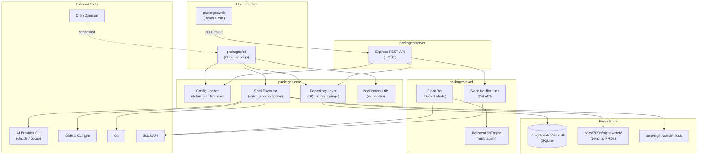
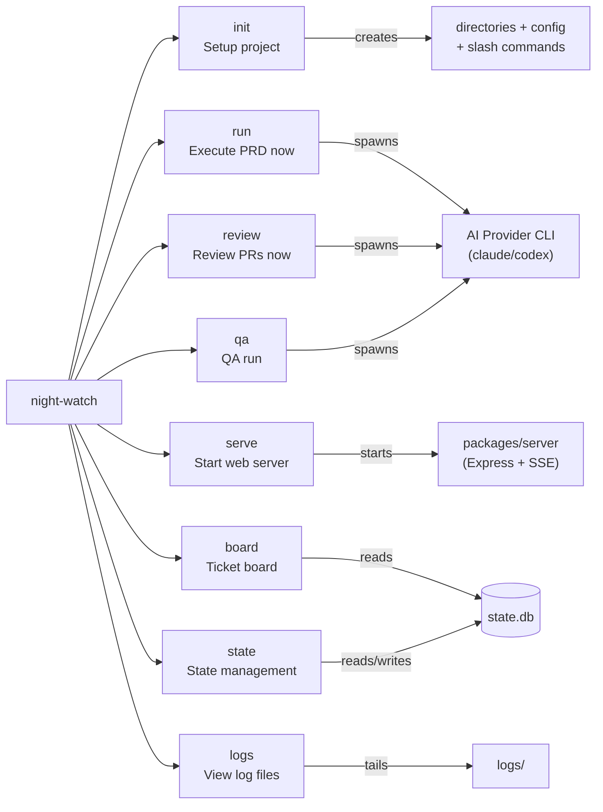
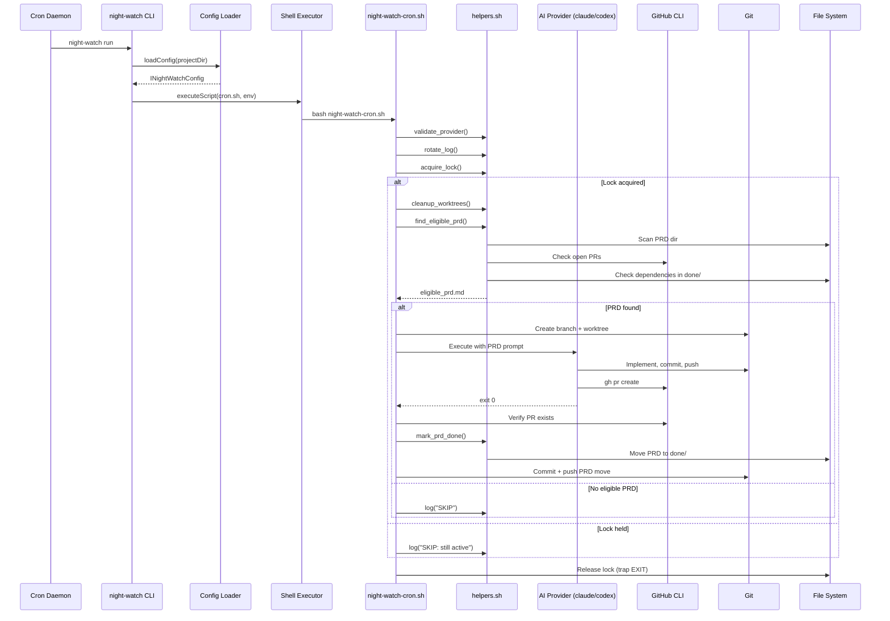
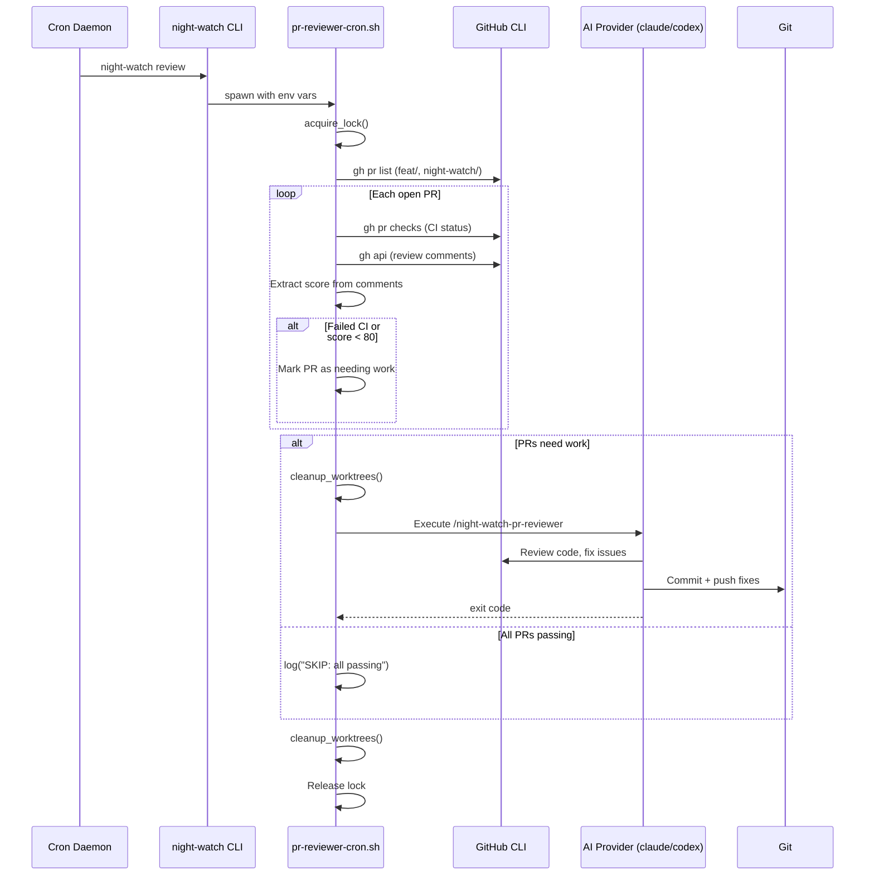
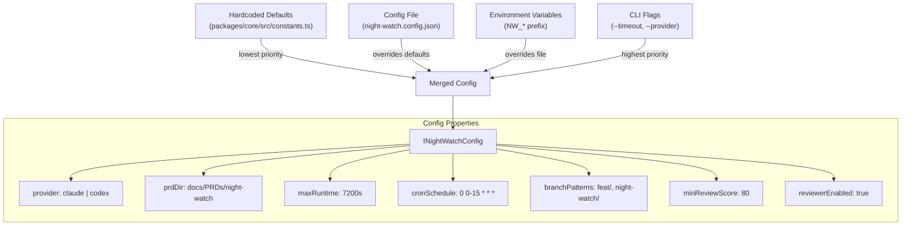
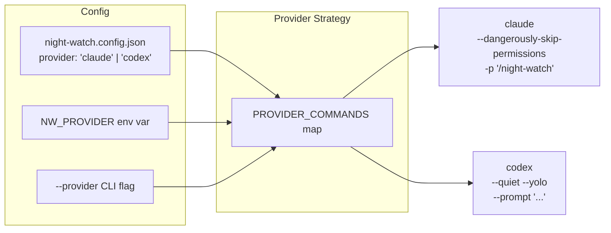
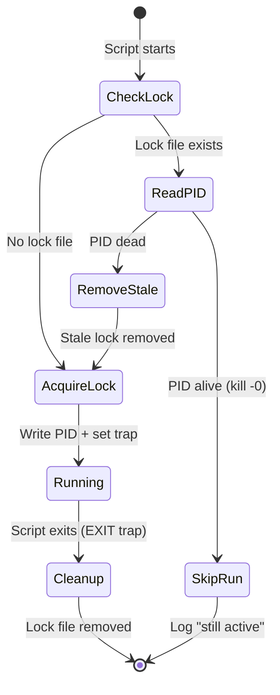
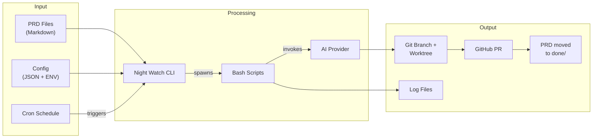
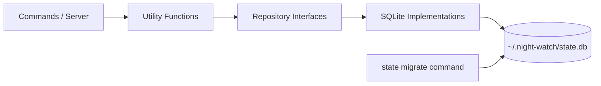

# Night Watch CLI - Architecture Overview

Night Watch CLI is an autonomous PRD executor that uses AI provider CLIs (Claude, Codex) combined with cron scheduling to automatically implement PRD tickets, open pull requests, and fix CI failures.

---

## High-Level Architecture



---

## CLI Command Structure



---

## PRD Execution Flow



---

## PR Review Flow



---

## Configuration Cascade



---

## Provider Abstraction



---

## Lock & Process Management



---

## Directory Structure

```
night-watch-cli/                    # Yarn workspaces monorepo
├── packages/
│   ├── core/                       # Domain logic (private)
│   │   └── src/
│   │       ├── agents/             # Soul/Style/Skill compiler → system prompts
│   │       ├── board/              # Roadmap + ticket management
│   │       ├── config.ts           # Hierarchical config loader
│   │       ├── constants.ts        # DEFAULT_*, VALID_* constants
│   │       ├── di/
│   │       │   └── container.ts    # tsyringe composition root
│   │       ├── storage/
│   │       │   ├── repositories/   # Interfaces + SQLite implementations
│   │       │   └── sqlite/         # DB client + migrations
│   │       ├── templates/          # PRD/slicer prompt templates
│   │       ├── types.ts            # Shared TypeScript interfaces
│   │       └── utils/              # notify, shell, registry, roadmap…
│   ├── cli/                        # Published npm package
│   │   └── src/
│   │       ├── cli.ts              # Commander.js program setup
│   │       └── commands/           # init, run, review, qa, serve, board…
│   ├── server/                     # REST API + SSE (private)
│   │   └── src/
│   │       ├── index.ts            # startServer / startGlobalServer
│   │       ├── middleware/         # error-handler, graceful-shutdown, SSE
│   │       ├── routes/             # agents, prds, board, slack…
│   │       └── services/           # notification.service
│   ├── slack/                      # Slack bot (private)
│   │   └── src/
│   │       ├── client.ts           # SlackClient (WebClient wrapper)
│   │       ├── deliberation.ts     # DeliberationEngine
│   │       ├── factory.ts          # createSlackStack()
│   │       ├── interaction-listener/ # Socket Mode event routing
│   │       ├── notify.ts           # sendSlackBotNotification()
│   │       └── proactive-loop.ts   # Proactive message scheduler
│   └── web/                        # React SPA source (private)
├── web/                            # Vite build root → web/dist/ (served by server)
├── docs/PRDs/                      # PRD storage (pending + done/)
├── logs/                           # Runtime logs
├── package.json                    # Workspace root
├── turbo.json                      # Turbo build pipeline
└── vitest.config.ts
```

---

## Data Flow Summary



---

## Key Design Decisions

| Decision             | Choice                        | Rationale                                                 |
| -------------------- | ----------------------------- | --------------------------------------------------------- |
| CLI framework        | Commander.js                  | Lightweight, well-established, single dependency          |
| Core logic           | Bash scripts                  | Battle-tested for process management, git ops, lock files |
| Node.js wrapper      | TypeScript                    | Distribution via npm, config management, type safety      |
| Scheduling           | System crontab                | No daemon to manage, works on any Unix system             |
| Isolation            | Git worktrees                 | Parallel execution without polluting the main tree        |
| Concurrency control  | PID lock files                | Simple, reliable, auto-cleanup via bash trap              |
| Provider abstraction | Strategy pattern              | Easy to add new AI provider CLIs                          |
| Config hierarchy     | Defaults < File < Env < Flags | Standard precedence, 12-factor friendly                   |
| Persistence layer    | SQLite via repository pattern | Structured state with enforced architectural boundary     |

---

## Persistence Architecture

Night Watch uses a layered persistence architecture backed by SQLite. All SQL operations are confined to `packages/core/src/storage/**` and enforced at lint time.



### Layers

| Layer                  | Location                                                 | Responsibility                                           |
| ---------------------- | -------------------------------------------------------- | -------------------------------------------------------- |
| Commands / Server      | `packages/cli/src/commands/**`, `packages/server/src/**` | User-facing logic; calls utility functions only          |
| Utility Functions      | `packages/core/src/utils/**`                             | Business logic; accesses state via repository interfaces |
| Repository Interfaces  | `packages/core/src/storage/repositories/interfaces.ts`   | Persistence contracts; no SQL                            |
| SQLite Implementations | `packages/core/src/storage/repositories/sqlite/**`       | Concrete SQL implementations                             |
| SQLite Client          | `packages/core/src/storage/sqlite/client.ts`             | Database connection and setup                            |
| Migrations             | `packages/core/src/storage/sqlite/migrations.ts`         | Schema versioning                                        |

### Repository Interfaces

- `IProjectRegistryRepository` — registered project paths
- `IExecutionHistoryRepository` — PRD execution records and cooldown tracking
- `IPrdStateRepository` — per-PRD workflow state (e.g. `pending-review`)
- `IRoadmapStateRepository` — roadmap scan metadata

### Boundary Enforcement

- All `better-sqlite3` imports are restricted to `packages/core/src/storage/**` by an ESLint `no-restricted-imports` rule in `eslint.config.js`
- Any attempt to import `better-sqlite3` outside the storage layer will produce a lint error:
  `SQL access is restricted to src/storage/**. Use repository interfaces instead.`
- The `state` command (`packages/cli/src/commands/state.ts`) manages SQLite state operations

### Verifying the Boundary

Run the following to confirm no raw SQL or `better-sqlite3` imports exist outside the storage layer:

```bash
rg -n "SELECT|INSERT|UPDATE|DELETE|better-sqlite3" packages/core/src --glob '!packages/core/src/storage/**'
```

This should return zero results.
