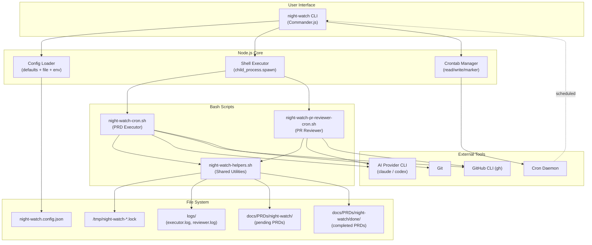
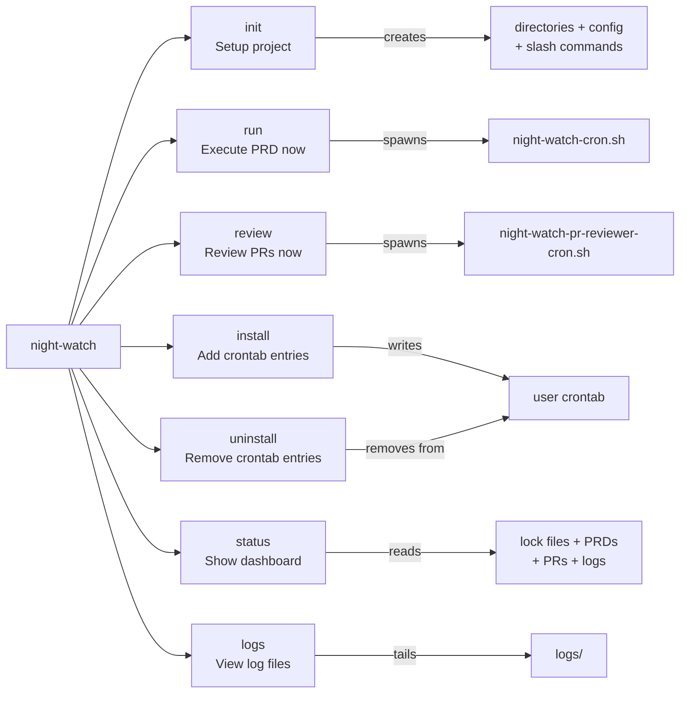
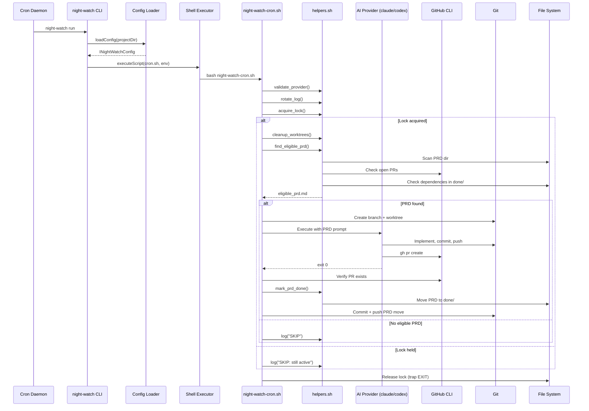
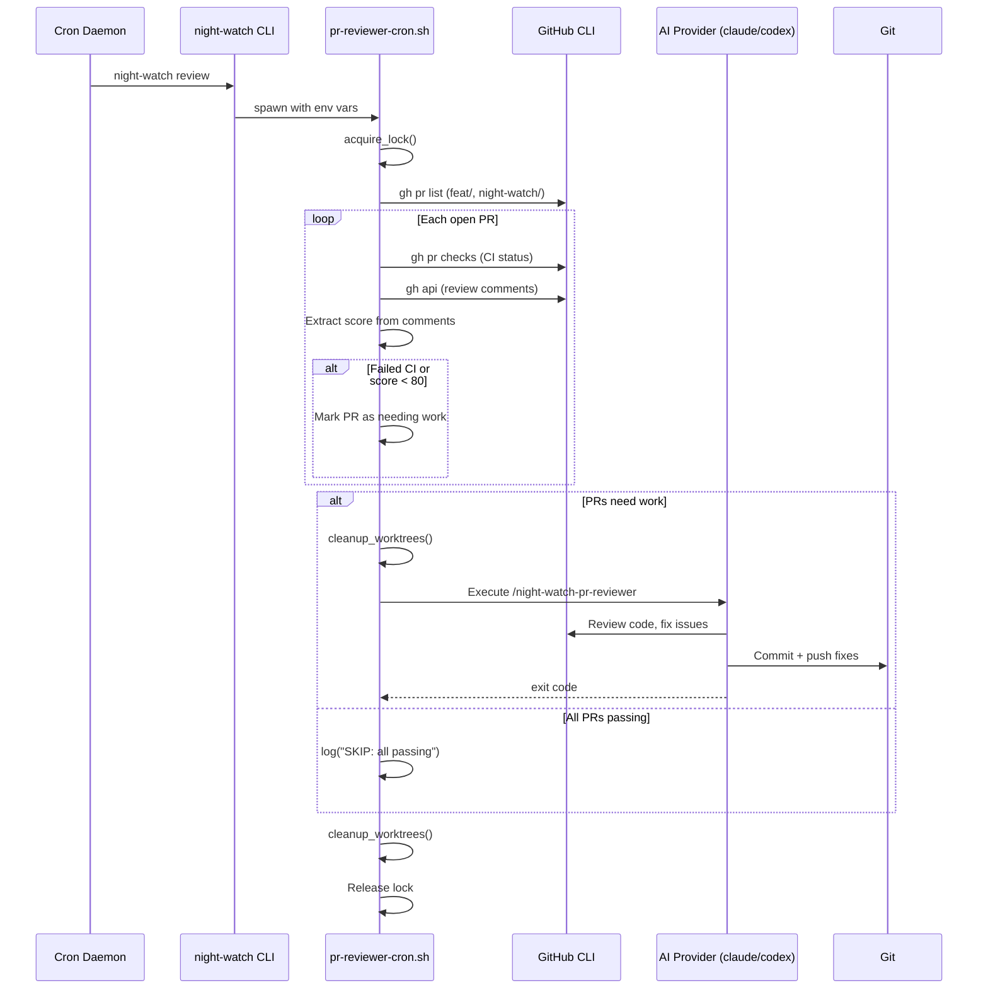
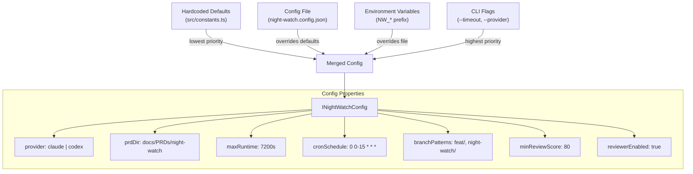
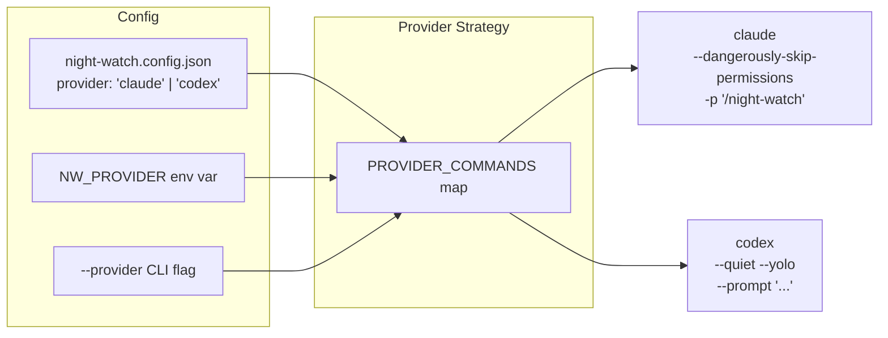
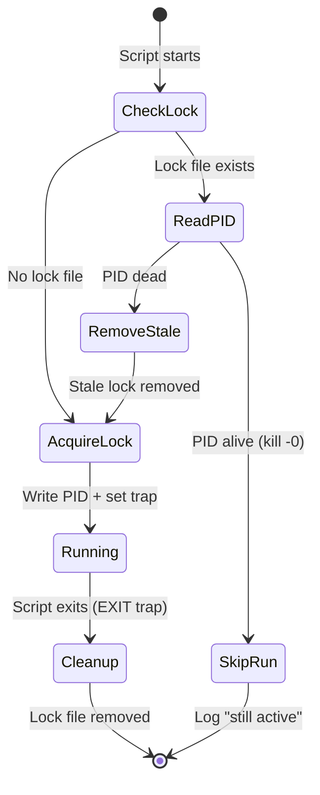
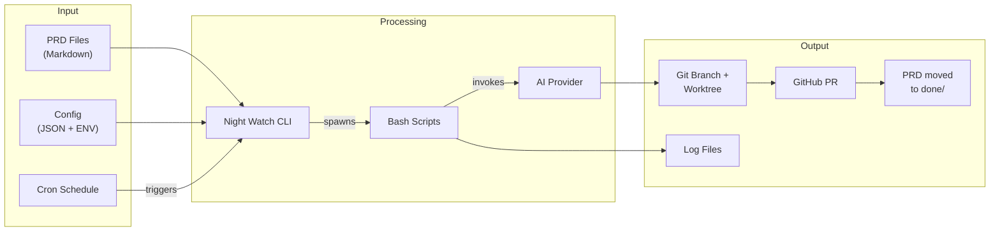

# Night Watch CLI - Architecture Overview

Night Watch CLI is an autonomous PRD executor that uses AI provider CLIs (Claude, Codex) combined with cron scheduling to automatically implement PRD tickets, open pull requests, and fix CI failures.

---

## High-Level Architecture



---

## CLI Command Structure



---

## PRD Execution Flow



---

## PR Review Flow



---

## Configuration Cascade



---

## Provider Abstraction



---

## Lock & Process Management



---

## Directory Structure

```
night-watch-cli/
├── bin/
│   └── night-watch.mjs            # ESM entry point (shebang)
├── src/
│   ├── cli.ts                     # Commander.js program setup
│   ├── types.ts                   # INightWatchConfig, Provider type
│   ├── constants.ts               # Defaults, PROVIDER_COMMANDS map
│   ├── config.ts                  # Hierarchical config loader
│   ├── commands/
│   │   ├── init.ts                # Project scaffolding
│   │   ├── run.ts                 # PRD executor dispatch
│   │   ├── review.ts              # PR reviewer dispatch
│   │   ├── install.ts             # Crontab entry creation
│   │   ├── uninstall.ts           # Crontab entry removal
│   │   ├── status.ts              # Health dashboard
│   │   └── logs.ts                # Log viewer (tail -f)
│   └── utils/
│       ├── shell.ts               # Bash subprocess wrapper
│       └── crontab.ts             # Crontab CRUD operations
├── scripts/
│   ├── night-watch-cron.sh        # PRD executor logic
│   ├── night-watch-pr-reviewer-cron.sh  # PR reviewer logic
│   └── night-watch-helpers.sh     # Shared bash functions
├── templates/
│   ├── night-watch.md             # Slash command for executor
│   ├── night-watch-pr-reviewer.md # Slash command for reviewer
│   └── night-watch.config.json    # Config template
├── docs/PRDs/                     # PRD storage
├── logs/                          # Runtime logs
├── package.json
├── tsconfig.json
└── vitest.config.ts
```

---

## Data Flow Summary



---

## Key Design Decisions

| Decision | Choice | Rationale |
|----------|--------|-----------|
| CLI framework | Commander.js | Lightweight, well-established, single dependency |
| Core logic | Bash scripts | Battle-tested for process management, git ops, lock files |
| Node.js wrapper | TypeScript | Distribution via npm, config management, type safety |
| Scheduling | System crontab | No daemon to manage, works on any Unix system |
| Isolation | Git worktrees | Parallel execution without polluting the main tree |
| Concurrency control | PID lock files | Simple, reliable, auto-cleanup via bash trap |
| Provider abstraction | Strategy pattern | Easy to add new AI provider CLIs |
| Config hierarchy | Defaults < File < Env < Flags | Standard precedence, 12-factor friendly |
