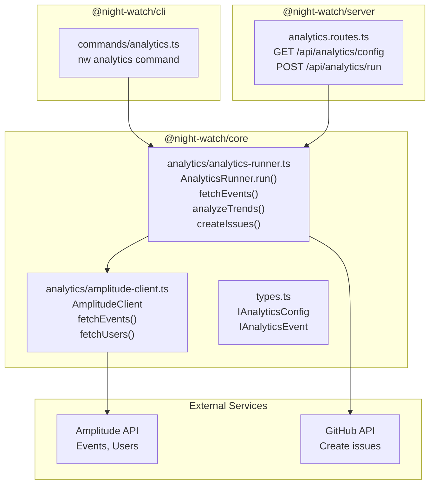
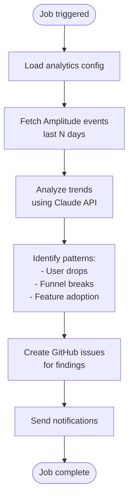

# Analytics Job Architecture

The Analytics job analyzes product analytics data (Amplitude) and creates GitHub issues for trending patterns or anomalies. It runs on a weekly schedule by default.

---

## Component Overview



---

## Job Configuration

```typescript
interface IAnalyticsConfig extends IBaseJobConfig {
  enabled: boolean;
  schedule: string; // Default: "0 6 * * 1" (weekly Monday 6am)
  maxRuntime: number; // Default: 900 (15 minutes)

  // Analytics-specific fields
  lookbackDays: number; // Default: 7
  targetColumn: string; // Default: "Draft" (GitHub Projects column)
  analysisPrompt: string; // Optional custom analysis prompt
}
```

Env override examples:

- `NW_ANALYTICS_ENABLED=true`
- `NW_ANALYTICS_LOOKBACK_DAYS=14`
- `NW_ANALYTICS_TARGET_COLUMN=Ready`

---

## Analytics Flow



---

## Amplitude Client

```typescript
class AmplitudeClient {
  constructor(apiKey: string, apiSecret: string);

  fetchEvents(options: {
    startDate: string;
    endDate: string;
    events?: string[];
  }): Promise<IAnalyticsEvent[]>;

  fetchUsers(userIds: string[]): Promise<IUser[]>;
}
```

Event structure:

```typescript
interface IAnalyticsEvent {
  event_type: string;
  user_id: string;
  time: number;
  event_properties?: Record<string, unknown>;
  user_properties?: Record<string, unknown>;
}
```

---

## Analysis Patterns

The job uses Claude to analyze events and detect:

1. **User Drop-offs**: Sudden decreases in active users
2. **Funnel Breaks**: Conversion rate drops in key flows
3. **Feature Adoption**: New feature usage trends
4. **Anomalies**: Statistical outliers in metrics

Example issue created:

```
Title: [Analytics] User drop-off detected - Week of 2026-03-15

Body:
- Active users dropped 23% vs previous week
- Key event `checkout_completed` down 31%
- Possible cause: Deploy on 2026-03-14 introduced regression
- Recommendation: Investigate recent checkout flow changes
```

---

## Key File Locations

| File                                              | Purpose                                        |
| ------------------------------------------------- | ---------------------------------------------- |
| `packages/core/src/analytics/analytics-runner.ts` | Main analytics job runner                      |
| `packages/core/src/analytics/amplitude-client.ts` | Amplitude API client                           |
| `packages/core/src/analytics/amplitude-types.ts`  | Analytics type definitions                     |
| `packages/core/src/analytics/index.ts`            | Barrel exports                                 |
| `packages/cli/src/commands/analytics.ts`          | CLI command: `nw analytics`                    |
| `packages/server/src/routes/analytics.routes.ts`  | Analytics API routes                           |
| `packages/core/src/jobs/job-registry.ts`          | Analytics job registry entry                   |
| `web/api.ts`                                      | `fetchAnalyticsConfig()`, `triggerAnalytics()` |
| `web/pages/Settings.tsx`                          | Analytics job settings UI                      |

---

## CLI Commands

```bash
# Run analytics job manually
nw analytics run

# Show analytics configuration
nw analytics config

# Test Amplitude connection
nw analytics test
```

---

## Web Integration

The Analytics job appears in:

- **Scheduling page**: Enable/disable, set schedule
- **Settings page**: Configure lookback days, target column, analysis prompt
- **Dashboard**: Shows last run status and any created issues

The job is **disabled by default** (`enabled: false`) since it requires Amplitude credentials.
