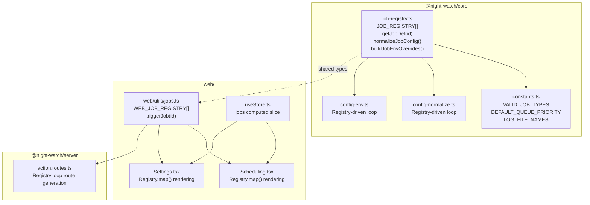
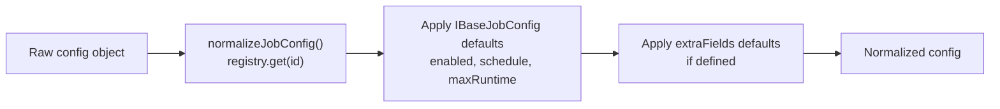
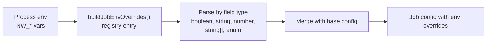

# Job Registry Architecture

The Job Registry is the single source of truth for all job type metadata, defaults, and configuration patterns. It reduces the cost of adding a new job type from touching 15+ files to just 2-3 files.

---

## Component Overview



---

## Job Definition Interface

```typescript
interface IJobDefinition<TConfig extends IBaseJobConfig = IBaseJobConfig> {
  id: JobType;
  name: string;
  description: string;
  cliCommand: string;
  logName: string;
  lockSuffix: string;
  queuePriority: number;
  envPrefix: string;
  extraFields?: IExtraFieldDef[];
  defaultConfig: TConfig;
}
```

All jobs extend `IBaseJobConfig`:

```typescript
interface IBaseJobConfig {
  enabled: boolean;
  schedule: string;
  maxRuntime: number;
}
```

---

## Registered Jobs

| Job Type  | Name      | CLI Command | Priority | Env Prefix     |
| --------- | --------- | ----------- | -------- | -------------- |
| executor  | Executor  | `run`       | 50       | `NW_EXECUTOR`  |
| reviewer  | Reviewer  | `review`    | 40       | `NW_REVIEWER`  |
| slicer    | Slicer    | `planner`   | 30       | `NW_SLICER`    |
| qa        | QA        | `qa`        | 20       | `NW_QA`        |
| audit     | Auditor   | `audit`     | 10       | `NW_AUDIT`     |
| analytics | Analytics | `analytics` | 10       | `NW_ANALYTICS` |

---

## Config Normalization Flow



The registry-driven normalization replaces per-job blocks in `config-normalize.ts`:

**Before (per-job blocks):**

```typescript
// QA job normalization
if (raw.qa) {
  normalized.qa = {
    enabled: raw.qa.enabled ?? true,
    schedule: raw.qa.schedule ?? '45 2,10,18 * * *',
    maxRuntime: raw.qa.maxRuntime ?? 3600,
    branchPatterns: raw.qa.branchPatterns ?? [],
    artifacts: raw.qa.artifacts ?? 'both',
    // ... more fields
  };
}
```

**After (registry-driven):**

```typescript
for (const jobDef of JOB_REGISTRY) {
  const rawJob = raw[jobDef.id];
  if (rawJob) {
    normalized[jobDef.id] = normalizeJobConfig(rawJob, jobDef);
  }
}
```

---

## Env Override Flow



Env var naming: `{envPrefix}_{FIELD_UPPER_SNAKE}`

Examples:

- `NW_QA_ENABLED` → `qa.enabled`
- `NW_QA_BRANCH_PATTERNS` → `qa.branchPatterns`
- `NW_QA_ARTIFACTS` → `qa.artifacts` (enum validation)

---

## Web Job Registry

The web-side registry extends the core registry with UI-specific fields:

```typescript
interface IWebJobDefinition extends IJobDefinition {
  icon: string; // lucide icon name
  triggerEndpoint: string; // '/api/actions/qa'
  scheduleTemplateKey: string;
  settingsSection?: 'general' | 'advanced';
}
```

This enables:

- Generic `triggerJob(jobId)` instead of per-job `triggerRun()`, `triggerReview()`, etc.
- Dynamic rendering of Scheduling and Settings pages via `WEB_JOB_REGISTRY.map()`

---

## Key File Locations

| File                                          | Purpose                                                               |
| --------------------------------------------- | --------------------------------------------------------------------- |
| `packages/core/src/jobs/job-registry.ts`      | Core registry, `JOB_REGISTRY`, utility functions                      |
| `packages/core/src/jobs/index.ts`             | Barrel exports                                                        |
| `packages/core/src/config-normalize.ts`       | Registry-driven normalization loop                                    |
| `packages/core/src/config-env.ts`             | Registry-driven env override loop                                     |
| `packages/core/src/constants.ts`              | Derives `VALID_JOB_TYPES`, `DEFAULT_QUEUE_PRIORITY`, `LOG_FILE_NAMES` |
| `packages/cli/src/commands/run.ts`            | Uses `getJobDef()` for executor dispatch                              |
| `packages/server/src/routes/action.routes.ts` | Generates routes from registry                                        |
| `web/utils/jobs.ts`                           | Web-side job registry                                                 |
| `web/api.ts`                                  | Generic `triggerJob(jobId)` function                                  |
| `web/pages/Scheduling.tsx`                    | Renders job cards from `WEB_JOB_REGISTRY`                             |
| `web/pages/Settings.tsx`                      | Renders job settings from `WEB_JOB_REGISTRY`                          |
| `web/store/useStore.ts`                       | Zustand `jobs` computed slice                                         |

---

## Adding a New Job Type

With the registry, adding a new job requires only:

1. **Core registry entry** (`packages/core/src/jobs/job-registry.ts`):

```typescript
{
  id: 'metrics',
  name: 'Metrics',
  description: 'Generates metrics reports',
  cliCommand: 'metrics',
  logName: 'metrics',
  lockSuffix: '-metrics.lock',
  queuePriority: 10,
  envPrefix: 'NW_METRICS',
  defaultConfig: {
    enabled: false,
    schedule: '0 6 * * 1',
    maxRuntime: 900,
  },
}
```

2. **CLI command** (`packages/cli/src/commands/metrics.ts`)

3. **Web registry entry** (`web/utils/jobs.ts`)

All other layers (normalization, env parsing, UI rendering, API routes) are automatically handled by the registry.
