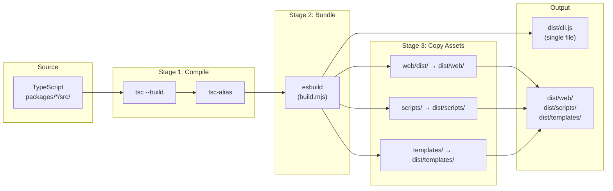
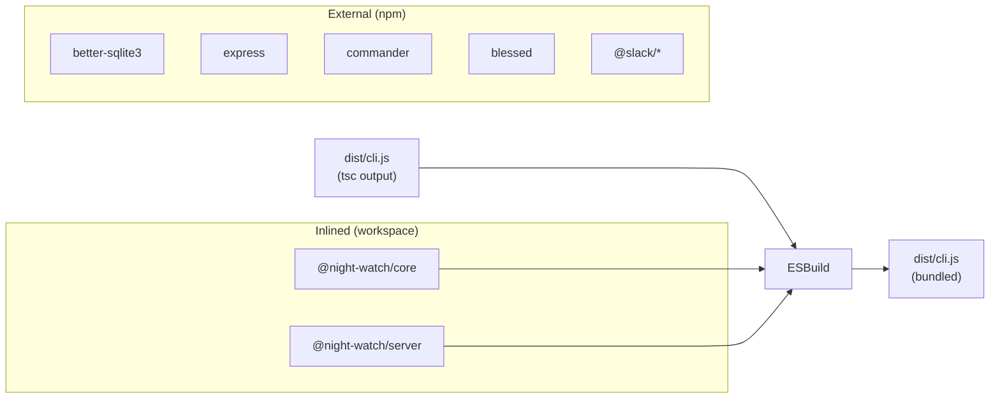
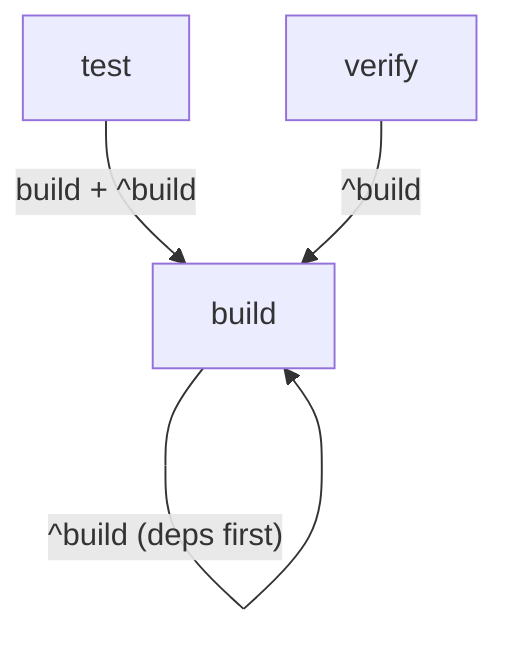
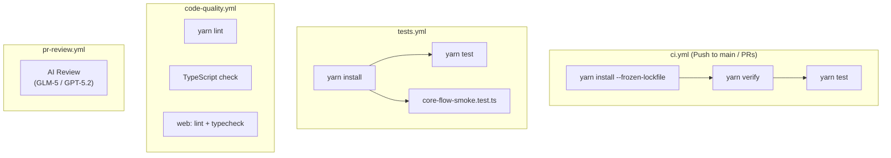
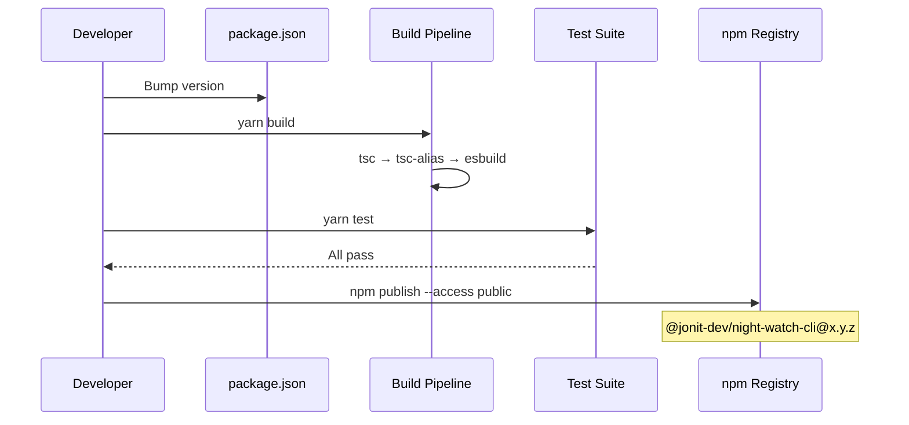

# Build Pipeline

How Night Watch is compiled, bundled, tested, and published.

> Related: [CLI Package](cli-package.md) | [DEV-ONBOARDING](DEV-ONBOARDING.md) | [Local Testing](local-testing.md)

---

## Overview



---

## Build Stages

### Stage 1: TypeScript Compilation

```bash
tsc --build          # Compile all packages (incremental)
tsc-alias            # Resolve @night-watch/* path aliases to relative paths
```

TypeScript uses project references (`tsconfig.json` → `references`). Each package has its own `tsconfig.json` extending the shared `tsconfig.base.json`.

**Base config** (`tsconfig.base.json`):

- Target: ES2022
- Module: NodeNext
- Strict mode: true
- Decorators + decorator metadata: enabled (for tsyringe)

### Stage 2: esbuild Bundling

**File:** `packages/cli/build.mjs`

The bundler inlines workspace packages and keeps npm dependencies external:



**Key esbuild options:**

- **Entry:** `dist/cli.js`
- **Platform:** Node.js ESM
- **Packages:** `'external'` — npm dependencies NOT bundled
- **Banner:** `import 'reflect-metadata'` injected first (tsyringe requires it)
- **Minification:** Disabled (debuggability)
- **Source maps:** Disabled

**Custom workspace plugin:** Resolves `@night-watch/*` imports to their pre-compiled `dist/` files. Supports both package-level (`@night-watch/core`) and subpath (`@night-watch/core/notify.js`) imports.

### Stage 3: Asset Copying

After bundling, three asset directories are copied into `dist/`:

| Source       | Destination       | Purpose                    |
| ------------ | ----------------- | -------------------------- |
| `web/dist/`  | `dist/web/`       | Web dashboard static files |
| `scripts/`   | `dist/scripts/`   | Bash cron scripts          |
| `templates/` | `dist/templates/` | PRD templates              |

All copies use `dereference: true` for symlink resolution.

---

## Build Commands

```bash
# Build everything (all packages via Turbo)
yarn build

# Type-check only (no emit)
yarn verify

# Build CLI package specifically
cd packages/cli && yarn build

# Development mode (no build, runs from source via tsx)
yarn dev -- run --dry-run
```

---

## Turbo Task Graph

**File:** `turbo.json`



- `build` depends on `^build` (upstream packages build first)
- `test` depends on local `build` + upstream `^build`
- `verify` depends on upstream `^build` only
- Outputs cached: `dist/**`

---

## CI/CD Pipeline

### GitHub Actions



**PR Review Bot:** Uses `jonit-dev/openrouter-github-action` with GLM-5 model. Scores PRs on a 0-100 scale. PRs scoring below `minReviewScore` (default 80) are flagged.

### Pre-Commit Hooks

Husky + lint-staged runs on every commit:

- TypeScript/JavaScript: ESLint --fix + Prettier --write
- JSON/Markdown/YAML: Prettier --write

---

## Publishing to npm



The `prepublishOnly` script ensures build + test pass before publishing.

**Published files:**

```
dist/            # Bundled CLI + assets
bin/             # night-watch.mjs entry point
scripts/         # Bash cron scripts
templates/       # PRD templates
```

**Not published:** `src/`, tests, tsconfig, dev dependencies.

---

## Known Gotchas

### Stale `.tsbuildinfo`

TypeScript incremental caches can mask stale builds. Delete and rebuild:

```bash
find . -name '*.tsbuildinfo' -delete
yarn build
```

### `import.meta.url` in Bundled Code

After esbuild inlines workspace packages, `import.meta.url` resolves to the bundle file (`dist/cli.js`), not the original source file. Use directory traversal from the known bundle location instead of relative `../..` paths.

### `better-sqlite3` Must Stay External

It ships with a native `.node` binary that cannot be bundled by esbuild. It remains an npm dependency that users install normally.

### `reflect-metadata` Banner

tsyringe requires `reflect-metadata` imported before any decorated class. The esbuild banner ensures this runs first in the bundle:

```javascript
banner: {
  js: "import 'reflect-metadata';";
}
```

---

## Related Docs

- [CLI Package](cli-package.md) — What gets built
- [Local Testing](local-testing.md) — Testing without publishing
- [DEV-ONBOARDING](DEV-ONBOARDING.md) — Getting started
- [Contributing](contributing.md) — Development workflow
