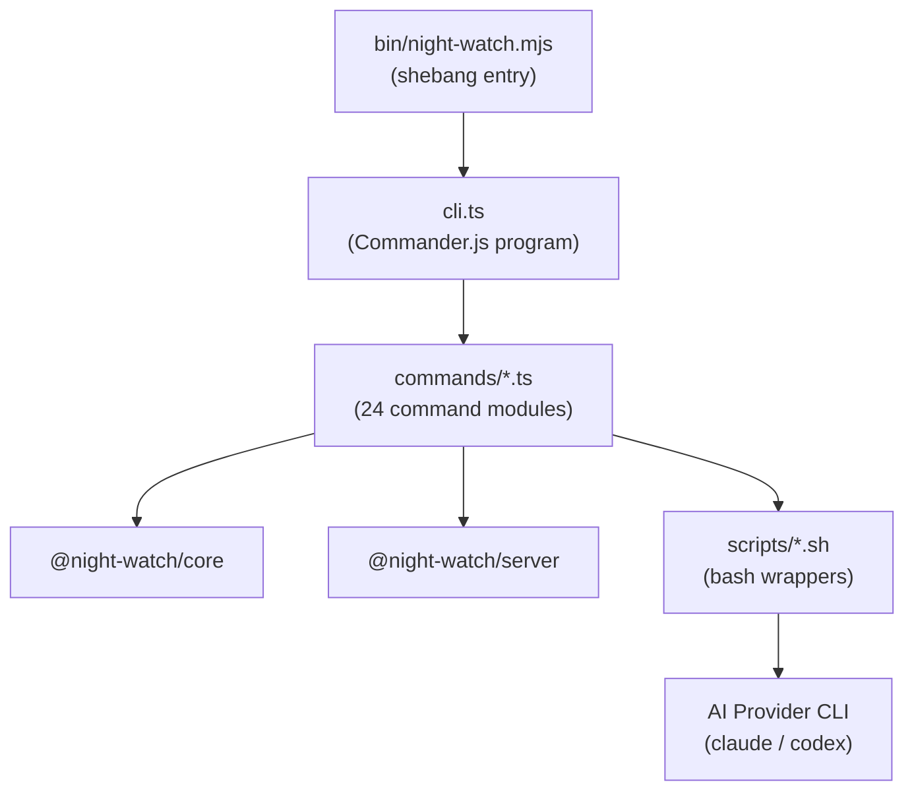
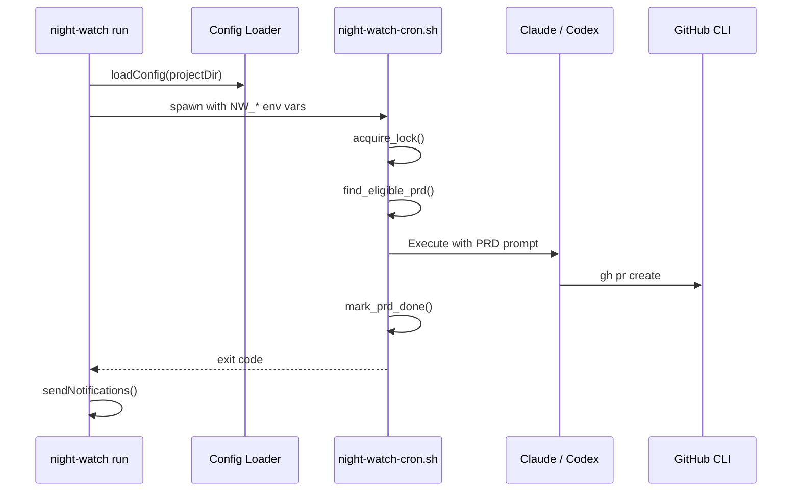

# CLI Package (`@jonit-dev/night-watch-cli`)

The CLI is the published entry point to Night Watch. It uses Commander.js to expose 24 commands that orchestrate PRD execution, PR review, cron management, and the web dashboard.

> Related: [Commands Reference](commands.md) | [Configuration](configuration.md) | [Core Package](core-package.md) | [Build Pipeline](build-pipeline.md)

---

## Architecture



### Command Registration Pattern

Every command follows the same structure:

```typescript
// packages/cli/src/commands/my-command.ts
import { Command } from 'commander';
import { loadConfig } from '@night-watch/core';

export function myCommand(program: Command): void {
  program
    .command('my-command')
    .description('Does something useful')
    .option('--dry-run', 'Preview without executing')
    .action(async (options) => {
      const config = loadConfig(process.cwd());
      // ... command logic
    });
}
```

Then registered in `cli.ts`:

```typescript
import { myCommand } from './commands/my-command.js';
myCommand(program);
```

### Script Execution Pattern

Execution commands (`run`, `review`, `qa`, `audit`, `slice`) don't invoke AI directly. They delegate to bash scripts that handle locking, worktree creation, and provider invocation:



---

## All 24 Commands

### Core Execution

| Command  | Purpose                         | Script                               |
| -------- | ------------------------------- | ------------------------------------ |
| `run`    | Execute next eligible PRD       | `night-watch-pr-executor-cron.sh`    |
| `review` | Review + fix open PRs           | `night-watch-pr-reviewer-cron.sh`    |
| `qa`     | Generate tests for reviewed PRs | `night-watch-qa-cron.sh`             |
| `audit`  | AI-driven code quality scan     | `night-watch-audit-cron.sh`          |
| `slice`  | Convert roadmap items to PRDs   | `night-watch-roadmap-slicer-cron.sh` |

### Cron Management

| Command     | Purpose                                     |
| ----------- | ------------------------------------------- |
| `install`   | Add crontab entries for automated execution |
| `uninstall` | Remove crontab entries                      |

### Status & Monitoring

| Command   | Purpose                                          |
| --------- | ------------------------------------------------ |
| `status`  | Show project status (processes, PRDs, PRs, logs) |
| `logs`    | View executor/reviewer log output                |
| `history` | Query execution history (used by bash scripts)   |
| `doctor`  | Validate environment setup                       |

### Configuration

| Command  | Purpose                          |
| -------- | -------------------------------- |
| `init`   | Interactive project setup wizard |
| `update` | Update config field values       |

### PRD Management

| Command     | Purpose                             |
| ----------- | ----------------------------------- |
| `prd`       | Create, list, remove, claim PRDs    |
| `prds`      | Query multiple PRDs with filtering  |
| `prd-state` | Query PRD claim/workflow states     |
| `retry`     | Move PRD from done/ back to pending |

### PR Management

| Command  | Purpose                                    |
| -------- | ------------------------------------------ |
| `prs`    | List open PRs with status                  |
| `cancel` | Cancel running executor/reviewer processes |

### Web UI & Dashboard

| Command     | Purpose                                  |
| ----------- | ---------------------------------------- |
| `serve`     | Start Express API server (web dashboard) |
| `dashboard` | Terminal UI dashboard (blessed)          |

### Board & State

| Command | Purpose                             |
| ------- | ----------------------------------- |
| `board` | GitHub Projects board integration   |
| `state` | State management + SQLite migration |

---

## Key Command Details

### `init` — Project Setup

Creates everything needed for Night Watch:

- `docs/PRDs/night-watch/done/` directory
- `night-watch.config.json` with detected defaults
- `.claude/commands/night-watch.md` slash command
- `.claude/commands/night-watch-pr-reviewer.md` slash command
- `logs/` directory (added to .gitignore)

### `run` / `review` — Provider Invocation

Both commands:

1. Load config with full cascade
2. Build environment variables (`NW_*` prefix)
3. Map provider to command: `claude --dangerously-skip-permissions -p '/night-watch'` or `codex --quiet --yolo`
4. Spawn bash script with spinner feedback
5. Parse exit code and send webhook notifications

### `serve` — Web Server

Starts the Express API server from `@night-watch/server`:

- Default port: 7575
- Single-project mode: `night-watch serve`
- Multi-project mode: `night-watch serve --global`
- Lock file prevents duplicate servers
- Serves web UI from `dist/web/`

### `dashboard` — Terminal UI

Blessed-based TUI with tabs: Status, Config, Schedules, Actions, Logs. Auto-refreshes every 10 seconds.

---

## Package Configuration

**File:** `packages/cli/package.json`

```
Name:    @jonit-dev/night-watch-cli
Version: 1.7.37
Node:    >= 22.0.0
Type:    module (ESM)
Bin:     night-watch → ./bin/night-watch.mjs
```

### Key Dependencies

| Dependency           | Purpose                                 |
| -------------------- | --------------------------------------- |
| `commander`          | CLI framework                           |
| `better-sqlite3`     | Native SQLite (kept external in bundle) |
| `blessed`            | Terminal UI                             |
| `chalk`              | Colored output                          |
| `ora`                | Spinners                                |
| `express`            | Web server                              |
| `@slack/socket-mode` | Slack webhook notifications             |
| `tsyringe`           | Dependency injection                    |

---

## Integration with Other Packages

### Imports from `@night-watch/core`

```typescript
import {
  loadConfig,
  INightWatchConfig,
  PROVIDER_COMMANDS,
  sendNotifications,
  getScriptPath,
  executeScriptWithOutput,
  createSpinner,
  fetchStatusSnapshot,
} from '@night-watch/core';
```

### Imports from `@night-watch/server`

```typescript
import { startServer, startGlobalServer } from '@night-watch/server';
```

At build time, both packages are inlined into a single `dist/cli.js` bundle. See [Build Pipeline](build-pipeline.md) for details.

---

## Related Docs

- [Commands Reference](commands.md) — Usage examples for every command
- [Configuration](configuration.md) — Full config field reference
- [Build Pipeline](build-pipeline.md) — How the CLI is bundled and published
- [Server API](server-api.md) — The REST API started by `serve`
- [Core Package](core-package.md) — Domain logic the CLI depends on
