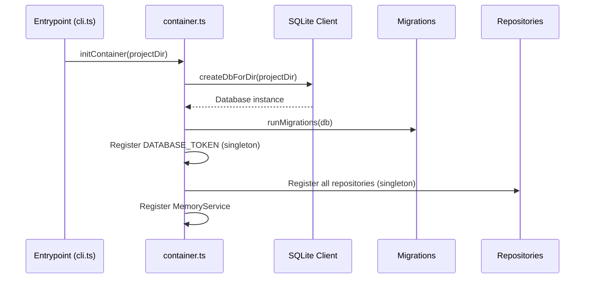
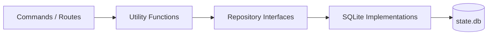
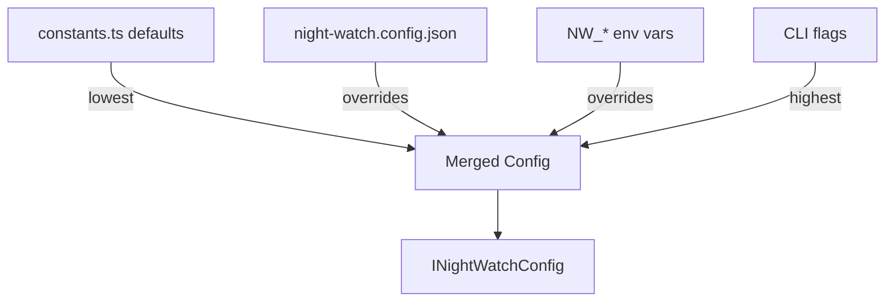

# Core Package (`@night-watch/core`)

The core package contains all domain logic, storage, configuration, and shared types. Both `cli` and `server` depend on it.

> Related: [Architecture Overview](architecture-overview.md) | [Persona System](persona-memory-system.md) | [DEV-ONBOARDING](DEV-ONBOARDING.md)

---

## Package Structure

```
packages/core/src/
├── agents/
│   └── soul-compiler.ts        # Persona → system prompt compiler
├── board/
│   └── board-provider.ts       # GitHub Projects integration
├── di/
│   └── container.ts            # tsyringe composition root
├── shared/
│   └── types.ts                # Agent persona interfaces (IAgentPersona, etc.)
├── storage/
│   ├── repositories/
│   │   ├── interfaces.ts       # Repository contracts
│   │   ├── index.ts            # Factory + backward-compat getRepositories()
│   │   └── sqlite/             # Concrete implementations
│   └── sqlite/
│       ├── client.ts           # DB connection + pragmas
│       └── migrations.ts       # Schema versioning
├── templates/                  # PRD/slicer prompt templates
├── utils/
│   ├── logger.ts               # Structured logger
│   ├── avatar-generator.ts     # Replicate Flux avatar generation
│   ├── notify.ts               # Webhook notification sender
│   ├── shell.ts                # Script execution helpers
│   ├── registry.ts             # Project registry utils
│   ├── roadmap-context-compiler.ts # Roadmap → prompt context
│   └── ...
├── config.ts                   # Hierarchical config loader
├── constants.ts                # DEFAULT_* / VALID_* constants
├── types.ts                    # INightWatchConfig + notification types
└── index.ts                    # Selective barrel exports
```

---

## Dependency Injection

### Container Setup

The DI container is initialized once at application startup via `initContainer(projectDir)`.



**File:** `packages/core/src/di/container.ts`

**Registered tokens:**

| Token / Class                      | Type      | Purpose                  |
| ---------------------------------- | --------- | ------------------------ |
| `DATABASE_TOKEN`                   | Database  | SQLite database instance |
| `SqliteAgentPersonaRepository`     | Singleton | Agent persona CRUD       |
| `SqliteExecutionHistoryRepository` | Singleton | PRD execution records    |
| `SqlitePrdStateRepository`         | Singleton | Per-PRD workflow state   |
| `SqliteProjectRegistryRepository`  | Singleton | Registered project paths |
| `SqliteRoadmapStateRepository`     | Singleton | Roadmap scan metadata    |

### Using DI

```typescript
import { container } from 'tsyringe';
import { SqliteAgentPersonaRepository } from '@night-watch/core';

// Resolve from container
const repo = container.resolve(SqliteAgentPersonaRepository);
const personas = repo.getActive();
```

### Backward Compatibility

The `getRepositories()` factory works without explicit DI initialization. It falls back to the global singleton DB path (`~/.night-watch/state.db`).

```typescript
import { getRepositories } from '@night-watch/core';

const repos = getRepositories();
repos.agentPersona.getAll();
repos.executionHistory.getRecords(projectPath);
```

---

## Repository Pattern

### Layer Architecture



### Repository Interfaces

**File:** `packages/core/src/storage/repositories/interfaces.ts`

| Interface                     | Methods                                                                                  | Purpose                                  |
| ----------------------------- | ---------------------------------------------------------------------------------------- | ---------------------------------------- |
| `IProjectRegistryRepository`  | `getAll`, `upsert`, `remove`, `clear`                                                    | Registered project paths                 |
| `IExecutionHistoryRepository` | `getRecords`, `addRecord`, `trimRecords`, `getAllHistory`                                | PRD execution records, cooldown tracking |
| `IPrdStateRepository`         | `get`, `getAll`, `readAll`, `set`, `delete`                                              | Per-PRD workflow state                   |
| `IRoadmapStateRepository`     | `load`, `save`                                                                           | Roadmap scan metadata                    |
| `IAgentPersonaRepository`     | `getAll`, `getById`, `getActive`, `create`, `update`, `delete`, `seedDefaultsOnFirstRun` | Agent persona CRUD                       |

### Boundary Enforcement

An ESLint rule restricts `better-sqlite3` imports to `packages/core/src/storage/**`. Any SQL outside the storage layer will fail lint.

### Database Schema

**File:** `packages/core/src/storage/sqlite/migrations.ts`

| Table               | Primary Key | Purpose                          |
| ------------------- | ----------- | -------------------------------- |
| `projects`          | `id`        | Registered project paths         |
| `execution_history` | composite   | PRD execution records            |
| `prd_states`        | `prd_name`  | Per-PRD workflow state           |
| `roadmap_states`    | `prd_dir`   | Roadmap scan metadata            |
| `schema_meta`       | `key`       | Schema version + encryption keys |
| `agent_personas`    | `id` (UUID) | AI persona definitions           |

Database file location: `~/.night-watch/state.db` (global) or `<projectDir>/state.db` (per-project via DI).

SQLite pragmas: `journal_mode = WAL`, `busy_timeout = 5000`.

---

## Configuration System

### Loading Priority



**File:** `packages/core/src/config.ts`

**Key functions:**

- `getDefaultConfig()` — Returns all hardcoded defaults
- `loadConfigFile(path)` — Reads JSON config, returns null if missing
- `normalizeConfig(raw)` — Converts raw JSON to typed config, handles legacy formats
- `loadConfig(projectDir)` — Full cascade: defaults < file < env vars

### INightWatchConfig

**File:** `packages/core/src/types.ts`

Key fields:

| Field            | Type                  | Default                   | Purpose                      |
| ---------------- | --------------------- | ------------------------- | ---------------------------- |
| `provider`       | `'claude' \| 'codex'` | `'claude'`                | AI provider                  |
| `prdDir`         | string                | `'docs/PRDs/night-watch'` | PRD file directory           |
| `maxRuntime`     | number                | `7200`                    | Max execution time (seconds) |
| `branchPrefix`   | string                | `'night-watch'`           | Git branch prefix            |
| `minReviewScore` | number                | `80`                      | Minimum PR review score      |
| `cronSchedule`   | string                | `'0 0-21 * * *'`          | Executor cron                |
| `notifications`  | object                | `{}`                      | Webhook config               |
| `slack`          | object?               | undefined                 | Slack bot config             |
| `boardProvider`  | string?               | undefined                 | Board integration            |
| `autoMerge`      | boolean               | false                     | Auto-merge approved PRs      |

See [configuration.md](configuration.md) for the full reference.

---

## Constants

**File:** `packages/core/src/constants.ts`

Notable constants:

```
DEFAULT_PRD_DIR          = 'docs/PRDs/night-watch'
DEFAULT_MAX_RUNTIME      = 7200 (2 hours)
DEFAULT_CRON_SCHEDULE    = '0 0-21 * * *'
DEFAULT_BRANCH_PREFIX    = 'night-watch'
DEFAULT_MIN_REVIEW_SCORE = 80
DEFAULT_PROVIDER         = 'claude'
GLOBAL_CONFIG_DIR        = '.night-watch'
STATE_DB_FILE_NAME       = 'state.db'
CLAUDE_MODEL_IDS         = { sonnet: 'claude-sonnet-4-6', opus: 'claude-opus-4-6' }
```

---

## Logger

**File:** `packages/core/src/utils/logger.ts`

```typescript
import { createLogger } from '@night-watch/core';

const logger = createLogger('my-module');
logger.info('Server started', { port: 7575 });
logger.error('Failed to connect', { error: err.message });
```

**Output format:**

```
2026-02-27T14:30:00.000Z [INFO] [my-module] Server started port="7575"
```

Levels: `debug` (magenta), `info` (green), `warn` (yellow), `error` (red).

---

## Exports

The core package uses selective barrel exports from `index.ts`. Key exports include:

- **Config**: `loadConfig`, `getDefaultConfig`, `normalizeConfig`, `saveConfig`
- **Types**: `INightWatchConfig`, `IAgentPersona`, all shared types
- **Constants**: All `DEFAULT_*` and `VALID_*` constants
- **DI**: `initContainer`, `container`, `isContainerInitialized`
- **Storage**: All repository interfaces and implementations, `getRepositories`
- **Agents**: `compileSoul`
- **Memory**: `MemoryService`
- **Utils**: `createLogger`, `sendNotifications`, `executeScriptWithOutput`, etc.

---

## Related Docs

- [Persona & Memory System](persona-memory-system.md) — Deep dive into soul compiler and memory
- [Server API](server-api.md) — How the server uses core services
- [CLI Package](cli-package.md) — How the CLI uses core
- [Build Pipeline](build-pipeline.md) — How core is bundled into the CLI
