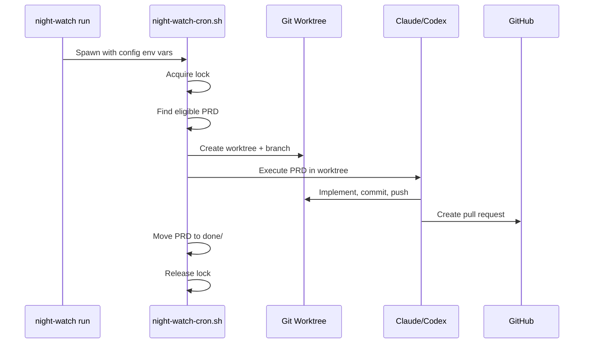

# 5-Minute Walkthrough: From Zero to First PR

This guide takes you from a fresh Night Watch install to your first AI-generated pull request.

---

## Prerequisites Check

```bash
# Verify you have the required tools
node -v        # Node.js 22+
gh auth status # GitHub CLI authenticated
claude --version # or codex --version
```

---

## Step 1: Install Night Watch

```bash
npm install -g @jonit-dev/night-watch-cli
```

---

## Step 2: Initialize Your Project

```bash
cd your-project
night-watch init
```

This creates:

- `docs/prds/` — Directory for PRD files
- `logs/` — Log files (added to .gitignore)
- `instructions/` — AI executor instructions
- `night-watch.config.json` — Configuration

---

## Step 3: Verify Setup

```bash
night-watch doctor
```

Expected output:

```
✓ Node.js version: v22.x.x
✓ Git repository: detected
✓ GitHub CLI: authenticated
✓ Provider CLI: claude detected
✓ Config file: night-watch.config.json
✓ PRD directory: docs/prds/
✓ Logs directory: logs/
```

If any check fails, follow the suggested fix.

---

## Step 4: Write Your First PRD

Create a file in `docs/prds/01-add-logging.md`:

```markdown
# Feature: Add Request Logging

## Overview

Add structured logging for all HTTP requests in the API.

## Requirements

- [ ] Log each incoming request with method, path, and timestamp
- [ ] Include response status code and duration
- [ ] Write logs to stdout in JSON format

## Acceptance Criteria

- All HTTP requests are logged
- Logs include: method, path, status, duration, timestamp
- Output is valid JSON
- Tests pass

## Technical Notes

- Use the existing Logger class from src/utils/logger.ts
- Follow the logging format already used in the auth module
```

### PRD Writing Tips

| Good PRD                          | Bad PRD                  |
| --------------------------------- | ------------------------ |
| Specific, bounded scope           | Vague, open-ended        |
| Clear acceptance criteria         | No definition of done    |
| References existing code patterns | Reinvents everything     |
| 3-5 implementation phases         | 20+ phases (too large)   |
| Can be reviewed in one sitting    | Requires hours to review |

---

## Step 5: Dry Run

See what Night Watch would do without actually running:

```bash
night-watch run --dry-run
```

This shows:

- Which PRD would be picked up
- The branch name that would be created
- Environment variables and provider command
- Worktree location

---

## Step 6: Run the Executor

```bash
night-watch run
```

What happens:



---

## Step 7: Check the Result

```bash
# View the PR
night-watch prs

# Check logs
night-watch logs --type run
```

You should see:

- A new PR on your repository
- The PRD moved to `docs/prds/done/`
- Log output in `logs/executor.log`

---

## Step 8: Review and Merge

1. Review the PR in GitHub
2. Request changes if needed (the reviewer will auto-fix)
3. Merge when satisfied

For automatic review fixes:

```bash
night-watch review
```

---

## Step 9: Automate with Cron (Optional)

Set up scheduled execution:

```bash
night-watch install
```

This adds crontab entries for:

- PRD executor (hourly during configured hours)
- PR reviewer (every 3 hours)

To uninstall:

```bash
night-watch uninstall
```

---

## Next Steps

- [Configuration](../reference/configuration.md) — Customize schedules, providers, notifications
- [PRD Format](../PRDs/prd-format.md) — Write better PRDs with dependencies
- [Commands Reference](../reference/commands.md) — All available commands
- [Architecture](../architecture/architecture-overview.md) — How Night Watch works under the hood

---

## Common Issues

### "No eligible PRDs"

The PRD might be:

- Already in `done/` (already processed)
- Has unmet dependencies (check `Depends on:` line)
- An open PR already exists for this PRD

### "Provider CLI not found"

Install Claude CLI or Codex CLI:

```bash
# Claude CLI
npm install -g @anthropic-ai/claude-cli

# Codex CLI
# Follow OpenAI's installation instructions
```

### "Lock file exists"

A previous run might have crashed. Clean up:

```bash
night-watch cancel
# or manually
rm /tmp/night-watch-*.lock
```
