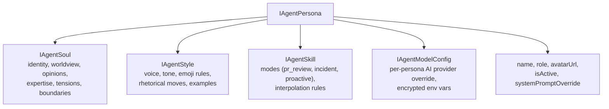
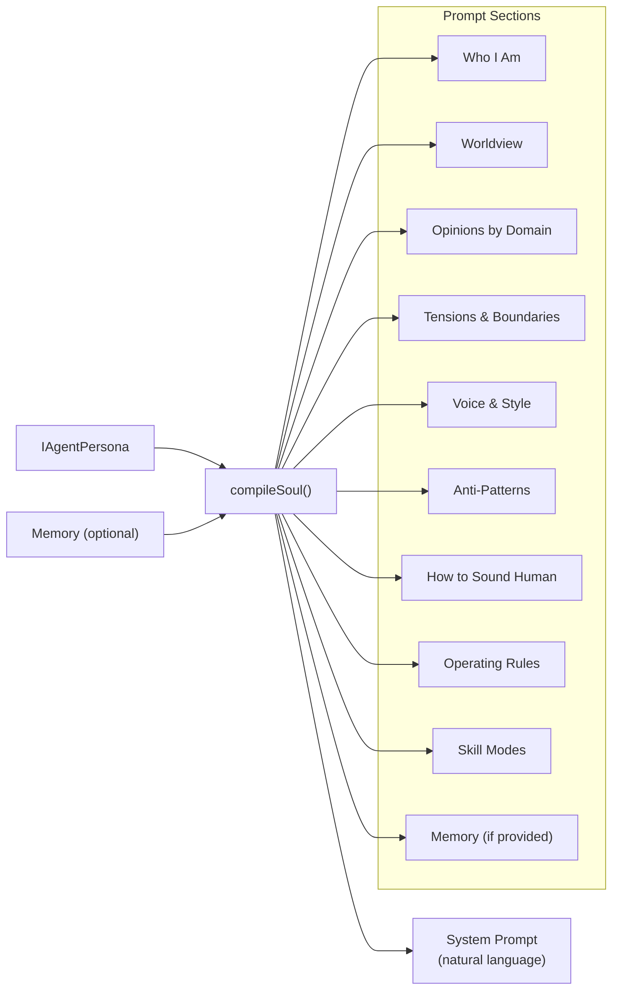

# Persona System

Night Watch uses AI personas with distinct identities and communication styles. This document covers the soul compiler, the four default personas, their storage schema, and avatar generation.

> Related: [Core Package](core-package.md) | [Server API](server-api.md) | [Architecture Overview](architecture-overview.md)

---

## Agent Personas

### Data Model

Each persona is a structured entity stored in SQLite. The schema is layered:



**File:** `packages/core/src/shared/types.ts`

### The Four Default Personas

| Persona    | Role                  | Model             | Domain Focus                                |
| ---------- | --------------------- | ----------------- | ------------------------------------------- |
| **Maya**   | Security Reviewer     | claude-sonnet-4-6 | AppSec, OWASP, auth flows, cryptography     |
| **Carlos** | Tech Lead / Architect | claude-opus-4-6   | Architecture, systems design, code review   |
| **Priya**  | QA Engineer           | claude-sonnet-4-6 | Testing strategy, edge cases, accessibility |
| **Dev**    | Implementer           | claude-sonnet-4-6 | Implementation, TypeScript, Node.js, git    |

Defaults are seeded on first run from `packages/core/src/storage/repositories/sqlite/agent-persona.defaults.ts`.

Carlos uses `claude-opus-4-6` (most capable) because he makes consensus decisions as tech lead. The others use `claude-sonnet-4-6`.

### Database Schema

```sql
CREATE TABLE agent_personas (
  id TEXT PRIMARY KEY,
  name TEXT NOT NULL,
  role TEXT NOT NULL,
  avatar_url TEXT,
  soul_json TEXT NOT NULL DEFAULT '{}',
  style_json TEXT NOT NULL DEFAULT '{}',
  skill_json TEXT NOT NULL DEFAULT '{}',
  model_config_json TEXT,
  system_prompt_override TEXT,
  is_active INTEGER NOT NULL DEFAULT 1,
  created_at INTEGER NOT NULL,
  updated_at INTEGER NOT NULL
);
```

### Secret Encryption

Model config `envVars` (API keys, tokens) are encrypted at rest using AES-256-GCM. The encryption key is stored in the `schema_meta` table.

Format: `enc:v1:{iv}:{tag}:{encrypted}`

---

## Soul Compiler

The soul compiler transforms a persona's structured data into a natural-language system prompt.

**File:** `packages/core/src/agents/soul-compiler.ts`



### Compilation Flow

```typescript
function compileSoul(persona: IAgentPersona): string;
```

1. If `systemPromptOverride` is set, return it directly (bypass compilation)
2. Otherwise, build structured prompt from soul/style/skill layers:
   - **Who I Am**: Free-text identity statement
   - **Worldview**: Core beliefs as bullet list
   - **Opinions**: Domain-specific takes organized by topic
   - **Tensions & Boundaries**: Internal conflicts and hard limits
   - **Voice & Style**: Voice principles, sentence rhythm, tone, emoji rules
   - **Rhetorical Moves**: Characteristic conversation patterns
   - **Anti-Patterns**: Phrases and words to avoid (AI filler, canned responses)
   - **How to Sound Human**: Hardcoded rules against robotic language
   - **Operating Rules**: Stay in character, be opinionated, use emoji sparingly
   - **Modes**: Behavior overrides per context (PR review, incident, proactive)

### Anti-Pattern Enforcement

The compiler includes lists of banned phrases:

- "Great question!", "I hope this helps", "Let me help you"
- "utilize", "leverage", "delve", "facilitate"
- "However, it's important to note..."

These are injected into the "How to Sound Human" section to keep responses natural.

---

## Avatar Generation

**File:** `packages/core/src/utils/avatar-generator.ts`

Each persona has a detailed visual description used to generate consistent portraits via Replicate Flux (`black-forest-labs/flux-1.1-pro`).

```typescript
function generatePersonaAvatar(
  personaName: string,
  personaRole: string,
  apiToken: string,
): Promise<string | null>;
```

| Persona | Visual Description                                                              |
| ------- | ------------------------------------------------------------------------------- |
| Maya    | South Asian woman, late 20s, sharp eyes, ponytail, dark blazer                  |
| Carlos  | Hispanic man, mid-30s, wavy hair, beard, navy henley, calm authority            |
| Priya   | Indian woman, early 30s, dark brown hair, olive cardigan, tortoiseshell glasses |
| Dev     | East Asian man, late 20s, short textured hair, heather gray sweatshirt          |

Custom personas fall back to role-based descriptions (security, architect, QA, developer).

---

## Roadmap Context

**File:** `packages/core/src/utils/roadmap-context-compiler.ts`

Personas receive roadmap context to ground their discussions in project priorities.

```typescript
function compileRoadmapForPersona(persona, status): string;
```

- **Lead roles** (tech lead, architect, PM): Full roadmap digest (2000 chars)
- **Other roles**: Smart summary (600 chars)
- Raw `ROADMAP.md` content (first 6000 chars) is included in both modes

---

## API Endpoints

Personas are managed via the REST API:

| Method   | Path                        | Purpose                        |
| -------- | --------------------------- | ------------------------------ |
| `GET`    | `/api/agents`               | List all personas              |
| `POST`   | `/api/agents`               | Create persona                 |
| `PUT`    | `/api/agents/:id`           | Update persona                 |
| `DELETE` | `/api/agents/:id`           | Delete persona                 |
| `GET`    | `/api/agents/:id/prompt`    | Preview compiled system prompt |
| `POST`   | `/api/agents/seed-defaults` | Re-seed default personas       |

See [Server API](server-api.md) for details.

---

## Related Docs

- [Core Package](core-package.md) — Repository and DI setup for personas
- [Server API](server-api.md) — REST endpoints for persona management
- [Architecture Overview](architecture-overview.md) — Where personas fit in the system
