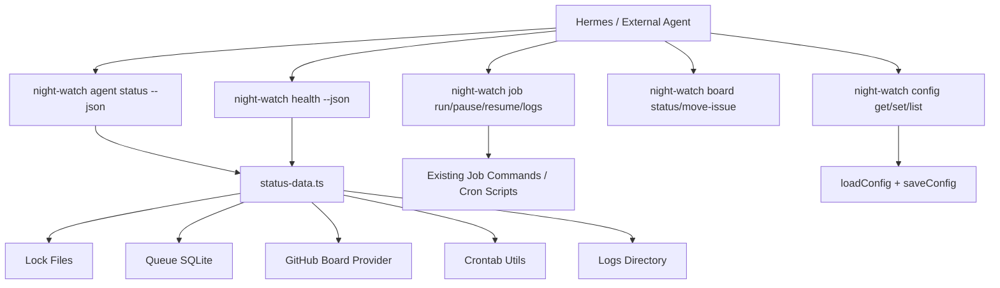
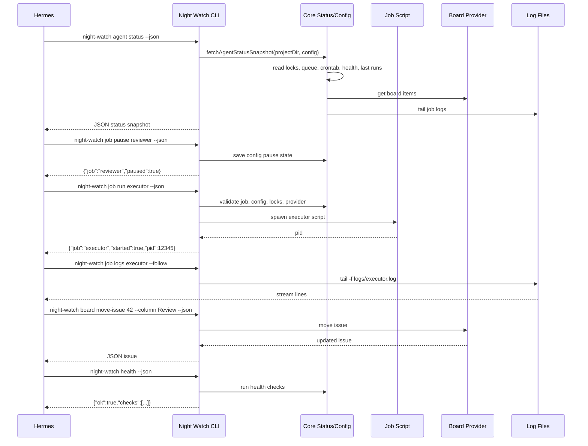

# PRD: Agent Manageability CLI

**Complexity: 8 -> HARD mode**

---

## 1. Context

**Problem:** Night Watch can run autonomously, but an external AI agent such as Hermes cannot fully operate it through a stable, machine-readable CLI contract. Status, logs, job triggers, queue state, board movement, config edits, and health checks are spread across commands with mixed human and JSON output. This forces agents to scrape terminal output, infer process state from files, and mutate config manually.

**Files Analyzed:**

- `packages/cli/src/commands/status.ts` - current project status command and legacy JSON shape
- `packages/core/src/utils/status-data.ts` - shared status snapshot source for CLI and dashboard
- `packages/cli/src/commands/logs.ts` - log tailing and static log output
- `packages/cli/src/commands/queue.ts` - global queue status, enqueue, dispatch, claim, and completion commands
- `packages/cli/src/commands/board.ts` - board status, PRD creation, next issue, move issue, and comments
- `packages/cli/src/commands/run.ts` - executor command entry point
- `packages/cli/src/commands/review.ts` - reviewer command entry point
- `packages/cli/src/commands/qa.ts` - QA command entry point
- `packages/cli/src/commands/audit.ts` - audit command entry point
- `packages/cli/src/commands/plan.ts` - planner command entry point
- `packages/cli/src/commands/analytics.ts` - analytics command entry point
- `packages/cli/src/commands/merge.ts` - merger command entry point
- `packages/core/src/utils/config-writer.ts` - existing safe config writer utility
- `packages/core/src/types.ts` - job types, config, status, and board-facing types

**Current Behavior:**

- `night-watch status --json` returns project, process, PRD, PR, crontab, and log data, but does not include queue details, board items, last successful job timestamps, or agent availability checks.
- `night-watch logs --type <job> -f` can stream one job log, but there is no JSON metadata mode for log paths or a stable "job" namespace.
- Specific jobs can be started through existing commands (`run`, `review`, `qa`, `audit`, `plan`, `analytics`, `merge`), but there is no uniform `job run <type>` command that an agent can call safely.
- There is no CLI-level pause/resume mechanism per job; users must edit cron/config or uninstall schedules.
- There is no first-class non-interactive `config get/set/list` command for agents to read and write config.
- Board commands can list and move issues, but agent workflows need clear JSON output guarantees and predictable exit codes.
- `doctor` checks setup, but there is no lightweight health command focused on automation readiness: cron installed, last success, stale locks, queue availability, provider binary/API availability.

**Integration Points Checklist:**

```markdown
**How will this feature be reached?**

- [ ] Entry point: new `night-watch agent <subcommand>` command group
- [ ] Entry point: new `night-watch job <subcommand>` command group
- [ ] Entry point: new `night-watch config <subcommand>` command group
- [ ] Entry point: new `night-watch health --json` command
- [ ] Caller: external AI agents such as Hermes, shell scripts, dashboard automation
- [ ] Registration: wire commands into `packages/cli/src/cli.ts`

**Is this user-facing?**

- [ ] YES -> documented CLI commands and JSON schemas
- [ ] YES -> status output remains backward compatible
- [ ] YES -> pause/resume affects cron-dispatched jobs

**Full user flow:**

1. Hermes runs `night-watch agent status --json`
2. CLI returns a complete machine-readable snapshot of jobs, queues, PRs, board items, config flags, crontab, logs, and health
3. Hermes sees `executor.running=false` and `prds.pending=3`
4. Hermes runs `night-watch job run executor --json`
5. CLI starts the executor immediately and returns `{ "started": true, "job": "executor", "pid": 12345 }`
6. Hermes streams `night-watch job logs executor --follow`
7. Hermes pauses reviewer with `night-watch job pause reviewer --json` while a human investigates
8. Hermes moves board item #42 with `night-watch board move-issue 42 --column "Review" --json`
9. Hermes runs `night-watch health --json` to confirm cron, provider, queue, and locks are healthy
```

---

## 2. Solution

**Approach:**

- Add an agent-grade CLI layer that wraps existing Night Watch primitives with stable JSON schemas, consistent job names, predictable exit codes, and non-interactive behavior.
- Keep existing human-facing commands intact. `status --json`, `logs`, `queue`, and `board` continue to work, while new commands reuse the same core utilities.
- Extend the shared status data layer to include queue state, board summaries, last job success/failure data, pause state, and health checks.
- Store pause/resume state in config so cron scripts can skip paused jobs deterministically without editing crontab entries.
- Add a safe config CLI that supports dot-path reads/writes with validation through existing config load/save code.
- Add health checks that are cheap enough for agents to poll frequently.

**Target Commands:**

| Command                                                        | Purpose                                                             |
| -------------------------------------------------------------- | ------------------------------------------------------------------- | --- | ----- | ------- | --------- | --------------- | ---------------------------------- |
| `night-watch agent status --json`                              | Full machine-readable project snapshot for external agents          |
| `night-watch job run <executor                                 | reviewer                                                            | qa  | audit | planner | analytics | merger> --json` | Trigger a specific job immediately |
| `night-watch job pause <job> --json`                           | Pause cron/queue dispatch for a specific job                        |
| `night-watch job resume <job> --json`                          | Resume cron/queue dispatch for a specific job                       |
| `night-watch config list --json`                               | Print resolved config                                               |
| `night-watch config get <path> --json`                         | Read a config value by dot path                                     |
| `night-watch config set <path> <value> --json`                 | Write a config value by dot path with validation                    |
| `night-watch board status --json`                              | List board items with status                                        |
| `night-watch board move-issue <number> --column <name> --json` | Move items between columns                                          |
| `night-watch job logs <job> --follow`                          | Stream a specific job log                                           |
| `night-watch health --json`                                    | Report cron, locks, queue, provider, board, and last success health |

**Status JSON Contract:**

```json
{
  "projectName": "joao",
  "projectDir": "/home/joao",
  "provider": "claude",
  "reviewerEnabled": true,
  "autoMerge": false,
  "autoMergeMethod": "squash",
  "executor": {
    "running": false,
    "pid": null
  },
  "reviewer": {
    "running": false,
    "pid": null
  },
  "qa": {
    "running": false,
    "pid": null
  },
  "audit": {
    "running": false,
    "pid": null
  },
  "planner": {
    "running": false,
    "pid": null
  },
  "analytics": {
    "running": false,
    "pid": null
  },
  "merger": {
    "running": false,
    "pid": null
  },
  "prds": {
    "pending": 0,
    "claimed": 0,
    "done": 0
  },
  "prs": {
    "open": 0
  },
  "crontab": {
    "installed": false,
    "entries": []
  },
  "logs": {
    "executor": {
      "path": "/home/joao/logs/executor.log",
      "lastLines": [],
      "exists": false,
      "size": 0
    },
    "reviewer": {
      "path": "/home/joao/logs/reviewer.log",
      "lastLines": [],
      "exists": false,
      "size": 0
    },
    "qa": {
      "path": "/home/joao/logs/night-watch-qa.log",
      "lastLines": [],
      "exists": false,
      "size": 0
    },
    "audit": {
      "path": "/home/joao/logs/audit.log",
      "lastLines": [],
      "exists": false,
      "size": 0
    },
    "planner": {
      "path": "/home/joao/logs/slicer.log",
      "lastLines": [],
      "exists": false,
      "size": 0
    },
    "analytics": {
      "path": "/home/joao/logs/analytics.log",
      "lastLines": [],
      "exists": false,
      "size": 0
    },
    "merger": {
      "path": "/home/joao/logs/merger.log",
      "lastLines": [],
      "exists": false,
      "size": 0
    }
  }
}
```

**Extended Agent Status Additions:**

```json
{
  "schemaVersion": 1,
  "paused": {
    "executor": false,
    "reviewer": false,
    "qa": false,
    "audit": false,
    "planner": false,
    "analytics": false,
    "merger": false
  },
  "queue": {
    "enabled": true,
    "running": null,
    "pending": {
      "total": 0,
      "byType": {}
    },
    "items": []
  },
  "board": {
    "configured": false,
    "columns": [],
    "items": []
  },
  "health": {
    "ok": true,
    "checks": []
  },
  "lastRuns": {
    "executor": {
      "lastSuccessAt": null,
      "lastFailureAt": null,
      "lastExitCode": null
    }
  }
}
```

**Architecture Diagram:**



**Key Decisions:**

- Use `agent status` for the complete external-agent contract instead of expanding every legacy status field immediately.
- Keep `night-watch status --json` backward compatible; it may call the same builder but should not remove fields or rename keys.
- Use canonical job names: `executor`, `reviewer`, `qa`, `audit`, `planner`, `analytics`, `merger`. Accept aliases (`run`, `review`, `slicer`, `slice`, `merge`) but normalize output.
- Store pause state in config under `jobs.<job>.paused` or an equivalent typed config object, then have cron scripts and `job run` respect it unless `--force` is passed.
- Return JSON on stdout only for `--json`; warnings and diagnostics go to stderr.
- Exit code `0` means the requested operation succeeded. Exit code `1` means a user/actionable failure. Exit code `2` means validation or usage error. Exit code `3` means dependency unavailable. Exit code `4` means operation refused because the job is paused or already running.
- Redact secret-looking config values in `config list --json` unless `--include-secrets` is passed.

**Data Changes:**

- Add pause state to `INightWatchConfig`.
- Reuse existing queue SQLite tables for queue status.
- Reuse existing execution history table if available for last success/failure timestamps; otherwise add a small job run history helper shared by cron result parsing and health checks.

---

## 3. Sequence Flow



---

## 4. Execution Phases

### Phase 1: Agent Status Snapshot

**User-visible outcome:** `night-watch agent status --json` returns one complete JSON document for external agents.

**Files (5):**

- `packages/core/src/utils/status-data.ts` - add `fetchAgentStatusSnapshot()`
- `packages/core/src/types.ts` - add agent status JSON types
- `packages/cli/src/commands/agent.ts` - add `agent status`
- `packages/cli/src/cli.ts` - register the agent command group
- `packages/cli/src/__tests__/commands/agent.test.ts` - tests for status JSON

**Implementation:**

- [ ] Define `IAgentStatusSnapshot` with `schemaVersion`, legacy status fields, `queue`, `board`, `paused`, `health`, and `lastRuns`
- [ ] Reuse `fetchStatusSnapshot()` for processes, PRDs, PRs, crontab, and logs
- [ ] Add queue summary from `getQueueStatus()`
- [ ] Add board summary using the configured board provider; if unavailable, return `configured: false` and a health warning
- [ ] Add `--lines <count>` option for log tail size, defaulting to existing status behavior
- [ ] Ensure `--json` prints JSON only to stdout

**Tests Required:**

| Test File                                           | Test Name                                      | Assertion                                             |
| --------------------------------------------------- | ---------------------------------------------- | ----------------------------------------------------- |
| `packages/cli/src/__tests__/commands/agent.test.ts` | `agent status outputs schema version`          | JSON contains `schemaVersion: 1`                      |
| `packages/cli/src/__tests__/commands/agent.test.ts` | `agent status includes queue and board fields` | JSON has `queue.pending.total` and `board.configured` |
| `packages/cli/src/__tests__/commands/agent.test.ts` | `agent status preserves legacy process shape`  | JSON has `executor.running` and `reviewer.pid`        |

**Verification Plan:**

1. `night-watch agent status --json | jq .schemaVersion` returns `1`
2. `night-watch agent status --json | jq .queue.pending.total` returns a number
3. `yarn verify` passes

---

### Phase 2: Job Control Commands

**User-visible outcome:** Agents can trigger, pause, resume, and inspect jobs through one stable command namespace.

**Files (6):**

- `packages/cli/src/commands/job.ts` - add `job run`, `job pause`, `job resume`, `job logs`, `job status`
- `packages/cli/src/cli.ts` - register job command group
- `packages/core/src/types.ts` - add pause config type
- `packages/core/src/config/config.ts` - load pause defaults
- `packages/core/src/utils/config-writer.ts` - support pause updates if needed
- `packages/cli/src/__tests__/commands/job.test.ts` - command tests

**Implementation:**

- [ ] Add canonical job validation and alias normalization
- [ ] Implement `night-watch job run <job> --json` by dispatching the matching existing command/script
- [ ] Add `--force` to run paused jobs intentionally
- [ ] Refuse to start a job when its lock indicates a live process unless `--force` is passed
- [ ] Implement `job pause <job>` by writing pause state to config
- [ ] Implement `job resume <job>` by clearing pause state
- [ ] Implement `job status <job> --json` as a filtered view of `agent status`
- [ ] Implement `job logs <job> --lines <n> --follow` as a stable wrapper around existing log paths

**Tests Required:**

| Test File                                         | Test Name                              | Assertion                            |
| ------------------------------------------------- | -------------------------------------- | ------------------------------------ |
| `packages/cli/src/__tests__/commands/job.test.ts` | `job run validates job type`           | invalid job exits with usage error   |
| `packages/cli/src/__tests__/commands/job.test.ts` | `job pause writes config state`        | config contains paused reviewer      |
| `packages/cli/src/__tests__/commands/job.test.ts` | `job resume clears config state`       | config contains resumed reviewer     |
| `packages/cli/src/__tests__/commands/job.test.ts` | `job logs resolves canonical log path` | executor maps to `logs/executor.log` |

**Verification Plan:**

1. `night-watch job pause reviewer --json` returns `{ "job": "reviewer", "paused": true }`
2. `night-watch job resume reviewer --json` returns `{ "job": "reviewer", "paused": false }`
3. `night-watch job run executor --dry-run --json` returns a start plan without spawning
4. `yarn verify` passes

---

### Phase 3: Cron Pause Enforcement

**User-visible outcome:** Paused jobs do not run from cron or queue dispatch, and status explains why.

**Files (8):**

- `scripts/night-watch-run-cron.sh` - skip when executor is paused
- `scripts/night-watch-pr-reviewer-cron.sh` - skip when reviewer is paused
- `scripts/night-watch-qa-cron.sh` - skip when QA is paused
- `scripts/night-watch-audit-cron.sh` - skip when audit is paused
- `scripts/night-watch-plan-cron.sh` - skip when planner is paused
- `scripts/night-watch-analytics-cron.sh` - skip when analytics is paused
- `scripts/night-watch-merger-cron.sh` - skip when merger is paused
- `packages/cli/src/__tests__/scripts/core-flow-smoke.test.ts` - pause smoke tests

**Implementation:**

- [ ] Add a shared helper in `scripts/night-watch-helpers.sh` to read job pause state through the CLI or config file
- [ ] Emit `NIGHT_WATCH_RESULT:skipped_paused|job=<job>` when a paused cron run exits
- [ ] Ensure queue claim/dispatch does not mark paused jobs as running
- [ ] Add `--force` bypass for manual `job run`
- [ ] Include pause state in `agent status` and `health`

**Tests Required:**

| Test File                                                    | Test Name                             | Assertion                       |
| ------------------------------------------------------------ | ------------------------------------- | ------------------------------- |
| `packages/cli/src/__tests__/scripts/core-flow-smoke.test.ts` | `reviewer cron skips when paused`     | log contains `skipped_paused`   |
| `packages/cli/src/__tests__/scripts/core-flow-smoke.test.ts` | `executor cron skips when paused`     | no provider command is invoked  |
| `packages/cli/src/__tests__/commands/job.test.ts`            | `job run force bypasses paused state` | command proceeds with `--force` |

**Verification Plan:**

1. Pause reviewer, run reviewer cron manually, confirm it exits 0 with skipped result
2. Resume reviewer, run reviewer cron manually, confirm normal execution path
3. `yarn verify` passes

---

### Phase 4: Config CLI

**User-visible outcome:** Agents can safely read and write Night Watch config without opening files.

**Files (5):**

- `packages/cli/src/commands/config.ts` - add config command group
- `packages/cli/src/cli.ts` - register config command
- `packages/core/src/utils/config-paths.ts` - dot-path get/set helpers
- `packages/core/src/utils/config-writer.ts` - validate and persist patched config
- `packages/cli/src/__tests__/commands/config.test.ts` - command tests

**Implementation:**

- [ ] Implement `night-watch config list --json`
- [ ] Implement `night-watch config get <path> --json`
- [ ] Implement `night-watch config set <path> <value> --json`
- [ ] Parse booleans, numbers, null, arrays, and objects from JSON values when possible
- [ ] Redact secrets by default for paths matching `token`, `secret`, `key`, `password`, or provider env values
- [ ] Add `--include-secrets` for explicit unredacted output
- [ ] Reject unknown paths unless `--allow-new` is passed
- [ ] Validate by reloading config after writes

**Tests Required:**

| Test File                                            | Test Name                                | Assertion                                         |
| ---------------------------------------------------- | ---------------------------------------- | ------------------------------------------------- |
| `packages/cli/src/__tests__/commands/config.test.ts` | `config get reads dot path`              | `provider` returns configured provider            |
| `packages/cli/src/__tests__/commands/config.test.ts` | `config set writes boolean`              | `reviewerEnabled` updates to false                |
| `packages/cli/src/__tests__/commands/config.test.ts` | `config list redacts secrets by default` | secret-like values are replaced with `[redacted]` |

**Verification Plan:**

1. `night-watch config get provider --json` returns a JSON value
2. `night-watch config set reviewerEnabled false --json` persists and reloads
3. `night-watch config list --json` produces valid JSON
4. `yarn verify` passes

---

### Phase 5: Board JSON Guarantees

**User-visible outcome:** Board listing and movement commands are safe for agents to consume programmatically.

**Files (3):**

- `packages/cli/src/commands/board.ts` - add/normalize JSON output for status and move commands
- `packages/core/src/board/types.ts` - document board item JSON fields if needed
- `packages/cli/src/__tests__/commands/board.test.ts` - JSON contract tests

**Implementation:**

- [ ] Ensure `board status --json` returns an array of board items with stable fields: `number`, `title`, `column`, `status`, `priority`, `labels`, `url`
- [ ] Add `--json` to `board move-issue`, `board comment`, `board create-prd`, and `board next-issue` if missing
- [ ] Make board command errors JSON-formatted when `--json` is passed
- [ ] Preserve existing human output when `--json` is absent

**Tests Required:**

| Test File                                           | Test Name                                  | Assertion                                   |
| --------------------------------------------------- | ------------------------------------------ | ------------------------------------------- |
| `packages/cli/src/__tests__/commands/board.test.ts` | `board status json has stable item fields` | item contains `number`, `column`, and `url` |
| `packages/cli/src/__tests__/commands/board.test.ts` | `move issue json returns updated issue`    | JSON contains new column                    |
| `packages/cli/src/__tests__/commands/board.test.ts` | `create prd json returns issue metadata`   | JSON contains issue number and URL          |

**Verification Plan:**

1. `night-watch board status --json | jq '.[0].column'` works when board has items
2. `night-watch board move-issue 42 --column Review --json` returns updated metadata
3. `yarn verify` passes

---

### Phase 6: Health Command

**User-visible outcome:** Agents can run one command to decide whether Night Watch is operational.

**Files (4):**

- `packages/cli/src/commands/health.ts` - add health command
- `packages/core/src/utils/health.ts` - reusable health checks
- `packages/cli/src/cli.ts` - register health command
- `packages/cli/src/__tests__/commands/health.test.ts` - health tests

**Implementation:**

- [ ] Check crontab installed and entries match current project
- [ ] Check stale lock files and live PIDs for each job
- [ ] Check logs directory is writable
- [ ] Check provider binary is available and provider env is minimally present
- [ ] Check global queue availability and stale queue entries
- [ ] Check board provider configuration and access
- [ ] Check last success/failure timestamps for each job
- [ ] Return `{ "ok": boolean, "checks": [...] }` with machine-readable `id`, `status`, `severity`, `message`, and `details`

**Tests Required:**

| Test File                                            | Test Name                             | Assertion                                |
| ---------------------------------------------------- | ------------------------------------- | ---------------------------------------- |
| `packages/cli/src/__tests__/commands/health.test.ts` | `health json includes check ids`      | JSON contains `checks[].id`              |
| `packages/cli/src/__tests__/commands/health.test.ts` | `health fails on stale lock`          | `ok` is false and check status is `fail` |
| `packages/cli/src/__tests__/commands/health.test.ts` | `health warns when board unavailable` | board check has `warn` severity          |

**Verification Plan:**

1. `night-watch health --json | jq .ok` returns a boolean
2. Stop or remove crontab entries and confirm health reports the issue
3. `yarn verify` passes

---

### Phase 7: Documentation & Agent Contract

**User-visible outcome:** External agents have a documented CLI contract with examples and exit codes.

**Files (3):**

- `docs/reference/commands.md` - document new commands
- `docs/integrations/agent-manageability.md` - document agent JSON schemas and workflows
- `templates/skills/_codex-block.md` - update Night Watch agent usage examples if needed

**Implementation:**

- [ ] Add command reference entries for `agent`, `job`, `config`, and `health`
- [ ] Document canonical job names and accepted aliases
- [ ] Document JSON schema versions and backward compatibility expectations
- [ ] Document exit codes
- [ ] Add example Hermes workflow for status -> run -> logs -> board move -> health

**Tests Required:**

| Test File | Test Name          | Assertion     |
| --------- | ------------------ | ------------- |
| N/A       | Documentation-only | Manual review |

**Verification Plan:**

1. `docs/reference/commands.md` includes all new commands
2. Examples run successfully in a local initialized project
3. `yarn verify` passes

---

## 5. Acceptance Criteria

- [ ] `night-watch agent status --json` returns the legacy status fields plus schema version, queue, board, pause, health, and last-run data
- [ ] Status JSON includes all job process fields: executor, reviewer, QA, audit, planner, analytics, and merger
- [ ] Agents can trigger any supported job immediately with `night-watch job run <job> --json`
- [ ] Agents can pause and resume individual jobs with CLI commands
- [ ] Paused jobs are skipped by cron/queue dispatch and reported clearly
- [ ] Agents can read and write config through `night-watch config get/set/list`
- [ ] Board items can be listed and moved with stable JSON output
- [ ] Job logs can be streamed with a stable job-name interface
- [ ] `night-watch health --json` reports cron status, last success, stale locks, queue availability, board access, and provider availability
- [ ] All new commands use predictable exit codes
- [ ] Existing human-facing CLI behavior remains backward compatible
- [ ] All specified tests pass
- [ ] `yarn verify` passes
