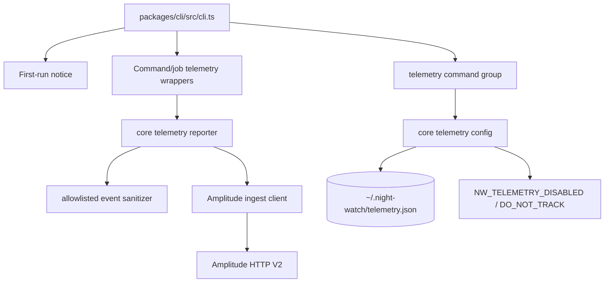
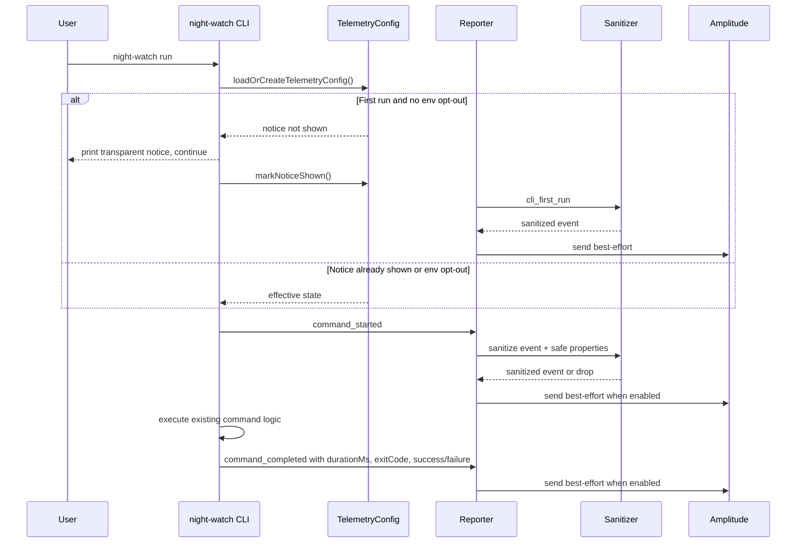

# PRD: Default-On Privacy-Safe Amplitude Telemetry

**Complexity: 10 -> HIGH mode**

Score: +3 touches 10+ files, +2 new telemetry module from scratch, +2 multi-package changes, +1 external API integration, +2 cross-cutting command/job lifecycle behavior.

---

## 1. Context

**Problem:** Night Watch needs real anonymous product usage measurement beyond noisy npm downloads while preserving developer trust through loud transparency, easy opt-out controls, and strict privacy-safe event schemas.

**Files Analyzed:**

- `instructions/prd-creator.md` - required PRD structure and checkpoint protocol.
- `package.json` - root scripts, especially `yarn verify`.
- `packages/cli/package.json` - CLI package metadata and dependency surface.
- `packages/core/package.json` - core dependency surface; no telemetry SDK dependency currently.
- `packages/cli/src/cli.ts` - Commander root registration for all CLI commands.
- `packages/cli/src/commands/init.ts` - first-run onboarding and config creation flow.
- `packages/cli/src/commands/run.ts` - executor command, PR-open result parsing, job outcome recording.
- `packages/cli/src/commands/review.ts` - reviewer command, review-completed and auto-merge result parsing.
- `packages/cli/src/commands/merge.ts` - merge orchestrator command and merge completion result parsing.
- `packages/cli/src/commands/analytics.ts` - existing Amplitude analytics job command, credentials handling.
- `packages/cli/src/commands/agent.ts` - machine-readable command patterns and JSON output style.
- `packages/cli/src/commands/shared/env-builder.ts` - shared command/job env construction and provider resolution.
- `packages/core/src/analytics/amplitude-client.ts` - existing Amplitude read-side API client using secret credentials.
- `packages/core/src/analytics/analytics-runner.ts` - existing product analytics job, unrelated to CLI telemetry ingestion.
- `packages/core/src/config-env.ts` - centralized `NW_*` env override pattern.
- `packages/core/src/config.ts` - default/file/env config merge behavior.
- `packages/core/src/constants.ts` - global constants, `GLOBAL_CONFIG_DIR`, and analytics constants.
- `packages/core/src/types.ts` - `INightWatchConfig`, `JobType`, provider and job configuration types.
- `packages/core/src/utils/global-config.ts` - existing `~/.night-watch` JSON config storage pattern.
- `packages/core/src/utils/registry.ts` - registered project count source.
- `packages/core/src/index.ts` - public core exports.
- `packages/core/src/__tests__/analytics-amplitude-client.test.ts` - existing Amplitude client test pattern.
- `packages/core/src/__tests__/config.test.ts` - core config test conventions.
- `packages/cli/src/__tests__/cli.test.ts` - root CLI test conventions.
- `packages/cli/src/__tests__/commands/doctor.test.ts` - command help and behavior test conventions.
- `docs/reference/commands.md` - command reference location.
- `README.md` - primary user-facing docs entry.

**Current Behavior:**

- Night Watch has no default CLI usage telemetry and cannot reliably measure active installs, active commands, PR-open success, or retention.
- `packages/core/src/analytics/*` already talks to Amplitude, but only for a user-configured analytics job that fetches product analytics with `AMPLITUDE_API_KEY` and `AMPLITUDE_SECRET_KEY`; it must not be reused for public telemetry ingestion.
- Global user-level JSON config already exists under `~/.night-watch` via `GLOBAL_CONFIG_DIR` and `global-config.ts`.
- CLI commands are registered independently in `packages/cli/src/cli.ts`; many commands call `process.exit(...)` inside action handlers, so command completion telemetry cannot rely only on Commander `postAction` hooks.
- Project registry data is available through `validateRegistry()` / `loadRegistry()` and can provide `registeredProjectCount` without sending project names or paths.

**Integration Points Checklist:**

```markdown
**How will this feature be reached?**

- [x] Entry point identified: `night-watch` root startup, `night-watch telemetry enable|disable|status`, and existing command/job actions.
- [x] Caller file identified: `packages/cli/src/cli.ts` installs root telemetry startup and registers `telemetryCommand(program)`.
- [x] Caller file identified: `packages/cli/src/commands/run.ts`, `review.ts`, `merge.ts`, and job command files emit product events from already parsed outcomes.
- [x] Registration/wiring needed: export telemetry helpers from `packages/core/src/index.ts`; import/register `telemetryCommand` in `packages/cli/src/cli.ts`; add shared CLI telemetry wrapper/helper for command started/completed events.

**Is this user-facing?**

- [x] YES -> CLI command group `night-watch telemetry enable|disable|status`.
- [x] YES -> first-run notice printed once, non-blocking.
- [x] YES -> privacy documentation in `docs/privacy.md` and command/reference docs link.
- [x] NO web UI change required for the CLI feature. If the landing page links docs, add a privacy link in the existing docs/website location as a follow-up in the docs phase.

**Full user flow:**

1. User runs any `night-watch` command after installing or upgrading.
2. Root CLI startup loads `~/.night-watch/telemetry.json`, creates an anonymous install ID when missing, prints the one-time telemetry notice, and continues without a prompt.
3. If telemetry is enabled and no env opt-out is present, the command emits privacy-safe product events through the Amplitude ingestion client.
4. User can run `night-watch telemetry status` to see effective state, local config path, env override status, and the privacy docs path.
5. User can run `night-watch telemetry disable`; subsequent commands do not send telemetry unless re-enabled with `night-watch telemetry enable`.
6. Owner can open Amplitude after beta release and see anonymous active installs, active commands, PR-open success events, and retention without receiving repo names, paths, PR contents, prompts, diffs, secrets, or personal identifiers.
```

---

## 2. Solution

**Approach:**

- Add a separate product telemetry module under `packages/core/src/telemetry/`; do not reuse `packages/core/src/analytics/amplitude-client.ts` because that client is read-side, secret-authenticated, and tied to the analytics job.
- Store local telemetry state at `~/.night-watch/telemetry.json` by default, honoring `NIGHT_WATCH_HOME` when present to match existing global config patterns.
- Enable telemetry by default only when not disabled by local config or env, but print a clear first-run notice before sending the first event.
- Enforce allowlisted event names and allowlisted property schemas in code; sanitize unknown properties by dropping them, never by trying to redact arbitrary raw payloads.
- Use a minimal fetch-based Amplitude HTTP V2 ingestion wrapper with dependency injection for tests; no Amplitude SDK unless a later implementation decision proves the SDK materially reduces risk without dependency bloat.

**Architecture Diagram:**



**Key Decisions:**

- [x] Library/framework choices: use built-in `fetch` on Node >=22 through a small `amplitude-ingest-client.ts`; avoid adding `@amplitude/analytics-node` initially.
- [x] Error-handling strategy: telemetry is best-effort and non-blocking; network failures, config parse failures, and sanitizer drops must never change command exit behavior.
- [x] Reused utilities: `GLOBAL_CONFIG_DIR`, `validateRegistry()`, package version discovery from existing CLI startup, `resolveJobProvider()`, `parseScriptResult()`, existing command outcome parsing helpers.
- [x] Privacy strategy: collect only explicit safe product events/properties; never attach raw command args, cwd, git/PR identifiers, provider output, stack traces, env, paths, hostnames, or usernames.
- [x] API key strategy: owner confirmed the `nightwatchcli.com` Amplitude ingestion/API key can be used for CLI telemetry; still support `NW_AMPLITUDE_API_KEY`/config override for local/dev and document that the package default client key is public and can be abused for noisy events.

**Amplitude Project Details:**

- Project name: `nightwatchcli.com`
- Project ID: `826678`
- Public ingestion/API key: `5289e9a61e10e059d25f8eb846bceaa8`
- Mobile URL scheme: `amp-7d6b975200263236` (not needed for the Node CLI ingestion path)
- Secret key: not provided and not needed for sending CLI telemetry; only required for Amplitude report/read APIs.
- Session definition: sessions are defined by Amplitude Session ID constant; CLI telemetry should not depend on mobile/web session semantics unless a future analytics report requires it.

**Data Changes:** No database migrations. New local JSON file:

```json
{
  "schemaVersion": 1,
  "installId": "uuid-v4",
  "enabled": true,
  "noticeShownAt": "2026-06-07T00:00:00.000Z",
  "createdAt": "2026-06-07T00:00:00.000Z",
  "updatedAt": "2026-06-07T00:00:00.000Z"
}
```

`enabled` defaults to `true` when the file is missing. Effective telemetry is disabled when `enabled === false`, `NW_TELEMETRY_DISABLED=1`, or `DO_NOT_TRACK=1`.

---

## 3. Sequence Flow



---

## 4. Execution Phases

#### Phase 1: Telemetry Config and Local State - "Users can inspect and change local telemetry state without any network calls"

**Files (max 5):**

- `packages/core/src/telemetry/config.ts` - load, save, effective-state, env opt-out, install ID, and notice state helpers.
- `packages/core/src/telemetry/index.ts` - export telemetry config API.
- `packages/core/src/index.ts` - export `./telemetry/index.js`.
- `packages/core/src/__tests__/telemetry/config.test.ts` - unit tests for config file behavior and env opt-outs.
- `packages/core/src/constants.ts` - add `TELEMETRY_FILE_NAME = 'telemetry.json'` and optional telemetry endpoint/key constants.

**Implementation:**

- [ ] Add `ITelemetryConfig` and `ITelemetryEffectiveState` types in `config.ts`.
- [ ] Resolve telemetry path as `path.join(process.env.NIGHT_WATCH_HOME || path.join(os.homedir(), GLOBAL_CONFIG_DIR), TELEMETRY_FILE_NAME)`.
- [ ] Generate `crypto.randomUUID()` install IDs; persist only the anonymous ID and telemetry state.
- [ ] Treat missing file as enabled by default with a newly generated install ID.
- [ ] Treat invalid JSON as recoverable: create a fresh config with a new install ID and do not throw.
- [ ] Implement `isTelemetryEnvDisabled(env)` where only exact `NW_TELEMETRY_DISABLED=1` and `DO_NOT_TRACK=1` disable telemetry.
- [ ] Implement `setTelemetryEnabled(enabled)` and `markTelemetryNoticeShown()`.
- [ ] Never store project path, cwd, username, hostname, repo name, branch, remotes, command args, or environment values in telemetry config.

**Tests Required:**

| Test File                                              | Test Name                                                                | Assertion                                                                       |
| ------------------------------------------------------ | ------------------------------------------------------------------------ | ------------------------------------------------------------------------------- |
| `packages/core/src/__tests__/telemetry/config.test.ts` | `should default telemetry to enabled when config file is missing`        | returns `enabled: true`, generated UUID, and path under test `NIGHT_WATCH_HOME` |
| `packages/core/src/__tests__/telemetry/config.test.ts` | `should persist disabled state when telemetry is disabled`               | saved JSON has `enabled: false` and stable install ID                           |
| `packages/core/src/__tests__/telemetry/config.test.ts` | `should report disabled effective state when NW_TELEMETRY_DISABLED is 1` | effective state is disabled with reason `env:NW_TELEMETRY_DISABLED`             |
| `packages/core/src/__tests__/telemetry/config.test.ts` | `should report disabled effective state when DO_NOT_TRACK is 1`          | effective state is disabled with reason `env:DO_NOT_TRACK`                      |
| `packages/core/src/__tests__/telemetry/config.test.ts` | `should recover from invalid telemetry json without throwing`            | returns fresh valid config                                                      |

**Verification Plan:**

1. **Unit Tests:** `yarn workspace @night-watch/core vitest run src/__tests__/telemetry/config.test.ts`
2. **Build Check:** `yarn workspace @night-watch/core verify`
3. **Evidence Required:**
   - [ ] Config tests pass.
   - [ ] No network client exists yet.
   - [ ] Core verify passes.

**User Verification:**

- Action: With `NIGHT_WATCH_HOME=$(mktemp -d)`, run the future config helper indirectly through Phase 2 command tests.
- Expected: `telemetry.json` is created under that directory and contains no machine, project, or repository identifiers.

**Checkpoint:**

- Automated checkpoint required: `prd-work-reviewer` reviews Phase 1 against this PRD before Phase 2 starts.

#### Phase 2: Event Schema, Sanitizer, and Amplitude Ingestion - "Only allowlisted anonymous events can be sent"

**Files (max 5):**

- `packages/core/src/telemetry/schema.ts` - event names, property allowlists, property types, error category enum.
- `packages/core/src/telemetry/sanitizer.ts` - validate event names/properties and drop unsafe data.
- `packages/core/src/telemetry/amplitude-ingest-client.ts` - small fetch wrapper for Amplitude HTTP V2 ingestion.
- `packages/core/src/telemetry/reporter.ts` - best-effort `trackTelemetryEvent()` with config, sanitizer, and client injection.
- `packages/core/src/__tests__/telemetry/reporter.test.ts` - sanitizer/client tests with mocked fetch/client and no network.

**Implementation:**

- [ ] Define allowed events exactly:
  - `cli_first_run`
  - `cli_init_completed`
  - `command_started`
  - `command_completed`
  - `job_started`
  - `job_completed`
  - `job_failed`
  - `pr_opened`
  - `review_completed`
  - `auto_merge_completed`
  - `doctor_failed`
  - `telemetry_enabled`
  - `telemetry_disabled`
- [ ] Define allowed properties exactly:
  - `cliVersion`
  - `command`
  - `jobType`
  - `provider`
  - `success`
  - `failure`
  - `durationMs`
  - `exitCode`
  - `platform`
  - `nodeMajorVersion`
  - `boardMode`
  - `registeredProjectCount`
  - `errorCategory`
- [ ] Use `platform` for OS/platform property, sourced from `process.platform`, to avoid host-specific OS detail.
- [ ] Coerce property types conservatively: strings for command/job/provider/category, booleans for success/failure/boardMode, non-negative integers for duration/exitCode/count/node major.
- [ ] Drop unknown event names and unknown properties.
- [ ] Reject or drop suspicious string values containing path separators, URL schemes, email-like strings, or whitespace-heavy/raw text patterns.
- [ ] Map raw errors to categories only: `config`, `provider`, `github`, `network`, `rate_limit`, `timeout`, `validation`, `unknown`.
- [ ] Implement Amplitude HTTP V2 payload with `user_id` or `device_id` set to the anonymous install ID, `event_type`, `event_properties`, and `time`.
- [ ] Do not send Amplitude events when API key is absent; reporter should return `{ sent: false, reason: 'missing-api-key' }` without throwing.
- [ ] Add dependency injection for fetch/client so all tests mock network.

**Tests Required:**

| Test File                                                | Test Name                                                          | Assertion                                                      |
| -------------------------------------------------------- | ------------------------------------------------------------------ | -------------------------------------------------------------- |
| `packages/core/src/__tests__/telemetry/reporter.test.ts` | `should send an allowed telemetry event with only safe properties` | mocked client receives event with install ID and allowed props |
| `packages/core/src/__tests__/telemetry/reporter.test.ts` | `should drop unknown event names`                                  | mocked client is not called                                    |
| `packages/core/src/__tests__/telemetry/reporter.test.ts` | `should drop repo paths urls emails and raw text properties`       | unsafe property values are omitted                             |
| `packages/core/src/__tests__/telemetry/reporter.test.ts` | `should not send when local telemetry is disabled`                 | result reason is `disabled:config`                             |
| `packages/core/src/__tests__/telemetry/reporter.test.ts` | `should not send when env opt out is set`                          | result reason is `disabled:env:*`                              |
| `packages/core/src/__tests__/telemetry/reporter.test.ts` | `should not perform network calls in tests`                        | fake client/fetch call count is asserted; no real fetch        |

**Verification Plan:**

1. **Unit Tests:** `yarn workspace @night-watch/core vitest run src/__tests__/telemetry/reporter.test.ts`
2. **Unit Tests:** `yarn workspace @night-watch/core vitest run src/__tests__/telemetry/config.test.ts`
3. **Build Check:** `yarn workspace @night-watch/core verify`
4. **Evidence Required:**
   - [ ] Sanitizer tests prove unsafe properties are omitted.
   - [ ] Missing API key and disabled states do not throw.
   - [ ] No dependency added unless implementation decision explicitly changes this PRD.

**User Verification:**

- Action: Run a small local test command with a fake injected client.
- Expected: Allowed telemetry event is produced in memory; no real network is attempted.

**Checkpoint:**

- Automated checkpoint required: `prd-work-reviewer` reviews Phase 2 before Phase 3 starts.
- Manual checkpoint required: review the schema table and sanitizer tests for privacy completeness before any default-on command wiring ships.

#### Phase 3: Telemetry CLI Command and First-Run Notice - "Users can see, disable, and re-enable telemetry from the CLI"

**Files (max 5):**

- `packages/cli/src/commands/telemetry.ts` - `telemetry enable|disable|status` command group.
- `packages/cli/src/cli.ts` - register `telemetryCommand(program)` and invoke first-run notice bootstrap.
- `packages/cli/src/__tests__/commands/telemetry.test.ts` - CLI command behavior tests.
- `packages/cli/src/__tests__/cli.test.ts` - root help/registration/notice smoke tests.
- `docs/reference/commands.md` - add telemetry command reference.

**Implementation:**

- [ ] Add `night-watch telemetry status` output:
  - effective status: `enabled` or `disabled`
  - reason: `config`, `env:NW_TELEMETRY_DISABLED`, `env:DO_NOT_TRACK`, or `missing-api-key`
  - config path: absolute path to `telemetry.json`
  - install ID: show a shortened value such as first 8 chars only, or say `created`
  - privacy docs path: `docs/privacy.md`
- [ ] Add `night-watch telemetry disable`:
  - persist `enabled: false`
  - track `telemetry_disabled` before disabling if effective telemetry is enabled
  - print a concise confirmation and env opt-out alternatives.
- [ ] Add `night-watch telemetry enable`:
  - persist `enabled: true`
  - track `telemetry_enabled` after enabling if no env opt-out is present
  - print when env opt-outs still override local enabled state.
- [ ] Add first-run notice in `cli.ts` before `program.parse()` or in a bootstrap helper called once per process:
  - Print once per local install when config has no `noticeShownAt`.
  - Do not prompt, block, or require input.
  - Do not print when `NW_TELEMETRY_DISABLED=1` or `DO_NOT_TRACK=1`; optionally create config with notice unshown.
  - Must say telemetry is enabled by default, how to disable it, what is collected, and what is never collected.
- [ ] First-run notice text must include:
  - "Night Watch collects anonymous product telemetry to understand usage and improve the CLI."
  - "Disable anytime with `night-watch telemetry disable`, `NW_TELEMETRY_DISABLED=1`, or `DO_NOT_TRACK=1`."
  - "Collected: CLI version, command/job type, provider, success/failure, duration, exit code, platform, Node major version, board mode, registered project count, and error category."
  - "Never collected: repo names, paths, remotes, branches, PR/issue titles/bodies/URLs/numbers, prompts, provider output, diffs, file paths, usernames/emails, hostnames, env vars, tokens/secrets, or raw stack traces."
- [ ] Use `console.error` or existing UI helpers consistently so notice does not corrupt JSON command output; for machine-readable commands with `--json`, suppress notice or send only to stderr.

**Tests Required:**

| Test File                                               | Test Name                                                         | Assertion                                            |
| ------------------------------------------------------- | ----------------------------------------------------------------- | ---------------------------------------------------- |
| `packages/cli/src/__tests__/commands/telemetry.test.ts` | `should show enabled status when telemetry is enabled by default` | output contains enabled state and config path        |
| `packages/cli/src/__tests__/commands/telemetry.test.ts` | `should disable telemetry when telemetry disable is run`          | JSON file has `enabled: false`                       |
| `packages/cli/src/__tests__/commands/telemetry.test.ts` | `should enable telemetry when telemetry enable is run`            | JSON file has `enabled: true`                        |
| `packages/cli/src/__tests__/commands/telemetry.test.ts` | `should show env override when DO_NOT_TRACK is 1`                 | status says disabled by env                          |
| `packages/cli/src/__tests__/cli.test.ts`                | `should register telemetry command in root help`                  | help contains `telemetry`                            |
| `packages/cli/src/__tests__/cli.test.ts`                | `should print first run notice once and continue`                 | first command prints notice; second command does not |

**Verification Plan:**

1. **CLI Tests:** `yarn workspace @jonit-dev/night-watch-cli vitest run src/__tests__/commands/telemetry.test.ts src/__tests__/cli.test.ts`
2. **Build Check:** `yarn workspace @jonit-dev/night-watch-cli verify`
3. **Evidence Required:**
   - [ ] `telemetry disable` persists local disabled state.
   - [ ] Env opt-outs override `telemetry enable`.
   - [ ] First-run notice is non-blocking and one-time.

**User Verification:**

- Action: `NIGHT_WATCH_HOME=$(mktemp -d) night-watch telemetry status`
- Expected: status shows default enabled state and the config path.
- Action: `night-watch telemetry disable && night-watch telemetry status`
- Expected: status shows disabled by config.
- Action: `DO_NOT_TRACK=1 night-watch telemetry status`
- Expected: status shows disabled by env override.

**Checkpoint:**

- Automated checkpoint required: `prd-work-reviewer` reviews Phase 3 before Phase 4 starts.
- Manual checkpoint required: run the three user verification commands and inspect notice text for clarity.

#### Phase 4: Command and Job Event Wiring - "Night Watch emits active command, job, PR-open, review, merge, and doctor outcome events"

**Files (max 5):**

- `packages/cli/src/commands/shared/telemetry.ts` - shared helpers for command timing, safe base properties, event fire-and-forget, exit wrapping.
- `packages/cli/src/cli.ts` - install command-start tracking and root-level safeguards.
- `packages/cli/src/commands/run.ts` - executor/job/pr-open event wiring.
- `packages/cli/src/commands/review.ts` - reviewer/review/auto-merge event wiring.
- `packages/cli/src/commands/merge.ts` - merge orchestrator event wiring.

**Implementation:**

- [ ] Add shared helper `trackCommandStarted(commandName, config?)`.
- [ ] Add shared helper `trackCommandCompleted(commandName, startedAt, exitCode, extraProps?)`.
- [ ] Add shared helper `trackJobStarted(jobType, provider, config)`.
- [ ] Add shared helper `trackJobCompletedOrFailed(jobType, startedAt, exitCode, scriptResult, config)`.
- [ ] Derive base properties:
  - `cliVersion` from `packages/cli/package.json` read already in `cli.ts`, passed to telemetry bootstrap.
  - `platform` from `process.platform`.
  - `nodeMajorVersion` from `process.versions.node`.
  - `registeredProjectCount` from `validateRegistry().valid.length`, count only.
  - `boardMode` from `config.boardProvider?.enabled !== false`.
- [ ] Wire `run.ts`:
  - `command_started` / `command_completed` for `run`.
  - `job_started` for `executor` before script execution.
  - `job_completed` or `job_failed` after script exit using `exitCode` and sanitized `errorCategory`.
  - `pr_opened` when `scriptResult?.status === 'success_open_pr'` or existing PR URL extraction detects success, without PR URL/number/title.
  - `cli_init_completed` is not emitted here; it belongs to `init.ts` in Phase 5 if not implemented earlier.
- [ ] Wire `review.ts`:
  - `command_started` / `command_completed` for `review`.
  - `job_started` / `job_completed` / `job_failed` for `reviewer`.
  - `review_completed` when `shouldSendReviewCompletionNotification(...)` is true.
  - `auto_merge_completed` when `parseAutoMergedPrNumbers(...)` length is greater than zero, without PR numbers.
- [ ] Wire `merge.ts`:
  - `command_started` / `command_completed` for `merge`.
  - `job_started` / `job_completed` / `job_failed` for `merger`.
  - `auto_merge_completed` when merged count is greater than zero, without PR details.
- [ ] Do not track raw stdout, stderr, script result data, PR numbers, PR URLs, branch names, project names, paths, or notification context.
- [ ] Ensure telemetry awaits are short or fire-and-forget with internally bounded timeout so command exits are not delayed materially.

**Tests Required:**

| Test File                                                      | Test Name                                                                        | Assertion                                     |
| -------------------------------------------------------------- | -------------------------------------------------------------------------------- | --------------------------------------------- |
| `packages/cli/src/__tests__/commands/telemetry-events.test.ts` | `should track command started and completed for run without unsafe properties`   | fake reporter receives only allowlisted props |
| `packages/cli/src/__tests__/commands/telemetry-events.test.ts` | `should track pr_opened for successful executor result without pr number or url` | fake event has event type only and safe props |
| `packages/cli/src/__tests__/commands/telemetry-events.test.ts` | `should track review_completed when reviewer completes successfully`             | fake reporter receives `review_completed`     |
| `packages/cli/src/__tests__/commands/telemetry-events.test.ts` | `should track auto_merge_completed without PR identifiers`                       | fake event omits PR number/title/url          |
| `packages/cli/src/__tests__/commands/telemetry-events.test.ts` | `should not alter command exit code when telemetry reporter fails`               | command exits with original code              |

**Verification Plan:**

1. **CLI Tests:** `yarn workspace @jonit-dev/night-watch-cli vitest run src/__tests__/commands/telemetry-events.test.ts`
2. **Core Tests:** `yarn workspace @night-watch/core vitest run src/__tests__/telemetry/reporter.test.ts`
3. **Build Check:** `yarn workspace @jonit-dev/night-watch-cli verify`
4. **Evidence Required:**
   - [ ] Events are emitted for target flows with fake reporter.
   - [ ] No unsafe identifiers appear in event payload snapshots.
   - [ ] Reporter failure does not affect command exit code.

**User Verification:**

- Action: Run mocked CLI command tests with fake telemetry client.
- Expected: owner-visible events exist in fake client for command/job/PR/review/merge flows and contain no repo or PR identifiers.

**Checkpoint:**

- Automated checkpoint required: `prd-work-reviewer` reviews Phase 4 before Phase 5 starts.
- Manual checkpoint required: inspect fake payloads from tests for privacy before any real Amplitude key is configured.

#### Phase 5: Remaining Command Coverage, Init, Doctor, Docs, and Release Rollout - "Beta ships with transparent docs and complete acceptance checks"

**Files (max 5):**

- `packages/cli/src/commands/init.ts` - emit `cli_init_completed` after successful init.
- `packages/cli/src/commands/doctor.ts` - emit `doctor_failed` when doctor exits with failed checks.
- `docs/privacy.md` - add privacy-safe telemetry documentation.
- `README.md` - link to privacy docs and telemetry disable command.
- `docs/reference/commands.md` - ensure telemetry command and env opt-outs are documented if not completed in Phase 3.

**Implementation:**

- [ ] Emit `cli_init_completed` after `night-watch init` successfully creates or updates config; include safe `provider`, `boardMode`, and no project path/name.
- [ ] Emit `doctor_failed` when `doctor` finds failing checks or exits non-zero; include only `errorCategory` such as `config`, `provider`, `github`, or `unknown`.
- [ ] Add `docs/privacy.md` with:
  - why telemetry exists
  - default-on behavior
  - first-run notice description
  - disable commands and env vars
  - exact event names
  - exact collected properties
  - exact never-collected list
  - local config path
  - public Amplitude key explanation
  - support/contact path for privacy questions
- [ ] Link privacy docs from README and command reference.
- [ ] If the landing page or published docs site is the public docs surface, add a separate small follow-up task or include the existing docs link there only if it can be done without expanding this phase beyond five files.
- [ ] Finalize Amplitude key decision:
  - **Recommended:** `NW_AMPLITUDE_API_KEY` override for dev/test plus a named package constant for production public ingestion key only after owner confirms the key is intentionally public.
  - **Tradeoff:** baked-in key creates zero setup friction and enables beta measurement, but anyone can inspect/reuse it and pollute analytics; env/config-only protects against accidental public key exposure but makes npm package telemetry inert unless release tooling injects the key.

**Tests Required:**

| Test File                                               | Test Name                                                                           | Assertion                                                 |
| ------------------------------------------------------- | ----------------------------------------------------------------------------------- | --------------------------------------------------------- |
| `packages/cli/src/__tests__/commands/init.test.ts`      | `should track cli_init_completed after successful init without project identifiers` | fake reporter receives safe event                         |
| `packages/cli/src/__tests__/commands/doctor.test.ts`    | `should track doctor_failed when required checks fail`                              | fake reporter receives `doctor_failed` with category only |
| `packages/cli/src/__tests__/commands/telemetry.test.ts` | `should mention privacy docs and opt-out commands in status output`                 | output contains docs path and disable env vars            |

**Verification Plan:**

1. **Targeted CLI Tests:** `yarn workspace @jonit-dev/night-watch-cli vitest run src/__tests__/commands/init.test.ts src/__tests__/commands/doctor.test.ts src/__tests__/commands/telemetry.test.ts`
2. **Targeted Core Tests:** `yarn workspace @night-watch/core vitest run src/__tests__/telemetry/config.test.ts src/__tests__/telemetry/reporter.test.ts`
3. **Full Verification:** `yarn verify`
4. **Evidence Required:**
   - [ ] Targeted vitest suites pass.
   - [ ] `yarn verify` passes.
   - [ ] Privacy docs include exact collected and never-collected lists.
   - [ ] Amplitude key decision is recorded in code comments or docs.

**User Verification:**

- Action: `night-watch init` in a temporary repo with fake telemetry client.
- Expected: `cli_init_completed` is emitted without repo name/path.
- Action: Force `doctor` failure in a temp project.
- Expected: `doctor_failed` is emitted with category only.
- Action: Read `docs/privacy.md`.
- Expected: A user can understand and disable telemetry in under one minute.

**Checkpoint:**

- Automated checkpoint required: `prd-work-reviewer` reviews Phase 5.
- Manual checkpoint required: privacy/docs review and Amplitude beta dashboard smoke check with a non-production test key.

---

## 5. Checkpoint Protocol

After each phase, execute the automated checkpoint review before continuing:

```text
Use Task tool with:
- subagent_type: "prd-work-reviewer"
- prompt: "Review checkpoint for phase [N] of PRD at docs/prds/amplitude-telemetry.md"
```

The reviewer must compare implementation against this PRD, run the phase verification commands, flag privacy drift, and report PASS before the next phase begins.

Manual checkpoints are additionally required for Phases 2, 3, 4, and 5 because this feature includes an external service integration and privacy-sensitive behavior.

---

## 6. Verification Strategy

**Philosophy:** Telemetry is only acceptable if the implementation proves two things: useful anonymous product events are emitted, and sensitive local/user/repository data cannot leave the process through telemetry.

**Unit Tests:**

- Core telemetry config state, env opt-outs, malformed file recovery, install ID stability.
- Event schema and sanitizer allowlist behavior.
- Error category mapping from raw errors/status to safe categories only.
- Amplitude ingestion client payload construction with mocked fetch.

**CLI Tests:**

- `night-watch telemetry enable`
- `night-watch telemetry disable`
- `night-watch telemetry status`
- first-run notice prints once and does not block
- env opt-outs suppress telemetry and are reflected in status
- command/job event helpers preserve original exit codes

**Integration/Behavior Tests:**

- Fake reporter receives `command_started` and `command_completed` for selected commands.
- Fake reporter receives `job_started`, `job_completed`, `job_failed`.
- Fake reporter receives `pr_opened`, `review_completed`, `auto_merge_completed`, `doctor_failed`, and `cli_init_completed` from existing parsed outcomes.
- Tests assert forbidden substrings/properties are absent: repo names, project paths, git remotes, branch names, issue/PR titles/bodies/URLs/numbers, prompt text, provider output, diffs, file paths, usernames/emails, hostnames, env vars, tokens/secrets, raw stack traces.

**No-Network Guarantee:**

- All telemetry tests inject a fake reporter/client/fetch.
- No test should require a real Amplitude API key.
- Missing API key path is explicitly tested.

**Required Commands Before Done:**

```bash
yarn workspace @night-watch/core vitest run src/__tests__/telemetry/config.test.ts src/__tests__/telemetry/reporter.test.ts
yarn workspace @jonit-dev/night-watch-cli vitest run src/__tests__/commands/telemetry.test.ts src/__tests__/commands/telemetry-events.test.ts
yarn verify
```

---

## 7. Acceptance Criteria

- [ ] All phases complete.
- [ ] All specified tests pass.
- [ ] `yarn verify` passes.
- [ ] All automated checkpoint reviews pass.
- [ ] Manual privacy checkpoints pass for Phases 2, 3, 4, and 5.
- [ ] `night-watch telemetry enable`, `night-watch telemetry disable`, and `night-watch telemetry status` are registered and tested.
- [ ] Telemetry is enabled by default when no local or env opt-out exists.
- [ ] `NW_TELEMETRY_DISABLED=1` disables telemetry regardless of local config.
- [ ] `DO_NOT_TRACK=1` disables telemetry regardless of local config.
- [ ] First-run notice is loud, one-time, non-blocking, and includes collected/never-collected summaries plus disable instructions.
- [ ] Anonymous local install ID/config is stored under `~/.night-watch/telemetry.json` or `NIGHT_WATCH_HOME/telemetry.json`.
- [ ] Event schema includes only the approved event names.
- [ ] Properties include only the approved safe properties.
- [ ] No telemetry event includes repo names, project paths, git remotes, branch names, issue/PR titles/bodies/URLs/numbers, prompt text, provider output, diffs, file paths, usernames/emails, hostnames, env vars, tokens/secrets, or raw stack traces with paths.
- [ ] Tests prove no network calls occur during telemetry test suites.
- [ ] `docs/privacy.md` exists and is linked from README/reference docs.
- [ ] Amplitude API key decision is explicitly recorded before beta release.
- [ ] After beta release, owner can see active anonymous installs, active commands, successful PR-open events, and retention in Amplitude.

---

## Risk and Privacy

**Primary Risks:**

- Default-on telemetry can erode trust if the notice is vague or opt-out is hard.
- Accidental collection of repository, PR, prompt, path, or identity data would be a severe product/privacy regression.
- Public Amplitude ingestion keys can be reused by third parties and pollute analytics.
- Synchronous network calls can slow CLI commands or mask real command exit behavior.
- Existing command handlers call `process.exit`, so naive post-action hooks may miss completion events.

**Mitigations:**

- Use explicit allowlists for event names and properties.
- Drop unknown properties by default and test against forbidden data classes.
- Keep telemetry best-effort with bounded timeout and swallowed network errors.
- Track command completion inside command wrappers around existing exit points instead of relying only on Commander `postAction`.
- Make `telemetry disable`, `NW_TELEMETRY_DISABLED=1`, and `DO_NOT_TRACK=1` prominent in first-run output and docs.
- Do not include raw error messages; map to `errorCategory` only.
- Do not include command args; use only canonical command names such as `run`, `review`, `telemetry status`.
- Treat Amplitude key as intentionally public only after owner confirmation; otherwise support env/config-driven key injection.

**Never Collect List:**

- repo names
- project paths
- git remotes
- branch names
- issue/PR titles, bodies, URLs, or numbers
- prompt text
- provider output
- diffs
- file paths
- usernames or emails
- hostnames
- env vars
- tokens or secrets
- raw stack traces with paths

---

## Rollout Plan

1. Implement with no production Amplitude key and verify all tests locally with fake clients.
2. Configure a staging/dev Amplitude key via `NW_AMPLITUDE_API_KEY` and run a local smoke test that sends only synthetic events from a temporary `NIGHT_WATCH_HOME`.
3. Review Amplitude payloads manually for the exact event/property schema and absence of identifiers.
4. Decide and record production key strategy:
   - env/release-injected key for controlled beta, or
   - package default public key if the owner accepts public-key analytics noise risk.
5. Ship in beta with first-run notice and privacy docs.
6. During beta, monitor:
   - anonymous active installs
   - active commands by command name
   - `pr_opened` success counts
   - retention cohorts
   - opt-out events and disabled status feedback
7. If privacy concerns or noisy events appear, disable production ingestion by removing/rotating the key and keep local opt-out behavior intact.
