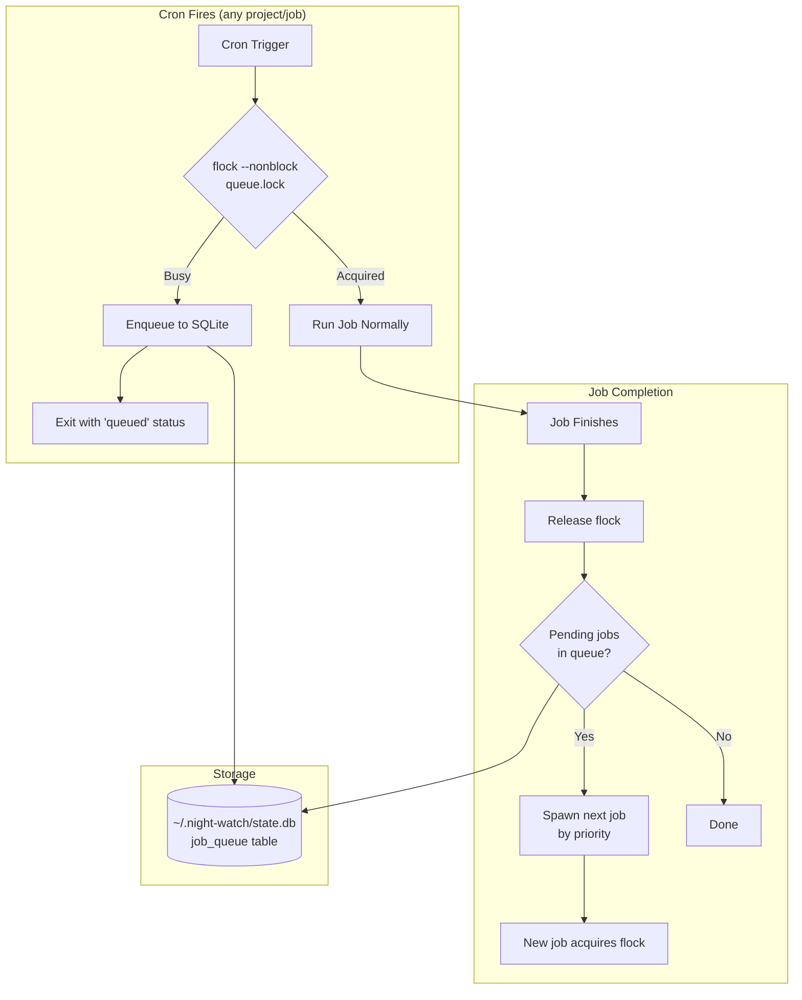
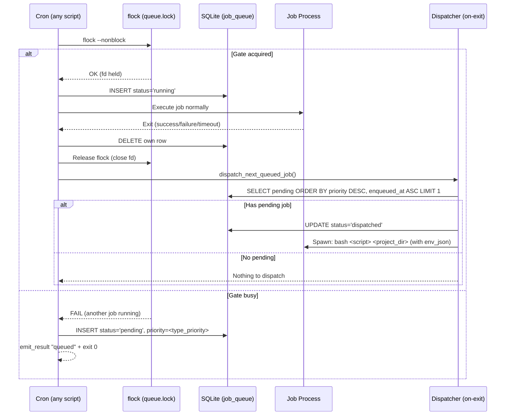

# PRD: Global Job Queue

**Complexity: 10 → HIGH mode**

---

## 1. Context

**Problem:** Night Watch CLI manages 2-3 projects with independent cron schedules. When multiple projects fire jobs simultaneously, they overwhelm the AI provider API with concurrent requests, causing 429 rate limiting. Current mitigations (exponential backoff, retries, manual `cronScheduleOffset`) are reactive and error-prone — they don't prevent clashes, only recover from them.

**Files Analyzed:**

- `scripts/night-watch-helpers.sh` — shared bash utilities (lock acquisition, project runtime key)
- `scripts/night-watch-cron.sh` — executor cron script (entry flow lines 43-83)
- `scripts/night-watch-audit-cron.sh` — audit cron script (entry flow lines 31-65)
- `scripts/night-watch-pr-reviewer-cron.sh` — reviewer cron script (entry flow lines 66-521)
- `scripts/night-watch-qa-cron.sh` — QA cron script (entry flow lines 41-349)
- `packages/core/src/utils/registry.ts` — project registry (SQLite-backed)
- `packages/core/src/storage/sqlite/migrations.ts` — SQLite schema & migrations
- `packages/core/src/types.ts` — `INightWatchConfig`, `IScheduleInfo`
- `packages/core/src/constants.ts` — default config values
- `packages/core/src/config.ts` — config loading & validation
- `packages/cli/src/commands/install.ts` — crontab generation with `cronScheduleOffset`
- `packages/cli/src/cli.ts` — CLI command registration
- `packages/server/src/routes/status.routes.ts` — status & schedule-info endpoints
- `packages/server/src/routes/action.routes.ts` — action triggers (run, review, etc.)
- `web/pages/Scheduling.tsx` — scheduling UI page
- `web/api.ts` — frontend API client

**Current Behavior:**

- Each project has independent cron schedules (template or custom mode)
- Templates stagger job types within a project (executor :05, reviewer :25, QA :45, audit :50, slicer :35)
- `cronScheduleOffset` (0-59 min) shifts minute fields but must be set manually per project
- Per-project lock files in `/tmp/night-watch-{type}-{runtime-key}.lock` prevent same-project same-type concurrency
- No cross-project coordination — two projects with same template fire simultaneously
- Rate limit detection is reactive: check for "429" in logs → exponential backoff → retry

**Integration Points Checklist:**

```markdown
**How will this feature be reached?**

- [x] Entry point: every cron script calls a new `acquire_global_gate()` helper BEFORE per-project lock
- [x] Caller: `night-watch-helpers.sh` (new function sourced by all 4 cron scripts)
- [x] Registration: new `night-watch queue` CLI command for manual queue management
- [x] Config: new `queue` section in `INightWatchConfig` / `night-watch.config.json`

**Is this user-facing?**

- [x] YES → Queue status card on Scheduling page + queue CLI command
- [x] YES → Queue config in Settings page (max concurrency, priority)

**Full user flow:**

1. User registers 2-3 projects, each with cron schedules
2. Cron fires for Project A executor → acquires global gate → runs
3. Cron fires for Project B executor (same minute) → global gate busy → enqueues → exits cleanly
4. Project A job finishes → gate released → dispatcher picks Project B from queue → runs
5. User sees queue status on Scheduling page or via `night-watch queue status`
```

---

## 2. Solution

**Approach:**

- Add a **global gate** using `flock` on a shared file (`~/.night-watch/queue.lock`) — zero-dependency, process-safe, no daemon required
- When a cron fires, it tries `flock --nonblock`. If acquired, the job proceeds normally. If busy, it **enqueues** the job (writes metadata to a SQLite queue table) and exits cleanly with a new `queued` result status
- A **dispatcher hook** runs at the end of every job: after releasing `flock`, it checks the queue table for pending jobs and spawns the next one
- Priority order: executor > reviewer > slicer > QA > audit (configurable)
- Configurable max concurrency (default 1, meaning fully serial across all projects and job types)

**Architecture Diagram:**



**Key Decisions:**

- **`flock`-based gating** — no daemon, no polling, leverages OS-level file locking; available on all Linux/macOS
- **SQLite queue table** in existing `state.db` — reuses infrastructure, atomic operations, survives reboots
- **Dispatcher-on-exit pattern** — no separate cron entry or daemon; each job checks the queue when it finishes
- **Backward compatible** — queue is opt-in via `queue.enabled` config (default `true` for new installs, `false` for upgrades to avoid surprises)
- **Stale job cleanup** — queued entries older than `queue.maxWaitTime` (default 2h) are expired and logged

**Data Changes:**

New SQLite table `job_queue`:

```sql
CREATE TABLE job_queue (
  id            INTEGER PRIMARY KEY AUTOINCREMENT,
  project_path  TEXT    NOT NULL,
  project_name  TEXT    NOT NULL,
  job_type      TEXT    NOT NULL,  -- 'executor' | 'reviewer' | 'qa' | 'audit' | 'slicer'
  priority      INTEGER NOT NULL DEFAULT 0,
  status        TEXT    NOT NULL DEFAULT 'pending',  -- 'pending' | 'running' | 'expired' | 'dispatched'
  env_json      TEXT    NOT NULL DEFAULT '{}',  -- serialized NW_* env vars for re-invocation
  enqueued_at   INTEGER NOT NULL,
  dispatched_at INTEGER,
  expired_at    INTEGER
);
CREATE INDEX idx_queue_pending ON job_queue(status, priority DESC, enqueued_at ASC);
```

New migration version in `packages/core/src/storage/sqlite/migrations.ts`.

---

## 3. Sequence Flow



---

## 4. Execution Phases

### Phase 1: Core Queue Infrastructure — "Jobs enqueue and dispatch via SQLite + flock"

**Files (max 5):**

- `packages/core/src/storage/sqlite/migrations.ts` — add `job_queue` table migration
- `scripts/night-watch-helpers.sh` — add `acquire_global_gate()`, `enqueue_job()`, `dispatch_next_queued_job()`, `expire_stale_jobs()` functions
- `packages/core/src/types.ts` — add `IQueueConfig` interface to `INightWatchConfig`
- `packages/core/src/constants.ts` — add `DEFAULT_QUEUE_*` constants

**Implementation:**

- [ ] Add `job_queue` table to SQLite migrations (version bump)
- [ ] Add `IQueueConfig` to `INightWatchConfig`:
  ```typescript
  interface IQueueConfig {
    enabled: boolean; // default: true
    maxConcurrency: number; // default: 1
    maxWaitTime: number; // seconds, default: 7200 (2h)
    priority: Record<string, number>; // job_type → priority (higher = first)
  }
  ```
- [ ] Add defaults to constants:
  ```typescript
  export const DEFAULT_QUEUE_ENABLED = true;
  export const DEFAULT_QUEUE_MAX_CONCURRENCY = 1;
  export const DEFAULT_QUEUE_MAX_WAIT_TIME = 7200;
  export const DEFAULT_QUEUE_PRIORITY: Record<string, number> = {
    executor: 50,
    reviewer: 40,
    slicer: 30,
    qa: 20,
    audit: 10,
  };
  ```
- [ ] Add bash helper `acquire_global_gate()`:
  - Uses `flock --nonblock` on `~/.night-watch/queue.lock`
  - Returns 0 (acquired) or 1 (busy)
  - Holds fd open for duration of job (fd passed to caller via variable)
- [ ] Add bash helper `enqueue_job()`:
  - Calls `night-watch queue enqueue <job_type> <project_dir>` (CLI wrapper for SQLite insert)
  - Serializes current `NW_*` env vars to JSON for later re-invocation
- [ ] Add bash helper `dispatch_next_queued_job()`:
  - Calls `night-watch queue dispatch` (CLI wrapper)
  - Expires stale jobs first (enqueued_at + maxWaitTime < now)
  - Picks highest-priority pending job
  - Spawns it as detached background process with restored env vars
- [ ] Add bash helper `expire_stale_jobs()`:
  - Deletes entries where `enqueued_at + maxWaitTime < now`
  - Logs expiration

**Tests Required:**

| Test File                                        | Test Name                                    | Assertion                                                 |
| ------------------------------------------------ | -------------------------------------------- | --------------------------------------------------------- |
| `packages/core/src/__tests__/migrations.test.ts` | `should create job_queue table`              | Table exists with correct columns after migration         |
| `packages/core/src/__tests__/queue.test.ts`      | `should enqueue a job with correct priority` | Row inserted with status='pending', priority matches type |
| `packages/core/src/__tests__/queue.test.ts`      | `should dispatch highest priority job first` | Executor dispatched before audit when both pending        |
| `packages/core/src/__tests__/queue.test.ts`      | `should expire jobs older than maxWaitTime`  | Stale rows marked 'expired'                               |

**User Verification:**

- Action: Run `night-watch queue enqueue executor /path/to/project` then `night-watch queue status`
- Expected: Shows 1 pending executor job in queue

---

### Phase 2: CLI Queue Command — "Users can view and manage the queue"

**Files (max 5):**

- `packages/cli/src/commands/queue.ts` — new CLI command with subcommands
- `packages/cli/src/cli.ts` — register `queueCommand`
- `packages/core/src/utils/job-queue.ts` — queue operations (enqueue, dispatch, status, clear, expire)
- `packages/core/src/index.ts` — export queue utilities

**Implementation:**

- [ ] Create `packages/core/src/utils/job-queue.ts` with functions:
  - `enqueueJob(projectPath, projectName, jobType, envVars): number` — inserts row, returns id
  - `dispatchNextJob(config): IQueueEntry | null` — finds & marks next job, spawns it
  - `getQueueStatus(): IQueueStatus` — returns counts + pending items
  - `clearQueue(filter?): number` — removes entries, returns count
  - `expireStaleJobs(maxWaitTime): number` — expires old entries, returns count
  - `getRunningJob(): IQueueEntry | null` — finds currently running entry
- [ ] Create `packages/cli/src/commands/queue.ts` with subcommands:
  - `night-watch queue status` — show queue summary (pending count per type, running job, next up)
  - `night-watch queue list` — show all queue entries with details
  - `night-watch queue clear [--type <type>]` — clear pending entries
  - `night-watch queue enqueue <type> <project-dir>` — manually enqueue (used by bash helpers)
  - `night-watch queue dispatch` — manually dispatch next (used by bash helpers)
- [ ] Register in `cli.ts`
- [ ] Export types from `packages/core/src/index.ts`

**Tests Required:**

| Test File                                       | Test Name                                         | Assertion                                                        |
| ----------------------------------------------- | ------------------------------------------------- | ---------------------------------------------------------------- |
| `packages/core/src/__tests__/job-queue.test.ts` | `should enqueue and retrieve job`                 | Inserted job appears in status                                   |
| `packages/core/src/__tests__/job-queue.test.ts` | `should dispatch by priority then FIFO`           | Higher priority dispatched first; same priority uses enqueued_at |
| `packages/core/src/__tests__/job-queue.test.ts` | `should clear only matching type`                 | Only executor entries cleared when `--type executor`             |
| `packages/core/src/__tests__/job-queue.test.ts` | `should not dispatch when maxConcurrency reached` | Returns null when running count >= maxConcurrency                |

**User Verification:**

- Action: `night-watch queue status` with empty queue
- Expected: Shows "Queue empty — no pending jobs"
- Action: `night-watch queue enqueue executor /path/to/project && night-watch queue status`
- Expected: Shows 1 pending executor job

---

### Phase 3: Cron Script Integration — "Jobs go through the global gate"

**Files (max 5):**

- `scripts/night-watch-cron.sh` — add global gate before per-project lock (after line 48)
- `scripts/night-watch-audit-cron.sh` — add global gate (after line 33)
- `scripts/night-watch-pr-reviewer-cron.sh` — add global gate (after line 68)
- `scripts/night-watch-qa-cron.sh` — add global gate (after line 43)
- `scripts/night-watch-helpers.sh` — finalize gate functions with env var passthrough

**Implementation:**

- [ ] In each cron script, add global gate block after helpers are sourced:
  ```bash
  # ── Global Job Queue Gate ──────────────────────────────
  if [ "${NW_QUEUE_ENABLED:-1}" = "1" ]; then
    if ! acquire_global_gate; then
      enqueue_job "${SCRIPT_TYPE}" "${PROJECT_DIR}"
      emit_result "queued"
      exit 0
    fi
  fi
  # ───────────────────────────────────────────────────────
  ```
- [ ] Set `SCRIPT_TYPE` variable at top of each script:
  - `night-watch-cron.sh` → `SCRIPT_TYPE="executor"`
  - `night-watch-audit-cron.sh` → `SCRIPT_TYPE="audit"`
  - `night-watch-pr-reviewer-cron.sh` → `SCRIPT_TYPE="reviewer"`
  - `night-watch-qa-cron.sh` → `SCRIPT_TYPE="qa"`
- [ ] Add dispatcher call at end of each script (before lock cleanup):
  ```bash
  dispatch_next_queued_job
  ```
- [ ] Update result parsing in CLI commands to handle `queued` status without error
- [ ] Pass `NW_QUEUE_ENABLED` env var through CLI commands (run, review, audit, qa)

**Tests Required:**

| Test File                                               | Test Name                               | Assertion                                        |
| ------------------------------------------------------- | --------------------------------------- | ------------------------------------------------ |
| `packages/cli/src/__tests__/scripts/queue-gate.test.ts` | `should enqueue when gate is busy`      | Second concurrent job gets 'queued' result       |
| `packages/cli/src/__tests__/scripts/queue-gate.test.ts` | `should proceed when gate is free`      | Solo job acquires gate and runs normally         |
| `packages/cli/src/__tests__/scripts/queue-gate.test.ts` | `should dispatch next after completion` | Queued job is dispatched when first job finishes |
| `packages/cli/src/__tests__/scripts/queue-gate.test.ts` | `should skip gate when queue disabled`  | NW_QUEUE_ENABLED=0 bypasses gate entirely        |

**User Verification:**

- Action: Start two `night-watch run` commands simultaneously for different projects
- Expected: First runs normally; second exits with "queued" result, then starts automatically when first finishes

---

### Phase 4: Config & CLI Wiring — "Queue is configurable via config file and env vars"

**Files (max 5):**

- `packages/core/src/config.ts` — load `queue.*` config fields + `NW_QUEUE_*` env vars
- `packages/cli/src/commands/run.ts` — pass `NW_QUEUE_ENABLED` to env
- `packages/cli/src/commands/review.ts` — pass `NW_QUEUE_ENABLED` to env
- `packages/cli/src/commands/audit.ts` — pass `NW_QUEUE_ENABLED` to env
- `packages/cli/src/commands/slice.ts` — pass `NW_QUEUE_ENABLED` to env

**Implementation:**

- [ ] Add `queue` field loading in `loadConfig()`:
  ```typescript
  queue: {
    enabled: envBool('NW_QUEUE_ENABLED', fileConfig?.queue?.enabled ?? DEFAULT_QUEUE_ENABLED),
    maxConcurrency: envInt('NW_QUEUE_MAX_CONCURRENCY', fileConfig?.queue?.maxConcurrency ?? DEFAULT_QUEUE_MAX_CONCURRENCY),
    maxWaitTime: envInt('NW_QUEUE_MAX_WAIT_TIME', fileConfig?.queue?.maxWaitTime ?? DEFAULT_QUEUE_MAX_WAIT_TIME),
    priority: fileConfig?.queue?.priority ?? DEFAULT_QUEUE_PRIORITY,
  }
  ```
- [ ] In each CLI command's env builder, add:
  ```typescript
  NW_QUEUE_ENABLED: config.queue.enabled ? '1' : '0',
  NW_QUEUE_MAX_CONCURRENCY: String(config.queue.maxConcurrency),
  NW_QUEUE_MAX_WAIT_TIME: String(config.queue.maxWaitTime),
  NW_QUEUE_PRIORITY_JSON: JSON.stringify(config.queue.priority),
  ```
- [ ] Validate config values (maxConcurrency clamped 1-10, maxWaitTime clamped 300-14400)

**Tests Required:**

| Test File                                    | Test Name                                  | Assertion                                        |
| -------------------------------------------- | ------------------------------------------ | ------------------------------------------------ |
| `packages/core/src/__tests__/config.test.ts` | `should load queue config from file`       | Queue fields parsed from night-watch.config.json |
| `packages/core/src/__tests__/config.test.ts` | `should override queue config from env`    | NW_QUEUE_ENABLED=0 overrides file config         |
| `packages/core/src/__tests__/config.test.ts` | `should clamp queue values to valid range` | maxConcurrency > 10 clamped to 10                |

**User Verification:**

- Action: Set `"queue": { "enabled": true, "maxConcurrency": 1 }` in `night-watch.config.json`
- Expected: `night-watch run --dry-run` shows `NW_QUEUE_ENABLED=1` in env output

---

### Phase 5: Server API & Web UI — "Queue status visible on Scheduling page"

**Files (max 5):**

- `packages/server/src/routes/queue.routes.ts` — new route file for queue API
- `packages/server/src/routes/index.ts` — register queue routes
- `web/api.ts` — add `fetchQueueStatus()` and `clearQueue()` API client functions
- `web/pages/Scheduling.tsx` — add Queue Status card

**Implementation:**

- [ ] Create `packages/server/src/routes/queue.routes.ts`:
  - `GET /api/queue/status` → `{ enabled, running: IQueueEntry | null, pending: { total, byType }, items: IQueueEntry[] }`
  - `POST /api/queue/clear` → clears pending entries (body: `{ type?: string }`)
  - Reuses `getQueueStatus()` and `clearQueue()` from `packages/core/src/utils/job-queue.ts`
- [ ] Register routes in `packages/server/src/routes/index.ts`
- [ ] Add to `web/api.ts`:
  ```typescript
  export async function fetchQueueStatus(): Promise<IQueueStatusResponse> { ... }
  export async function clearQueue(type?: string): Promise<void> { ... }
  ```
- [ ] Add Queue Status card to `web/pages/Scheduling.tsx`:
  - Position: after Status Banner, before Schedule Cards
  - Shows: enabled/disabled badge, running job (type + project name), pending count by type, "Clear Queue" button
  - Auto-refreshes with existing polling interval
  - Empty state: "No jobs queued — queue is idle"

**Tests Required:**

| Test File                                            | Test Name                                    | Assertion                                     |
| ---------------------------------------------------- | -------------------------------------------- | --------------------------------------------- |
| `packages/server/src/__tests__/queue.routes.test.ts` | `GET /api/queue/status returns queue state`  | Response has enabled, running, pending fields |
| `packages/server/src/__tests__/queue.routes.test.ts` | `POST /api/queue/clear removes pending jobs` | Pending count drops to 0 after clear          |

**User Verification:**

- Action: Open web UI → Scheduling page with a job queued
- Expected: Queue Status card shows running job and pending items with "Clear" button

---

### Phase 6: Notification & Result Handling — "Queued status flows through notification system"

**Files (max 5):**

- `packages/cli/src/commands/run.ts` — handle `queued` script result
- `packages/cli/src/commands/review.ts` — handle `queued` script result
- `packages/cli/src/commands/audit.ts` — handle `queued` script result
- `packages/cli/src/commands/slice.ts` — handle `queued` script result

**Implementation:**

- [ ] In each CLI command's result parser, add `queued` as a valid non-error status:
  ```typescript
  case 'queued':
    logger.info('Job queued — another job is currently running, will dispatch when slot opens');
    break;
  ```
- [ ] Ensure `cross-project-fallback` logic does not trigger when result is `queued` (the queue already handles ordering)
- [ ] Optional: send Telegram notification for `queued` events if `NW_TELEGRAM_STATUS_WEBHOOKS` is set (fire-and-forget, low priority)

**Tests Required:**

| Test File                                | Test Name                                               | Assertion                                    |
| ---------------------------------------- | ------------------------------------------------------- | -------------------------------------------- |
| `packages/cli/src/__tests__/run.test.ts` | `should handle queued result without error`             | No exception thrown, logger.info called      |
| `packages/cli/src/__tests__/run.test.ts` | `should not trigger cross-project-fallback when queued` | Fallback not attempted when result is queued |

**User Verification:**

- Action: Trigger two jobs simultaneously, check logs
- Expected: Second job log shows "Job queued — another job is currently running"

---

## 5. Acceptance Criteria

- [ ] All 6 phases complete
- [ ] All specified tests pass
- [ ] `yarn verify` passes
- [ ] All automated checkpoint reviews passed
- [ ] When two projects' crons fire simultaneously, only one job runs; the other enqueues and runs after
- [ ] `night-watch queue status` shows accurate queue state at all times
- [ ] Web UI Scheduling page displays Queue Status card with live data
- [ ] Queue is configurable via `night-watch.config.json` and `NW_QUEUE_*` env vars
- [ ] `NW_QUEUE_ENABLED=0` completely bypasses the queue (backward compatible)
- [ ] Stale queued jobs are expired after `maxWaitTime` seconds
- [ ] Priority ordering works: executor dispatched before audit when both pending
