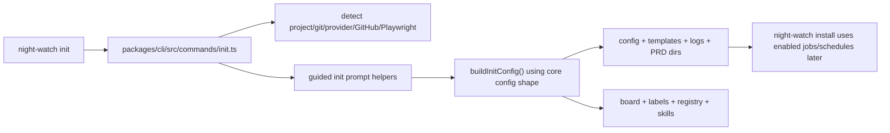
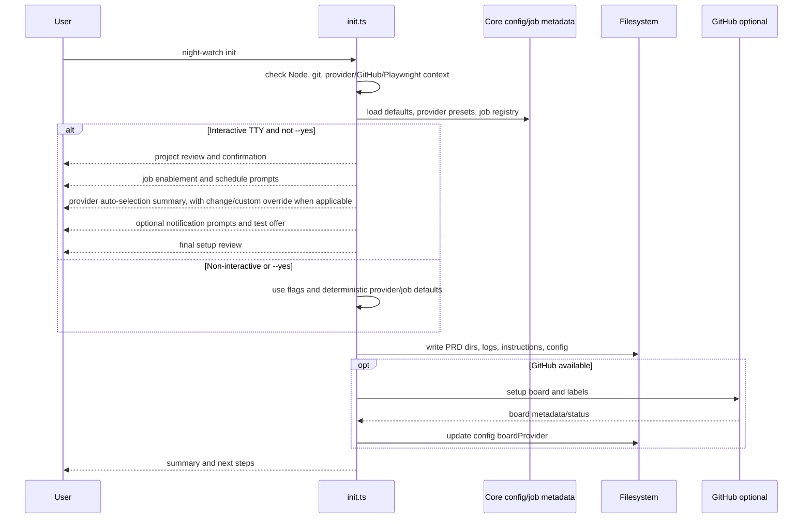

# PRD: Guided Init Onboarding

**Complexity: 6 → MEDIUM mode** (6-10 files, complex interactive state logic, multi-package contract usage)

---

## 1. Context

**Problem:** `night-watch init` currently creates a mostly default setup; users still need to discover and edit the config manually before the project is truly ready to run.

**Files Analyzed:**
- `instructions/prd-creator.md` - required PRD structure, complexity scoring, phase/checkpoint rules
- `CLAUDE.md` - repo conventions: yarn, TypeScript, interfaces prefixed with `I`, kebab-case, `.js` imports, vitest
- `packages/cli/src/commands/init.ts` - current init flow, provider detection, template copy, config creation, board setup, skill install
- `packages/cli/src/__tests__/commands/init.test.ts` - current init coverage for git checks, template copy, idempotency, `.gitignore`, config generation
- `packages/cli/src/__tests__/commands/init-branch-selection.test.ts` - default branch detection tests
- `packages/cli/src/commands/install.ts` - cron entry generation from config schedules and enabled job flags
- `packages/core/src/types.ts` - `INightWatchConfig`, `IProviderPreset`, `IJobProviders`, `JobType`, notification/webhook types
- `packages/core/src/constants.ts` - default schedules, enabled flags, `BUILT_IN_PRESETS`, `BUILT_IN_PRESET_IDS`
- `packages/core/src/config.ts` - default config and merge behavior
- `packages/core/src/config-normalize.ts` - accepted config shape for provider presets, notifications, schedules, nested jobs
- `packages/core/src/jobs/job-registry.ts` - source of truth for job names, descriptions, CLI commands, schedules, defaults
- `packages/core/src/utils/webhook-validator.ts` - Slack, Discord, Telegram validation rules
- `packages/cli/src/commands/notify.ts` - existing notification test path via `night-watch notify`
- `packages/cli/src/commands/doctor.ts` - provider and webhook health checks

**Current Behavior:**
- `night-watch init` checks Node, git, provider CLIs, optional GitHub prerequisites, and Playwright; then writes PRD/log/instruction directories, `night-watch.config.json`, GitHub board metadata when available, labels, global registry entry, and AI skills.
- Provider selection only supports detected built-in providers and the `--provider` flag is validated against `BUILT_IN_PRESET_IDS`; custom provider presets are supported by core config but not by init.
- Current provider selection still makes interactive users choose when multiple provider CLIs are detected, even when there is an obvious default. The guided flow should instead auto-select the best detected provider by deterministic precedence and let the user override.
- Init writes default schedules and job enabled flags from `getDefaultConfig()` with only `--no-reviewer` as a guided job-control option.
- Init prompts only for multiple detected providers and optional Playwright install; it does not clearly confirm the detected project or ask which jobs/schedules/notifications the user wants.
- Non-interactive sessions already avoid provider-selection prompts and Playwright prompts by checking TTY state.

---

## 2. Solution

**Approach:**
- Add an interactive, TTY-only onboarding flow inside `night-watch init` that confirms the project, collects job enablement/schedules, provider preset details, optional notifications, and then writes the same canonical config shape Night Watch already uses.
- Keep non-interactive behavior deterministic: existing flags continue to work, no prompts run without TTY, provider defaults use the same auto-selection precedence as interactive init, and new flags provide CI/headless control where needed.
- Reuse `JOB_REGISTRY`, `BUILT_IN_PRESETS`, `BUILT_IN_PRESET_IDS`, `INightWatchConfig`, `IProviderPreset`, `IWebhookConfig`, and `validateWebhook()` instead of inventing a second init-only model.
- Make dangerous/high-impact jobs explicit in prompt copy: executor writes PRs, reviewer can push fixes, pr-resolver rebases/conflict-resolves, merger can merge PRs, analytics needs Amplitude credentials, audit/manager/slicer can create board issues.
- Write a ready-to-run result: config, instructions/templates, board/project config where available, schedules, enabled jobs, provider preset selection, optional notifications, registry entry, labels, and skills.
- Provider onboarding should auto-detect and auto-select by default when a supported provider CLI is available. The default precedence is Codex > Claude/Claude model presets > other detected built-in presets, unless the user supplies `--provider` or chooses the custom/advanced override path.

**Architecture Diagram:**



**Key Decisions:**
- [x] Use Node `readline` to stay consistent with current init prompts; do not add an interactive prompt dependency.
- [x] Model prompt answers as a small `IInitOnboardingAnswers` object and transform it into `INightWatchConfig` through `buildInitConfig()`.
- [x] Read job metadata from `getAllJobDefs()`/`getJobDef()` for labels, descriptions, defaults, and schedules; only add init-specific warning copy for high-impact jobs.
- [x] Built-in provider choices come from `BUILT_IN_PRESETS`; custom providers are stored under `providerPresets[custom-id]` and selected through `provider`.
- [x] Notification setup is optional; Telegram uses `botToken` + `chatId`, Slack/Discord use `url`, and all use existing `events`.
- [x] Interactive prompts must run only when `isInteractiveInitSession()` returns true and must be suppressible with `--yes`/flags for automation.

**Data Changes:** None. Use existing `night-watch.config.json` fields: `provider`, `providerPresets`, `providerEnv`, top-level executor/reviewer schedule fields, nested job configs, `roadmapScanner`, `notifications`, `jobProviders`, `boardProvider`.

---

## 3. Sequence Flow



---

## 4. Integration Points Checklist

```markdown
**How will this feature be reached?**
- [x] Entry point identified: `night-watch init`
- [x] Caller file identified: `packages/cli/src/commands/init.ts`
- [x] Registration/wiring needed: extend the existing `initCommand(program)` options and action; no new command registration required

**Is this user-facing?**
- [x] YES -> CLI prompts and summary output in `night-watch init`
- [x] NO web UI required; dashboard settings already edit resulting config later

**Full user flow:**
1. User runs `night-watch init` from a project root.
2. Existing init checks detect git repo, project name, default branch, providers, GitHub remote/auth, Playwright status, and existing config.
3. In an interactive TTY, init shows a setup review and asks the user to confirm this is the project Night Watch should run on.
4. User selects job types and accepts or edits schedules.
5. Init auto-selects the best detected provider by precedence, shows a short confirmation/summary line, and lets the user change to another built-in preset or enter a custom executable CLI command with flags.
6. User optionally configures Telegram, Slack, or Discord notifications and can test notification delivery.
7. Init writes `night-watch.config.json`, instructions/templates, PRD/log dirs, board metadata where available, labels, registry entry, and skills.
8. User sees a final summary with enabled jobs, provider, notification status, and next commands.
```

---

## 5. Requirements

**Interactive Init Acceptance Criteria:**
- Running `night-watch init` in a TTY shows a project review containing at least project path, project name, default branch, GitHub remote status, config overwrite status, selected PRD dir, and detected provider/Playwright status.
- The user must explicitly confirm the project before file writes begin. Declining exits with code `0` before creating or modifying project files.
- The user can enable/disable executor, reviewer, QA, audit, analytics, slicer/planner/roadmap scanning, pr-resolver, manager, and merger; init clearly warns that executor/reviewer/pr-resolver/merger can modify branches, push changes, resolve conflicts, or merge PRs.
- Each enabled scheduled job writes its schedule into the existing config field consumed by `install.ts`: `cronSchedule`, `reviewerSchedule`, `qa.schedule`, `audit.schedule`, `analytics.schedule`, `roadmapScanner.slicerSchedule`, `prResolver.schedule`, `manager.schedule`, and `merger.schedule`.
- Disabled jobs write the matching existing flags/config fields: `executorEnabled`, `reviewerEnabled`, `qa.enabled`, `audit.enabled`, `analytics.enabled`, `roadmapScanner.enabled`, `prResolver.enabled`, `manager.enabled`, and `merger.enabled`.
- Provider choices include Claude, Codex, and every current built-in preset in `BUILT_IN_PRESETS`: `claude`, `claude-sonnet-4-6`, `claude-opus-4-6`, `codex`, `glm-47`, and `glm-5`.
- Provider selection is auto-detected and auto-selected by default when at least one supported provider CLI is available; the user is not forced through a provider picker when there is an obvious detected provider.
- Provider default precedence is deterministic: Codex > Claude/Claude model presets > other detected built-in presets, unless the user supplies `--provider` or explicitly changes the selection in the guided flow.
- If Codex is detected, init defaults to Codex. If both Codex and Claude are detected, init defaults to Codex and prints a clear line that Claude is also available and can be selected instead.
- If exactly one supported provider CLI is detected, init auto-selects it and shows a short confirmation/summary line before final review.
- If no supported provider CLI is detected, init prompts for custom provider setup or explains which supported provider CLIs can be installed; custom provider setup remains available as an advanced override even when built-in providers are detected.
- Built-in provider output reuses preset IDs and does not duplicate built-in preset objects into config unless the user customizes fields.
- Custom provider setup writes `provider: "<custom-id>"` and `providerPresets["<custom-id>"]` with existing fields: `name`, `command`, optional `subcommand`, `promptFlag`, `autoApproveFlag`, `workdirFlag`, `modelFlag`, `model`, `useGoalCommand`, and optional `envVars`.
- Custom provider prompt copy warns: the command must be an executable CLI command available to the Night Watch process, or scheduled jobs will fail.
- Telegram setup collects `botToken`, `chatId`, and notification events; prompt copy explains BotFather for the token and `getUpdates`/a message to the bot for chat ID discovery.
- Slack and Discord setup collect webhook URL and events using existing webhook types.
- Notification setup is optional and never blocks init completion unless the user chooses to test and the test fails; a failed test should warn and allow continuing with or without saving that webhook.
- Final summary includes enabled jobs with schedules, selected provider/preset, custom provider command when applicable, notification status, board status, skills status, and next steps.

**Non-Interactive Init Acceptance Criteria:**
- Running `night-watch init` with non-TTY stdin/stdout never prompts.
- Existing flags keep working: `--force`, `--prd-dir`, `--provider`, and `--no-reviewer`.
- Non-interactive provider behavior uses the same deterministic auto-selection/default precedence as interactive init unless an explicit provider flag is supplied: Codex > Claude/Claude model presets > other detected built-in presets.
- In non-interactive mode, exactly one detected provider is auto-selected, multiple detected providers choose the highest-precedence provider, and no detected provider fails with a message explaining supported installs or the custom provider flags/path.
- `--provider` accepts current built-in preset IDs, not only `claude`/`codex`.
- New flags, if added, must be optional and deterministic. Recommended flags: `--yes`, `--jobs <csv>`, `--no-jobs <csv>`, `--schedule <job=cron>`, `--custom-provider-command <cmd>`, `--custom-provider-name <name>`, and notification flags only if needed for CI use.
- Headless init writes the same default-ready config shape as today plus any explicitly requested job/provider/notification flag changes.
- Non-interactive mode must not attempt Telegram/Slack/Discord test sends unless an explicit test flag is provided.

**Out of Scope:**
- No new web dashboard pages or settings UI changes.
- No new config schema or migration format.
- No automatic installation of cron entries during init; continue to direct users to `night-watch install`.
- No secret manager integration; tokens entered during init are written to config using the current notification model.
- No provider capability probing beyond checking that the command exists and warning for custom commands.
- No changes to job implementations, scheduler semantics, or board provider behavior beyond init config generation.

---

## 6. Execution Phases

### Phase 1: Prompt Infrastructure and Project Confirmation - Users can safely review/abort before init writes files

**Files (max 5):**
- `packages/cli/src/commands/init.ts` - add reusable prompt helpers, project review prompt, `--yes` option, and answer model
- `packages/cli/src/__tests__/commands/init.test.ts` - unit tests for TTY gating, project confirmation, and abort behavior

**Implementation:**
- [ ] Add interfaces in `init.ts`: `IInitOnboardingAnswers`, `IJobSelectionAnswer`, `IProviderSelectionAnswer`, and `INotificationSelectionAnswer`.
- [ ] Add readline helpers: `promptText()`, `promptYesNoInteractive()`, `promptChoice()`, and `promptMultiSelect()` that all short-circuit when `!isInteractiveInitSession()`.
- [ ] Add `--yes` to skip guided prompts while still using current defaults and flags.
- [ ] Move project name/default branch detection before any file writes and build a project review object: `cwd`, `projectName`, `defaultBranch`, GitHub remote status, `prdDir`, existing config status, provider status, Playwright status.
- [ ] In interactive mode and without `--yes`, show the review and require confirmation. If declined, print a concise cancellation message, fire no completion telemetry, and return before directory/config/template writes.
- [ ] Preserve current `--force` behavior when a config file exists; in interactive mode, include whether init will overwrite or skip existing config.

**Tests Required:**
| Test File | Test Name | Assertion |
|-----------|-----------|-----------|
| `packages/cli/src/__tests__/commands/init.test.ts` | `isInteractiveInitSession returns false for non-TTY test process` | `expect(isInteractiveInitSession()).toBe(false)` |
| `packages/cli/src/__tests__/commands/init.test.ts` | `should skip guided confirmation when --yes is passed` | CLI exits successfully and writes config without waiting for stdin |
| `packages/cli/src/__tests__/commands/init.test.ts` | `should abort before writes when project confirmation is declined` | no `night-watch.config.json`, `instructions/`, or `logs/` created |

**Verification Plan:**
1. Unit/integration tests:
   ```bash
   yarn vitest packages/cli/src/__tests__/commands/init.test.ts --run
   ```
2. Type/lint/build:
   ```bash
   yarn verify
   ```

**User Verification:**
- Action: run `night-watch init` in a temporary git repo and answer `n` to project confirmation.
- Expected: init exits without writing project files.

**Checkpoint:** Use `prd-work-reviewer` with prompt: `Review checkpoint for phase 1 of PRD at docs/prds/guided-init-onboarding.md`.

### Phase 2: Job Selection and Schedule Writing - Init produces a config with the selected scheduled jobs

**Files (max 5):**
- `packages/cli/src/commands/init.ts` - add job catalog, prompts, schedule validation, config application
- `packages/cli/src/__tests__/commands/init.test.ts` - tests for job selection transform and config output
- `packages/cli/src/__tests__/commands/install.test.ts` - focused regression that init-produced enabled/disabled fields are consumed by cron install

**Implementation:**
- [ ] Build a job catalog from core job definitions for: `executor`, `reviewer`, `qa`, `audit`, `analytics`, `slicer`, `pr-resolver`, `manager`, and `merger`.
- [ ] Add init-specific warning/help text for high-impact jobs:
  - `executor`: creates branches and PRs from PRDs.
  - `reviewer`: can push fix commits to Night Watch PR branches.
  - `pr-resolver`: can rebase/update PR branches and resolve conflicts.
  - `merger`: can merge eligible PRs and delete branches depending on merge path.
  - `analytics`: needs Amplitude credentials in `providerEnv` or will fail when run.
  - `slicer`/`manager`/`audit`: can create board issues or draft work.
- [ ] Prompt for default job bundles first, then allow per-job edits:
  - `recommended`: executor, reviewer, QA, slicer, manager, pr-resolver enabled; audit, analytics, merger disabled.
  - `minimal`: executor only.
  - `custom`: per-job selection.
- [ ] For every enabled job, prompt to accept default schedule or enter a cron expression. Keep validation pragmatic: five cron fields or known preset label; reject empty schedules for enabled jobs.
- [ ] Add headless flags if needed: `--jobs <csv>`, `--no-jobs <csv>`, and `--schedule <job=cron>`; parse job IDs through the existing `JobType`/registry list.
- [ ] Update `buildInitConfig()` to apply answers to existing fields:
  - `executor` -> `executorEnabled`, `cronSchedule`
  - `reviewer` -> `reviewerEnabled`, `reviewerSchedule`
  - `qa` -> `qa.enabled`, `qa.schedule`
  - `audit` -> `audit.enabled`, `audit.schedule`
  - `analytics` -> `analytics.enabled`, `analytics.schedule`
  - `slicer` -> `roadmapScanner.enabled`, `roadmapScanner.slicerSchedule`
  - `pr-resolver` -> `prResolver.enabled`, `prResolver.schedule`
  - `manager` -> `manager.enabled`, `manager.schedule`
  - `merger` -> `merger.enabled`, `merger.schedule`
- [ ] Keep `--no-reviewer` as a compatibility alias that disables reviewer unless interactive answers explicitly re-enable it after the setup review.

**Tests Required:**
| Test File | Test Name | Assertion |
|-----------|-----------|-----------|
| `packages/cli/src/__tests__/commands/init.test.ts` | `buildInitConfig applies selected job enablement and schedules` | selected jobs are enabled with requested schedules and unselected jobs are disabled |
| `packages/cli/src/__tests__/commands/init.test.ts` | `--no-reviewer remains honored in non-interactive init` | generated config has `reviewerEnabled: false` |
| `packages/cli/src/__tests__/commands/init.test.ts` | `should reject unknown job IDs in --jobs` | CLI exits non-zero with valid job list |
| `packages/cli/src/__tests__/commands/install.test.ts` | `performInstall uses init-selected job schedules` | generated cron entries match enabled jobs and schedules |

**Verification Plan:**
1. Related tests:
   ```bash
   yarn vitest packages/cli/src/__tests__/commands/init.test.ts packages/cli/src/__tests__/commands/install.test.ts --run
   ```
2. Full verification:
   ```bash
   yarn verify
   ```

**User Verification:**
- Action: run `night-watch init --yes --jobs executor,qa --schedule executor="*/30 * * * *" --schedule qa="0 2 * * *"` in a git repo.
- Expected: config enables executor and QA with those schedules and disables reviewer/slicer/audit/analytics/pr-resolver/manager/merger unless otherwise defaulted by explicit product decision.

**Checkpoint:** Use `prd-work-reviewer` with prompt: `Review checkpoint for phase 2 of PRD at docs/prds/guided-init-onboarding.md`.

### Phase 3: Provider Preset and Custom Provider Onboarding - Init can produce usable built-in and custom provider config

**Files (max 5):**
- `packages/cli/src/commands/init.ts` - provider preset prompt, custom provider capture, validation, summary
- `packages/cli/src/__tests__/commands/init.test.ts` - provider selection/config tests
- `packages/core/src/__tests__/config.test.ts` - regression tests only if new config assumptions need coverage

**Implementation:**
- [ ] Replace init's hardcoded provider flag messaging with `BUILT_IN_PRESET_IDS` and `BUILT_IN_PRESETS` labels.
- [ ] Continue auto-detection for installed provider commands and compute a default provider without prompting when there is a usable detected provider.
- [ ] Implement deterministic default precedence for both interactive and non-interactive init: Codex > Claude/Claude model presets > other detected built-in presets, unless `--provider` or an explicit guided override is supplied.
- [ ] When Codex is detected, default to `codex`. When both Codex and Claude are detected, print a concise summary that Codex was selected and Claude is also available via change/override.
- [ ] When exactly one supported provider CLI is detected, auto-select its highest-precedence built-in preset and show a short confirmation/summary line instead of forcing provider selection.
- [ ] When no supported provider CLI is detected, prompt interactively for custom provider setup or show supported provider install guidance; in non-interactive mode, fail unless explicit provider/custom provider flags provide a usable selection.
- [ ] Provider change/advanced choices must include all built-in presets, even if the underlying command is not detected; show detected/not detected status beside each.
- [ ] For built-in presets:
  - Write `provider` as the selected preset ID.
  - Do not write `providerPresets` unless the user chooses to customize details.
  - Check the executable command using `BUILT_IN_PRESETS[presetId].command`.
- [ ] For custom provider:
  - Prompt for display name and executable command/name.
  - Prompt for optional `subcommand`, `promptFlag`, `autoApproveFlag`, `workdirFlag`, `modelFlag`, `model`, and `useGoalCommand`.
  - Generate a stable config key from the name/command, e.g. `custom-provider`, with collision handling.
  - Write `provider` to that key and write `providerPresets[key]` using the existing `IProviderPreset` shape.
  - Warn clearly that the command must be executable by scheduled Night Watch runs or jobs will fail.
- [ ] Validate built-in and custom command existence with the existing provider CLI check where possible. For a missing custom command, allow the user to continue only after explicit confirmation.
- [ ] Add optional headless custom provider flags only if needed: `--custom-provider-command`, `--custom-provider-name`, `--custom-provider-prompt-flag`, `--custom-provider-auto-approve-flag`, `--custom-provider-workdir-flag`, `--custom-provider-model-flag`, `--custom-provider-model`.
- [ ] Update final summary to show preset ID, command, model when present, and whether the command was found.

**Tests Required:**
| Test File | Test Name | Assertion |
|-----------|-----------|-----------|
| `packages/cli/src/__tests__/commands/init.test.ts` | `--provider accepts all built-in preset IDs` | `glm-5` and `claude-opus-4-6` are accepted and resolve to `claude` command checks |
| `packages/cli/src/__tests__/commands/init.test.ts` | `auto-selects Codex when Codex and Claude are detected` | generated config has `provider: "codex"` and stdout indicates Claude can be selected instead |
| `packages/cli/src/__tests__/commands/init.test.ts` | `auto-selects the only detected provider without prompting` | generated config uses the single detected provider and stdout contains a short provider summary |
| `packages/cli/src/__tests__/commands/init.test.ts` | `non-interactive init uses provider precedence` | multiple detected providers choose Codex without prompting unless `--provider` overrides |
| `packages/cli/src/__tests__/commands/init.test.ts` | `no detected provider explains install or custom setup path` | interactive mode offers custom setup/install guidance; non-interactive mode exits non-zero without explicit provider/custom flags |
| `packages/cli/src/__tests__/commands/init.test.ts` | `buildInitConfig writes custom provider preset` | `provider` equals generated custom key and `providerPresets[key]` contains command/flags/model |
| `packages/cli/src/__tests__/commands/init.test.ts` | `custom provider without executable warns but can be confirmed interactively` | config is written only after explicit confirmation |
| `packages/core/src/__tests__/config.test.ts` | `resolvePreset reads init-created custom provider` | `resolvePreset(config, customKey)` returns the custom preset |

**Verification Plan:**
1. Provider-focused tests:
   ```bash
   yarn vitest packages/cli/src/__tests__/commands/init.test.ts packages/core/src/__tests__/config.test.ts --run
   ```
2. Full verification:
   ```bash
   yarn verify
   ```

**User Verification:**
- Action: run `night-watch init --yes` in a git repo with both Codex and Claude CLIs installed.
- Expected: config has `provider: "codex"` and summary output states Codex was selected while Claude remains available as an override.
- Action: run `night-watch init --yes --provider glm-5` in a git repo with Claude CLI installed.
- Expected: config has `provider: "glm-5"` and `night-watch doctor` checks the `claude` executable for that preset.

**Checkpoint:** Use `prd-work-reviewer` with prompt: `Review checkpoint for phase 3 of PRD at docs/prds/guided-init-onboarding.md`.

### Phase 4: Optional Notification Setup and Test Path - Users can configure alerts during init without blocking setup

**Files (max 5):**
- `packages/cli/src/commands/init.ts` - notification prompts, webhook construction, optional test send
- `packages/cli/src/__tests__/commands/init.test.ts` - notification config tests
- `packages/core/src/__tests__/utils/webhook-validator.test.ts` - regression only if validator behavior changes

**Implementation:**
- [ ] Add an optional, highly recommended notification step after provider setup and before final review.
- [ ] Offer webhook types from existing config: Telegram, Slack, Discord, or skip.
- [ ] Telegram prompt copy:
  - Bot token comes from Telegram's BotFather after creating a bot.
  - Chat ID can be found by sending the bot a message and calling `https://api.telegram.org/bot<TOKEN>/getUpdates`, or by using an existing known chat ID.
  - Night Watch needs both `botToken` and `chatId`.
- [ ] Slack/Discord prompt copy:
  - Slack URL should start with `https://hooks.slack.com/`.
  - Discord URL should start with `https://discord.com/api/webhooks/`.
- [ ] Let the user choose events from existing `NOTIFICATION_EVENTS`; provide a recommended default set: `run_failed`, `run_timeout`, `review_ready_for_human`, `rate_limit_fallback`, `qa_completed`, `merge_failed`, `manager_blocked`, `manager_weekly_summary`.
- [ ] Validate webhook shape using `validateWebhook()` before saving. If invalid, show issues and let the user fix, skip, or save anyway only after explicit confirmation.
- [ ] Offer a test send using existing notification infrastructure, equivalent to `night-watch notify run_started <projectDir>` with the in-memory config. A failed test warns and allows continuing without blocking init.
- [ ] In non-interactive mode, only write notifications from explicit flags/env if implemented; otherwise keep `notifications.webhooks: []`.

**Tests Required:**
| Test File | Test Name | Assertion |
|-----------|-----------|-----------|
| `packages/cli/src/__tests__/commands/init.test.ts` | `buildInitConfig writes telegram notification webhook` | config contains `{ type: "telegram", botToken, chatId, events }` |
| `packages/cli/src/__tests__/commands/init.test.ts` | `buildInitConfig writes discord notification webhook` | config contains Discord `url` and selected events |
| `packages/cli/src/__tests__/commands/init.test.ts` | `non-interactive init does not prompt or test notifications` | init completes with empty webhooks unless flags are supplied |
| `packages/core/src/__tests__/utils/webhook-validator.test.ts` | `telegram validation still requires botToken and chatId` | missing fields produce validation issues |

**Verification Plan:**
1. Notification tests:
   ```bash
   yarn vitest packages/cli/src/__tests__/commands/init.test.ts packages/core/src/__tests__/utils/webhook-validator.test.ts --run
   ```
2. Manual test command with a real configured webhook:
   ```bash
   night-watch notify run_started "$(pwd)"
   ```
3. Full verification:
   ```bash
   yarn verify
   ```

**User Verification:**
- Action: run guided init, choose Telegram, enter a valid bot token/chat ID, and accept the test send.
- Expected: test message arrives; config contains the Telegram webhook; init can still complete if the user skips or the test fails.

**Checkpoint:** Use `prd-work-reviewer` with prompt: `Review checkpoint for phase 4 of PRD at docs/prds/guided-init-onboarding.md`.

### Phase 5: Final Review, Idempotency, and Documentation of Headless Behavior - Init feels complete and remains automation-safe

**Files (max 5):**
- `packages/cli/src/commands/init.ts` - final setup review, summary table, telemetry updates, idempotency polish
- `packages/cli/src/__tests__/commands/init.test.ts` - end-to-end config assertions and idempotency tests
- `docs/configuration.md` - document only if new init flags are added and CLI docs already track command flags there

**Implementation:**
- [ ] Add a final interactive setup review before writes: project, jobs/schedules, provider details, notifications, board setup status, Playwright choice, and files that will be created/skipped.
- [ ] Require confirmation before writes unless `--yes` or non-interactive mode is active.
- [ ] Preserve idempotency:
  - Without `--force`, do not overwrite existing config/templates.
  - Guided answers should not silently disappear if config exists; show that config will be skipped unless `--force`.
  - With `--force`, write the newly selected config.
- [ ] Update summary tables to include enabled jobs and schedules, provider preset command/model, notification count/type, board setup, label sync, registry, skills, and Playwright status.
- [ ] Update telemetry payload only with non-sensitive fields already permitted by telemetry bootstrap: provider, success/failure, board mode; do not include paths, tokens, webhook URLs, custom commands, schedules, or job selections unless telemetry policy is explicitly expanded elsewhere.
- [ ] If new flags were added, document them in the existing CLI docs location used by the repo. If no such docs are present, keep documentation in command `--help` and tests only.

**Tests Required:**
| Test File | Test Name | Assertion |
|-----------|-----------|-----------|
| `packages/cli/src/__tests__/commands/init.test.ts` | `guided init final config is ready to run` | config includes selected jobs, schedules, provider, templates dir, board provider, notifications, and defaults needed by `loadConfig()` |
| `packages/cli/src/__tests__/commands/init.test.ts` | `second init without force does not overwrite existing guided config` | config content remains unchanged |
| `packages/cli/src/__tests__/commands/init.test.ts` | `init --force rewrites config with new guided answers` | config reflects second run answers |
| `packages/cli/src/__tests__/commands/init.test.ts` | `init summary does not print notification secrets` | stdout does not contain Telegram token, chat ID, Slack URL, or Discord URL |

**Verification Plan:**
1. Init test suite:
   ```bash
   yarn vitest packages/cli/src/__tests__/commands/init.test.ts packages/cli/src/__tests__/commands/init-branch-selection.test.ts --run
   ```
2. Related command tests:
   ```bash
   yarn vitest packages/cli/src/__tests__/commands/install.test.ts packages/cli/src/__tests__/commands/doctor.test.ts --run
   ```
3. Full verification:
   ```bash
   yarn verify
   ```

**User Verification:**
- Action: run a complete guided init in a fresh git repo, then run `night-watch doctor`.
- Expected: doctor reports config/logs/webhooks/provider status correctly; skipped optional integrations are informational, not fatal unless existing doctor behavior already treats them as fatal.

**Checkpoint:** Use `prd-work-reviewer` with prompt: `Review checkpoint for phase 5 of PRD at docs/prds/guided-init-onboarding.md`.

---

## 7. Verification Strategy

**Unit Tests:**
- Pure helpers for parsing job CSVs, applying schedule overrides, generating custom provider keys, building provider presets, masking secrets in summaries, and validating cron-like input.
- Config transform tests for `buildInitConfig()` covering selected jobs, disabled jobs, built-in provider IDs, provider auto-selection precedence, custom provider presets, and notifications.

**Integration Tests:**
- CLI `init --yes` in temp git repos to verify no prompts and ready config output.
- CLI `init --yes` with mocked/detected provider combinations to verify Codex > Claude/Claude model presets > other detected built-in presets, and `--provider` override behavior.
- CLI `init --force` and second-run idempotency behavior.
- `performInstall()` with init-produced config to prove schedules/enabled jobs produce expected cron entries.
- `loadConfig()`/`resolvePreset()` with init-produced custom provider config.

**Manual Verification:**
- Guided TTY run where the user declines project confirmation: no writes.
- Guided TTY run with Codex and Claude installed: Codex is selected automatically and the user can change it before final review.
- Guided/non-interactive run with only one supported provider installed: that provider is auto-selected and summarized without a provider picker.
- Guided/non-interactive run with no supported provider installed: guided mode offers custom setup/install guidance; non-interactive mode exits with actionable guidance unless explicit provider/custom flags are supplied.
- Guided TTY run with a custom provider command: config writes a valid `providerPresets` entry and summary warns about executable requirements.
- Guided TTY run with Telegram test send: message is delivered or failure is non-blocking.

**Evidence Required:**
- [ ] `yarn vitest packages/cli/src/__tests__/commands/init.test.ts packages/cli/src/__tests__/commands/init-branch-selection.test.ts --run` passes.
- [ ] `yarn vitest packages/cli/src/__tests__/commands/install.test.ts packages/cli/src/__tests__/commands/doctor.test.ts --run` passes.
- [ ] `yarn vitest packages/core/src/__tests__/config.test.ts packages/core/src/__tests__/utils/webhook-validator.test.ts --run` passes if those files are touched.
- [ ] `yarn verify` passes.
- [ ] Manual guided init writes a config that `night-watch doctor` can load.

---

## 8. Risks and Mitigations

- **Risk:** Interactive prompts make CI hang.
  **Mitigation:** Gate every prompt behind `isInteractiveInitSession()` and add tests for non-TTY/`--yes`.
- **Risk:** Custom provider config diverges from runtime invocation.
  **Mitigation:** Store only existing `IProviderPreset` fields and verify with `resolvePreset()` tests.
- **Risk:** Init writes secrets to terminal output.
  **Mitigation:** Mask notification tokens, chat IDs, webhook URLs, and env var values in summaries and tests.
- **Risk:** The job list drifts as new jobs are added.
  **Mitigation:** Use `JOB_REGISTRY` for labels/defaults and keep only warning copy as an init-specific map.
- **Risk:** Existing users rerun init and accidentally overwrite hand-edited config.
  **Mitigation:** Preserve skip-without-force behavior and show final review before writes.
- **Risk:** Dangerous jobs become too easy to enable.
  **Mitigation:** Use explicit warning copy and require confirmation for pr-resolver/merger in interactive custom selection.
