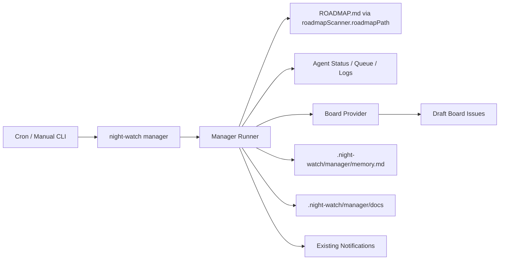
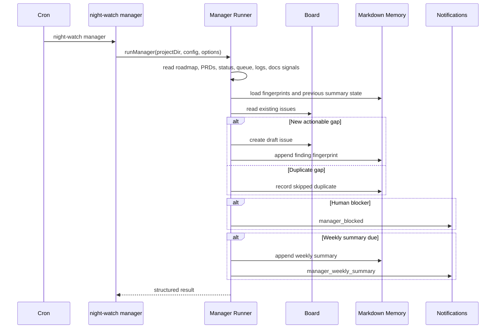

# PRD: Manager Agent

**Complexity: 9 -> HIGH mode**

---

## 1. Context

**Problem:** Night Watch can execute, review, QA, audit, slice, and merge work, but it does not have a roadmap-aware manager that continuously checks whether the automation system, project board, PRDs, and documentation remain aligned.

**Files Analyzed:**

- `ROADMAP.md` - product direction and current/future agent responsibilities
- `CLAUDE.md` - repo conventions for TypeScript, DI, tests, and package manager
- `templates/prd-creator.md` - required PRD planning template
- `packages/core/src/jobs/job-registry.ts` - central job metadata registry
- `packages/core/src/types.ts` - config, job type, notification, and queue types
- `packages/core/src/constants.ts` - default config and log/job constants
- `packages/core/src/config.ts` - config loading, normalization, validation
- `packages/core/src/config-env.ts` - environment variable overrides
- `packages/cli/src/commands/agent.ts` - machine-readable agent status
- `packages/cli/src/commands/board.ts` - board issue creation and roadmap sync patterns
- `packages/cli/src/commands/install.ts` - cron installation patterns
- `packages/cli/src/commands/queue.ts` - job queue command/job dispatch patterns
- `packages/cli/src/commands/slice.ts` - scheduled AI job command pattern
- `packages/cli/src/commands/notify.ts` - notification command/event integration

**Current Behavior:**

- Night Watch has first-class jobs for executor, reviewer, PR resolver, slicer, QA, audit, analytics, and merger.
- The slicer turns roadmap items into PRDs, but there is no agent responsible for ongoing roadmap/project health.
- `roadmapScanner.roadmapPath` already defaults to `ROADMAP.md` and should remain the shared roadmap source.
- Notifications already support Slack, Discord, and Telegram via `notifications.webhooks`.
- `night-watch agent status --json` exposes operational state for current jobs, but not a Manager job.
- Runtime logs and local config are ignored; `.night-watch/manager` should also be local generated state.

**Integration Points Checklist:**

```markdown
**How will this feature be reached?**
- [ ] Entry point identified: `night-watch manager`
- [ ] Entry point identified: installed cron entry when `manager.enabled` is true
- [ ] Entry point identified: queue/agent status through existing job registry flows
- [ ] Caller file identified: `packages/cli/src/cli.ts`
- [ ] Registration/wiring needed: job registry, config defaults, install/uninstall, status/logs/queue, notification events

**Is this user-facing?**
- [ ] YES -> CLI command, config fields, board draft issues, notifications, generated manager memory/docs

**Full user flow:**
1. User enables Night Watch with board and notifications configured.
2. Cron runs `night-watch manager` on the configured schedule.
3. Manager reads `roadmapScanner.roadmapPath`, PRDs, board items, job status, queue state, logs, and documentation coverage signals.
4. Manager updates Markdown memory under `.night-watch/manager/memory.md`.
5. Manager writes Manager-owned generated docs under `.night-watch/manager/docs`.
6. Manager creates draft GitHub Project issues in the configured target column for actionable gaps.
7. Manager sends urgent blocker notifications for human-only work and a weekly roadmap/project summary.
```

---

## 2. Solution

**Approach:**

- Add `manager` as a first-class Night Watch job instead of extending slicer, so it has its own config, schedule, status, pause/resume, logs, and provider assignment.
- Reuse `roadmapScanner.roadmapPath` for roadmap input. Do not introduce a second roadmap path.
- Default Manager authority to draft-only: it creates board draft issues, not ready PRDs or workflow mutations.
- Store Manager memory as Markdown only under `.night-watch/manager/memory.md`.
- Allow direct documentation writes only for Manager-owned generated docs under `.night-watch/manager/docs`.
- Reuse existing notification webhooks with new Manager notification events.

**Architecture Diagram:**



**Key Decisions:**

- [ ] Manager is a new job type: `manager`.
- [ ] Default output is board draft issues.
- [ ] Default roadmap source is `roadmapScanner.roadmapPath`.
- [ ] Default memory is Markdown only.
- [ ] Default escalation sends blocker notifications plus weekly summaries.
- [ ] Manager-owned docs are local generated files under `.night-watch/manager/docs`.

**Data Changes:** None to SQLite. Add config fields and local generated Markdown files only.

---

## 3. Sequence Flow



---

## 4. Execution Phases

#### Phase 1: Job Registration - `manager` is a first-class Night Watch job

**Files (max 5):**

- `packages/core/src/types.ts` - add Manager job/config/notification types
- `packages/core/src/constants.ts` - add default Manager config/log constants
- `packages/core/src/jobs/job-registry.ts` - register Manager metadata
- `packages/core/src/config.ts` - load/normalize Manager config
- `packages/core/src/config-env.ts` - add Manager env overrides

**Implementation:**

- [ ] Add `manager` to `JobType` and `IJobProviders`.
- [ ] Add `IManagerConfig` with `enabled`, `schedule`, `maxRuntime`, `authority`, `outputMode`, `targetColumn`, `memoryPath`, `docsDir`, `weeklySummaryEnabled`, and `weeklySummaryDay`.
- [ ] Add notification events `manager_blocked` and `manager_weekly_summary`.
- [ ] Add `DEFAULT_MANAGER` and `MANAGER_LOG_NAME`.
- [ ] Register Manager in `JOB_REGISTRY` with `cliCommand: 'manager'`, `logName: 'manager'`, `lockSuffix: '-manager.lock'`, and priority below slicer but above audit/analytics.
- [ ] Normalize config values conservatively and preserve defaults for invalid optional values.
- [ ] Support `NW_MANAGER_ENABLED`, `NW_MANAGER_SCHEDULE`, and `NW_MANAGER_MAX_RUNTIME`.

**Tests Required:**

| Test File | Test Name | Assertion |
|-----------|-----------|-----------|
| `packages/core/src/__tests__/config.test.ts` | `loads default manager config` | default config has `manager.enabled === true` and `manager.outputMode === 'board-draft'` |
| `packages/core/src/__tests__/config.test.ts` | `loads manager config from file` | configured schedule/memory/output values are preserved |
| `packages/core/src/__tests__/jobs/job-registry.test.ts` | `includes manager in valid job types` | `getValidJobTypes()` contains `manager` |

**User Verification:**

- Action: Run `night-watch config get manager --json`
- Expected: Resolved Manager config is returned.

#### Phase 2: CLI, Cron, Status, and Queue Wiring - Manager is operable

**Files (max 5):**

- `packages/cli/src/cli.ts` - register `managerCommand`
- `packages/cli/src/commands/manager.ts` - add Manager command entry point
- `packages/cli/src/commands/install.ts` - install Manager cron when enabled
- `packages/cli/src/commands/uninstall.ts` - include Manager log/cron cleanup
- `packages/cli/src/commands/agent.ts` - include Manager in machine-readable status through valid job types

**Implementation:**

- [ ] Implement `night-watch manager` with `--dry-run`, `--json`, `--timeout <seconds>`, and `--provider <provider>` where existing command patterns support it.
- [ ] Apply cron scheduling delay and queue behavior consistently with other scheduled jobs.
- [ ] Install cron entry writing to `logs/manager.log`.
- [ ] Ensure pause/resume, valid job lists, and agent status include Manager through registry-based code.
- [ ] Add `.night-watch/manager/` to `.gitignore`.

**Tests Required:**

| Test File | Test Name | Assertion |
|-----------|-----------|-----------|
| `packages/cli/src/__tests__/commands/manager.test.ts` | `prints dry-run json without side effects` | output includes `dryRun: true` and no created issues |
| `packages/cli/src/__tests__/commands/install.test.ts` | `installs manager cron when enabled` | generated crontab includes `night-watch manager` |
| `packages/cli/src/__tests__/commands/agent.test.ts` | `agent status includes manager` | JSON status contains Manager process/pause/lastRun fields |

**User Verification:**

- Action: Run `night-watch manager --dry-run --json`
- Expected: Command exits zero with a structured analysis result.

#### Phase 3: Manager Runner - Manager analyzes roadmap and system state

**Files (max 5):**

- `packages/core/src/manager/manager-runner.ts` - core orchestration
- `packages/core/src/manager/manager-memory.ts` - Markdown memory read/write and fingerprints
- `packages/core/src/manager/manager-analysis.ts` - roadmap/system/docs signal analysis
- `packages/core/src/manager/manager-prompts.ts` - PRD-quality draft body generation prompt helpers
- `packages/core/src/index.ts` - selective exports

**Implementation:**

- [ ] Read the roadmap from `roadmapScanner.roadmapPath`.
- [ ] Inspect current PRDs, board items, queue, health/status snapshot, and log metadata.
- [ ] Generate findings for roadmap gaps, blocked work, stale execution signals, duplicate/stale PRDs, and missing Manager-owned docs.
- [ ] Create stable fingerprints for findings.
- [ ] Write Markdown memory with latest run summary, fingerprints, blocked items, created drafts, and weekly summary timestamp.
- [ ] Write only Manager-owned docs under `manager.docsDir`.
- [ ] In dry-run mode, return proposed actions without writing memory/docs or board issues.

**Tests Required:**

| Test File | Test Name | Assertion |
|-----------|-----------|-----------|
| `packages/core/src/__tests__/manager/manager-runner.test.ts` | `returns roadmap findings in dry run` | result includes proposed draft for unmatched roadmap gap |
| `packages/core/src/__tests__/manager/manager-memory.test.ts` | `dedupes findings from markdown memory` | repeated fingerprint is skipped |
| `packages/core/src/__tests__/manager/manager-runner.test.ts` | `writes only manager-owned docs` | generated docs path starts with configured `docsDir` |

**User Verification:**

- Action: Run Manager in a temp project with a roadmap and fake board provider.
- Expected: Memory updates and duplicate runs do not create duplicate drafts.

#### Phase 4: Board Drafts and Notifications - Manager creates drafts and asks for help

**Files (max 5):**

- `packages/core/src/manager/manager-board.ts` - board draft creation and issue dedupe
- `packages/core/src/manager/manager-notifications.ts` - Manager notification mapping
- `packages/core/src/utils/notify.ts` - support Manager events if event-specific rendering is needed
- `packages/cli/src/commands/manager.ts` - connect runner result to notifications
- `packages/core/src/__tests__/manager/manager-notifications.test.ts` - notification tests

**Implementation:**

- [ ] Create GitHub Project draft issues by default in `manager.targetColumn`.
- [ ] Draft issue bodies must follow `templates/prd-creator.md` structure enough to be executable after human approval.
- [ ] Check existing board issue titles/labels and memory fingerprints before creating drafts.
- [ ] Send `manager_blocked` only for findings requiring human credentials, external setup, destructive approval, or unclear priority.
- [ ] Send `manager_weekly_summary` only when `weeklySummaryEnabled` is true and the configured weekday is due.

**Tests Required:**

| Test File | Test Name | Assertion |
|-----------|-----------|-----------|
| `packages/core/src/__tests__/manager/manager-board.test.ts` | `creates board draft for new finding` | provider receives `createIssue` with `column: 'Draft'` |
| `packages/core/src/__tests__/manager/manager-board.test.ts` | `skips existing board issue` | duplicate title/fingerprint creates no issue |
| `packages/core/src/__tests__/manager/manager-notifications.test.ts` | `notifies blockers only` | ordinary drafts do not emit `manager_blocked` |
| `packages/core/src/__tests__/manager/manager-notifications.test.ts` | `sends weekly summary once` | second same-week run emits no summary |

**User Verification:**

- Action: Configure a Telegram webhook for Manager events and run Manager against a blocker fixture.
- Expected: A blocker notification is sent; normal drafts do not spam.

#### Phase 5: Documentation and Verification - Manager is documented and stable

**Files (max 5):**

- `docs/reference/configuration.md` - document Manager config
- `docs/reference/commands.md` - document `night-watch manager`
- `docs/reference/features.md` - document Manager behavior
- `docs/integrations/integrations.md` - document Manager notification events
- `docs/guides/troubleshooting.md` - document Manager logs/memory

**Implementation:**

- [ ] Document Manager as a roadmap oversight agent, not a replacement for executor/slicer.
- [ ] Document draft-only default and configurable output mode.
- [ ] Document `.night-watch/manager/memory.md` and `.night-watch/manager/docs`.
- [ ] Document notification subscription events.
- [ ] Run focused tests and `yarn verify`.

**Tests Required:**

| Test File | Test Name | Assertion |
|-----------|-----------|-----------|
| Existing docs checks if present | docs references are valid | commands/config docs mention Manager |
| Full verification | `yarn verify` | exits zero |

**User Verification:**

- Action: Read `night-watch manager --help` and reference docs.
- Expected: User can configure, run, pause, and interpret Manager output.

---

## 5. Acceptance Criteria

- [ ] `docs/prds/manager-agent.md` exists and follows the PRD template.
- [ ] `manager` is a valid Night Watch job type.
- [ ] `night-watch manager --dry-run --json` works without creating board issues or files.
- [ ] Manager uses `roadmapScanner.roadmapPath` and defaults to `ROADMAP.md`.
- [ ] Manager default output is GitHub Project draft issues.
- [ ] Manager memory defaults to `.night-watch/manager/memory.md`.
- [ ] Manager direct docs are limited to `.night-watch/manager/docs`.
- [ ] Manager dedupes using memory fingerprints and board state.
- [ ] Manager sends blocker notifications and weekly summaries through existing notification webhooks.
- [ ] `night-watch agent status --json`, job pause/resume, queue, cron install, and logs recognize Manager.
- [ ] Focused tests and `yarn verify` pass.
