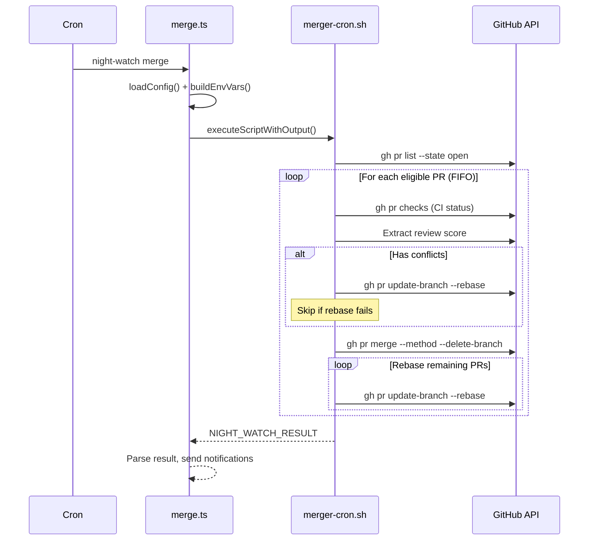

# PRD: Merge Orchestrator Job

**Complexity: 7 → HIGH mode** (10+ files, new system/module, multi-package changes, UI changes)

---

## 1. Context

**Problem:** Auto-merge is currently embedded inside the reviewer flow (`review.ts` → `night-watch-pr-reviewer-cron.sh:687`). The user wants a dedicated repo-wide merge orchestrator that scans all open PRs, resolves conflicts, decides merge order, rebases after each merge, and merges — as a separate configurable job with its own UI section.

**Files Analyzed:**
- `packages/core/src/types.ts` — `INightWatchConfig`, `JobType`, `MergeMethod`, `IPrResolverConfig`
- `packages/core/src/constants.ts` — `DEFAULT_AUTO_MERGE*`, `DEFAULT_PR_RESOLVER*`
- `packages/core/src/jobs/job-registry.ts` — `JOB_REGISTRY`, `IJobDefinition`
- `packages/cli/src/commands/review.ts` — `buildEnvVars()`, `applyCliOverrides()` (auto-merge wiring)
- `packages/cli/src/commands/install.ts` — `performInstall()` (cron entry generation)
- `packages/cli/src/commands/shared/env-builder.ts` — `buildBaseEnvVars()`
- `scripts/night-watch-pr-reviewer-cron.sh` — lines 683-748 (auto-merge logic)
- `web/pages/settings/GeneralTab.tsx` — auto-merge toggle + merge method selector
- `web/pages/settings/JobsTab.tsx` — QA/Audit/Analytics/Planner job sections
- `web/pages/Settings.tsx` — `ConfigForm`, `toFormState()`, `handleSave()`, tab wiring

**Current Behavior:**
- `autoMerge` (boolean) and `autoMergeMethod` (squash|merge|rebase) live as top-level config fields
- Reviewer sets `NW_AUTO_MERGE=1` env var → cron script merges eligible PRs after review pass
- UI toggle lives in GeneralTab alongside project config
- No merge ordering, no rebase-after-merge loop, no conflict resolution in the merge path
- Merge only happens when ALL open PRs pass — no individual PR merging

---

## 2. Solution

**Approach:**
- Create a new `merger` job type registered in `JOB_REGISTRY` with its own CLI command (`night-watch merge`)
- Define `IMergerConfig` interface with enabled (default: **false**), schedule, maxRuntime, mergeMethod, minReviewScore, branchPatterns, rebaseBeforeMerge, maxPrsPerRun
- Create `scripts/night-watch-merger-cron.sh` — a repo-wide orchestrator that: scans all open PRs, filters eligible ones (CI passing + review score + branch pattern), orders by oldest-first (FIFO by PR creation date), resolves conflicts via rebase, merges one at a time, rebases remaining PRs after each merge
- Create `packages/cli/src/commands/merge.ts` — CLI command that builds env vars and invokes the script
- Add a new "Merge Orchestrator" section to `JobsTab.tsx` — **disabled by default**; when enabled, scrolls/highlights the config section so user must configure it
- **Remove** auto-merge toggle from `GeneralTab.tsx` and the reviewer's env-building logic
- Wire into cron install, schedule templates, and save flow

**Architecture Diagram:**

```mermaid
flowchart LR
    Cron["Cron Trigger"] --> CLI["night-watch merge"]
    CLI --> Script["night-watch-merger-cron.sh"]
    Script --> Scan["gh pr list (all open)"]
    Scan --> Filter["Filter: CI + score + branch"]
    Filter --> Order["Sort: oldest first (FIFO)"]
    Order --> Loop["For each PR:"]
    Loop --> Rebase["Rebase against base branch"]
    Rebase --> WaitCI["Wait for CI (optional)"]
    WaitCI --> Merge["gh pr merge --method"]
    Merge --> RebaseRest["Rebase remaining PRs"]
    RebaseRest --> Loop
```



**Key Decisions:**
- [x] Merge order: FIFO (oldest PR first by creation date)
- [x] Rebase after each merge: yes (sequential, safe)
- [x] Conflict resolution: rebase via `gh pr update-branch` or `git rebase` + force push
- [x] Disabled by default — enabling in UI scrolls to config section
- [x] Reuse `buildBaseEnvVars()` for provider env; merger-specific vars via `NW_MERGER_*` prefix
- [x] Remove `autoMerge`/`autoMergeMethod` from reviewer path and GeneralTab
- [x] New notification events: `merge_completed`, `merge_failed`

**Data Changes:**
- New `IMergerConfig` interface in `types.ts`
- New `merger` field on `INightWatchConfig`
- New entry in `JOB_REGISTRY`
- `autoMerge` and `autoMergeMethod` top-level fields deprecated (migrated into `merger` config)

---

## 3. Sequence Flow



---

## 4. Integration Points Checklist

```markdown
**How will this feature be reached?**
- [x] Entry point: cron schedule → `night-watch merge` CLI command
- [x] Caller file: `packages/cli/src/commands/merge.ts` (new)
- [x] Registration: add to `JOB_REGISTRY`, `JobType` union, `install.ts`, schedule templates

**Is this user-facing?**
- [x] YES → New "Merge Orchestrator" section in JobsTab.tsx
- [x] On enable: auto-scroll to config section (same pattern as other jobs)

**Full user flow:**
1. User navigates to Settings → Jobs tab
2. Toggles "Merge Orchestrator" switch ON
3. UI scrolls to reveal config fields (schedule, merge method, min review score, etc.)
4. User configures and saves
5. Cron is reinstalled with new merger entry
6. Merger runs on schedule, merges eligible PRs in FIFO order
```

---

## 5. Execution Phases

### Phase 1: Core Types, Config & Job Registry

**User-visible outcome:** `night-watch merge --dry-run` prints config and exits (no script yet).

**Files (5):**
- `packages/core/src/types.ts` — Add `IMergerConfig` interface, add `'merger'` to `JobType`, add `merger` field to `INightWatchConfig`, add `'merge_completed' | 'merge_failed'` to `NotificationEvent`
- `packages/core/src/constants.ts` — Add `DEFAULT_MERGER_*` constants and `DEFAULT_MERGER` object
- `packages/core/src/jobs/job-registry.ts` — Add merger entry to `JOB_REGISTRY`
- `packages/core/src/config.ts` — Add merger config merging in `buildConfig()` (with migration: if old `autoMerge: true` exists, populate `merger.enabled: true` + carry `autoMergeMethod`)
- `packages/core/src/config-env.ts` — Add `NW_MERGER_*` env var parsing

**Implementation:**

- [ ] Define `IMergerConfig`:
  ```typescript
  interface IMergerConfig {
    enabled: boolean;           // default: false
    schedule: string;           // default: '55 */4 * * *'
    maxRuntime: number;         // default: 1800 (30 min)
    mergeMethod: MergeMethod;   // default: 'squash'
    minReviewScore: number;     // default: 80
    branchPatterns: string[];   // default: [] (uses top-level)
    rebaseBeforeMerge: boolean; // default: true
    maxPrsPerRun: number;       // default: 0 (unlimited)
  }
  ```
- [ ] Add `merger: IMergerConfig` to `INightWatchConfig`
- [ ] Add `'merger'` to `JobType` union
- [ ] Add `'merge_completed' | 'merge_failed'` to `NotificationEvent`
- [ ] Add `DEFAULT_MERGER` constant object with `enabled: false`
- [ ] Add merger entry to `JOB_REGISTRY` (id: 'merger', cliCommand: 'merge', logName: 'merger', lockSuffix: '-merger.lock', queuePriority: 45, envPrefix: 'NW_MERGER')
- [ ] In `config.ts` `buildConfig()`: merge `merger` config with defaults. Migration: if `raw.autoMerge === true && !raw.merger`, auto-populate `merger.enabled: true` + `merger.mergeMethod: raw.autoMergeMethod`
- [ ] In `config-env.ts`: parse `NW_MERGER_*` env vars

**Tests Required:**
| Test File | Test Name | Assertion |
|-----------|-----------|-----------|
| `packages/core/src/__tests__/jobs/job-registry.test.ts` | `should include merger in JOB_REGISTRY` | `expect(getJobDef('merger')).toBeDefined()` |
| `packages/core/src/__tests__/config.test.ts` | `should migrate autoMerge into merger config` | `config.merger.enabled === true` when `autoMerge: true` |

**Verification Plan:**
1. Unit tests: job registry includes merger, config migration works
2. `yarn verify` passes

---

### Phase 2: CLI Command & Bash Script

**User-visible outcome:** `night-watch merge --dry-run` scans open PRs and logs what it would merge (no actual merges).

**Files (4):**
- `packages/cli/src/commands/merge.ts` — New CLI command (follows pattern of `review.ts`)
- `packages/cli/src/cli.ts` — Register `merge` command
- `scripts/night-watch-merger-cron.sh` — Main merger bash script
- `packages/cli/src/commands/shared/env-builder.ts` — (only if merger needs extra base env logic; likely no changes needed)

**Implementation:**

- [ ] Create `merge.ts` command:
  - Loads config, applies CLI overrides (--dry-run, --provider, --timeout)
  - Builds env vars: `NW_MERGER_*` (mergeMethod, minReviewScore, branchPatterns, rebaseBeforeMerge, maxPrsPerRun, maxRuntime)
  - Executes `night-watch-merger-cron.sh` via `executeScriptWithOutput()`
  - Parses result, sends `merge_completed` / `merge_failed` notifications
- [ ] Register in `cli.ts`: `program.command('merge').description('Merge eligible PRs in FIFO order')...`
- [ ] Create `night-watch-merger-cron.sh`:
  - Source `night-watch-helpers.sh`
  - Read env: `NW_MERGER_MERGE_METHOD`, `NW_MERGER_MIN_REVIEW_SCORE`, `NW_MERGER_BRANCH_PATTERNS`, `NW_MERGER_REBASE_BEFORE_MERGE`, `NW_MERGER_MAX_PRS_PER_RUN`
  - Lock file: `/tmp/night-watch-merger-${PROJECT_RUNTIME_KEY}.lock`
  - `gh pr list --state open --json number,headRefName,createdAt,labels --jq 'sort_by(.createdAt)'`
  - Filter: branch pattern match, CI passing (`gh pr checks --required`), review score >= threshold
  - For each eligible PR (FIFO):
    1. If `REBASE_BEFORE_MERGE=1`: `gh pr update-branch --rebase` (skip PR on failure)
    2. Wait for CI recheck if rebased (poll `gh pr checks` with timeout)
    3. `gh pr merge --${METHOD} --delete-branch` (not `--auto`, direct merge)
    4. After merge: rebase all remaining eligible PRs via `gh pr update-branch`
  - Emit `NIGHT_WATCH_RESULT:success|merged=N|failed=M|prs=1,2,3`
  - Dry-run mode: log actions without executing

**Tests Required:**
| Test File | Test Name | Assertion |
|-----------|-----------|-----------|
| Manual | `night-watch merge --dry-run` | Lists eligible PRs without merging |

**Verification Plan:**
1. `yarn verify` passes
2. `night-watch merge --help` shows command
3. `night-watch merge --dry-run` in a repo with open PRs shows expected output

---

### Phase 3: Remove Auto-Merge from Reviewer

**User-visible outcome:** Reviewer no longer auto-merges. The `autoMerge` config field is deprecated in favor of `merger.enabled`.

**Files (4):**
- `packages/cli/src/commands/review.ts` — Remove `NW_AUTO_MERGE` / `NW_AUTO_MERGE_METHOD` from `buildEnvVars()`, remove `autoMerge` from `applyCliOverrides()`
- `scripts/night-watch-pr-reviewer-cron.sh` — Remove auto-merge section (lines 686-739)
- `web/pages/settings/GeneralTab.tsx` — Remove auto-merge toggle and merge method selector
- `web/pages/Settings.tsx` — Remove `autoMerge`/`autoMergeMethod` from `ConfigForm`, `toFormState()`, `handleSave()` payload

**Implementation:**

- [ ] In `review.ts` `buildEnvVars()`: remove lines 220-223 (`NW_AUTO_MERGE` / `NW_AUTO_MERGE_METHOD`)
- [ ] In `review.ts` `applyCliOverrides()`: remove lines 249-251 (`options.autoMerge`)
- [ ] In `review.ts`: remove `--auto-merge` CLI flag from command definition
- [ ] In `night-watch-pr-reviewer-cron.sh`: remove lines 686-739 (the entire auto-merge block). Keep the "all passing → skip" path but remove the merge sub-path
- [ ] In `GeneralTab.tsx`: remove the auto-merge Switch (lines 67-73) and conditional merge method Select (lines 74-85). Remove from `IConfigFormGeneral` interface
- [ ] In `Settings.tsx`: remove `autoMerge`/`autoMergeMethod` from `ConfigForm` type, `toFormState()`, and `handleSave()` payload
- [ ] Keep `autoMerge`/`autoMergeMethod` on `INightWatchConfig` for backward compat (migration reads them in Phase 1), but they become inert

**Tests Required:**
| Test File | Test Name | Assertion |
|-----------|-----------|-----------|
| `packages/cli/src/__tests__/review.test.ts` | `buildEnvVars should not set NW_AUTO_MERGE` | `expect(env.NW_AUTO_MERGE).toBeUndefined()` |

**Verification Plan:**
1. `yarn verify` passes
2. Reviewer no longer sets `NW_AUTO_MERGE` in env
3. GeneralTab no longer shows auto-merge toggle

---

### Phase 4: UI — Merge Orchestrator in JobsTab + Enable Flow

**User-visible outcome:** New "Merge Orchestrator" card in Jobs tab. Disabled by default. Toggling ON reveals config fields. Save reinstalls cron with merger entry.

**Files (5):**
- `web/pages/settings/JobsTab.tsx` — Add Merge Orchestrator section with enable toggle + config fields
- `web/pages/Settings.tsx` — Add `merger` to `ConfigForm`, `toFormState()`, `handleSave()`, `shouldReinstallCron`, and `handleEditJob` routing
- `web/api.ts` — Ensure `IMergerConfig` is exported/importable from API types
- `web/utils/cron.ts` — Add merger schedule to `SCHEDULE_TEMPLATES`
- `packages/cli/src/commands/install.ts` — Add merger cron entry in `performInstall()`

**Implementation:**

- [ ] In `JobsTab.tsx`: Add `IMergerConfig` to the `IConfigFormJobs` interface. Add a new Card section (id: `job-section-merger`) following the same pattern as QA/Audit:
  ```
  - Switch: "Merge Orchestrator" (enabled toggle)
  - Subtitle: "Repo-wide PR merge coordinator — scans, rebases, and merges in FIFO order"
  - When enabled, show config:
    - CronScheduleInput: "Merger Schedule"
    - Input: "Max Runtime" (seconds)
    - Select: "Merge Method" (squash/merge/rebase)
    - Input: "Min Review Score" (0-100)
    - TagInput: "Branch Patterns" (empty = top-level patterns)
    - Switch: "Rebase before merge" (default: true)
    - Input: "Max PRs per Run" (0 = unlimited)
  ```
- [ ] In `Settings.tsx`:
  - Add `merger: IMergerConfig` to `ConfigForm`
  - Add to `toFormState()` with defaults (enabled: false)
  - Add `merger` to `handleSave()` payload
  - Add merger to `shouldReinstallCron` check (enabled change + schedule change)
  - Add `'merger'` to `handleEditJob` jobsTabTypes array
  - Add merger to `JOB_PROVIDER_KEYS` if provider assignment is desired
- [ ] In `install.ts` `performInstall()`: Add merger cron entry (same pattern as QA/audit):
  ```typescript
  const installMerger = config.merger?.enabled ?? false;
  if (installMerger) {
    const mergerSchedule = config.merger.schedule;
    const mergerLog = path.join(logDir, 'merger.log');
    const mergerEntry = `${mergerSchedule} ${pathPrefix}...night-watch merge...`;
    entries.push(mergerEntry);
  }
  ```
- [ ] In `cron.ts`: add `merger` schedule to each `SCHEDULE_TEMPLATE` (e.g., always-on: `'55 */4 * * *'`)
- [ ] Ensure `IInstallOptions` gets `noMerger?` / `merger?` flags

**Tests Required:**
| Test File | Test Name | Assertion |
|-----------|-----------|-----------|
| Manual | Enable merger in UI, save | Cron reinstalled with merger entry |
| Manual | Disable merger, save | Merger cron entry removed |

**Verification Plan:**
1. `yarn verify` passes
2. JobsTab shows Merge Orchestrator section (disabled by default)
3. Enabling it reveals config fields
4. Saving with merger enabled adds cron entry (check `crontab -l`)
5. Schedule templates include merger schedule

---

### Phase 5: Notifications & Cleanup

**User-visible outcome:** Merger sends Slack/Telegram/Discord notifications on merge success/failure. Old `autoMerge` fields are fully inert.

**Files (4):**
- `packages/cli/src/commands/merge.ts` — Add notification sending after script completes (parse `merged`/`failed` from result)
- `web/components/settings/WebhookEditor.tsx` — Add `merge_completed` and `merge_failed` to event type list
- `packages/core/src/types.ts` — Verify `merge_completed` | `merge_failed` in `NotificationEvent` (done in Phase 1)
- `packages/core/src/constants.ts` — Clean up: mark `DEFAULT_AUTO_MERGE` / `DEFAULT_AUTO_MERGE_METHOD` with deprecation comment

**Implementation:**

- [ ] In `merge.ts`: After `executeScriptWithOutput()`, parse `NIGHT_WATCH_RESULT` for `merged=N`, `failed=M`, `prs=...`. For each merged PR, send `merge_completed` notification. For each failed, send `merge_failed`.
- [ ] In `WebhookEditor.tsx`: Add `merge_completed` and `merge_failed` to the event type options list
- [ ] In `constants.ts`: Add `/** @deprecated Use DEFAULT_MERGER instead */` comments to `DEFAULT_AUTO_MERGE*`

**Tests Required:**
| Test File | Test Name | Assertion |
|-----------|-----------|-----------|
| Manual | Run merger with webhook configured | Notification sent on merge |

**Verification Plan:**
1. `yarn verify` passes
2. WebhookEditor shows new event types
3. Merger sends notifications

---

## 6. Acceptance Criteria

- [ ] All phases complete
- [ ] All specified tests pass
- [ ] `yarn verify` passes
- [ ] New `night-watch merge` CLI command works (--dry-run, --provider, --timeout)
- [ ] Merge orchestrator: scans PRs, filters eligible, merges FIFO, rebases after each merge
- [ ] Merger is **disabled by default** in config
- [ ] Enabling in UI scrolls to config section for mandatory setup
- [ ] Auto-merge removed from reviewer flow and GeneralTab
- [ ] Backward compat: `autoMerge: true` in existing configs migrates to `merger.enabled: true`
- [ ] Cron install includes merger entry when enabled
- [ ] Schedule templates include merger schedule
- [ ] Notifications sent for merge success/failure
- [ ] Feature is reachable end-to-end: enable in UI → save → cron runs → PRs merged
