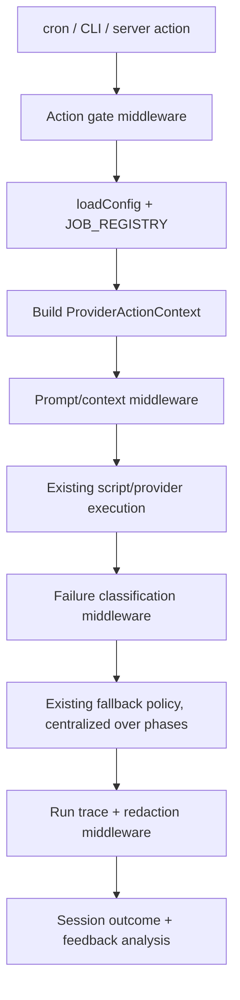
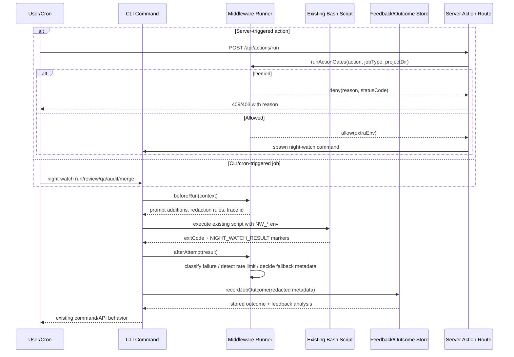

# PRD: Provider/Action Lifecycle Middleware

**Complexity: 9 → HIGH mode**

Score: +3 touches 10+ files, +2 new system/module from scratch, +2 complex lifecycle/error state logic, +2 multi-package changes.

---

## 1. Context

**Problem:** Night Watch has provider execution, fallback, queueing, feedback, and action-trigger policy spread across bash scripts, CLI commands, and server routes; this makes cross-cutting behavior hard to reuse consistently across executor, reviewer, QA, audit, and merger.

**Files Analyzed:**

- `scripts/night-watch-cron.sh` — executor provider execution, retry, existing rate-limit fallback, result markers
- `scripts/night-watch-helpers.sh` — provider command construction, rate-limit detection, notification helpers
- `packages/core/src/config.ts` — config loading with `fallbackOnRateLimit`, fallback models, `jobProviders`, `feedback`, `queue`
- `packages/core/src/config-normalize.ts` — existing fallback config normalization
- `packages/core/src/config-env.ts` — existing environment overrides for fallback settings
- `packages/core/src/constants.ts` — fallback, provider, queue, feedback defaults
- `packages/core/src/types.ts` — provider, feedback, session outcome, job type types
- `packages/core/src/jobs/job-registry.ts` — single source of truth for job metadata across executor/reviewer/QA/audit/merger
- `packages/core/src/utils/job-queue.ts` — global queue and provider-aware dispatch utilities
- `packages/core/src/feedback/outcome-parser.ts` — failure classification and outcome parsing
- `packages/core/src/feedback/prompt-augmenter.ts` — feedback-driven prompt/context injection
- `packages/cli/src/commands/shared/env-builder.ts` — shared provider env construction and queue env wiring
- `packages/cli/src/commands/shared/feedback.ts` — session outcome recording and feedback analysis
- `packages/cli/src/commands/run.ts` — executor env construction including existing rate-limit fallback wiring
- `packages/cli/src/commands/review.ts` — reviewer provider command entry
- `packages/cli/src/commands/qa.ts` — QA provider command entry
- `packages/cli/src/commands/audit.ts` — audit provider command entry
- `packages/cli/src/commands/merge.ts` — merger command entry and CI policy wiring
- `packages/server/src/routes/action.routes.ts` — server action gates and manual trigger spawning
- `packages/server/src/routes/feedback.routes.ts` — feedback outcome and augmentation API

**Current Behavior:**

- Fallback already exists for executor rate limits in `scripts/night-watch-cron.sh`: a 429 can trigger configured preset/model fallback, emits `rate_limit_fallback=1`, and records `rate_limited` when exhausted.
- Fallback settings already exist in config: `fallbackOnRateLimit`, `primaryFallbackModel`, `secondaryFallbackModel`, `primaryFallbackPreset`, `secondaryFallbackPreset`.
- Provider selection already flows through `jobProviders`, `resolveJobProvider`, `resolvePreset`, and `buildBaseEnvVars`.
- Global queue behavior already exists in `packages/core/src/utils/job-queue.ts` and is activated from bash scripts with `NW_QUEUE_ENABLED`.
- Feedback already records outcomes in CLI code and exposes summaries/patterns through server routes.
- Action routes already gate some manual triggers with lock checks and bypass queueing for manual UI actions via `NW_QUEUE_ENABLED=0`.

**Integration Points Checklist:**

```markdown
**How will this feature be reached?**

- [x] Entry point identified: CLI job commands (`run`, `review`, `qa`, `audit`, `merge`) and server action routes (`/api/actions/*`)
- [x] Caller file identified: `packages/cli/src/commands/shared/env-builder.ts` exports middleware env/context; job commands invoke lifecycle hooks before/after script execution; `packages/server/src/routes/action.routes.ts` invokes action gate hooks before spawning commands
- [x] Registration/wiring needed: export middleware from `packages/core/src/index.ts`; register built-in middleware from CLI command helpers; wire server action gate calls into `spawnAction`

**Is this user-facing?**

- [x] NO → Internal/background architecture improvement. It is triggered by existing CLI commands, cron scripts, server action routes, and provider runs. No new UI is required in this PRD.

**Full user flow:**

1. User or cron triggers an existing Night Watch job, such as `night-watch run`, `night-watch review`, `night-watch qa`, `night-watch audit`, or `night-watch merge`.
2. The existing CLI command loads config, resolves the job provider, builds env vars, and enters the provider/action middleware runner.
3. Middleware runs typed hooks for action gates, prompt/context injection, secret redaction, provider attempt tracing, failure classification, fallback planning, and policy enforcement.
4. Existing scripts still perform provider execution during early phases; fallback behavior is first observed and then centralized without changing user-facing behavior.
5. User sees the same command/API behavior as before, plus more consistent logs, session outcomes, and feedback patterns.
```

---

## 2. Solution

**Approach:**

- Add a small typed lifecycle middleware layer in `@night-watch/core`, inspired by Google Genkit's middleware idea of composable execution hooks, but with no Genkit dependency and no adoption of Genkit runtime concepts.
- Treat existing fallback as behavior to preserve and centralize, not as a new feature. The middleware first observes current fallback markers, then moves classification and fallback decision logic into typed core helpers while bash remains a compatibility execution layer.
- Provide two middleware surfaces: provider lifecycle hooks for AI provider attempts and action gate hooks for manual/server-triggered job actions.
- Reuse current architecture: `JOB_REGISTRY` for job metadata, config normalization for policy inputs, `job-queue.ts` for queue context, feedback repositories for prompt augmentation/outcome storage, and `env-builder.ts` for provider env assembly.
- Keep scope internal and typed: no external plugin marketplace, no Genkit package, no user-authored arbitrary middleware loading in phase one.

**Architecture Diagram:**



**Key Decisions:**

- [x] Library/framework choices: TypeScript-only core module, no Genkit dependency, no new runtime framework.
- [x] Error-handling strategy: hooks return typed allow/deny/modify/classify results; middleware failures are fail-closed for policy gates and fail-open for observability-only hooks unless explicitly marked required.
- [x] Reused utilities: `JOB_REGISTRY`, `resolveJobProvider`, `resolvePreset`, `buildBaseEnvVars`, `job-queue`, `recordJobOutcome`, `buildProjectFeedbackPromptBlock`, `analyzeFeedbackOutcome`, `parseScriptResult`.
- [x] Compatibility: bash scripts remain callable; existing env vars and result markers remain stable until replacement phases prove equivalent behavior.
- [x] Security: secret redaction is centralized before traces, logs, metadata, and failure signatures are persisted.

**Data Changes:** None in the initial implementation. Use existing session outcome and feedback tables. If trace detail later outgrows session outcome metadata, create a separate PRD for trace storage.

---

## 3. Sequence Flow



---

## 4. Execution Phases

#### Phase 1: Typed Middleware Core — "Provider/action runs can pass through typed hooks without changing behavior"

**Files (max 5):**

- `packages/core/src/middleware/types.ts` — define lifecycle context, hook result, failure classification, trace event, action gate types
- `packages/core/src/middleware/runner.ts` — implement ordered hook runner with fail-open/fail-closed semantics
- `packages/core/src/middleware/index.ts` — export middleware public API for core
- `packages/core/src/index.ts` — export new middleware module
- `packages/core/src/__tests__/middleware/runner.test.ts` — prove hook ordering, context mutation, and error handling

**Implementation:**

- [ ] Add `ProviderActionContext` with `jobType`, `projectDir`, `providerKey`, `providerCommand`, `providerLabel`, `config`, `traceId`, `source` (`cron` | `cli` | `server-action`), and optional `scriptResult`.
- [ ] Add `ProviderLifecycleMiddleware` hooks:
  - `beforeRun(context)`
  - `beforeProviderAttempt(context)`
  - `afterProviderAttempt(context, result)`
  - `classifyFailure(context, result)`
  - `afterRun(context, result)`
- [ ] Add `ActionGateMiddleware` hook:
  - `beforeAction(context)` returning `allow`, `deny`, or `modifyEnv`.
- [ ] Implement deterministic middleware order using array order; no dynamic plugin loading.
- [ ] Implement required-vs-optional hook error behavior:
  - action gates fail closed with a typed denial
  - observability hooks fail open and attach a warning to trace metadata
  - failure classification hooks return `uncategorized` on hook error
- [ ] Export all middleware types and runner helpers from `@night-watch/core`.

**Tests Required:**

| Test File | Test Name | Assertion |
|-----------|-----------|-----------|
| `packages/core/src/__tests__/middleware/runner.test.ts` | `should run provider lifecycle hooks in registration order` | records hook call order for two middleware entries |
| `packages/core/src/__tests__/middleware/runner.test.ts` | `should preserve context changes from beforeRun hooks` | later hooks receive prompt/context additions from earlier hooks |
| `packages/core/src/__tests__/middleware/runner.test.ts` | `should fail closed when an action gate throws` | returns denied result with safe error reason |
| `packages/core/src/__tests__/middleware/runner.test.ts` | `should fail open when an observability hook throws` | run continues and trace warning is attached |

**Verification Plan:**

1. **Unit Tests:**
   - `yarn workspace @night-watch/core test -- packages/core/src/__tests__/middleware/runner.test.ts`
2. **Type Check:**
   - `yarn workspace @night-watch/core verify`
3. **Evidence Required:**
   - [ ] Hook ordering test passes
   - [ ] Action gate fail-closed test passes
   - [ ] Core package typecheck passes

**User Verification:**

- Action: Run `yarn workspace @night-watch/core test -- packages/core/src/__tests__/middleware/runner.test.ts`
- Expected: Tests pass and no existing CLI behavior changes because the core runner is exported but not yet wired into job commands.

**Checkpoint:** Spawn `prd-work-reviewer` with prompt: `Review checkpoint for phase 1 of PRD at docs/prds/provider-action-middleware.md`. Continue only after PASS.

---

#### Phase 2: Built-In Context, Trace, and Redaction Middleware — "Existing job commands emit consistent redacted lifecycle metadata"

**Files (max 5):**

- `packages/core/src/middleware/built-ins.ts` — implement built-in trace, secret redaction, prompt augmentation, and failure classification middleware
- `packages/core/src/middleware/redaction.ts` — central redaction helpers for env, logs, metadata, provider command details
- `packages/core/src/__tests__/middleware/built-ins.test.ts` — unit coverage for built-ins
- `packages/cli/src/commands/shared/feedback.ts` — include middleware classification and redacted trace metadata in recorded outcomes
- `packages/cli/src/__tests__/commands/shared/feedback.test.ts` — verify redacted metadata is stored

**Implementation:**

- [ ] Add `createDefaultProviderMiddleware(config)` returning built-ins for:
  - run trace start/end event metadata
  - provider attempt metadata
  - prompt/context injection from feedback augmentations
  - failure classification using existing outcome parser categories
  - secret redaction for provider env, command args, stdout/stderr snippets, and metadata
- [ ] Redact common secret sources:
  - exact keys matching `TOKEN`, `KEY`, `SECRET`, `PASSWORD`, `AUTH`
  - current provider env keys from `providerEnv` and preset `envVars`
  - Telegram webhook tokens/chat IDs before trace metadata is persisted
- [ ] Ensure prompt augmentation uses existing `buildProjectFeedbackPromptBlock` and respects current feedback config.
- [ ] Update `recordJobOutcome` to accept optional middleware trace/classification metadata, merge it into outcome metadata, and avoid storing unredacted fields.
- [ ] Do not add new UI or API fields in this phase; use existing metadata storage only.

**Tests Required:**

| Test File | Test Name | Assertion |
|-----------|-----------|-----------|
| `packages/core/src/__tests__/middleware/built-ins.test.ts` | `should redact provider secrets from trace metadata` | sensitive env values are replaced with `[REDACTED]` |
| `packages/core/src/__tests__/middleware/built-ins.test.ts` | `should classify rate limit failures when output contains 429` | classification category is `rate_limited` |
| `packages/core/src/__tests__/middleware/built-ins.test.ts` | `should build feedback prompt context when active augmentations exist` | prompt block is appended and augmentation ids are tracked |
| `packages/cli/src/__tests__/commands/shared/feedback.test.ts` | `should store middleware classification without raw secrets` | session outcome metadata includes category and excludes token values |

**Verification Plan:**

1. **Unit Tests:**
   - `yarn workspace @night-watch/core test -- packages/core/src/__tests__/middleware/built-ins.test.ts`
   - `yarn workspace @jonit-dev/night-watch-cli test -- packages/cli/src/__tests__/commands/shared/feedback.test.ts`
2. **Type Check:**
   - `yarn workspace @night-watch/core verify`
   - `yarn workspace @jonit-dev/night-watch-cli verify`
3. **Evidence Required:**
   - [ ] Redaction tests prove raw secret values are not stored
   - [ ] Classification tests preserve current rate-limit category behavior
   - [ ] Feedback prompt injection remains config-gated

**User Verification:**

- Action: Run the listed tests with a fake provider env containing `ANTHROPIC_API_KEY=test-secret`.
- Expected: Test output passes and stored metadata contains `[REDACTED]`, never `test-secret`.

**Checkpoint:** Spawn `prd-work-reviewer` with prompt: `Review checkpoint for phase 2 of PRD at docs/prds/provider-action-middleware.md`. Continue only after PASS.

---

#### Phase 3: CLI Provider Lifecycle Wiring — "Executor, reviewer, QA, audit, and merger enter middleware around existing script execution"

**Files (max 5):**

- `packages/cli/src/commands/shared/provider-lifecycle.ts` — shared helper to create context, run hooks, execute script, classify result, record outcome
- `packages/cli/src/commands/run.ts` — delegate executor lifecycle metadata and outcome recording to shared helper while preserving env vars
- `packages/cli/src/commands/review.ts` — wire reviewer through shared lifecycle helper
- `packages/cli/src/commands/qa.ts` — wire QA through shared lifecycle helper
- `packages/cli/src/__tests__/commands/provider-lifecycle.test.ts` — shared lifecycle command tests

**Implementation:**

- [ ] Create `runJobWithProviderLifecycle(input)` that:
  - builds `ProviderActionContext`
  - runs `beforeRun`
  - appends prompt/context additions only when the command has a prompt surface
  - executes the existing script using current `executeScriptWithOutput`
  - parses `NIGHT_WATCH_RESULT` markers with existing `parseScriptResult`
  - runs `afterProviderAttempt`, `classifyFailure`, and `afterRun`
  - calls `recordJobOutcome` with redacted middleware metadata
- [ ] Keep existing env var behavior stable, especially:
  - `NW_FALLBACK_ON_RATE_LIMIT`
  - `NW_CLAUDE_PRIMARY_MODEL_ID`
  - `NW_CLAUDE_SECONDARY_MODEL_ID`
  - `NW_FALLBACK_*_PRESET_*`
  - `NW_QUEUE_*`
- [ ] Ensure fallback remains implemented by existing script behavior in this phase; middleware observes and classifies it, but does not replace it yet.
- [ ] Apply shared lifecycle helper to `run`, `review`, and `qa` commands first.
- [ ] Add a follow-up task in this PRD phase notes for audit/merger wiring if their command shape requires a second small patch; do not exceed the five-file phase limit.

**Tests Required:**

| Test File | Test Name | Assertion |
|-----------|-----------|-----------|
| `packages/cli/src/__tests__/commands/provider-lifecycle.test.ts` | `should preserve executor fallback env vars when lifecycle is enabled` | env contains the same fallback keys as before |
| `packages/cli/src/__tests__/commands/provider-lifecycle.test.ts` | `should record rate_limit_fallback marker as middleware trace metadata` | parsed script result marker appears in redacted metadata |
| `packages/cli/src/__tests__/commands/provider-lifecycle.test.ts` | `should still skip QA notifications for queued results` | `shouldSendQaNotification('queued')` behavior remains false |
| `packages/cli/src/__tests__/commands/provider-lifecycle.test.ts` | `should continue when optional trace middleware throws` | script execution still occurs |

**Verification Plan:**

1. **Unit Tests:**
   - `yarn workspace @jonit-dev/night-watch-cli test -- packages/cli/src/__tests__/commands/provider-lifecycle.test.ts`
   - `yarn workspace @jonit-dev/night-watch-cli test -- packages/cli/src/__tests__/commands/run.test.ts packages/cli/src/__tests__/commands/qa.test.ts`
2. **Script Smoke Tests:**
   - `yarn workspace @jonit-dev/night-watch-cli test -- packages/cli/src/__tests__/scripts/core-flow-smoke.test.ts -t "rate-limit fallback"`
3. **Type Check:**
   - `yarn workspace @jonit-dev/night-watch-cli verify`
4. **Evidence Required:**
   - [ ] Existing executor fallback smoke tests still pass
   - [ ] Middleware metadata is recorded without changing script markers
   - [ ] `run`, `review`, and `qa` command tests pass

**User Verification:**

- Action: Run the existing rate-limit fallback smoke test.
- Expected: Executor still emits `rate_limit_fallback=1` on successful fallback and still emits `rate_limited` when fallback is disabled or exhausted.

**Checkpoint:** Spawn `prd-work-reviewer` with prompt: `Review checkpoint for phase 3 of PRD at docs/prds/provider-action-middleware.md`. Continue only after PASS.

---

#### Phase 4: Action Gate Middleware — "Server and manual triggers use shared typed policy checks before spawning jobs"

**Files (max 5):**

- `packages/core/src/middleware/action-gates.ts` — built-in gates for locks, paused jobs, queue bypass policy, job registry validation, and provider policy
- `packages/core/src/__tests__/middleware/action-gates.test.ts` — unit tests for gates
- `packages/server/src/routes/action.routes.ts` — invoke shared gates from `spawnAction`
- `packages/server/src/__tests__/server/action-routes.test.ts` — API tests for denied/allowed actions
- `packages/cli/src/commands/shared/env-builder.ts` — expose action-gate env additions consistently

**Implementation:**

- [ ] Add built-in action gates:
  - reject duplicate executor/reviewer/planner actions when lock files are running, preserving current 409 behavior
  - reject invalid job IDs by consulting `JOB_REGISTRY`
  - enforce paused jobs consistently using existing pause/status utilities
  - keep manual UI triggers queue-bypassed unless config explicitly opts into queueing manual actions
  - attach provider key and job metadata to action context for tracing
- [ ] Replace ad hoc lock-check branching in `spawnAction` with shared gate calls while preserving response status and response shape.
- [ ] Keep `NW_QUEUE_ENABLED=0` for current manual actions unless a gate returns a deliberate env modification.
- [ ] Make gate denials safe for API responses: no filesystem secrets, env values, or raw stack traces.
- [ ] Ensure registry-driven routes for QA/audit/merger/planner continue to be generated from `JOB_REGISTRY`.

**Tests Required:**

| Test File | Test Name | Assertion |
|-----------|-----------|-----------|
| `packages/core/src/__tests__/middleware/action-gates.test.ts` | `should deny executor action when executor lock is running` | returns denial with status `409` |
| `packages/core/src/__tests__/middleware/action-gates.test.ts` | `should allow registered job action when no lock is running` | returns allowed and includes job metadata |
| `packages/core/src/__tests__/middleware/action-gates.test.ts` | `should redact errors from denied action gate responses` | denial reason excludes env/stack secrets |
| `packages/server/src/__tests__/server/action-routes.test.ts` | `should return 409 when run action is already running` | API preserves current response shape |
| `packages/server/src/__tests__/server/action-routes.test.ts` | `should spawn registry-driven job route when action gate allows` | response `{ started: true, pid }` is unchanged |

**Verification Plan:**

1. **Unit Tests:**
   - `yarn workspace @night-watch/core test -- packages/core/src/__tests__/middleware/action-gates.test.ts`
2. **API Tests:**
   - `yarn workspace @night-watch/server test -- packages/server/src/__tests__/server/action-routes.test.ts`
3. **Type Check:**
   - `yarn workspace @night-watch/core verify`
   - `yarn workspace @night-watch/server verify`
4. **API Proof:**
   ```bash
   curl -X POST http://localhost:3000/api/actions/run \
     -H "Content-Type: application/json" \
     -d '{}'
   # Expected when no executor lock exists: {"started":true,"pid":<number>}
   # Expected when executor lock is active: HTTP 409 with existing "Executor is already running" shape
   ```
5. **Evidence Required:**
   - [ ] Action API behavior remains backward compatible
   - [ ] Gate logic is shared instead of duplicated in server routes
   - [ ] Registry-driven actions continue to work

**User Verification:**

- Action: Trigger `POST /api/actions/run` while executor lock is active, then again after clearing the lock.
- Expected: Active lock returns 409; no lock starts the existing command with no UI contract change.

**Checkpoint:** Spawn `prd-work-reviewer` with prompt: `Review checkpoint for phase 4 of PRD at docs/prds/provider-action-middleware.md`. Continue only after PASS.

---

#### Phase 5: Centralize Fallback Policy Without Changing Fallback Behavior — "Existing rate-limit fallback decisions are represented as typed policy outcomes"

**Files (max 5):**

- `packages/core/src/middleware/fallback-policy.ts` — typed fallback decision helpers based on current config and provider attempt classification
- `packages/core/src/__tests__/middleware/fallback-policy.test.ts` — preserve current fallback decision matrix
- `packages/cli/src/commands/run.ts` — use fallback policy to build existing fallback env vars and trace policy decisions
- `packages/cli/src/__tests__/commands/run.test.ts` — verify existing env and marker behavior remains stable
- `packages/cli/src/__tests__/scripts/core-flow-smoke.test.ts` — update/add fallback smoke assertions only if needed

**Implementation:**

- [ ] Add `resolveFallbackPolicy(config, providerContext)` that returns:
  - `enabled`
  - `primaryPreset` / `secondaryPreset`
  - `primaryModel` / `secondaryModel`
  - `reasonIfUnavailable`
  - `preservesExistingScriptFallback: true`
- [ ] Use the policy in `run.ts` to populate the same env vars currently used by `scripts/night-watch-cron.sh`.
- [ ] Do not move provider re-execution out of bash in this phase. The script remains responsible for actual retry/fallback execution.
- [ ] Add trace metadata that explains whether fallback was configured, attempted, skipped, or missing configuration.
- [ ] Preserve these existing behaviors exactly:
  - fallback only triggers on detected rate limit in executor script
  - `fallbackOnRateLimit=false` disables fallback
  - primary preset takes precedence over model fallback
  - secondary preset/model is tried only when primary fallback is rate-limited
  - missing fallback config emits `fallback_unconfigured=1`
  - successful fallback emits `rate_limit_fallback=1`

**Tests Required:**

| Test File | Test Name | Assertion |
|-----------|-----------|-----------|
| `packages/core/src/__tests__/middleware/fallback-policy.test.ts` | `should resolve disabled fallback when fallbackOnRateLimit is false` | policy enabled is false |
| `packages/core/src/__tests__/middleware/fallback-policy.test.ts` | `should prefer primary fallback preset over model fallback` | policy primary target is preset |
| `packages/core/src/__tests__/middleware/fallback-policy.test.ts` | `should report missing fallback configuration when no preset or model exists` | `reasonIfUnavailable` is set |
| `packages/cli/src/__tests__/commands/run.test.ts` | `should export the same fallback env vars from policy` | env snapshot matches current expected keys |
| `packages/cli/src/__tests__/scripts/core-flow-smoke.test.ts` | `executor should trigger native Claude fallback and include rate_limit_fallback marker when proxy returns 429` | existing smoke test remains green |

**Verification Plan:**

1. **Unit Tests:**
   - `yarn workspace @night-watch/core test -- packages/core/src/__tests__/middleware/fallback-policy.test.ts`
   - `yarn workspace @jonit-dev/night-watch-cli test -- packages/cli/src/__tests__/commands/run.test.ts`
2. **Smoke Tests:**
   - `yarn workspace @jonit-dev/night-watch-cli test -- packages/cli/src/__tests__/scripts/core-flow-smoke.test.ts -t "fallback"`
3. **Type Check:**
   - `yarn workspace @night-watch/core verify`
   - `yarn workspace @jonit-dev/night-watch-cli verify`
4. **Evidence Required:**
   - [ ] Existing fallback tests are unchanged or only updated to inspect typed policy metadata
   - [ ] No PRD text or release note describes fallback as a new feature
   - [ ] Bash fallback execution remains stable while policy construction is centralized

**User Verification:**

- Action: Run fallback smoke tests for enabled, disabled, secondary, and missing-configuration cases.
- Expected: All existing result markers and outcomes match pre-middleware behavior.

**Checkpoint:** Spawn `prd-work-reviewer` with prompt: `Review checkpoint for phase 5 of PRD at docs/prds/provider-action-middleware.md`. Continue only after PASS.

---

#### Phase 6: Complete Job Coverage and Documentation — "All provider-backed job types share lifecycle hooks with clear internal docs"

**Files (max 5):**

- `packages/cli/src/commands/audit.ts` — wire audit through shared provider lifecycle helper
- `packages/cli/src/commands/merge.ts` — wire merger action/policy tracing where provider or repair actions run
- `packages/cli/src/__tests__/commands/audit.test.ts` — verify audit env/outcome behavior remains stable
- `packages/cli/src/__tests__/commands/merge.test.ts` — verify merger action policy tracing does not alter merge decisions
- `docs/architecture/provider-action-middleware.md` — internal architecture note with hook contracts and non-goals

**Implementation:**

- [ ] Wire audit command through the shared lifecycle helper, preserving audit-specific max runtime, branch patterns, reports, and fallback-on-rate-limit behavior already present in `scripts/night-watch-audit-cron.sh`.
- [ ] Wire merger through action/policy tracing for merge orchestration and AI repair paths, preserving `ciPolicy=fallback-local` behavior as a merger CI policy, not provider rate-limit fallback.
- [ ] Document hook contract rules:
  - built-ins only for now
  - no Genkit dependency
  - no marketplace/plugin loading
  - no arbitrary project-provided hook execution
  - action gates fail closed; observability hooks fail open
- [ ] Document integration points for future provider execution migration out of bash, but keep that out of scope.

**Tests Required:**

| Test File | Test Name | Assertion |
|-----------|-----------|-----------|
| `packages/cli/src/__tests__/commands/audit.test.ts` | `should preserve audit env vars when lifecycle middleware is enabled` | audit command env remains compatible with script |
| `packages/cli/src/__tests__/commands/audit.test.ts` | `should classify audit rate limits without changing retry behavior` | outcome classification is rate-limited and script controls retry |
| `packages/cli/src/__tests__/commands/merge.test.ts` | `should preserve fallback-local CI policy behavior` | local check fallback still controls merge eligibility |
| `packages/cli/src/__tests__/commands/merge.test.ts` | `should record merger policy trace without raw command secrets` | metadata is redacted |

**Verification Plan:**

1. **Unit Tests:**
   - `yarn workspace @jonit-dev/night-watch-cli test -- packages/cli/src/__tests__/commands/audit.test.ts packages/cli/src/__tests__/commands/merge.test.ts`
2. **Smoke Tests:**
   - `yarn workspace @jonit-dev/night-watch-cli test -- packages/cli/src/__tests__/scripts/core-flow-smoke.test.ts -t "merger"`
3. **Full Package Verification:**
   - `yarn verify`
4. **Evidence Required:**
   - [ ] Executor, reviewer, QA, audit, and merger have lifecycle integration
   - [ ] Merger CI fallback-local behavior is not conflated with provider rate-limit fallback
   - [ ] Architecture docs list non-goals and future migration points

**User Verification:**

- Action: Run `yarn verify` and targeted audit/merger tests.
- Expected: All checks pass, with no user-facing command or API behavior changes except improved internal metadata consistency.

**Checkpoint:** Spawn `prd-work-reviewer` with prompt: `Review checkpoint for phase 6 of PRD at docs/prds/provider-action-middleware.md`. Continue only after PASS.

---

## 5. Checkpoint Protocol

After each phase:

1. Run the phase's unit/API/smoke tests.
2. Run the listed package type checks.
3. Spawn the automated checkpoint reviewer:

```text
Use Task tool with:
- subagent_type: "prd-work-reviewer"
- prompt: "Review checkpoint for phase [N] of PRD at docs/prds/provider-action-middleware.md"
```

4. Continue to the next phase only when the checkpoint reviewer reports PASS.

Manual checkpoints are not required because this PRD is internal/background architecture work with no UI changes. API proof for action routes is included in Phase 4.

---

## 6. Verification Strategy

**Unit Tests:**

- Middleware runner hook ordering and error semantics
- Built-in redaction, trace metadata, feedback prompt injection, and failure classification
- Fallback policy decision matrix
- Action gates for locks, paused jobs, registry validation, and queue bypass behavior

**Integration Tests:**

- CLI command tests for `run`, `review`, `qa`, `audit`, and `merge`
- Server action route tests for allowed/denied actions
- Feedback outcome tests ensuring middleware metadata is stored redacted

**Script Smoke Tests:**

- Existing executor fallback tests in `packages/cli/src/__tests__/scripts/core-flow-smoke.test.ts`
- Existing merger local fallback tests to prove CI fallback policy remains separate from provider fallback
- Queue-related smoke tests if lifecycle metadata touches `NW_QUEUE_*`

**API Proof:**

```bash
curl -X POST http://localhost:3000/api/actions/run \
  -H "Content-Type: application/json" \
  -d '{}'
# Expected when allowed: {"started":true,"pid":<number>}
# Expected when denied by active lock: HTTP 409 and existing lock error message shape
```

**Final Verification Commands:**

```bash
yarn workspace @night-watch/core test -- packages/core/src/__tests__/middleware
yarn workspace @jonit-dev/night-watch-cli test -- packages/cli/src/__tests__/commands/provider-lifecycle.test.ts
yarn workspace @jonit-dev/night-watch-cli test -- packages/cli/src/__tests__/commands/run.test.ts packages/cli/src/__tests__/commands/qa.test.ts packages/cli/src/__tests__/commands/audit.test.ts packages/cli/src/__tests__/commands/merge.test.ts
yarn workspace @night-watch/server test -- packages/server/src/__tests__/server/action-routes.test.ts
yarn workspace @jonit-dev/night-watch-cli test -- packages/cli/src/__tests__/scripts/core-flow-smoke.test.ts -t "fallback"
yarn verify
```

**Evidence Required:**

- [ ] Current rate-limit fallback smoke tests pass without behavioral drift
- [ ] Metadata/traces never persist raw provider secrets
- [ ] Action routes preserve current response shapes
- [ ] All provider-backed job types are wired through shared lifecycle helpers
- [ ] `yarn verify` passes

---

## 7. Acceptance Criteria

- [ ] All phases complete.
- [ ] All specified tests pass.
- [ ] `yarn verify` passes.
- [ ] All automated checkpoint reviews pass.
- [ ] Middleware is reachable from existing entry points and no hook module is orphaned.
- [ ] Fallback is documented and implemented as existing behavior that has been centralized/refactored, not as a new feature.
- [ ] No Genkit dependency is added to any `package.json`.
- [ ] No broad plugin marketplace, arbitrary project hook loading, or user-authored middleware execution is introduced.
- [ ] Provider lifecycle hooks cover executor, reviewer, QA, audit, and merger.
- [ ] Action gate hooks cover server-triggered job actions and preserve current lock/queue behavior.
- [ ] Prompt/context injection reuses the existing feedback augmentation system.
- [ ] Secret redaction is applied before storing trace metadata, failure signatures, or outcome metadata.
- [ ] Failure classification distinguishes at minimum `rate_limited`, `network`, `context_exhausted`, `timeout`, `policy_denied`, and `uncategorized`.
- [ ] Merger `fallback-local` CI behavior remains separate from provider rate-limit fallback.
