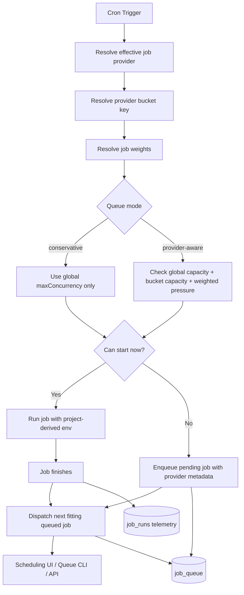
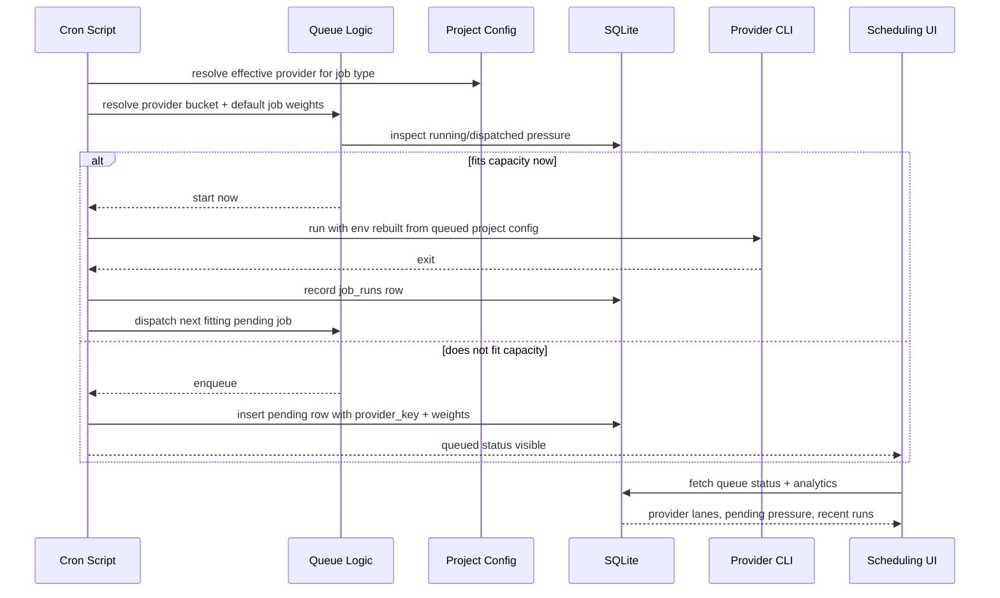

> **Note:** The dual-pressure model (`aiPressure`/`runtimePressure`) described in this PRD was removed in favor of simple per-bucket `maxConcurrency`. See `docs/prds/simplify-scheduler-pressure-model.md`.

# PRD: Provider-Aware Weighted Scheduling and Execution Insights

**Complexity: 10 -> HIGH mode**

```
+2  Multi-package change (core + cli + server + web + scripts)
+2  Queue dispatch correctness + backward compatibility constraints
+2  Scheduling algorithm change with provider-aware capacity checks
+2  New operational telemetry model and API surface
+2  Scheduling UX redesign with charts / visual execution lanes
```

---

## 1. Context

**Problem:** Night Watch's global queue currently treats all jobs as equivalent and all provider pressure as a single pool. That is safe, but overly conservative when different jobs run against different provider backends. At the same time, relaxing concurrency naively would be unsafe because job types have very different provider pressure profiles: executor and planner are heavy, audit is usually heavy, reviewer is moderate, and QA is usually lighter on AI but can still occupy runtime for a long time.

There is also a correctness gap today: queued jobs persist only `NW_*` environment variables, then inherit the dispatcher process environment at spawn time. In mixed-provider setups, a queued job can therefore be resumed with the wrong provider-specific environment (proxy URL, API keys, model overrides), which is unacceptable if we want to make scheduling provider-aware.

The Scheduling UI also does not show execution pressure in a meaningful way. It is mostly a cron/settings page today, not an operational view of queue pressure, provider saturation, or recent execution patterns.

**Files analyzed:**

- `scripts/night-watch-helpers.sh` - queue gate, enqueue, dispatch helpers
- `scripts/night-watch-cron.sh` - executor queue entry flow
- `scripts/night-watch-pr-reviewer-cron.sh` - reviewer queue entry flow
- `scripts/night-watch-qa-cron.sh` - QA queue entry flow
- `scripts/night-watch-audit-cron.sh` - audit queue entry flow
- `scripts/night-watch-slicer-cron.sh` - planner/slicer queue entry flow
- `packages/core/src/utils/job-queue.ts` - queue selection, dispatch, concurrency checks
- `packages/core/src/utils/scheduling.ts` - cross-project cron balancing
- `packages/core/src/storage/sqlite/migrations.ts` - queue and execution history schema
- `packages/core/src/types.ts` - queue config and queue entry contracts
- `packages/core/src/config.ts` - config loading / validation
- `packages/cli/src/commands/queue.ts` - dispatch command that spawns queued jobs
- `packages/cli/src/commands/shared/env-builder.ts` - current job env construction
- `packages/server/src/routes/queue.routes.ts` - queue API
- `packages/server/src/index.ts` - route wiring
- `web/api.ts` - web API client
- `web/pages/Scheduling.tsx` - current scheduling UI

**Current behavior:**

- Global queue throttling is based on `maxConcurrency` only.
- Queue priority exists per job type, but there is no job cost model beyond priority.
- Provider resolution exists per job type via `jobProviders`, but the queue itself is provider-blind.
- Cron balancing spreads jobs across projects, but only by project priority and slot index, not by provider bucket or job pressure.
- Queued jobs persist only serialized `NW_*` env vars; provider-specific env is not persisted or recomputed at dispatch time.
- `job_queue` stores only job identity / status, not provider bucket or weight metadata.
- Existing `execution_history` is PRD-centric and too sparse for Scheduling UI analytics.
- Queue API exists only in single-project mode; global/project-scoped queue visibility is incomplete.
- Scheduling UI shows cron state and next runs, but not queue pressure, provider load, wait time, or recent execution history.

**Integration Points Checklist:**

```markdown
**How will this feature be reached?**

- [x] Entry point: all cron scripts continue to use the existing queue gate / enqueue / dispatch path
- [x] Core runtime: queue dispatch becomes provider-aware when enabled
- [x] Config: new queue mode / weights / provider bucket settings in `night-watch.config.json`
- [x] API: queue status and analytics endpoints for Scheduling UI

**Is this user-facing?**

- [x] YES -> Scheduling page gets queue / provider execution visuals
- [x] YES -> Settings page gains provider-aware scheduling controls
- [x] YES -> `night-watch queue status` surfaces provider bucket and pressure data

**Full user flow:**

1. User configures mixed providers by job type, e.g. executor -> proxy-backed Claude/GLM, reviewer -> Codex
2. Cron fires multiple jobs across projects
3. Queue resolves each queued job to a provider bucket and job weight
4. Scheduler allows safe cross-provider parallelism when buckets are independent and capacity permits
5. Heavy jobs targeting the same provider bucket stay serialized or limited by bucket capacity
6. Scheduling UI shows active lanes, pending pressure, and recent queue / execution history
```

---

## 2. Solution

**Approach:**

- Preserve the current conservative queue behavior as the safe baseline.
- Introduce an opt-in `queue.mode = "provider-aware"` that adds per-provider-bucket capacity checks on top of the global queue.
- Resolve a **provider bucket key** from the effective job provider plus provider environment, not just from the `Provider` enum.
- Introduce default **job weights** for AI pressure and runtime pressure so heavy jobs consume more scheduler capacity than lighter jobs.
- Fix queued dispatch correctness by rebuilding job environment from the queued job's project config and job type at dispatch time, then overlaying persisted runtime-only `NW_*` flags.
- Add operational telemetry for queued/running/completed jobs so the scheduler and UI can reason about real wait times, run durations, and throttling events.
- Upgrade the Scheduling page from a cron configuration surface into an operational execution dashboard.

**Provider bucket examples:**

- `codex`
- `claude-native`
- `claude-proxy:z.ai`
- `claude-proxy:<custom-host>`

This avoids conflating "Claude CLI" with all Anthropic-compatible backends. A GLM-5 proxy and native Claude are different throttle domains even if both happen to be invoked through the `claude` CLI.

**Default job pressure model:**

| Job Type | AI Pressure | Runtime Pressure | Notes |
| --- | --- | --- | --- |
| executor | 5 | 4 | High-context, full PR generation, highest throttle risk |
| reviewer | 2 | 2 | Usually smaller prompts and narrower edits |
| qa | 1 | 4 | Lower AI pressure, but often long wall-clock runtime |
| audit | 4 | 3 | Can be broad-context and report-heavy |
| slicer / planner | 4 | 2 | High-context planning / decomposition work |

These are defaults, not absolutes. The scheduler should remain configurable because some repositories will have heavier reviewers or lighter audits.

**Architecture Diagram:**



**Key decisions:**

- **Keep conservative mode** so existing installs remain safe by default.
- **Throttle by provider bucket**, not by the coarse `Provider` enum.
- **Use two pressures**:
  - `aiPressure`: provider saturation / throttle likelihood
  - `runtimePressure`: queue occupancy / wall-clock contention
- **Do not trust dispatcher env** for queued jobs; recompute env from queued project config.
- **Do not overload `execution_history`** for operational charts; add a dedicated job-run telemetry model.
- **Prefer lightweight chart primitives** (SVG / simple React components) over a heavy charting dependency unless a library is already justified.

**Config shape (target):**

```typescript
interface IQueueConfig {
  enabled: boolean;
  mode: 'conservative' | 'provider-aware';
  maxConcurrency: number;
  maxWaitTime: number;
  priority: Record<JobType, number>;
  jobWeights: Record<JobType, { aiPressure: number; runtimePressure: number }>;
  providerBuckets: Record<
    string,
    {
      maxConcurrency: number;
      aiCapacity: number;
      runtimeCapacity: number;
    }
  >;
}
```

**Data changes:**

Extend `job_queue` with queue-time scheduling metadata:

```sql
ALTER TABLE job_queue ADD COLUMN provider_key TEXT;
ALTER TABLE job_queue ADD COLUMN ai_pressure INTEGER;
ALTER TABLE job_queue ADD COLUMN runtime_pressure INTEGER;
```

Add a new operational telemetry table:

```sql
CREATE TABLE job_runs (
  id                INTEGER PRIMARY KEY AUTOINCREMENT,
  project_path      TEXT    NOT NULL,
  job_type          TEXT    NOT NULL,
  provider_key      TEXT    NOT NULL,
  queue_entry_id    INTEGER,
  status            TEXT    NOT NULL, -- queued | running | success | failure | timeout | rate_limited | skipped
  queued_at         INTEGER,
  started_at        INTEGER NOT NULL,
  finished_at       INTEGER,
  wait_seconds      INTEGER,
  duration_seconds  INTEGER,
  throttled_count   INTEGER NOT NULL DEFAULT 0,
  metadata_json     TEXT    NOT NULL DEFAULT '{}'
);
CREATE INDEX idx_job_runs_lookup
  ON job_runs(project_path, started_at DESC, job_type, provider_key);
```

`execution_history` remains in place for PRD cooldown / PRD-oriented logic.

---

## 3. Sequence Flow



---

## 4. Execution Phases

### Phase 1: Queue Dispatch Correctness - "Queued jobs always run with the right provider env"

**User-visible outcome:** Mixed-provider jobs no longer inherit the wrong provider env when they are dispatched from the queue.

**Files (max 5):**

- `scripts/night-watch-helpers.sh` - narrow what is persisted from enqueue time
- `packages/cli/src/commands/queue.ts` - rebuild env from queued project config and job type before spawn
- `packages/cli/src/commands/shared/env-builder.ts` - shared queued-job env reconstruction helper
- `packages/core/src/utils/job-queue.ts` - optional provider key calculation for status output
- `packages/core/src/types.ts` - queue status types if provider key is surfaced

**Implementation:**

- [ ] Add a shared helper that rebuilds the effective environment for a queued job from:
  - `loadConfig(entry.projectPath)`
  - effective `jobType`
  - the same env builder used by the corresponding foreground command
- [ ] Limit persisted `env_json` to runtime-only overrides / queue markers, not provider identity
- [ ] Ensure queued dispatch overlays persisted `NW_*` values on top of freshly built project/job env
- [ ] Ensure provider-specific env (e.g. `ANTHROPIC_BASE_URL`, API keys, model ids) always comes from the queued job's project config
- [ ] Add regression coverage for mixed-provider queued dispatch

**Tests Required:**

| Test File | Test Name | Assertion |
| --- | --- | --- |
| `packages/cli/src/__tests__/commands/queue.test.ts` | `dispatch rebuilds env from queued project config` | Spawn env uses queued project's provider env, not dispatcher env |
| `packages/cli/src/__tests__/commands/queue.test.ts` | `dispatch preserves persisted NW queue markers` | `NW_QUEUE_DISPATCHED` and `NW_QUEUE_ENTRY_ID` still present |
| `packages/cli/src/__tests__/scripts/night-watch-helpers.test.ts` | `enqueue persists runtime queue flags only` | Provider-specific env is not relied on from serialized queue env |

**User Verification:**

- Action: Queue a reviewer job that resolves to `codex` while dispatching from a project using a Claude proxy
- Expected: The queued reviewer still launches with `codex` and its own config-derived env

---

### Phase 2: Provider-Aware Weighted Scheduler - "Safe parallelism only across independent provider buckets"

**User-visible outcome:** Users can opt into better throughput when jobs target different provider buckets, without allowing heavy jobs to stampede the same provider.

**Files (max 5):**

- `packages/core/src/types.ts` - extend `IQueueConfig`, queue entry types
- `packages/core/src/constants.ts` - default mode, default job weights, default bucket heuristics
- `packages/core/src/config.ts` - load / validate new queue config shape
- `packages/core/src/utils/job-queue.ts` - weighted dispatch algorithm and bucket-aware in-flight checks
- `packages/server/src/routes/config.routes.ts` - config validation for queue weights / buckets

**Implementation:**

- [ ] Add `queue.mode` with values:
  - `conservative`
  - `provider-aware`
- [ ] Add default `jobWeights` by job type
- [ ] Add provider bucket resolution helper:
  - `codex` -> `codex`
  - Claude with no proxy -> `claude-native`
  - Claude with proxy host -> `claude-proxy:<host>`
- [ ] Extend queue entries with `providerKey`, `aiPressure`, `runtimePressure`
- [ ] Update dispatch selection:
  - keep `maxConcurrency` as a global hard cap
  - in `provider-aware` mode, also enforce per-bucket `maxConcurrency`
  - enforce weighted `aiCapacity` / `runtimeCapacity`
  - if the head item does not fit, evaluate the next eligible pending item rather than stalling the whole queue
- [ ] Keep `conservative` mode behavior identical to today's semantics
- [ ] Surface "blocked by provider capacity" in CLI / status output where possible

**Tests Required:**

| Test File | Test Name | Assertion |
| --- | --- | --- |
| `packages/core/src/__tests__/utils/job-queue.test.ts` | `conservative mode preserves current serial dispatch semantics` | Existing behavior unchanged |
| `packages/core/src/__tests__/utils/job-queue.test.ts` | `same-bucket heavy jobs do not dispatch in parallel` | Second heavy job remains pending |
| `packages/core/src/__tests__/utils/job-queue.test.ts` | `cross-bucket jobs can dispatch when capacity allows` | Independent provider buckets progress concurrently |
| `packages/core/src/__tests__/config.test.ts` | `loads and validates queue job weights` | Invalid values rejected / clamped |

**User Verification:**

- Action: Configure executor -> `claude-proxy:z.ai`, reviewer -> `codex`, set `queue.mode = "provider-aware"`
- Expected: A Codex reviewer can start while a proxy-backed executor is active, but two heavy proxy-backed executors cannot overlap

---

### Phase 3: Operational Telemetry and APIs - "Scheduling UI gets real execution data"

**User-visible outcome:** Queue state and recent execution telemetry are available to both CLI and web UI, including in global mode.

**Files (max 5):**

- `packages/core/src/storage/sqlite/migrations.ts` - add queue metadata columns + `job_runs` table
- `packages/core/src/utils/job-queue.ts` - query helpers for provider breakdown / analytics
- `packages/server/src/routes/queue.routes.ts` - richer queue status and analytics responses
- `packages/server/src/index.ts` - wire queue routes for global/project-scoped mode
- `web/api.ts` - typed queue status / analytics client methods

**Implementation:**

- [ ] Add `job_runs` operational table
- [ ] Record queued, running, completed, throttled, timeout states for all job types
- [ ] Extend queue status response with:
  - provider bucket for each item
  - running pressure by provider bucket
  - pending counts by job type and provider bucket
  - oldest queued age / average wait time
- [ ] Add queue analytics endpoint for recent history (e.g. 24h / 7d)
- [ ] Make queue APIs available in global/project-scoped server mode too
- [ ] Keep API contracts aligned in shared web types

**Tests Required:**

| Test File | Test Name | Assertion |
| --- | --- | --- |
| `packages/core/src/__tests__/storage/sqlite/migrations.test.ts` | `creates job_runs table and queue metadata columns` | Schema present after migration |
| `packages/server/src/__tests__/server.test.ts` or route-specific tests | `returns queue analytics payload` | API shape includes provider breakdown |
| `packages/server/src/__tests__/server.test.ts` or route-specific tests | `queue routes work in project-scoped global mode` | `/api/projects/:projectId/...` path responds |

**User Verification:**

- Action: Start the server in global mode and open the Scheduling page for a project
- Expected: Queue / execution data loads without falling back to single-project-only routes

---

### Phase 4: Scheduling UX Refresh - "Execution becomes visible, not just configurable"

**User-visible outcome:** The Scheduling page clearly shows what is running, what is blocked, which provider bucket is under pressure, and how the last 24 hours behaved.

**Files (max 5):**

- `web/pages/Scheduling.tsx` - page layout redesign
- `web/components/scheduling/ProviderLanesChart.tsx` - live provider lane visualization
- `web/components/scheduling/QueuePressureBars.tsx` - weighted pressure summary
- `web/components/scheduling/RecentRunsChart.tsx` - recent execution / wait-time chart
- `web/pages/__tests__/Scheduling.test.tsx` - UI coverage

**Implementation:**

- [ ] Add a top-level queue overview block:
  - running now
  - pending total
  - average wait time
  - throttled events in recent window
- [ ] Add **Provider Lanes** chart:
  - one row per provider bucket
  - running jobs shown as active blocks
  - queued jobs shown as pending blocks
  - color by job type
- [ ] Add **Pressure Summary** bars:
  - AI pressure by provider bucket
  - runtime pressure by provider bucket
- [ ] Add **Recent Runs** chart:
  - recent runs over time
  - queue wait vs run duration
  - highlight throttled / timed-out runs
- [ ] Keep cron controls and job enablement, but demote them below operational visibility
- [ ] Ensure the page works in narrow/mobile layouts

**Design direction:**

- Make the page feel operational, not purely administrative
- Favor dense but readable telemetry cards over oversized empty panels
- Use a clear color system by job type, not by arbitrary decorative palette
- Use lightweight animation only to indicate live execution / queue movement

**Tests Required:**

| Test File | Test Name | Assertion |
| --- | --- | --- |
| `web/pages/__tests__/Scheduling.test.tsx` | `renders provider lanes from queue analytics` | Lanes appear with provider labels |
| `web/pages/__tests__/Scheduling.test.tsx` | `renders pending queue pressure summary` | Pressure cards show counts / wait time |
| `web/pages/__tests__/Scheduling.test.tsx` | `keeps cron controls available after dashboard refresh` | Existing controls still function |

**User Verification:**

- Action: Open Scheduling while one job is running and one is queued
- Expected: UI shows the active provider lane, pending queue pressure, and recent execution chart without obscuring cron controls

---

## 5. Acceptance Criteria

- [ ] Queued jobs always dispatch with the correct project-derived provider environment
- [ ] `queue.mode = "conservative"` preserves today's queue semantics
- [ ] `queue.mode = "provider-aware"` allows safe cross-provider parallelism
- [ ] Heavy jobs on the same provider bucket do not overrun bucket capacity
- [ ] Default job weights reflect heavier executor / planner / audit behavior than reviewer
- [ ] QA contributes mostly runtime pressure rather than AI pressure by default
- [ ] Queue status surfaces provider bucket and pressure metadata
- [ ] Queue APIs work in both single-project and global/project-scoped modes
- [ ] Scheduling UI shows provider lanes, pending pressure, and recent runs
- [ ] Existing cron install / pause / edit controls remain functional

---

## 6. Non-Goals

- [ ] Exact per-request token accounting from provider APIs
- [ ] Automatic provider switching / failover between Codex, Claude, and proxies
- [ ] Replacing the existing `execution_history` PRD cooldown model
- [ ] Predictive ML-based queue optimization

---

## 7. Notes

- The scheduler should remain adaptive but pragmatic. We do not have stable RPM/TPM guarantees across all coding products, especially proxies and CLI products with opaque 5-hour windows. The design should therefore prefer weighted heuristics and observed wait/run data over pretending we have exact provider token budgets.
- The first implementation milestone is correctness, not aggressive parallelism. Provider-aware scheduling is only worth shipping after queued mixed-provider dispatch is made safe.
