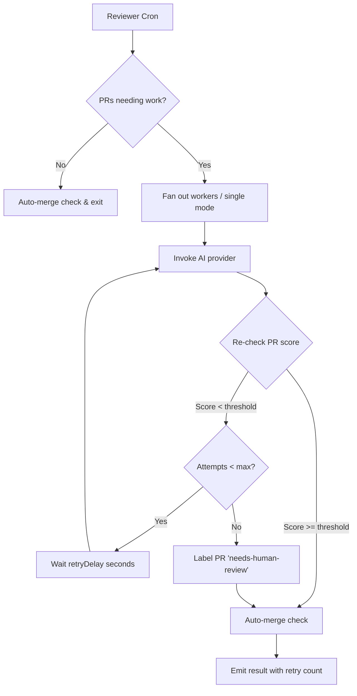
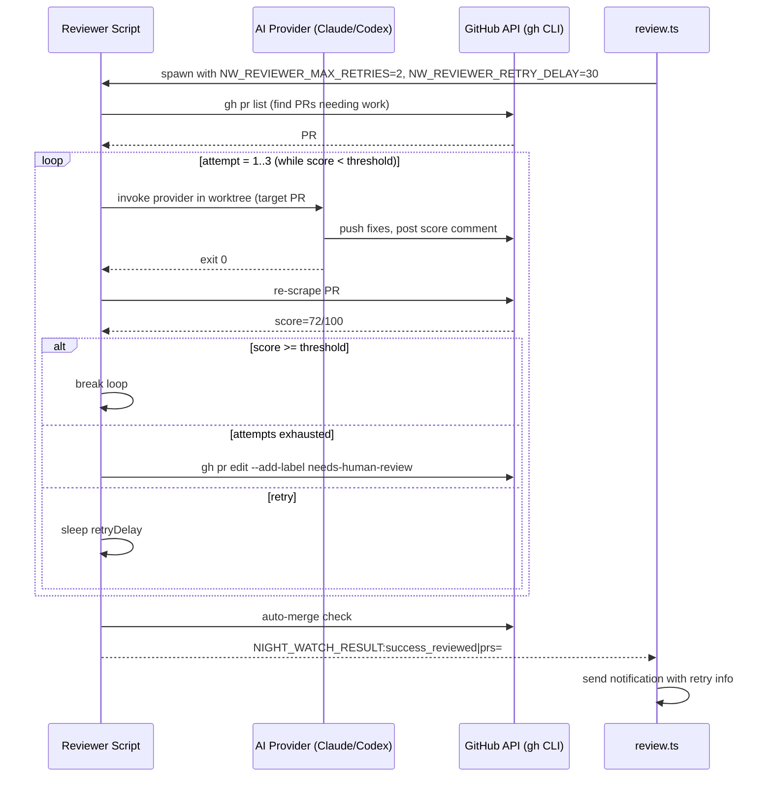

# PRD: Reviewer Retry Loop

**Complexity: 6 → MEDIUM mode**

---

## 1. Context

**Problem:** The reviewer invokes the AI provider once per cron run to fix PRs below the score threshold. If the fix attempt doesn't fully resolve issues, the PR sits idle until the next cron tick (default: 3 hours). This breaks the "autonomous overnight" promise — users wake up to half-fixed PRs instead of merged code.
tran
**Files Analyzed:**

- `scripts/night-watch-pr-reviewer-cron.sh` — bash reviewer orchestrator (533 lines)
- `scripts/night-watch-helpers.sh` — shared bash utilities
- `packages/cli/src/commands/review.ts` — CLI command, env-var builder, result parser
- `packages/core/src/types.ts` — `INightWatchConfig`
- `packages/core/src/constants.ts` — default config values
- `packages/core/src/config/config.ts` — config loading & validation
- `packages/core/src/utils/execution-history.ts` — SQLite history tracking
- `templates/night-watch-pr-reviewer.md` — reviewer prompt template

**Current Behavior:**

- Reviewer bash script finds PRs with score < threshold, CI failures, or merge conflicts
- Invokes the AI provider **once** in a detached worktree (or parallel workers, one per PR)
- After AI exits, checks for auto-merge eligibility, emits result, exits
- No re-check of scores after the fix attempt within the same run
- No tracking of how many fix attempts a PR has received across runs
- No mechanism to "give up" on a PR after repeated failures

**Integration Points Checklist:**

```markdown
**How will this feature be reached?**

- [x] Entry point: existing `night-watch review` command + reviewer cron job
- [x] Caller: `night-watch-pr-reviewer-cron.sh` (the retry loop wraps the existing provider invocation)
- [x] Registration: new env vars wired through `review.ts` → bash

**Is this user-facing?**

- [x] YES → Settings page gains two new config fields (max retries, retry delay)
- [x] YES → Notifications include retry attempt info

**Full user flow:**

1. User runs `night-watch review` (or cron triggers it)
2. Reviewer finds PR #42 with score 55/100
3. AI fixes issues, pushes, posts new score comment (72/100)
4. Bash re-checks score → still below 80 threshold → attempt 2 of 3
5. AI fixes remaining issues, pushes, posts score (88/100)
6. Bash re-checks → above threshold → proceeds to auto-merge
7. Notification says "PR #42 reviewed (88/100, 3 attempts)"
```

---

## 2. Solution

**Approach:**

- Add a retry loop in the bash reviewer script that wraps the provider invocation. After the AI exits, re-scrape the PR's latest score from GitHub comments. If still below threshold and attempts < max, wait `retryDelay` seconds and re-invoke the AI.
- The loop operates per-PR (inside the worker/single-PR path), so parallel workers each retry their own PR independently.
- Two new config fields: `reviewerMaxRetries` (default: 2, meaning up to 2 additional attempts after the first) and `reviewerRetryDelay` (default: 30 seconds, to let CI settle before re-checking).
- Track cumulative attempt count per PR across cron runs via the existing `execution_history` SQLite table, using a `pr:<number>` key. After exceeding a global lifetime cap, label the PR and stop retrying.
- Emit retry metadata in `NIGHT_WATCH_RESULT` so the Node.js side can include it in notifications.

**Architecture Diagram:**



**Key Decisions:**

- Retry loop lives in bash (not TypeScript) because the provider invocation is bash-native. Avoids a risky rewrite.
- Re-scrape score from GitHub comments (reuse existing `grep -oP` pattern) rather than parsing AI stdout.
- `retryDelay` defaults to 30s — enough for CI to start but not waste time. Users can tune it.
- `reviewerMaxRetries: 2` means up to 3 total attempts (1 initial + 2 retries). Conservative default.
- The per-PR timeout shrinks proportionally: each attempt gets `MAX_RUNTIME / (attempt + remaining)` to avoid exceeding the total `reviewerMaxRuntime`.
- The `needs-human-review` GitHub label is added via `gh pr edit --add-label` after max retries exhausted.

**Data Changes:** None (reuses existing `execution_history` table with `pr:<number>` as the PRD key).

---

## 3. Sequence Flow



---

## 4. Execution Phases

### Phase 1: Config Types & Defaults

**User-visible outcome:** `night-watch review --dry-run` shows the new retry config fields.

**Files (3):**

- `packages/core/src/types.ts` — add `reviewerMaxRetries` and `reviewerRetryDelay` to `INightWatchConfig`
- `packages/core/src/constants.ts` — add `DEFAULT_REVIEWER_MAX_RETRIES = 2` and `DEFAULT_REVIEWER_RETRY_DELAY = 30`
- `packages/core/src/config/config.ts` — add defaults + validation for the two new fields

**Implementation:**

- [x] Add `reviewerMaxRetries: number` and `reviewerRetryDelay: number` to `INightWatchConfig`
- [x] Add `DEFAULT_REVIEWER_MAX_RETRIES = 2` and `DEFAULT_REVIEWER_RETRY_DELAY = 30` to constants
- [x] Wire defaults in `buildDefaultConfig()` in `config.ts`
- [x] Add validation: `reviewerMaxRetries` must be 0-10 integer, `reviewerRetryDelay` must be 0-300 integer

**Tests Required:**

| Test File                                    | Test Name                                        | Assertion                                               |
| -------------------------------------------- | ------------------------------------------------ | ------------------------------------------------------- |
| `packages/core/src/__tests__/config.test.ts` | `should include reviewer retry defaults`         | `expect(config.reviewerMaxRetries).toBe(2)`             |
| `packages/core/src/__tests__/config.test.ts` | `should clamp reviewerMaxRetries to valid range` | `expect(loadConfig({reviewerMaxRetries: 99})).toBe(10)` |

**Verification Plan:**

1. Unit tests: config loading returns correct defaults
2. `yarn verify` passes

---

### Phase 2: CLI Env Wiring & Dry-Run Output

**User-visible outcome:** `night-watch review --dry-run` displays `NW_REVIEWER_MAX_RETRIES` and `NW_REVIEWER_RETRY_DELAY` in the env vars section.

**Files (2):**

- `packages/cli/src/commands/review.ts` — add env vars to `buildEnvVars()`
- `packages/cli/src/__tests__/review.test.ts` — test env var passthrough

**Implementation:**

- [x] Add `NW_REVIEWER_MAX_RETRIES: String(config.reviewerMaxRetries)` to `buildEnvVars()`
- [x] Add `NW_REVIEWER_RETRY_DELAY: String(config.reviewerRetryDelay)` to `buildEnvVars()`

**Tests Required:**

| Test File                                   | Test Name                            | Assertion                                        |
| ------------------------------------------- | ------------------------------------ | ------------------------------------------------ |
| `packages/cli/src/__tests__/review.test.ts` | `should include retry env vars`      | `expect(env.NW_REVIEWER_MAX_RETRIES).toBe('2')`  |
| `packages/cli/src/__tests__/review.test.ts` | `should include retry delay env var` | `expect(env.NW_REVIEWER_RETRY_DELAY).toBe('30')` |

**Verification Plan:**

1. Unit tests pass
2. `yarn verify` passes

---

### Phase 3: Bash Retry Loop

**User-visible outcome:** The reviewer retries fixing a PR if the score is still below threshold after the AI exits, up to `NW_REVIEWER_MAX_RETRIES` additional attempts.

**Files (1):**

- `scripts/night-watch-pr-reviewer-cron.sh` — wrap provider invocation in a retry loop with score re-check

**Implementation:**

- [x] Read `NW_REVIEWER_MAX_RETRIES` (default 2) and `NW_REVIEWER_RETRY_DELAY` (default 30) env vars
- [x] Extract the "re-scrape PR score" logic into a `get_pr_score()` bash function (reuse existing grep pattern)
- [x] In the single-PR / worker path (after line ~415), wrap the provider invocation in a `for` loop:

  ```bash
  TOTAL_ATTEMPTS=$((REVIEWER_MAX_RETRIES + 1))
  for ATTEMPT in $(seq 1 "${TOTAL_ATTEMPTS}"); do
    # Calculate per-attempt timeout
    REMAINING=$((TOTAL_ATTEMPTS - ATTEMPT + 1))
    ATTEMPT_TIMEOUT=$((MAX_RUNTIME / REMAINING))

    # Invoke provider (existing case block, using ATTEMPT_TIMEOUT instead of MAX_RUNTIME)
    ...

    # If provider failed (non-zero exit), don't retry
    [ ${EXIT_CODE} -ne 0 ] && break

    # Re-check score for the target PR
    if [ -n "${TARGET_PR}" ]; then
      CURRENT_SCORE=$(get_pr_score "${TARGET_PR}")
      if [ -n "${CURRENT_SCORE}" ] && [ "${CURRENT_SCORE}" -ge "${MIN_REVIEW_SCORE}" ]; then
        log "RETRY: PR #${TARGET_PR} now scores ${CURRENT_SCORE}/100 (>= ${MIN_REVIEW_SCORE}) after attempt ${ATTEMPT}"
        break
      fi
      if [ "${ATTEMPT}" -lt "${TOTAL_ATTEMPTS}" ]; then
        log "RETRY: PR #${TARGET_PR} scores ${CURRENT_SCORE:-unknown}/100 after attempt ${ATTEMPT}/${TOTAL_ATTEMPTS}, retrying in ${REVIEWER_RETRY_DELAY}s..."
        sleep "${REVIEWER_RETRY_DELAY}"
      else
        log "RETRY: PR #${TARGET_PR} still at ${CURRENT_SCORE:-unknown}/100 after ${TOTAL_ATTEMPTS} attempts — giving up"
      fi
    else
      break  # Non-targeted mode: no retry (reviewer handles all PRs in one shot)
    fi
  done
  ```

- [x] Append `|attempts=${ATTEMPT}` to the `NIGHT_WATCH_RESULT` output for workers
- [x] When retries exhausted and score still < threshold, add `needs-human-review` label:
  ```bash
  gh pr edit "${TARGET_PR}" --add-label "needs-human-review" 2>/dev/null || true
  ```

**Tests Required:**

| Test File                                  | Test Name                                         | Assertion                                         |
| ------------------------------------------ | ------------------------------------------------- | ------------------------------------------------- |
| `scripts/__tests__/reviewer-retry.test.ts` | `should pass retry env vars to script in dry-run` | dry-run output contains `NW_REVIEWER_MAX_RETRIES` |

**Verification Plan:**

1. `night-watch review --dry-run` shows retry config
2. Manual test: create a PR with a low score, run `night-watch review`, observe retry logs
3. `yarn verify` passes

---

### Phase 4: Result Parsing & Notifications

**User-visible outcome:** Notifications include retry attempt count and final score.

**Files (3):**

- `packages/cli/src/commands/review.ts` — parse `attempts` and `final_score` from result data
- `packages/core/src/utils/notify.ts` — include retry info in review notification message
- `packages/core/src/types.ts` — add `review_retried` notification event (optional)

**Implementation:**

- [x] In `review.ts`, after `parseScriptResult()`, extract `scriptResult.data.attempts` and `scriptResult.data.final_score`
- [x] Include `attempts` and `finalScore` in the notification context passed to `sendNotifications()`
- [x] In `notify.ts`, when formatting `review_completed` messages, append `" (X attempts, final score: Y/100)"` if attempts > 1
- [x] Update the parallel-worker result aggregation to sum/max attempts across workers

**Tests Required:**

| Test File                                    | Test Name                                          | Assertion                                |
| -------------------------------------------- | -------------------------------------------------- | ---------------------------------------- |
| `packages/cli/src/__tests__/review.test.ts`  | `should parse retry attempts from result`          | `expect(parsed.data.attempts).toBe('3')` |
| `packages/core/src/__tests__/notify.test.ts` | `should include retry info in review notification` | message contains `(3 attempts`           |

**Verification Plan:**

1. Unit tests pass
2. `yarn verify` passes

---

### Phase 5: Settings UI

**User-visible outcome:** The Settings page in the web UI shows reviewer retry configuration fields.

**Files (2):**

- `web/src/pages/Settings.tsx` — add inputs for `reviewerMaxRetries` and `reviewerRetryDelay` in the Review section
- `web/src/types.ts` — add the two fields to the config type (if mirrored)

**Implementation:**

- [x] Add a "Retry Settings" sub-section under the existing Review Configuration section
- [x] Add a number input for `reviewerMaxRetries` (label: "Max Retry Attempts", min: 0, max: 10, help: "Additional fix attempts after initial review. 0 = no retries.")
- [x] Add a number input for `reviewerRetryDelay` (label: "Retry Delay (seconds)", min: 0, max: 300, help: "Wait time between retry attempts to let CI settle.")

**Tests Required:**

| Test File                             | Test Name                           | Assertion                                |
| ------------------------------------- | ----------------------------------- | ---------------------------------------- |
| `web/src/__tests__/Settings.test.tsx` | `should render retry config fields` | form contains `reviewerMaxRetries` input |

**Verification Plan:**

1. `yarn verify` passes
2. Start server (`night-watch serve`), navigate to Settings, verify retry fields appear and save correctly

---

## 5. Acceptance Criteria

- [x] All phases complete
- [x] All specified tests pass
- [x] `yarn verify` passes
- [x] `night-watch review --dry-run` shows retry config
- [x] Reviewer bash script retries up to N times when score < threshold
- [x] PRs labeled `needs-human-review` after max retries exhausted
- [x] Notifications include retry attempt count
- [x] Settings UI shows retry configuration
- [x] Feature is reachable via existing `night-watch review` command (no orphaned code)
