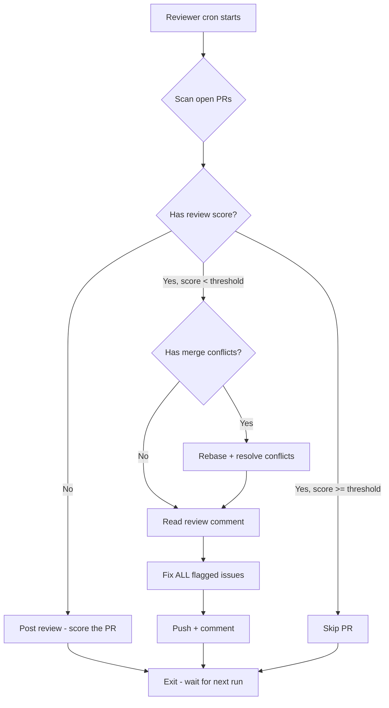
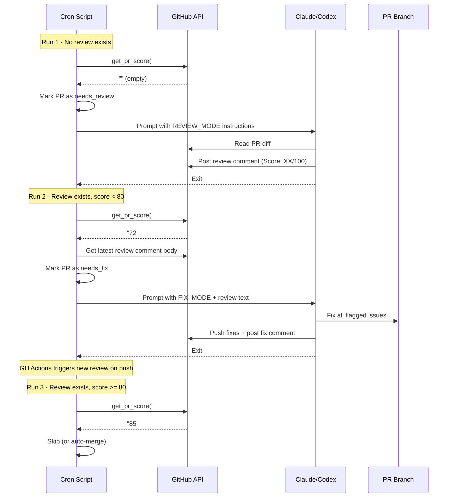

# PRD: Reviewer — Review First, Fix Later

`Complexity: 4 → MEDIUM mode`

## 1. Context

**Problem:** The reviewer treats "no review score yet" as "all good" and skips the PR. When it does fix, it only addresses CI failures and merge conflicts — ignoring code quality bugs, performance issues, and other review feedback flagged by the AI reviewer.

**Files Analyzed:**

- `scripts/night-watch-pr-reviewer-cron.sh` — orchestration (PR scanning, retry loop, worktree management)
- `instructions/night-watch-pr-reviewer.md` — Claude prompt (decides what to fix)
- `.github/workflows/pr-review.yml` — GitHub Actions review trigger
- `.github/prompts/pr-review.md` — scoring criteria template
- `packages/core/src/constants.ts` — default config values
- `packages/cli/src/commands/review.ts` — CLI command handler

**Current Behavior:**

- Cron script line 654: `if [ -n "${LATEST_SCORE}" ] && ...` — empty score (no review) → condition is false → PR is NOT marked as needing work
- Cron script line 662: logs `"or no score yet"` and emits `skip_all_passing`
- Reviewer prompt line 24: explicitly says `"or no review score yet"` means skip
- Reviewer prompt line 124-133: section C (address review feedback) tells Claude to read review comments, but the fixer in practice only addresses CI failures because the prompt structure leads Claude to prioritize CI (step D) over review feedback (step C)
- GitHub Actions (`pr-review.yml`) posts a DiffGuard review automatically on `opened`/`synchronize`, but there's a race condition — the reviewer cron can run before GH Actions finishes

## 2. Solution

**Approach:**

1. Change the cron script's PR scanning loop so "no review score" marks the PR as needing work (new state: `needs_review`)
2. When PR needs review (no score), the reviewer prompt should tell Claude to **score the PR** (using the same criteria from `.github/prompts/pr-review.md`) and post a review comment — then stop without fixing
3. When PR has a review with score < threshold, the reviewer prompt should tell Claude to **fix ALL flagged issues** (bugs, code quality, performance, CI, merge conflicts) by reading the full review comment text — then push and exit
4. Remove the `"or no review score yet"` skip logic from both the cron script and the prompt

**Architecture Diagram:**

**Key Decisions:**

- [ ] Claude posts the review itself (using the shared `.github/prompts/pr-review.md` criteria) rather than triggering GH Actions — this avoids race conditions and ensures a review always exists before fixing
- [ ] The review comment format must match the existing DiffGuard format so score extraction works (`**Overall Score:** XX/100`)
- [ ] No new config values needed — reuses existing `NW_MIN_REVIEW_SCORE`
- [ ] The cron script injects the full latest review comment text into the prompt so Claude has concrete issues to fix

**Data Changes:** None

## 3. Sequence Flow

## 4. Execution Phases

### Phase 1: Update cron script to detect "no review" as needing work

**Files (3):**

- `scripts/night-watch-pr-reviewer-cron.sh` — change PR scanning loop + add review text extraction
- `packages/cli/src/commands/review.ts` — add `needs_review` to result parsing (if new emit status)

**Implementation:**

- [ ] In the PR scanning loop (lines 610-659), add a new condition: if `LATEST_SCORE` is empty AND no failed CI AND no merge conflicts → mark as `needs_review` (set `NEEDS_WORK=1`)
- [ ] Add a new function `get_pr_latest_review_comment()` that extracts the full body of the most recent review comment (the one containing `Overall Score:`)
- [ ] When building `TARGET_SCOPE_PROMPT` (lines 946-964), if no score found, add a `- action: review` hint; if score < threshold, add `- action: fix` and include the full review comment body
- [ ] Add new emit result `needs_review` for telemetry/notification differentiation

**Tests Required:**

| Test File | Test Name | Assertion |
|-----------|-----------|-----------|
| `packages/cli/src/__tests__/scripts/core-flow-smoke.test.ts` | `reviewer should mark PR as needing work when no review score exists` | Expect `NEEDS_WORK=1` and not `skip_all_passing` |
| `packages/cli/src/__tests__/scripts/core-flow-smoke.test.ts` | `reviewer should inject review comment text into prompt when score < threshold` | Expect review body in prompt |

**Verification Plan:**

1. **Unit test**: Mock `gh pr view` to return comments with no score → verify script does NOT emit `skip_all_passing`
2. **Manual**: Run `night-watch review --dry-run` on a PR with no review → should show PR as needing work

---

### Phase 2: Update reviewer prompt with review-first/fix-later modes

**Files (1):**

- `instructions/night-watch-pr-reviewer.md` — restructure into two modes

**Implementation:**

- [ ] Remove the `"or no review score yet"` exception from the Early Exit section (line 24)
- [ ] Remove it from the determination logic (line 92-93)
- [ ] Add a new section `## Mode: Review` that tells Claude to:
  - Read the PR diff (`gh pr diff <number>`)
  - Score it using the criteria from `.github/prompts/pr-review.md` (inline the scoring rubric)
  - Post a review comment in the exact DiffGuard format (so `extract_review_score_from_text` can parse it)
  - Do NOT fix anything — just review and exit
- [ ] Add a new section `## Mode: Fix` that tells Claude to:
  - Read the full review comment (injected by the cron script into the prompt)
  - Address ALL items: bugs (high/medium confidence), code quality issues, performance issues, CI failures, merge conflicts
  - For each bug/issue in the review table, either fix it or explain why it was not fixed
  - Commit, push, and post a "Night Watch PR Fix" comment listing what was addressed from the review
- [ ] The cron script's `TARGET_SCOPE_PROMPT` injection determines which mode Claude operates in:
  - `- action: review` → Claude follows Review mode
  - `- action: fix` + review comment text → Claude follows Fix mode

**Tests Required:**

| Test File | Test Name | Assertion |
|-----------|-----------|-----------|
| Manual verification | Review mode posts correct format | Review comment matches `**Overall Score:** XX/100` pattern |
| Manual verification | Fix mode addresses review bugs | Fix comment references specific bugs from review |

**Verification Plan:**

1. **Manual**: Run reviewer against a PR with no review → verify it posts a review comment with score
2. **Manual**: Run reviewer against a PR with review score < 80 → verify it fixes code quality bugs (not just CI)
3. **Automated**: `yarn verify` passes (no TS/lint changes in this phase)

---

### Phase 3: Wire review comment body into the fix prompt

**Files (1):**

- `scripts/night-watch-pr-reviewer-cron.sh` — extract and inject review comment body

**Implementation:**

- [ ] Add function `get_pr_latest_review_body()` that returns the full body of the most recent comment containing a review score. Use `gh api repos/{owner}/{repo}/issues/{pr}/comments --jq` to get the comment body, filter for the one with the latest score pattern
- [ ] In the `TARGET_SCOPE_PROMPT` construction (around line 946), when `TARGET_SCORE` exists and is below threshold:
  - Call `get_pr_latest_review_body "${TARGET_PR}"`
  - Truncate to ~6000 chars (via existing `truncate_for_prompt`)
  - Append as `## Latest Review Feedback\n<review body>` to the prompt
- [ ] When no score exists, set `- action: review` in the scope prompt
- [ ] When score < threshold, set `- action: fix` in the scope prompt

**Tests Required:**

| Test File | Test Name | Assertion |
|-----------|-----------|-----------|
| `packages/cli/src/__tests__/scripts/core-flow-smoke.test.ts` | `reviewer should include review body in prompt when score is below threshold` | Grep log for review body content |

**Verification Plan:**

1. **Smoke test**: Existing smoke tests still pass (`yarn test`)
2. **Manual**: Run reviewer in dry-run against PR with low score → verify review body appears in prompt context
3. **Automated**: `yarn verify` passes

---

## 5. Acceptance Criteria

- [ ] PRs with no AI review comment are detected as needing work (not skipped)
- [ ] On first encounter (no review), the reviewer posts a review comment with score — does NOT fix code
- [ ] On subsequent encounters (score < threshold), the reviewer fixes ALL flagged issues from the review comment (bugs, code quality, performance — not just CI)
- [ ] The fix comment references specific items from the review
- [ ] After pushing fixes, the reviewer exits (no same-run re-review)
- [ ] PRs with score >= threshold are still skipped (unchanged behavior)
- [ ] Auto-merge logic still works (requires score >= threshold)
- [ ] `yarn verify` passes
- [ ] Smoke tests pass
