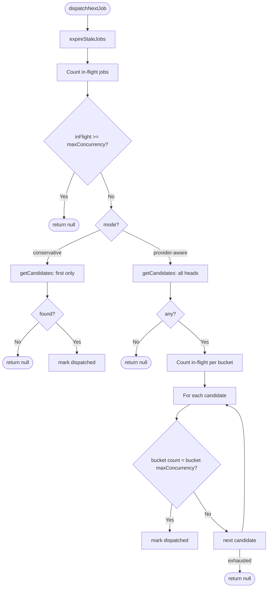

# PRD: Simplify Scheduler — Remove Pressure Model

**Complexity: 8 → HIGH mode**

```
+3  Touches 15+ files across core, cli, server, web, tests, docs
+2  Multi-package changes (core + server + web + tests)
+1  Database schema changes (drop columns)
+2  Core scheduling algorithm refactor
```

---

## 1. Context

**Problem:** The dual-pressure model (`aiPressure`/`runtimePressure` with per-bucket `aiCapacity`/`runtimeCapacity`) adds significant complexity to the scheduler without practical benefit — per-bucket `maxConcurrency` alone achieves the same goal. This complexity creates resistance when implementing features in this area.

**Files Analyzed:**

- `packages/core/src/utils/job-queue.ts` — dispatch logic, pressure queries, enqueue
- `packages/core/src/types.ts` — `IJobWeight`, `IProviderBucketConfig`, pressure fields across 6 interfaces
- `packages/core/src/constants.ts` — `DEFAULT_JOB_WEIGHTS`, `DEFAULT_PROVIDER_BUCKETS`, `DEFAULT_QUEUE`
- `packages/core/src/config.ts` — `mergeConfigLayer` deep-merges `jobWeights`/`providerBuckets`
- `packages/core/src/config-normalize.ts` — 40-line parsing blocks for `jobWeights` and `providerBuckets`
- `packages/core/src/config-env.ts` — no pressure-related env vars (clean)
- `packages/core/src/storage/sqlite/migrations.ts` — `ai_pressure`, `runtime_pressure` columns
- `packages/server/src/routes/queue.routes.ts` — pass-through, returns what `getQueueStatus()`/`getJobRunsAnalytics()` provide
- `packages/cli/src/commands/queue.ts` — calls `enqueueJob()` (already omits pressure params)
- `packages/cli/src/commands/shared/env-builder.ts` — no pressure env vars (clean)
- `web/components/scheduling/QueuePressureBars.tsx` — 85-line component visualizing pressure bars
- `web/pages/Scheduling.tsx` — imports `QueuePressureBars`, renders "Queue Pressure" card
- `web/api.ts` — mirrors core types including pressure fields
- `docs/scheduler-architecture.md` — documents pressure model extensively

**Current Behavior:**

- Two dispatch modes exist: `conservative` (serial) and `provider-aware` (parallel with bucket checks).
- Provider-aware mode uses a 3-check waterfall: bucket concurrency → AI capacity → runtime capacity.
- Job weights (`aiPressure`/`runtimePressure`) are assigned per job type with arbitrary 0–10 heuristic values.
- Default provider buckets config is empty `{}` — no user has ever configured bucket capacities.
- The concurrency check alone (`inFlight.count >= bucket.maxConcurrency`) provides the actual rate-limit protection.
- `selectNextPendingEntry()` and `getAllPendingCandidates()` share ~90% identical logic (query, group by project, multi-criteria sort).

### Integration Points Checklist

```markdown
**How will this feature be reached?**

- [x] Entry point: cron scripts → queue enqueue/dispatch → simplified dispatch logic
- [x] Core runtime: provider-aware dispatch simplified to per-bucket concurrency only
- [x] Config: IQueueConfig drops jobWeights and simplifies providerBuckets
- [x] API: queue status/analytics endpoints return simplified shapes (no pressure fields)
- [x] UI: Scheduling page renders bucket counts instead of pressure bars

**Is this user-facing?**

- [x] YES → Scheduling page "Queue Pressure" card simplified to per-bucket counts
- [x] YES → `IQueueConfig` loses `jobWeights` and `providerBuckets.aiCapacity/runtimeCapacity`
- [x] YES → API responses lose `pressureByBucket` and `totalAiPressure`/`totalRuntimePressure` fields

**Full user flow:**

1. Existing behavior preserved: cron fires → job enqueued → dispatch checks per-bucket concurrency → job runs
2. Config simplified: `providerBuckets` only needs `{ maxConcurrency: N }` per bucket
3. Scheduling page shows running/pending counts per bucket (no pressure bars)
4. No user action required — breaking config keys are silently ignored
```

---

## 2. Solution

**Approach:**

- Remove the entire `aiPressure`/`runtimePressure`/`aiCapacity`/`runtimeCapacity` subsystem.
- Simplify `IProviderBucketConfig` to only `{ maxConcurrency: number }`.
- Delete `IJobWeight` type and `DEFAULT_JOB_WEIGHTS` constant entirely.
- Simplify `fitsProviderCapacity()` to a single concurrency check.
- Deduplicate `selectNextPendingEntry()` and `getAllPendingCandidates()` into one shared function.
- Replace `QueuePressureBars` pressure visualization with simple per-bucket running/pending counts.
- Remove `ai_pressure`/`runtime_pressure` DB columns (stop writing; tolerate existing data).

**Key Decisions:**

- Keep `provider_key` column and `resolveProviderBucketKey()` — provider bucketing is useful
- Keep `job_runs` telemetry table — operational analytics remains valuable
- Keep `conservative` / `provider-aware` dual-mode — backward compatible
- Keep `providerBuckets` in config — but only `maxConcurrency` per bucket
- Do not migrate existing data — simply stop reading/writing pressure columns
- Silently ignore `jobWeights`, `aiCapacity`, `runtimeCapacity` in user configs (normalizer drops them)

**Data Changes:**

- `job_queue`: stop writing `ai_pressure` and `runtime_pressure` columns (leave columns in schema for SQLite backward compatibility — SQLite doesn't cleanly drop columns on older versions)
- Remove `ai_pressure`/`runtime_pressure` from CREATE TABLE definition in migrations
- Remove the ALTER TABLE ADD COLUMN statements for pressure columns

---

## 3. Sequence Flow

Simplified dispatch flow (provider-aware mode):



---

## 4. Execution Phases

### Phase 1: Simplify core types, constants, and config — "Remove pressure model from the type system"

**Files (max 5):**

- `packages/core/src/types.ts` — delete `IJobWeight`, simplify `IProviderBucketConfig`, remove pressure fields from `IQueueEntry`, `IQueueStatus`, `IQueueConfig`, `IJobRunAnalytics`
- `packages/core/src/constants.ts` — delete `DEFAULT_JOB_WEIGHTS`, `DEFAULT_PROVIDER_BUCKETS`, remove `jobWeights`/`providerBuckets` from `DEFAULT_QUEUE`, remove `IJobWeight`/`IProviderBucketConfig` imports
- `packages/core/src/config-normalize.ts` — delete `jobWeights` and `providerBuckets` parsing blocks (lines 278–313), simplify `providerBuckets` parsing to only read `maxConcurrency`
- `packages/core/src/config.ts` — simplify `mergeConfigLayer` queue branch (remove `jobWeights`/`providerBuckets` deep-merge)

**Implementation:**

- [ ] Delete `IJobWeight` interface from `types.ts`
- [ ] Simplify `IProviderBucketConfig` to `{ maxConcurrency: number }` only
- [ ] Remove `aiPressure`/`runtimePressure` optional fields from `IQueueEntry`
- [ ] Remove `pressureByBucket` from `IQueueStatus`
- [ ] Remove `jobWeights` and simplify `providerBuckets` type in `IQueueConfig`
- [ ] Remove `totalAiPressure`/`totalRuntimePressure` from `IJobRunAnalytics.byProviderBucket`
- [ ] Delete `DEFAULT_JOB_WEIGHTS` constant and its import chain
- [ ] Remove `jobWeights` from `DEFAULT_QUEUE`
- [ ] In `config-normalize.ts`: delete lines 278–293 (`rawJobWeights` parsing), simplify lines 295–313 (`rawProviderBuckets` to only read `maxConcurrency`)
- [ ] In `config.ts` `mergeConfigLayer`: remove `jobWeights` spread, simplify `providerBuckets` spread
- [ ] Remove unused imports (`IJobWeight`, `DEFAULT_JOB_WEIGHTS`, etc.)

**Tests Required:**

| Test File | Test Name | Assertion |
|-----------|-----------|-----------|
| `packages/core/src/__tests__/config.test.ts` | `should load queue defaults including mode, providerBuckets` | `queue.mode` is `'conservative'`, no `jobWeights` key, `providerBuckets` is `{}` |
| `packages/core/src/__tests__/config.test.ts` | `should parse providerBuckets with maxConcurrency only` | `providerBuckets['claude-native'].maxConcurrency` is set, no `aiCapacity`/`runtimeCapacity` |

**Verification Plan:**

1. `yarn verify` passes (type-checks with no references to removed types)
2. Updated config tests pass

---

### Phase 2: Simplify job-queue dispatch and deduplicate candidate selection — "One function, one concurrency check"

**Files (max 5):**

- `packages/core/src/utils/job-queue.ts` — deduplicate candidate selection, simplify dispatch, remove pressure queries
- `packages/core/src/storage/sqlite/migrations.ts` — remove `ai_pressure`/`runtime_pressure` from CREATE TABLE and ALTER TABLE

**Implementation:**

- [ ] Extract shared `getPendingCandidates(db, limit?)` function that replaces both `selectNextPendingEntry()` and `getAllPendingCandidates()` — queries pending jobs, groups one head per project, sorts by priority + scheduling priority + enqueue time. When `limit=1`, returns just the top candidate (conservative mode). When unlimited, returns all heads (provider-aware mode).
- [ ] Delete `getInFlightPressureByBucket()` function entirely
- [ ] Simplify `fitsProviderCapacity()` to only check bucket concurrency: count in-flight jobs for the bucket, compare against `bucket.maxConcurrency`. Remove all AI/runtime capacity checks.
- [ ] Replace the bucket capacity check's pressure map with a simpler `getInFlightCountByBucket(db)` query: `SELECT provider_key, COUNT(*) ... GROUP BY provider_key`
- [ ] Remove `aiPressure`/`runtimePressure` params from `enqueueJob()` signature
- [ ] Remove `ai_pressure`/`runtime_pressure` from INSERT statement in `enqueueJob()`
- [ ] Remove `ai_pressure`/`runtime_pressure` from `rowToEntry()` mapping
- [ ] Remove `pressureByBucket` aggregation from `getQueueStatus()`
- [ ] Remove `totalAiPressure`/`totalRuntimePressure` from `getJobRunsAnalytics()` bucket query
- [ ] In `migrations.ts`: remove `ai_pressure REAL` and `runtime_pressure REAL` from the CREATE TABLE statement. Remove the three ALTER TABLE ADD COLUMN statements for `provider_key`, `ai_pressure`, `runtime_pressure` (they are already in the CREATE TABLE — the ALTER is only needed for upgrades; `provider_key` is already in CREATE TABLE too).

**Tests Required:**

| Test File | Test Name | Assertion |
|-----------|-----------|-----------|
| `packages/core/src/__tests__/utils/job-queue.test.ts` | `conservative mode preserves serial dispatch semantics` | First dispatch succeeds, second blocked (existing test — should pass as-is) |
| `packages/core/src/__tests__/utils/job-queue.test.ts` | `same-bucket jobs blocked when bucket maxConcurrency exhausted` | Update existing test to drop `aiCapacity`/`runtimeCapacity` from config, remove `aiPressure`/`runtimePressure` from `enqueueJob()` calls |
| `packages/core/src/__tests__/utils/job-queue.test.ts` | `cross-bucket jobs can dispatch in parallel` | Update existing test similarly |
| `packages/core/src/__tests__/utils/job-queue.test.ts` | `enqueueJob stores providerKey but not pressure fields` | Update existing test: assert `providerKey` set, `aiPressure`/`runtimePressure` are undefined |
| `packages/core/src/__tests__/storage/sqlite/migrations.test.ts` | `creates job_queue table without pressure columns` | Verify `ai_pressure`/`runtime_pressure` not in schema |

**Verification Plan:**

1. `yarn verify` passes
2. All job-queue tests pass
3. Migration test confirms clean schema

---

### Phase 3: Simplify API responses, web types, and UI — "Clean pressure data from API and Scheduling page"

**Files (max 5):**

- `web/api.ts` — remove pressure fields from `IQueueStatusEntry`, `IQueueStatus`, `IQueueAnalytics`
- `web/components/scheduling/QueuePressureBars.tsx` — rewrite to show simple per-bucket running/pending counts (no pressure bars)
- `web/pages/Scheduling.tsx` — update "Queue Pressure" card to use simplified component, rename to "Provider Buckets"

**Implementation:**

- [ ] In `web/api.ts`: remove `aiPressure`/`runtimePressure` from `IQueueStatusEntry`, remove `pressureByBucket` from `IQueueStatus`, remove `totalAiPressure`/`totalRuntimePressure` from `IQueueAnalytics.byProviderBucket`
- [ ] Rewrite `QueuePressureBars.tsx` → rename to `ProviderBucketSummary.tsx`: show per-bucket running count / pending count as simple text/badges (no pressure bar visualization). Accept `analytics: IQueueAnalytics` prop unchanged.
- [ ] In `Scheduling.tsx`: update import from `QueuePressureBars` to `ProviderBucketSummary`, rename "Queue Pressure" heading to "Provider Buckets"

**Tests Required:**

| Test File | Test Name | Assertion |
|-----------|-----------|-----------|
| `web/pages/__tests__/Scheduling.test.tsx` | `renders provider bucket summary from analytics` | Bucket names appear with running/pending counts |
| `web/pages/__tests__/Scheduling.test.tsx` | mock config updated | Remove `jobWeights` from mock queue config |
| `web/pages/__tests__/Settings.scheduling.test.tsx` | mock config updated | Remove `jobWeights` from mock queue config |

**Verification Plan:**

1. `yarn verify` passes
2. Scheduling page tests pass
3. Settings scheduling tests pass

---

### Phase 4: Update tests and documentation — "Docs and test fixtures reflect simplified architecture"

**Files (max 5):**

- `packages/server/src/__tests__/server/queue.test.ts` — remove `pressureByBucket` assertions
- `packages/core/src/__tests__/config.test.ts` — update/remove pressure-related config tests
- `docs/scheduler-architecture.md` — rewrite to reflect simplified design
- `docs/prds/provider-aware-weighted-scheduling.md` — add note at top that pressure model was removed

**Implementation:**

- [ ] In `server/queue.test.ts`: remove `pressureByBucket: expect.any(Object)` from status shape assertions. Remove `pressureByBucket` assertion from global mode test.
- [ ] In `config.test.ts`: update test `should load queue defaults including mode, jobWeights, providerBuckets` — rename, remove `jobWeights` assertions, keep `providerBuckets` assertions. Update `should merge custom queue job weights from config file` — remove entirely or convert to providerBuckets-only test. Update `should parse provider bucket configurations from config file` — remove `aiCapacity`/`runtimeCapacity` from assertions. Remove `should preserve default weights for non-overridden job types` test.
- [ ] In `scheduler-architecture.md`: remove "Default Job Weights" table (AI Pressure/Runtime Pressure columns). Simplify Dispatch Flow diagram (remove BucketChecks subgraph — replace with single concurrency check). Remove `ai_pressure`/`runtime_pressure` from job_queue schema table. Remove pressure-related references from Component Overview.
- [ ] In `provider-aware-weighted-scheduling.md`: add deprecation note at top: "Note: The dual-pressure model (aiPressure/runtimePressure) was removed in favor of simple per-bucket maxConcurrency. See simplify-scheduler-pressure-model.md."

**Tests Required:**

| Test File | Test Name | Assertion |
|-----------|-----------|-----------|
| `packages/server/src/__tests__/server/queue.test.ts` | `returns queue status with enriched shape` | No `pressureByBucket` in expected shape |
| `packages/core/src/__tests__/config.test.ts` | `should load queue defaults` | `queue.providerBuckets` is `{}`, no `jobWeights` |

**Verification Plan:**

1. `yarn verify` passes
2. All test suites pass: `yarn test`
3. Architecture doc accurately reflects the simplified code

---

## 5. Acceptance Criteria

- [ ] `IJobWeight` type and `DEFAULT_JOB_WEIGHTS` constant are deleted
- [ ] `IProviderBucketConfig` only contains `maxConcurrency`
- [ ] `IQueueConfig` has no `jobWeights` field
- [ ] `IQueueEntry` has no `aiPressure`/`runtimePressure` fields
- [ ] `IQueueStatus` has no `pressureByBucket` field
- [ ] `IJobRunAnalytics.byProviderBucket` has no `totalAiPressure`/`totalRuntimePressure` fields
- [ ] `enqueueJob()` takes no pressure params
- [ ] `fitsProviderCapacity()` only checks bucket concurrency count
- [ ] `selectNextPendingEntry()` and `getAllPendingCandidates()` merged into one shared function
- [ ] `getInFlightPressureByBucket()` deleted
- [ ] `QueuePressureBars.tsx` replaced with `ProviderBucketSummary.tsx` (no pressure bars)
- [ ] All existing queue tests updated and pass
- [ ] `yarn verify` passes
- [ ] `conservative` mode behavior unchanged
- [ ] `provider-aware` mode still allows cross-bucket parallelism
- [ ] `scheduler-architecture.md` updated

---

## 6. Non-Goals

- [ ] Removing provider bucketing entirely (buckets are useful)
- [ ] Removing `job_runs` telemetry table (analytics are useful)
- [ ] Removing `conservative` / `provider-aware` mode toggle
- [ ] Migrating existing SQLite data (pressure columns remain but are unused)
- [ ] Changing the `resolveProviderBucketKey()` function
