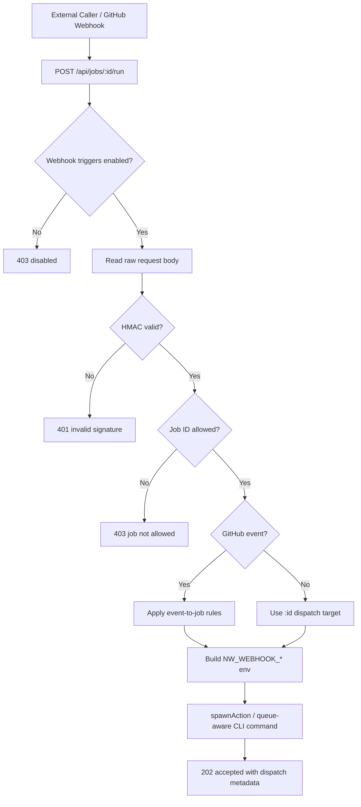
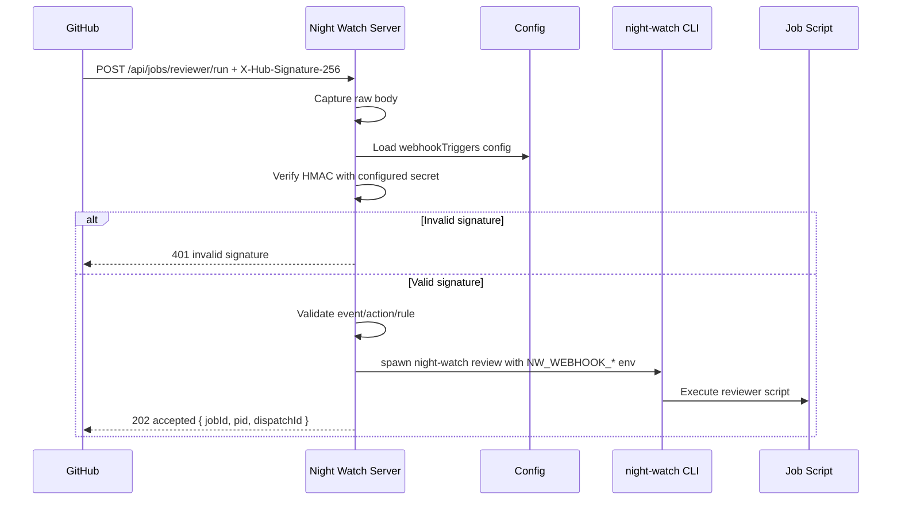

# PRD: Webhook Trigger

**Complexity: 7 → HIGH mode**

---

## 1. Context

**Problem:** Night Watch jobs can be started by cron or manual UI/CLI actions, but external systems cannot dispatch a specific job through a stable authenticated HTTP endpoint. GitHub Actions, repository webhooks, release automation, and third-party schedulers all need a secure way to say "run this job now" without shelling into the host.

**Files Analyzed:**

- `packages/server/src/routes/action.routes.ts` — existing manual action endpoints and job spawning helper
- `packages/server/src/routes/index.ts` — API route registration
- `packages/server/src/index.ts` — Express app bootstrap and middleware setup
- `packages/core/src/jobs/job-registry.ts` — registered job IDs, CLI commands, lock suffixes, queue priorities
- `packages/core/src/types.ts` — `JobType`, `INightWatchConfig`, webhook and notification types
- `packages/cli/src/commands/serve.ts` — server command and runtime options
- `packages/cli/src/commands/shared/env-builder.ts` — existing `NW_*` env construction patterns
- `packages/server/src/__tests__/server/actions.test.ts` — coverage pattern for action route behavior
- `web/api.ts` — frontend API client and project-scoped API path conventions
- `docs/integrations/integrations.md` — existing webhook and GitHub Actions integration documentation

**Current Behavior:**

- UI actions POST to `/api/actions/run`, `/api/actions/review`, and registry-driven action routes
- Global mode scopes actions under `/api/projects/:id/actions/*`
- `spawnAction()` shells out to `night-watch <command>` in detached mode and returns `{ started, pid }`
- Manual UI triggers bypass the global queue by setting `NW_QUEUE_ENABLED=0`
- No `/api/jobs/:id/run` route exists
- No inbound webhook HMAC verification exists
- No GitHub webhook event parser maps `workflow_run`, `check_suite`, `pull_request`, or `repository_dispatch` payloads to Night Watch jobs
- External callers must use ad hoc shell access, cron edits, or the UI server without a request-signing contract

**Integration Points Checklist:**

```markdown
**How will this feature be reached?**

- [x] Entry point: new `POST /api/jobs/:id/run` route in the existing server
- [x] Caller: external webhook clients, GitHub webhooks, GitHub Actions, and internal UI/API clients
- [x] Registration: route registered alongside existing action routes and project-scoped global routes
- [x] Config: new `webhookTriggers` section in `INightWatchConfig`

**Is this user-facing?**

- [x] YES → Settings page gains inbound webhook trigger configuration
- [x] YES → Integrations docs include GitHub webhook setup and HMAC examples
- [x] YES → API responses return dispatch IDs, job IDs, and rejection reasons

**Full user flow:**

1. User enables webhook triggers and stores a signing secret in Settings
2. User configures a GitHub webhook for `workflow_run` failures
3. GitHub POSTs to `/api/jobs/reviewer/run` with `X-Hub-Signature-256`
4. Server verifies HMAC, validates event rules, and maps payload to `night-watch review`
5. Job is spawned or queued, and response returns `{ accepted: true, jobId: "reviewer", pid }`
6. Invalid signatures return `401` without starting a job
```

---

## 2. Solution

**Approach:**

- Add a registry-backed job dispatch endpoint: `POST /api/jobs/:id/run`, where `:id` is a `JobType` from `JOB_REGISTRY`.
- Verify inbound requests with HMAC before parsing job intent. Support Night Watch native signatures (`X-Night-Watch-Signature: sha256=<hex>`) and GitHub signatures (`X-Hub-Signature-256: sha256=<hex>`).
- Introduce `IWebhookTriggerConfig` with `enabled`, `secretEnv`, `allowedJobIds`, `github.enabled`, `github.events`, and optional event-to-job rules.
- Reuse the existing `spawnAction()` flow after verification so locks, project scoping, CLI invocation, and SSE behavior remain consistent.
- Add a GitHub webhook adapter that validates event type, extracts repository/PR/check metadata, and optionally passes context to the child process via `NW_WEBHOOK_*` env vars.
- Preserve manual UI routes. The new endpoint is for signed external dispatch and should default to queue-aware execution unless the rule explicitly bypasses the queue.

**Architecture Diagram:**



**Key Decisions:**

- Route uses `jobs/:id/run` instead of overloading `/api/actions/*` so external dispatch has a clean contract and separate auth behavior.
- HMAC verification uses the raw body with `crypto.timingSafeEqual`; JSON parsing happens only after verification.
- GitHub compatibility supports `X-Hub-Signature-256` first-class instead of requiring a custom proxy.
- Job IDs come from `JOB_REGISTRY`; no parallel hard-coded list.
- Default `allowedJobIds` excludes destructive or administrative commands. Runtime jobs only: executor, reviewer, qa, audit, planner/slicer, pr-resolver, merger, analytics.
- External dispatch should not set `NW_QUEUE_ENABLED=0` by default. Webhook-triggered jobs should participate in global queue coordination.
- Response status is `202` for accepted asynchronous dispatch, `400` for malformed payloads, `401` for signature failures, `403` for disabled/disallowed dispatch, and `409` for active per-project locks.

**Data Changes:**

New config shape in `INightWatchConfig`:

```typescript
interface IWebhookTriggerConfig {
  enabled: boolean;
  secretEnv: string; // default: "NIGHT_WATCH_WEBHOOK_SECRET"
  allowedJobIds: JobType[];
  requireTimestamp: boolean;
  maxSkewSeconds: number;
  github: {
    enabled: boolean;
    events: string[];
    rules: Array<{
      event: string;
      action?: string;
      jobId: JobType;
      branchPatterns?: string[];
      onlyOnFailure?: boolean;
    }>;
  };
}
```

No required SQLite migration in Phase 1. Optional dispatch audit history can reuse `job_runs.metadata_json` or be added later if traceability needs grow.

---

## 3. Sequence Flow



---

## 4. Execution Phases

### Phase 1: Config, Types & Secret Loading

**User-visible outcome:** `night-watch serve` can reject inbound job webhook calls when webhook triggers are disabled or missing a secret.

**Files (4):**

- `packages/core/src/types.ts` — add `IWebhookTriggerConfig` and `webhookTriggers` to `INightWatchConfig`
- `packages/core/src/constants.ts` — add default webhook trigger config
- `packages/core/src/config.ts` — merge and validate webhook trigger config
- `templates/night-watch.config.json` — document disabled-by-default config

**Implementation:**

- [ ] Add `IWebhookTriggerConfig` with disabled default
- [ ] Add defaults: `enabled: false`, `secretEnv: "NIGHT_WATCH_WEBHOOK_SECRET"`, `requireTimestamp: false`, `maxSkewSeconds: 300`
- [ ] Validate `allowedJobIds` against `JOB_REGISTRY`
- [ ] Validate GitHub rule `jobId` values against `JOB_REGISTRY`
- [ ] Reject enabled config when `secretEnv` is empty

**Tests Required:**

| Test File                                    | Test Name                                     | Assertion                                     |
| -------------------------------------------- | --------------------------------------------- | --------------------------------------------- |
| `packages/core/src/__tests__/config.test.ts` | `should default webhook triggers to disabled` | `config.webhookTriggers.enabled === false`    |
| `packages/core/src/__tests__/config.test.ts` | `should reject invalid webhook job ids`       | invalid job id is removed or validation fails |

**Verification Plan:**

1. Unit tests pass
2. `yarn verify` passes

---

### Phase 2: Signed Job Dispatch Route

**User-visible outcome:** A signed `POST /api/jobs/:id/run` starts an allowed job and returns `202`.

**Files (4):**

- `packages/server/src/routes/job.routes.ts` — new signed dispatch route
- `packages/server/src/routes/index.ts` — register job routes in single-project and global modes
- `packages/server/src/routes/action.routes.ts` — extract reusable spawn helper if needed
- `packages/server/src/__tests__/server/jobs.test.ts` — route tests

**Implementation:**

- [ ] Add raw-body middleware for `/api/jobs/*` before JSON parsing affects signature verification
- [ ] Implement `verifyHmacSignature(rawBody, header, secret)` with `crypto.createHmac("sha256", secret)`
- [ ] Accept `X-Night-Watch-Signature` and `X-Hub-Signature-256` formats
- [ ] Add `POST /api/jobs/:id/run` route
- [ ] Resolve `:id` via `JOB_REGISTRY`
- [ ] Reject disabled config, unknown jobs, disallowed jobs, invalid signatures, and locked jobs
- [ ] Spawn the matching CLI command and return `{ accepted: true, jobId, pid, dispatchId }`

**Tests Required:**

| Test File                                           | Test Name                             | Assertion                                |
| --------------------------------------------------- | ------------------------------------- | ---------------------------------------- |
| `packages/server/src/__tests__/server/jobs.test.ts` | `should reject unsigned job dispatch` | response status is `401`                 |
| `packages/server/src/__tests__/server/jobs.test.ts` | `should dispatch signed allowed job`  | `spawn` called with matching CLI command |
| `packages/server/src/__tests__/server/jobs.test.ts` | `should reject disallowed job id`     | response status is `403`                 |

**Verification Plan:**

1. Server tests pass
2. Manual signed curl starts a dry-run-safe job in a fixture project

---

### Phase 3: GitHub Webhook Adapter

**User-visible outcome:** GitHub webhooks can trigger a configured Night Watch job when an event rule matches.

**Files (3):**

- `packages/server/src/routes/job.routes.ts` — GitHub header parsing and rule matching
- `packages/server/src/__tests__/server/jobs-github.test.ts` — GitHub signature and event tests
- `docs/integrations/integrations.md` — GitHub webhook setup guide

**Implementation:**

- [ ] Read `X-GitHub-Event`, `X-GitHub-Delivery`, and `X-Hub-Signature-256`
- [ ] Match configured GitHub rules by event, action, branch pattern, and failure status
- [ ] Support initial events: `workflow_run`, `check_suite`, `pull_request`, `repository_dispatch`
- [ ] Populate `NW_WEBHOOK_SOURCE=github`, `NW_WEBHOOK_EVENT`, `NW_WEBHOOK_DELIVERY`, `NW_WEBHOOK_PR_NUMBER`, and `NW_WEBHOOK_BRANCH`
- [ ] Return `202 ignored` for valid signatures with no matching rule

**Tests Required:**

| Test File                                                  | Test Name                               | Assertion                           |
| ---------------------------------------------------------- | --------------------------------------- | ----------------------------------- |
| `packages/server/src/__tests__/server/jobs-github.test.ts` | `should accept GitHub sha256 signature` | response status is `202`            |
| `packages/server/src/__tests__/server/jobs-github.test.ts` | `should ignore unmatched GitHub event`  | response body has `accepted: false` |

**Verification Plan:**

1. GitHub webhook fixture tests pass
2. Test delivery from GitHub UI succeeds and returns accepted/ignored result

---

### Phase 4: Settings UI & Docs

**User-visible outcome:** Users can configure inbound webhook triggers without hand-editing JSON.

**Files (4):**

- `web/pages/settings/IntegrationsTab.tsx` — add inbound webhook trigger section
- `web/api.ts` — mirror webhook trigger config types if needed
- `web/components/settings/WebhookEditor.tsx` — reuse or extend for inbound trigger rules
- `docs/integrations/integrations.md` — add signed curl and GitHub webhook examples

**Implementation:**

- [ ] Add enable switch, secret env name input, allowed job selector, and GitHub event rule editor
- [ ] Display the endpoint URL for single-project and global-project modes
- [ ] Add copyable curl example using `openssl dgst -sha256 -hmac`
- [ ] Add GitHub setup steps for repository webhook secret and selected events

**Tests Required:**

| Test File                                               | Test Name                                        | Assertion                               |
| ------------------------------------------------------- | ------------------------------------------------ | --------------------------------------- |
| `web/pages/settings/__tests__/IntegrationsTab.test.tsx` | `should render inbound webhook trigger settings` | form contains `webhookTriggers.enabled` |

**Verification Plan:**

1. `yarn verify` passes
2. Settings save/load preserves webhook trigger rules

---

## 5. Acceptance Criteria

- [ ] `POST /api/jobs/:id/run` exists for single-project and global-project API paths
- [ ] Requests without valid HMAC signatures cannot start jobs
- [ ] GitHub `X-Hub-Signature-256` verification works against the raw body
- [ ] Unknown or disallowed job IDs return clear 4xx responses
- [ ] Accepted requests spawn the matching Night Watch CLI job
- [ ] GitHub webhook events can be mapped to configured jobs
- [ ] Settings UI exposes inbound webhook trigger configuration
- [ ] Integration docs include signed curl and GitHub webhook examples
- [ ] `yarn verify` passes
