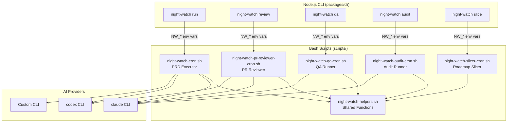
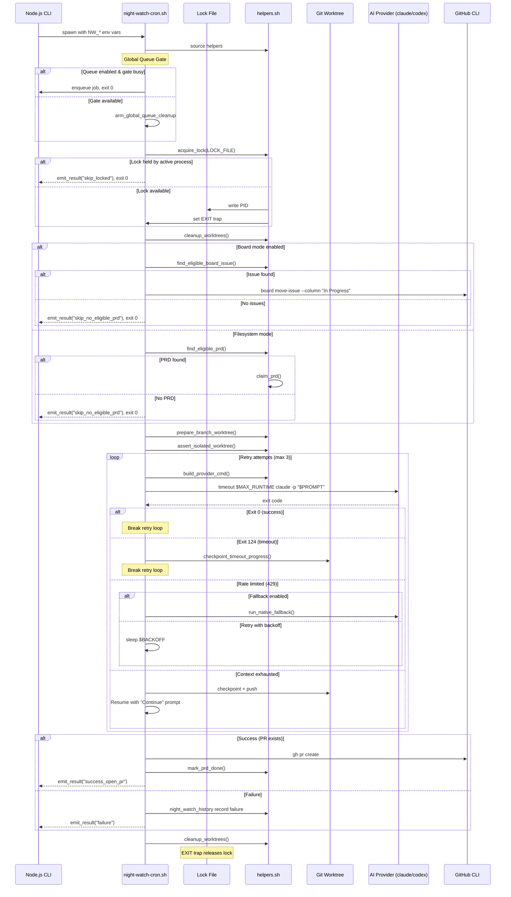
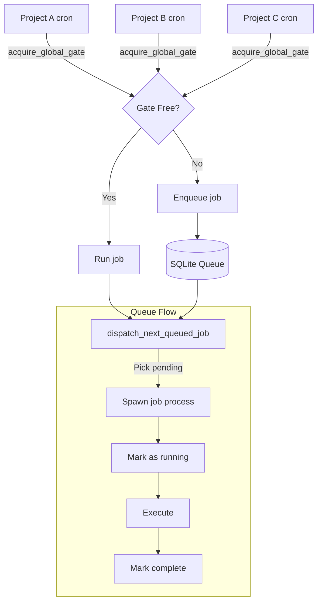

# Bash Scripts Architecture

> Related: [Architecture Overview](../architecture/architecture-overview.md) | [Commands Reference](commands.md) | [Configuration](configuration.md)

Night Watch's core execution layer is implemented in Bash scripts. These scripts handle process management, git operations, lock files, and provider invocation. The Node.js CLI is a thin wrapper that configures environment variables and spawns these scripts.

---

## Overview



---

## Script Inventory

| Script                            | Purpose                         | Lock File                                     | Typical Runtime |
| --------------------------------- | ------------------------------- | --------------------------------------------- | --------------- |
| `night-watch-cron.sh`             | PRD executor — implements PRDs  | `/tmp/night-watch-{project}.lock`             | 2-4 hours       |
| `night-watch-pr-reviewer-cron.sh` | PR reviewer — fixes failing PRs | `/tmp/night-watch-pr-reviewer-{project}.lock` | 30-60 min       |
| `night-watch-qa-cron.sh`          | QA runner — generates tests     | `/tmp/night-watch-qa-{project}.lock`          | 30-60 min       |
| `night-watch-audit-cron.sh`       | Code audit runner               | `/tmp/night-watch-audit-{project}.lock`       | 15-30 min       |
| `night-watch-slicer-cron.sh`      | Roadmap → PRD slicer            | `/tmp/night-watch-slicer-{project}.lock`      | 10-20 min       |
| `night-watch-helpers.sh`          | Shared functions (sourced)      | —                                             | —               |

---

## Execution Flow: PRD Executor



---

## Key Helper Functions

### Lock Management

```bash
# Acquire a PID-based lock file
acquire_lock() {
  local lock_file="${1:?lock_file required}"
  # Returns 0 if acquired, 1 if held by another process
  # Auto-cleans stale locks from dead processes
}

# Append a command to the EXIT trap
append_exit_trap() {
  local command="${1:?command required}"
  # Ensures cleanup runs even on failure
}
```

### PRD Discovery

```bash
# Find the next eligible PRD (filesystem mode)
find_eligible_prd() {
  local prd_dir="${1:?}"
  local max_runtime="${2:-7200}"
  local project_dir="${3:-}"
  # Returns: first eligible PRD filename, or empty string
  # Skips: claimed, in-cooldown, has-open-PR, unmet-dependencies
}

# Find next eligible board issue (board mode)
find_eligible_board_issue() {
  local project_dir="${1:-}"
  local max_runtime="${2:-7200}"
  # Returns: JSON of eligible issue, or empty string
}
```

### Worktree Management

```bash
# Create a branch worktree for implementation
prepare_branch_worktree() {
  local project_dir="${1:?}"
  local worktree_dir="${2:?}"
  local branch_name="${3:?}"
  local default_branch="${4:?}"
  local log_file="${5:-}"
  # Creates worktree, handles existing branch/remote
}

# Create a detached worktree (for bookkeeping)
prepare_detached_worktree() {
  local project_dir="${1:?}"
  local worktree_dir="${2:?}"
  local default_branch="${3:?}"
  local log_file="${4:-}"
}

# Clean up leftover worktrees
cleanup_worktrees() {
  local project_dir="${1:?}"
  local scope="${2:-}"  # Optional: narrow cleanup scope
}

# Safety guard: ensure we're in a worktree, not main checkout
assert_isolated_worktree() {
  local project_dir="${1:?}"
  local worktree_dir="${2:?}"
  local context_label="${3:-worktree}"
  # Returns 1 if worktree == project_dir (refuses to run)
}
```

### Provider Invocation

```bash
# Build provider command from NW_PROVIDER_* env vars
build_provider_cmd() {
  local workdir="${1:?}"
  local prompt="${2:?}"
  # Outputs NUL-delimited args for mapfile -d ''
  # Uses: NW_PROVIDER_CMD, NW_PROVIDER_PROMPT_FLAG, etc.
}

# Ensure provider CLI is on PATH
ensure_provider_on_path() {
  local provider="${1:-claude}"
  # Sources nvm, fnm, volta, checks common bin dirs
  # Returns 0 if found, 1 otherwise
}
```

### Rate Limit Handling

```bash
# Check for 429 errors in log
check_rate_limited() {
  local log_file="${1:?}"
  local start_line="${2:-0}"
  # Returns 0 if rate limited, 1 otherwise
}

# Send Telegram warning when fallback triggers
send_rate_limit_fallback_warning() {
  local model="${1:-native Claude}"
  local project_name="${2:-unknown}"
}
```

---

## Environment Variables

The Node.js CLI sets these env vars before spawning bash scripts:

### Core Configuration

| Variable                 | Source                     | Purpose                      |
| ------------------------ | -------------------------- | ---------------------------- |
| `NW_PROVIDER_CMD`        | `config.provider`          | CLI binary (claude, codex)   |
| `NW_PROVIDER_LABEL`      | `config.providerLabel`     | Human-readable label         |
| `NW_MAX_RUNTIME`         | `config.maxRuntime`        | Max execution time (seconds) |
| `NW_SESSION_MAX_RUNTIME` | `config.sessionMaxRuntime` | Per-invocation timeout       |
| `NW_PRD_DIR`             | `config.prdDir`            | PRD directory path           |
| `NW_BRANCH_PREFIX`       | `config.branchPrefix`      | Git branch prefix            |
| `NW_DEFAULT_BRANCH`      | `config.defaultBranch`     | Default git branch           |
| `NW_DRY_RUN`             | `--dry-run` flag           | Skip actual execution        |

### Provider Presets

| Variable                   | Source                 | Purpose                                |
| -------------------------- | ---------------------- | -------------------------------------- |
| `NW_PROVIDER_SUBCOMMAND`   | preset.subcommand      | e.g., "exec" for codex                 |
| `NW_PROVIDER_PROMPT_FLAG`  | preset.promptFlag      | e.g., "-p" for claude                  |
| `NW_PROVIDER_APPROVE_FLAG` | preset.autoApproveFlag | e.g., "--dangerously-skip-permissions" |
| `NW_PROVIDER_WORKDIR_FLAG` | preset.workdirFlag     | e.g., "-C" for codex                   |
| `NW_PROVIDER_MODEL_FLAG`   | preset.modelFlag       | e.g., "--model"                        |
| `NW_PROVIDER_MODEL`        | preset.model           | e.g., "claude-sonnet-4-6"              |

### Rate Limit Fallback

| Variable                       | Source                          | Purpose                  |
| ------------------------------ | ------------------------------- | ------------------------ |
| `NW_FALLBACK_ON_RATE_LIMIT`    | `config.fallbackOnRateLimit`    | Enable fallback          |
| `NW_CLAUDE_PRIMARY_MODEL_ID`   | `config.primaryFallbackModel`   | Primary fallback model   |
| `NW_CLAUDE_SECONDARY_MODEL_ID` | `config.secondaryFallbackModel` | Secondary fallback model |

### Queue System

| Variable              | Source     | Purpose                |
| --------------------- | ---------- | ---------------------- |
| `NW_QUEUE_ENABLED`    | always "1" | Enable global queue    |
| `NW_QUEUE_DISPATCHED` | internal   | Mark as dispatched job |
| `NW_QUEUE_ENTRY_ID`   | internal   | Queue entry ID         |

---

## Global Job Queue

When multiple projects run concurrently, Night Watch uses a global queue to serialize execution:



---

## Result Emission

Scripts communicate outcomes via `NIGHT_WATCH_RESULT:` markers:

```bash
emit_result() {
  local status="${1:?}"
  local details="${2:-}"
  echo "NIGHT_WATCH_RESULT:${status}|${details}"
}
```

| Status                   | Meaning                     |
| ------------------------ | --------------------------- |
| `success_open_pr`        | PRD implemented, PR created |
| `success_already_merged` | PRD already merged          |
| `skip_locked`            | Another run in progress     |
| `skip_no_eligible_prd`   | No work to do               |
| `queued`                 | Job enqueued for later      |
| `timeout`                | Runtime limit exceeded      |
| `rate_limited`           | API quota exhausted         |
| `failure`                | Execution failed            |

---

## Debugging Bash Scripts

### Enable verbose logging

```bash
# Run with debug output
bash -x /path/to/night-watch-cron.sh /your/project
```

### Check logs

```bash
# View executor log
night-watch logs --type run

# Follow in real-time
night-watch logs --follow
```

### Inspect lock files

```bash
# List all Night Watch locks
ls -la /tmp/night-watch-*.lock

# Check lock contents (PID)
cat /tmp/night-watch-your-project.lock

# Check if PID is running
kill -0 <PID> && echo "running" || echo "dead"
```

### Manual cleanup

```bash
# Remove stale locks
rm /tmp/night-watch-*.lock

# Remove stale worktrees
git worktree list
git worktree remove --force /path/to/worktree
```

---

## Adding a New Job Type

To add a new job type (e.g., `night-watch deploy`):

1. **Create the bash script** (`scripts/night-watch-deploy-cron.sh`):

   ```bash
   #!/usr/bin/env bash
   set -euo pipefail

   PROJECT_DIR="${1:?Usage: $0 /path/to/project}"
   # ... source helpers, acquire lock, etc.
   ```

2. **Add CLI command** (`packages/cli/src/commands/deploy.ts`):

   ```typescript
   import { getScriptPath, executeScriptWithOutput } from '@night-watch/core';

   // Build env vars, spawn script
   ```

3. **Wire into queue system**:
   - Add `deploy` to job type union
   - Add queue handling in script

4. **Add to install command**:
   - Add `--deploy-schedule` option
   - Add crontab entry generation
