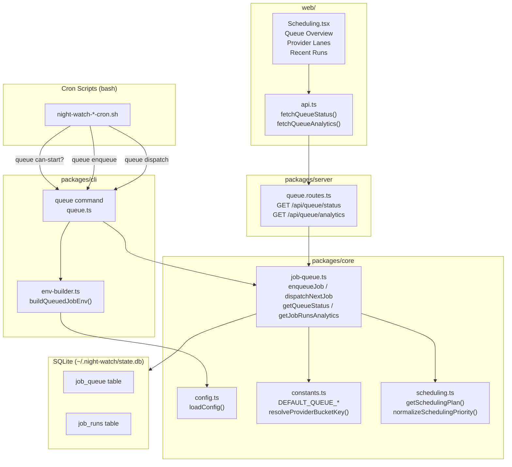
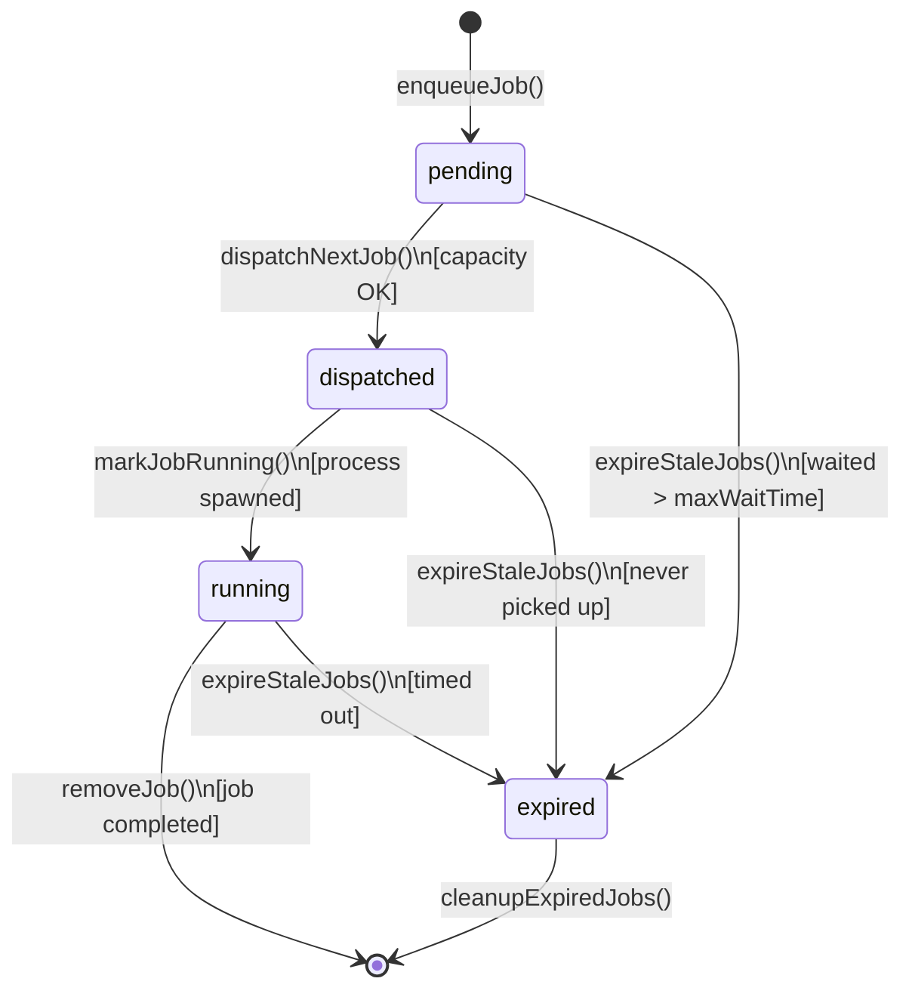
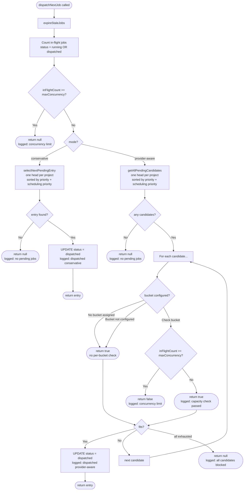
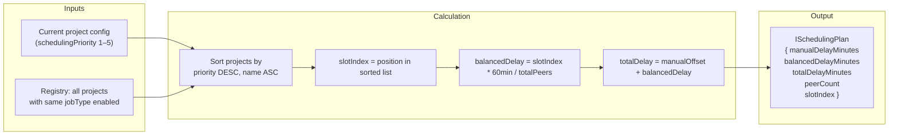
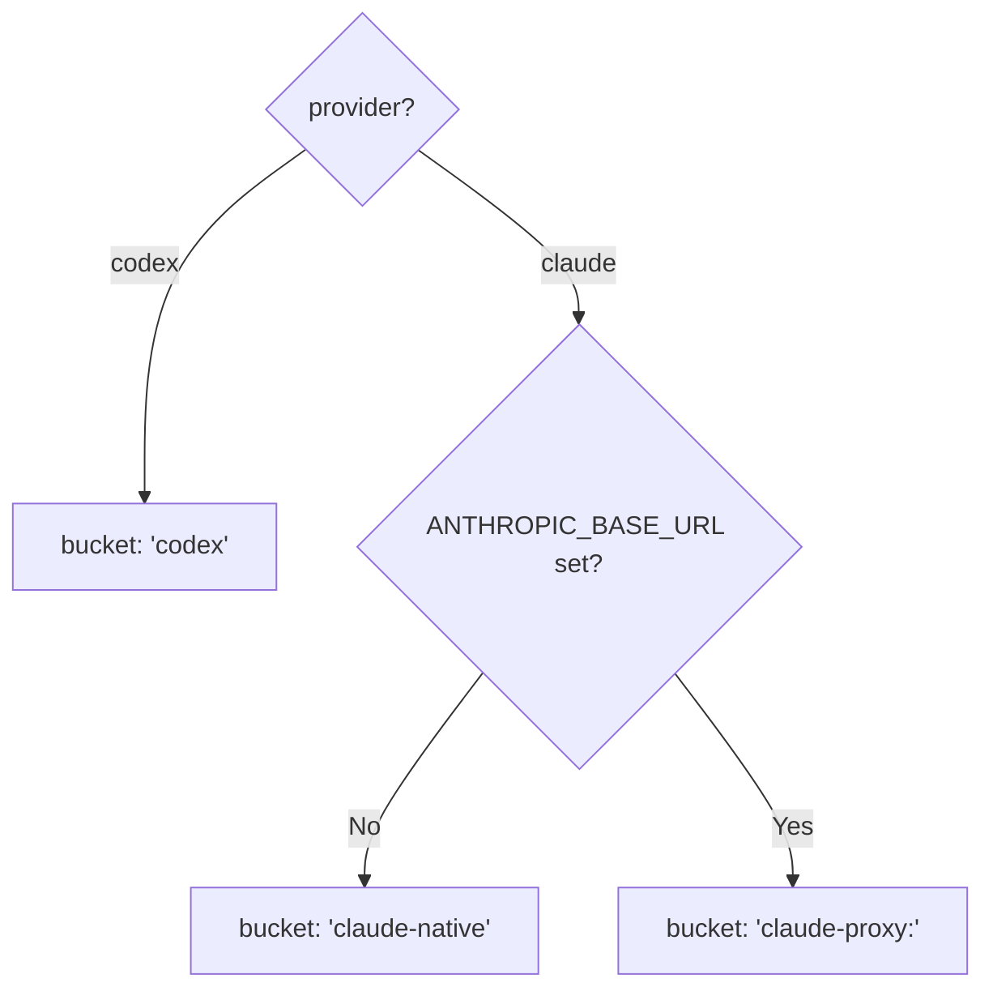
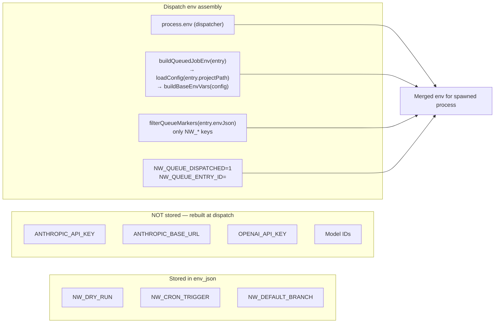

# Scheduler Architecture

The global job queue prevents API rate-limiting and coordinates concurrent execution across multiple Night Watch projects. It supports two dispatch modes: **conservative** (serial, default) and **provider-aware** (parallel with capacity budgets).

---

## Component Overview

---

## Job Lifecycle

---

## Dispatch Flow

---

## Cross-Project Cron Balancing

When multiple projects share the same job type and cron schedule, `getSchedulingPlan()` staggers their start times to avoid simultaneous execution.

**Example** — 3 projects, executor at same cron:

| Project | Priority | slotIndex | balancedDelay |
|---------|----------|-----------|---------------|
| alpha   | 5        | 0         | 0 min         |
| beta    | 3        | 1         | 20 min        |
| gamma   | 1        | 2         | 40 min        |

---

## Database Schema

### `job_queue`

| Column            | Type    | Description                                          |
|-------------------|---------|------------------------------------------------------|
| `id`              | INTEGER | Auto-increment primary key                           |
| `project_path`    | TEXT    | Absolute path to project directory                   |
| `project_name`    | TEXT    | Human-readable project name                          |
| `job_type`        | TEXT    | `executor` \| `reviewer` \| `qa` \| `audit` \| `slicer` |
| `priority`        | INTEGER | Higher = dispatched first (default: executor=50)     |
| `status`          | TEXT    | `pending` → `dispatched` → `running` → (deleted) or `expired` |
| `env_json`        | TEXT    | Persisted NW_* runtime markers (NOT provider keys)   |
| `enqueued_at`     | INTEGER | Unix timestamp of enqueue                            |
| `dispatched_at`   | INTEGER | Unix timestamp of dispatch (nullable)                |
| `expired_at`      | INTEGER | Unix timestamp of expiry (nullable)                  |
| `provider_key`    | TEXT    | Provider bucket key e.g. `claude-native`, `codex`    |

Index: `(status, priority DESC, enqueued_at ASC)` — optimises dispatch query.

### `job_runs`

Telemetry table for analytics and UI charts. Written at job completion.

| Column           | Type    | Description                                           |
|------------------|---------|-------------------------------------------------------|
| `id`             | INTEGER | Auto-increment primary key                            |
| `project_path`   | TEXT    | Project directory                                     |
| `job_type`       | TEXT    | Job type                                              |
| `provider_key`   | TEXT    | Provider bucket key                                   |
| `queue_entry_id` | INTEGER | FK to `job_queue.id` (nullable if not queued)         |
| `status`         | TEXT    | `queued` \| `running` \| `success` \| `failure` \| `timeout` \| `rate_limited` \| `skipped` |
| `queued_at`      | INTEGER | When enqueued (nullable)                              |
| `started_at`     | INTEGER | When execution started                                |
| `finished_at`    | INTEGER | When execution finished (nullable)                    |
| `wait_seconds`   | INTEGER | Seconds from enqueue to start (nullable)              |
| `duration_seconds`| INTEGER | Execution duration in seconds (nullable)              |
| `throttled_count`| INTEGER | How many times this run was throttled                 |
| `metadata_json`  | TEXT    | Arbitrary JSON metadata                               |

Index: `(project_path, started_at DESC, job_type, provider_key)` — optimises analytics queries.

---

## Provider Bucket Resolution

Provider buckets isolate throttle domains so different API backends don't compete:

---

## Default Job Priorities

| Job Type  | Priority |
|-----------|----------|
| executor  | 50       |
| reviewer  | 40       |
| slicer    | 30       |
| qa        | 20       |
| audit     | 10       |

---

## Environment Variable Handling at Dispatch

A critical security/correctness invariant: provider identity is **never** stored in the queue.

This ensures multi-provider setups always run each job with its own project's provider config, regardless of which project triggered the dispatch.

---

## Key File Locations

| File | Purpose |
|------|---------|
| `packages/core/src/utils/job-queue.ts` | Core queue operations (enqueue, dispatch, expire, analytics) |
| `packages/core/src/utils/scheduling.ts` | Cross-project cron balancing (`getSchedulingPlan`) |
| `packages/core/src/types.ts` | `IQueueConfig`, `IQueueEntry`, `IQueueStatus`, `IJobRunAnalytics` |
| `packages/core/src/constants.ts` | Defaults, weights, `resolveProviderBucketKey` |
| `packages/core/src/config.ts` | `loadConfig`, `mergeConfigLayer` (deep-merges queue config) |
| `packages/core/src/storage/sqlite/migrations.ts` | `job_queue` and `job_runs` table DDL |
| `packages/cli/src/commands/queue.ts` | CLI subcommands (status, dispatch, enqueue, clear, expire) |
| `packages/cli/src/commands/shared/env-builder.ts` | `buildQueuedJobEnv` — env reconstruction at dispatch |
| `packages/server/src/routes/queue.routes.ts` | `GET /api/queue/status`, `GET /api/queue/analytics` |
| `web/pages/Scheduling.tsx` | Scheduling UI (overview cards, provider lanes, recent runs) |
| `docs/prds/provider-aware-weighted-scheduling.md` | Original design PRD |
