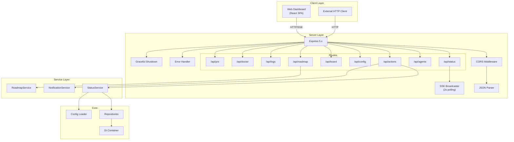
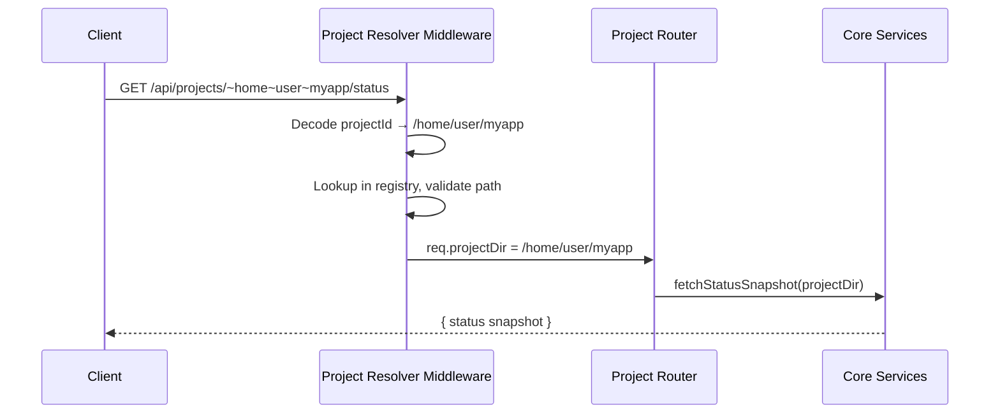
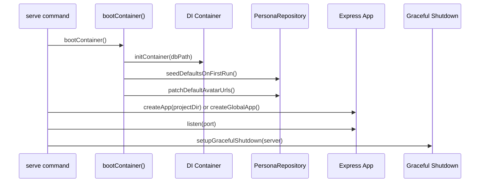

# Server & REST API (`@night-watch/server`)

The server package provides an Express REST API with SSE for real-time updates. It serves the web dashboard and supports both single-project and multi-project modes.

> Related: [Architecture Overview](architecture-overview.md) | [Core Package](core-package.md) | [CLI Package](cli-package.md) | [Web UI](WEB-UI.md)

---

## Architecture



---

## Server Modes

### Single-Project Mode

```bash
night-watch serve              # localhost:7575
night-watch serve -p 8080     # custom port
```

All API endpoints operate on the project in the current directory.

### Multi-Project Mode (Global)

```bash
night-watch serve --global     # serves all registered projects
```

Endpoints are scoped per project:

- `GET /api/projects` — List all registered projects
- `GET /api/projects/:projectId/status` — Status for a specific project
- `POST /api/projects/:projectId/actions/run` — Run executor for a project

The `:projectId` is the project path with `/` replaced by `~` (URL-encoded).



---

## API Endpoints

### Status

| Method | Path                 | Purpose                         |
| ------ | -------------------- | ------------------------------- |
| `GET`  | `/api/status`        | Current project status snapshot |
| `GET`  | `/api/status/events` | SSE stream (real-time updates)  |
| `GET`  | `/api/schedule-info` | Cron schedule info              |

#### SSE Stream

Connect to `/api/status/events` to receive real-time status updates:

```
event: status_changed
data: {"executor":{"running":false},"reviewer":{"running":false},"prds":{"pending":3,"done":12},...}
```

The server polls every 2 seconds and broadcasts `status_changed` events when the snapshot differs from the previous one.

### Agents (Personas)

| Method   | Path                        | Purpose                            |
| -------- | --------------------------- | ---------------------------------- |
| `GET`    | `/api/agents`               | List all personas (secrets masked) |
| `GET`    | `/api/agents/:id`           | Get persona by ID                  |
| `GET`    | `/api/agents/:id/prompt`    | Compile persona system prompt      |
| `POST`   | `/api/agents`               | Create new persona                 |
| `PUT`    | `/api/agents/:id`           | Update persona fields              |
| `DELETE` | `/api/agents/:id`           | Delete persona                     |
| `POST`   | `/api/agents/:id/avatar`    | Update avatar URL                  |
| `POST`   | `/api/agents/seed-defaults` | Seed default personas              |

Model config secrets (`envVars`) are masked with `***` before returning.

### Actions

| Method | Path                          | Purpose                        |
| ------ | ----------------------------- | ------------------------------ |
| `POST` | `/api/actions/run`            | Spawn PRD executor             |
| `POST` | `/api/actions/review`         | Spawn PR reviewer              |
| `POST` | `/api/actions/cancel`         | Cancel running process         |
| `POST` | `/api/actions/retry`          | Move PRD from done/ to pending |
| `POST` | `/api/actions/clear-lock`     | Clear stale lock file          |
| `POST` | `/api/actions/install-cron`   | Install crontab entries        |
| `POST` | `/api/actions/uninstall-cron` | Remove crontab entries         |

Actions that spawn processes use `child_process.spawn` in detached mode with `unref()`. A lock file prevents concurrent run/review.

### Configuration

| Method | Path          | Purpose                   |
| ------ | ------------- | ------------------------- |
| `GET`  | `/api/config` | Fetch current config      |
| `PUT`  | `/api/config` | Update config (validated) |

Config updates are validated for:

- Provider: must be `'claude'` or `'codex'`
- Runtimes: >= 60 seconds
- Review score: 0-100
- Webhook URLs: validated per type
- Cron expressions: non-empty strings

### Board (GitHub Projects)

| Method   | Path                                | Purpose                                  |
| -------- | ----------------------------------- | ---------------------------------------- |
| `GET`    | `/api/board/status`                 | All issues grouped by column (60s cache) |
| `GET`    | `/api/board/issues`                 | List all issues                          |
| `POST`   | `/api/board/issues`                 | Create new issue                         |
| `PATCH`  | `/api/board/issues/:number/move`    | Move issue to column                     |
| `POST`   | `/api/board/issues/:number/comment` | Add comment                              |
| `DELETE` | `/api/board/issues/:number`         | Close/delete issue                       |

Board columns: Draft, Ready, In Progress, Review, Done.

### Roadmap

| Method | Path                  | Purpose                                      |
| ------ | --------------------- | -------------------------------------------- |
| `GET`  | `/api/roadmap`        | Roadmap status (pending/claimed/done counts) |
| `POST` | `/api/roadmap/scan`   | Scan roadmap + slice next item               |
| `PUT`  | `/api/roadmap/toggle` | Enable/disable roadmap scanner               |

### Logs

| Method | Path              | Purpose                    |
| ------ | ----------------- | -------------------------- |
| `GET`  | `/api/logs/:name` | Last N lines from log file |

Query: `?lines=200` (default 200, max 10000). Valid names: `executor`, `reviewer`, `qa`.

### Doctor (Health Check)

| Method | Path          | Purpose                       |
| ------ | ------------- | ----------------------------- |
| `GET`  | `/api/doctor` | Run environment health checks |

Returns an array of check results with `status: 'pass' | 'fail' | 'warn'`.

### Pull Requests

| Method | Path       | Purpose                                |
| ------ | ---------- | -------------------------------------- |
| `GET`  | `/api/prs` | List open PRs matching branch patterns |

---

## Middleware Stack

Request processing order:

```
CORS → JSON Parser → Route Handler → Error Handler
```

### Error Handler

All uncaught errors return `{ error: message }` with status 500.

### Graceful Shutdown

Handles SIGTERM/SIGINT with timeouts:

- Pre-shutdown cleanup: 5 seconds
- Connection drain: 12 seconds
- Closes idle connections and destroys active sockets

### Project Resolver (Global Mode)

Decodes `:projectId`, looks up the project in the registry, validates the path and config file exist, attaches `req.projectDir` and `req.projectConfig`.

### SSE Status Watcher

Background interval that polls `fetchStatusSnapshot()` every 2 seconds and broadcasts to all connected SSE clients.

---

## Static File Serving

The server serves the web UI from `dist/web/`:

1. Bundled mode: checks `dist/web/index.html` relative to server
2. Dev mode: traverses up to find `turbo.json`, then serves `web/dist/`
3. SPA fallback: all non-`/api/*` requests serve `index.html`

---

## Services

### StatusService

Injectable service that aggregates status data:

- Process status (executor/reviewer PIDs, lock files)
- PRD counts (pending, claimed, done)
- PR counts (open, needs work)
- Log info (file size, last lines)
- Crontab info (installed entries)

### NotificationService

Formats and sends webhook notifications to Slack, Discord, and Telegram. Supports events: `run_started`, `run_succeeded`, `run_failed`, `run_timeout`, `review_completed`, `pr_auto_merged`, `qa_completed`.

### RoadmapService

Manages roadmap scanning, item slicing, and scanner toggle.

---

## Boot Sequence



---

## Status Codes

| Code  | Usage                              |
| ----- | ---------------------------------- |
| `200` | Success                            |
| `201` | Created (new persona, issue)       |
| `204` | No Content (delete)                |
| `400` | Validation failure                 |
| `404` | Not found (persona, project, log)  |
| `409` | Conflict (process already running) |
| `410` | Gone (deprecated PRD endpoints)    |
| `500` | Server error                       |

---

## Related Docs

- [Web UI](WEB-UI.md) — The React SPA that consumes this API
- [Architecture Overview](architecture-overview.md) — High-level system diagrams
- [Core Package](core-package.md) — Services and repositories used by the server
- [CLI Package](cli-package.md) — The `serve` command that starts the server
- [Configuration](configuration.md) — Config validation rules
