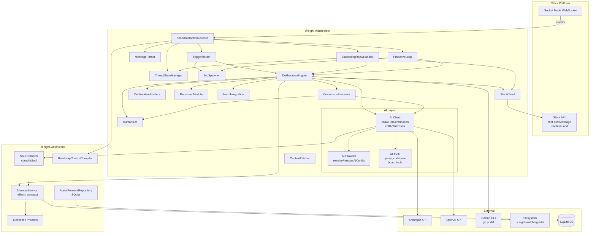
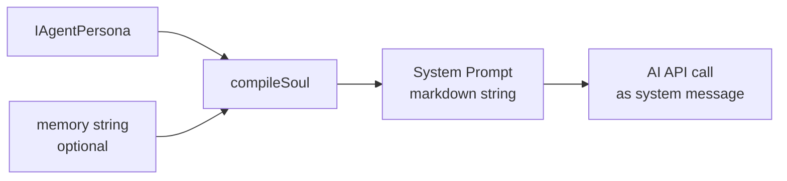
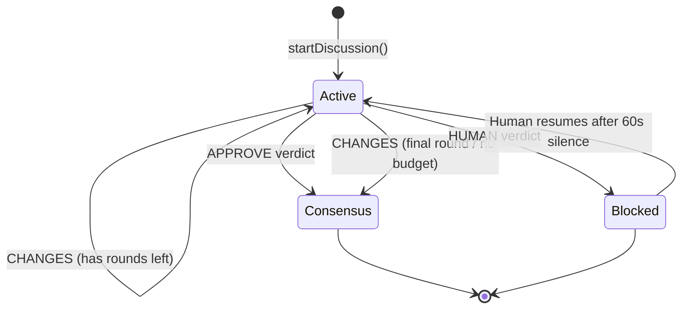
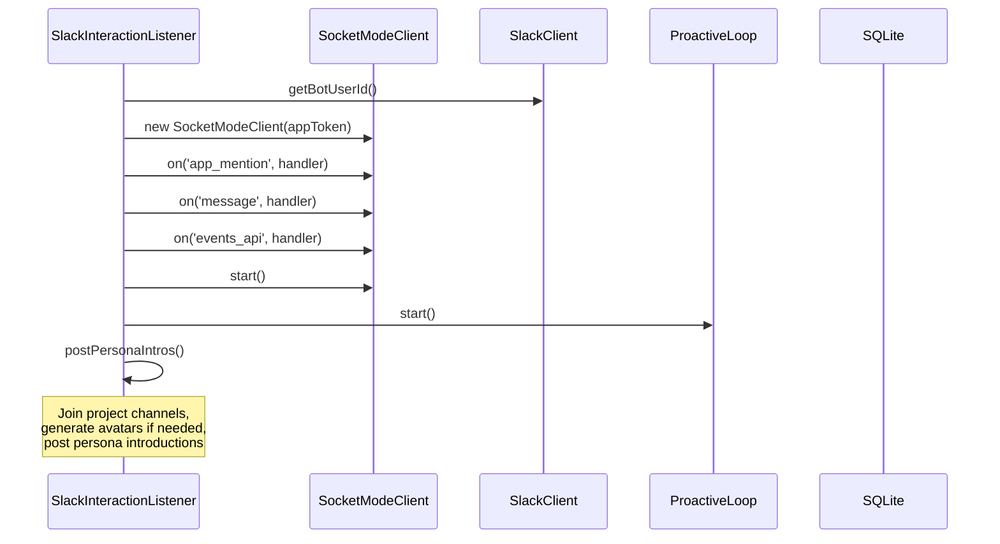
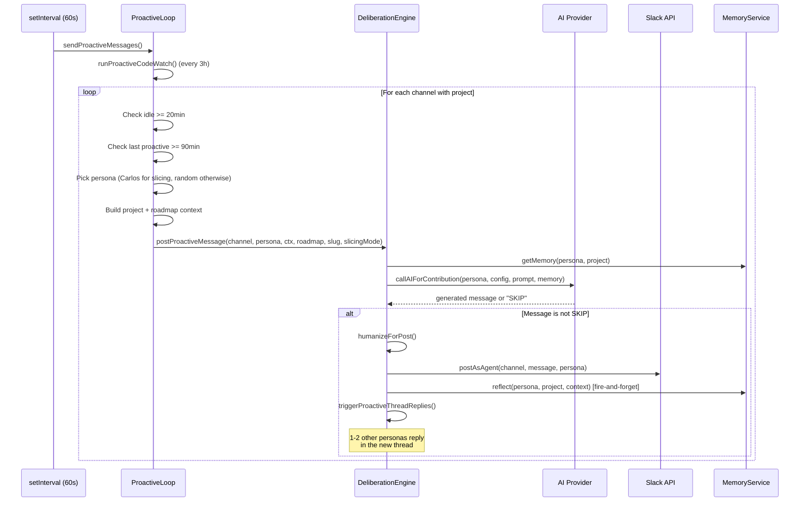
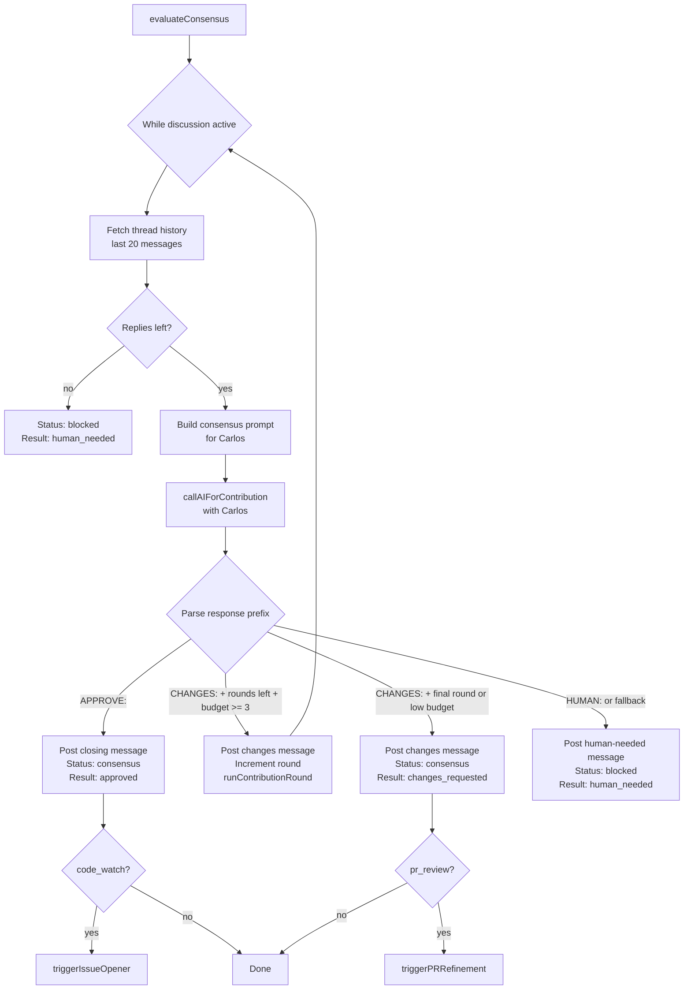
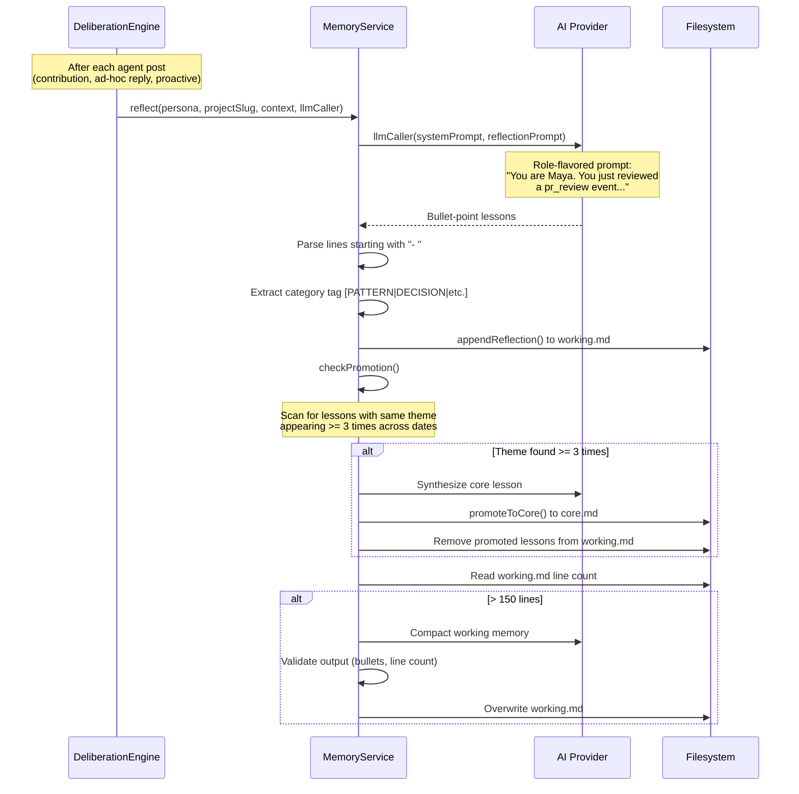
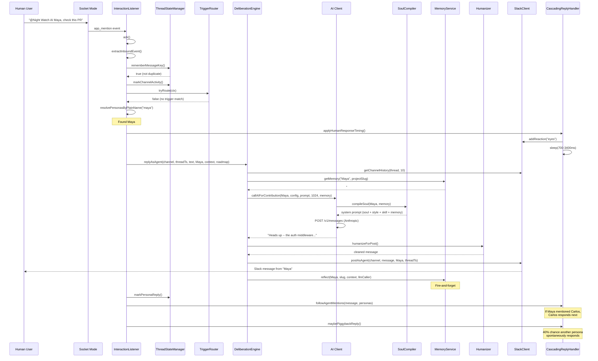
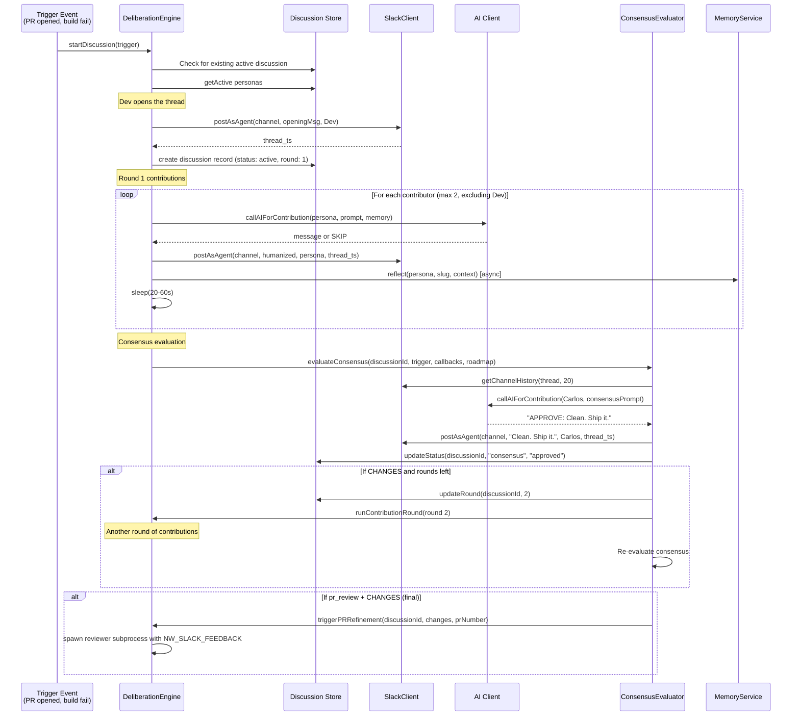

# Night Watch Slack Agent System -- Architecture Documentation

> Generated: 2026-02-21
> Last updated: 2026-02-21
> Scope: Multi-agent Slack bot architecture within the Night Watch CLI monorepo
> Status: Living document -- reflects current `main` branch state

---

## Table of Contents

1. [High-Level Overview](#high-level-overview)
2. [System Architecture Diagram](#system-architecture-diagram)
3. [Agent Personas](#agent-personas)
4. [Soul Compiler](#soul-compiler)
5. [Deliberation Engine](#deliberation-engine)
6. [Interaction Listener](#interaction-listener)
7. [Proactive Loop](#proactive-loop)
8. [Cascading Reply Handler](#cascading-reply-handler)
9. [Consensus Evaluator](#consensus-evaluator)
10. [Memory Service](#memory-service)
11. [Roadmap Context Compiler](#roadmap-context-compiler)
12. [AI Client Layer](#ai-client-layer)
13. [Component Responsibility Table](#component-responsibility-table)
14. [Runtime Flows](#runtime-flows)
15. [Glossary](#glossary)
16. [Open Questions and TODOs](#open-questions-and-todos)
17. [File Index](#file-index)

---

## High-Level Overview

The Night Watch Slack Agent System is a multi-agent conversational AI layer built on top of the Night Watch CLI. It deploys four AI personas (Maya, Carlos, Priya, Dev) as Slack teammates who participate in code reviews, proactive observations, issue triage, and ad-hoc conversations. Each persona has a distinct identity (soul), communication style, and domain expertise compiled into system prompts at runtime.

**Core modules (two packages):**

| Package              | Purpose                                                                                                                          |
| -------------------- | -------------------------------------------------------------------------------------------------------------------------------- |
| `@night-watch/core`  | Persona storage, soul compiler, memory service, roadmap context, shared types                                                    |
| `@night-watch/slack` | Slack client, deliberation engine, interaction listener, proactive loop, consensus evaluator, cascading reply handler, AI client |

**Key design principles:**

- Personas are data, not code -- soul/style/skill layers are JSON stored in SQLite
- Memory is persistent and per-persona/per-project -- stored as markdown files on disk
- All AI calls go through a unified `callAIForContribution` function that compiles persona + memory into a system prompt
- Human-like timing (randomized delays, emoji reactions, typing cadence) prevents robotic feel
- Consensus is driven by the lead persona (Carlos) with structured APPROVE/CHANGES/HUMAN decisions

---

## System Architecture Diagram



---

## Agent Personas

### Definition and Storage

Personas are stored in a SQLite `agent_personas` table. Each row contains JSON-serialized soul, style, skill, and modelConfig blobs. The repository is `SqliteAgentPersonaRepository`.

**File:** `/home/joao/projects/night-watch-cli/packages/core/src/storage/repositories/sqlite/agent-persona.repository.ts`

**Schema (logical):**

| Column                   | Type    | Description                                            |
| ------------------------ | ------- | ------------------------------------------------------ |
| `id`                     | UUID    | Primary key                                            |
| `name`                   | string  | Display name (e.g., "Maya")                            |
| `role`                   | string  | Role description (e.g., "Security Reviewer")           |
| `avatar_url`             | string  | URL to avatar image (GitHub CDN or generated)          |
| `soul_json`              | JSON    | IAgentSoul -- identity, worldview, opinions, expertise |
| `style_json`             | JSON    | IAgentStyle -- voice, tone, emoji rules, examples      |
| `skill_json`             | JSON    | IAgentSkill -- modes, interpolation rules              |
| `model_config_json`      | JSON    | IAgentModelConfig -- per-persona AI provider override  |
| `system_prompt_override` | string  | Optional raw system prompt (bypasses soul compiler)    |
| `is_active`              | boolean | Whether the persona participates in discussions        |

### The Four Default Personas

**File:** `/home/joao/projects/night-watch-cli/packages/core/src/storage/repositories/sqlite/agent-persona.defaults.ts`

| Persona    | Role                  | Model             | Domain Focus                                                 |
| ---------- | --------------------- | ----------------- | ------------------------------------------------------------ |
| **Maya**   | Security Reviewer     | claude-sonnet-4-6 | AppSec, pentesting, auth flows, OWASP, cryptography          |
| **Carlos** | Tech Lead / Architect | claude-opus-4-6   | Architecture, systems design, code review, team dynamics     |
| **Priya**  | QA Engineer           | claude-sonnet-4-6 | Testing strategy, edge cases, test automation, accessibility |
| **Dev**    | Implementer           | claude-sonnet-4-6 | Implementation, TypeScript, Node.js, git workflows           |

Note that Carlos uses `claude-opus-4-6` while the other three use `claude-sonnet-4-6`. Each persona has per-model config overrides through `modelConfig`.

### Persona Data Structure (IAgentPersona)

**File:** `/home/joao/projects/night-watch-cli/packages/core/src/shared/types.ts` (lines 211-224)

```
IAgentPersona
  +-- id, name, role, avatarUrl
  +-- soul: IAgentSoul
  |     +-- whoIAm (free-text identity statement)
  |     +-- worldview[] (core beliefs)
  |     +-- opinions{} (domain -> takes[])
  |     +-- expertise[], interests[], tensions[], boundaries[], petPeeves[]
  +-- style: IAgentStyle
  |     +-- voicePrinciples, sentenceStructure, tone
  |     +-- wordsUsed[], wordsAvoided[]
  |     +-- emojiUsage { frequency, favorites[], contextRules }
  |     +-- quickReactions{}, rhetoricalMoves[]
  |     +-- antiPatterns[], goodExamples[], badExamples[]
  +-- skill: IAgentSkill
  |     +-- modes{} (pr_review, incident, proactive)
  |     +-- interpolationRules, additionalInstructions[]
  +-- modelConfig: IAgentModelConfig | null
  +-- systemPromptOverride: string | null
  +-- isActive, createdAt, updatedAt
```

### Persona Resolution

**File:** `/home/joao/projects/night-watch-cli/packages/slack/src/personas.ts`

Persona lookup is name-first, role-keyword-fallback. This means personas can be renamed and the system will still find them by role keywords:

- `findDev()` -- names: ["Dev"], roles: ["implementer", "executor", "developer"]
- `findCarlos()` -- names: ["Carlos"], roles: ["tech lead", "architect", "lead"]
- `findMaya()` -- names: ["Maya"], roles: ["security reviewer", "security"]
- `findPriya()` -- names: ["Priya"], roles: ["qa", "quality assurance", "test"]

`getParticipatingPersonas(triggerType, personas)` selects which personas join a discussion:

| Trigger Type                   | Participants                                             |
| ------------------------------ | -------------------------------------------------------- |
| `pr_review`, `code_watch`      | Dev, Carlos, Maya, Priya (all four)                      |
| `build_failure`, `prd_kickoff` | Dev, Carlos                                              |
| `issue_review`                 | Carlos, Maya, Priya, Dev (all four, lead-first ordering) |
| Default                        | Carlos only                                              |

### Encryption

Model config `envVars` (API keys) are encrypted at rest using AES-256-GCM. The encryption key is stored in the `schema_meta` table. Secrets with value `"***"` in updates are treated as "keep existing" sentinel values.

---

## Soul Compiler

**File:** `/home/joao/projects/night-watch-cli/packages/core/src/agents/soul-compiler.ts`

The soul compiler transforms an `IAgentPersona` into a markdown-formatted system prompt string. It is a pure function with the signature:

```typescript
compileSoul(persona: IAgentPersona, memory?: string): string
```

### Compilation Pipeline

1. **Short-circuit:** If `persona.systemPromptOverride` is set, return it directly
2. **Identity:** `# {name} -- {role}` header, followed by `## Who I Am`
3. **Worldview:** Bullet list of core beliefs
4. **Opinions:** Nested by domain (e.g., `### security`, `### code_quality`)
5. **Tensions & Boundaries:** Internal conflicts and domain boundaries
6. **Voice & Style:** Principles, rhythm, tone, rhetorical moves, quick reactions
7. **Word lists:** Words used / words avoided
8. **Emoji policy:** Frequency, favorites, context rules
9. **Anti-patterns:** Examples of what NOT to sound like (with explanations)
10. **Good examples:** Examples of the persona's authentic voice
11. **"How to Sound Human" section:** Hard-coded rules injected into every persona:
    - Avoid canned chatbot phrases: "great question", "of course", "certainly", etc.
    - Avoid AI filler words: "additionally", "moreover", "pivotal", "crucial", etc.
    - No markdown formatting in Slack, no bullet lists, no headings
    - Match message length to substance — one sentence if that covers it, several if the topic needs depth; never pad, never truncate insight
    - Say concrete things with file paths, not vague observations
12. **Operating Rules:** Never break character, have opinions, tag teammates
13. **Modes:** Skill modes (pr_review, incident, proactive)
14. **Memory injection:** If `memory` string is provided and non-empty, appended at the end. The memory string arrives pre-formatted as `## Core Lessons` + `## Working Memory`



---

## Deliberation Engine

**File:** `/home/joao/projects/night-watch-cli/packages/slack/src/deliberation.ts`

The `DeliberationEngine` is the central orchestrator for all agent interactions in Slack. It manages formal discussions (triggered by events like PR reviews) and ad-hoc replies (triggered by @mentions).

### Core Methods

| Method                                                                | Purpose                                                    |
| --------------------------------------------------------------------- | ---------------------------------------------------------- |
| `startDiscussion(trigger)`                                            | Create a new discussion thread from a trigger event        |
| `contributeAsAgent(discussionId, persona)`                            | Have a specific agent contribute to an existing discussion |
| `handleHumanMessage(channel, threadTs, message, userId)`              | Handle a human message posted in a discussion thread       |
| `replyAsAgent(channel, threadTs, text, persona, ctx, roadmap)`        | Ad-hoc reply outside formal discussions                    |
| `postProactiveMessage(channel, persona, ctx, roadmap, slug, slicing)` | AI-generated proactive observation                         |
| `triggerPRRefinement(discussionId, changes, prNumber)`                | Spawn reviewer process with Slack feedback                 |
| `analyzeCodeCandidate(fileContext, signalSummary, location)`          | Have Dev evaluate whether a scanner finding is worth raising |
| `handleAuditReport(report, projectName, projectPath, channel)`        | Triage audit report, file GitHub issue if warranted, post Slack ping |

### Discussion Lifecycle



### Discussion Data Model (ISlackDiscussion)

| Field             | Type             | Description                                                                    |
| ----------------- | ---------------- | ------------------------------------------------------------------------------ |
| `id`              | string           | UUID                                                                           |
| `projectPath`     | string           | Filesystem path to the project                                                 |
| `triggerType`     | TriggerType      | pr_review, build_failure, prd_kickoff, code_watch, issue_review, slack_message |
| `triggerRef`      | string           | PR number, PRD name, etc.                                                      |
| `channelId`       | string           | Slack channel ID                                                               |
| `threadTs`        | string           | Slack thread timestamp (anchor)                                                |
| `status`          | DiscussionStatus | active, consensus, blocked, closed                                             |
| `round`           | number           | Current deliberation round (1-based)                                           |
| `participants`    | string[]         | Agent IDs that have contributed                                                |
| `consensusResult` | ConsensusResult  | approved, changes_requested, human_needed                                      |

### Contribution Round Logic

Each contribution round (`runContributionRound`):

1. Fetch thread history (last 10 messages)
2. Count existing replies; compute remaining budget (`MAX_AGENT_THREAD_REPLIES = 6` total replies minus existing minus 1 for consensus)
3. Choose contributors via `chooseRoundContributors()` (exclude Carlos to save him for consensus; max 3 per round)
4. For each contributor:
   a. Check discussion is still active
   b. Build contribution prompt with trigger context, thread history, round number, roadmap context
   c. Fetch persona memory from disk (optional, failures ignored)
   d. Call `callAIForContribution(persona, config, prompt, undefined, memory)`
   e. Humanize the response (sentence limits, emoji policy, character cap)
   f. Skip if response is "SKIP" or duplicate of existing thread message
   g. Post as agent in Slack thread
   h. Fire-and-forget `memoryService.reflect()` for the persona
   i. Add human-like delay (20-60 seconds) before next contributor

### Deduplication Guards

- `inFlightDiscussionStarts` Map prevents concurrent starts for the same trigger
- `DISCUSSION_REPLAY_GUARD_MS` (30 minutes) prevents re-triggering a recently completed discussion
- Normalized text comparison prevents posting duplicate messages in a thread

### Humanization Pipeline

Every AI-generated message passes through `humanizeForPost()` before posting:

1. Track emoji cadence per persona per thread (emoji every 3rd message, non-facial every 9th)
2. Call `humanizeSlackReply()` which:
   - Strips markdown formatting (headings, bullets, bold)
   - Removes canned AI phrases ("Great question", "Of course")
   - Deduplicates repeated sentences
   - Applies emoji policy (strip, keep facial only, or allow)
   - Limits to 1 emoji max
   - No hard sentence or character cap applied by default (`maxSentences` and `maxChars` both default to `Infinity`); callers may pass explicit limits via options

---

## Interaction Listener

**File:** `/home/joao/projects/night-watch-cli/packages/slack/src/interaction-listener.ts`

`SlackInteractionListener` is the entry point for all Slack events. It connects via Socket Mode and routes messages to the appropriate handler.

### Startup Sequence



### Message Flow

```mermaid
flowchart TD
    E[Slack Event<br/>app_mention / message] --> ACK[Ack event]
    ACK --> EXTRACT[parser.extractInboundEvent]
    EXTRACT --> IGNORE{Should ignore?<br/>bot self / system}
    IGNORE -->|yes| DROP[Drop]
    IGNORE -->|no| DEDUP{Duplicate<br/>message key?}
    DEDUP -->|yes| DROP
    DEDUP -->|no| ACTIVITY[Mark channel activity]

    ACTIVITY --> URLS[Extract GitHub/generic URLs<br/>Fetch context]
    URLS --> TRIGGER{TriggerRouter<br/>tryRoute?}
    TRIGGER -->|matched| DONE[Handled]
    TRIGGER -->|no match| MENTION{Persona<br/>@mentioned?}

    MENTION -->|yes by @handle| REPLY_MENTIONED[Reply as mentioned persona(s)<br/>+ follow agent mentions<br/>+ maybe piggyback]
    MENTION -->|yes by plain name| REPLY_MENTIONED
    MENTION -->|no| DISC{In active<br/>discussion thread?}

    DISC -->|yes| HUMAN_MSG[handleHumanMessage<br/>debounce 60s, then Carlos resumes]
    DISC -->|no| ADHOC{Ad-hoc thread<br/>remembered?}

    ADHOC -->|yes| REPLY_ADHOC[Continue with<br/>remembered persona]
    ADHOC -->|no| RECOVER{Recover from<br/>thread history?}

    RECOVER -->|yes| REPLY_ADHOC
    RECOVER -->|no| AMBIENT{Ambient team<br/>message?}

    AMBIENT -->|yes| MULTI[Engage 2-3 personas<br/>with staggered delays]
    AMBIENT -->|no| APPMENTION{app_mention<br/>event?}

    APPMENTION -->|yes| RANDOM[Pick random persona]
    APPMENTION -->|no| REACT[Maybe add emoji reaction<br/>25% probability]

    REACT --> FALLBACK[Fallback: pick random persona<br/>and reply]
```

### Key Routing Decisions

1. **Bot issue URLs:** If a bot posts a message containing GitHub issue URLs, trigger an async `issue_review` before the ignore filter
2. **Mirror suppression:** If a `message` event contains a bot mention (`<@BOTID>`), ignore it to prevent duplicate handling (the `app_mention` event will handle it)
3. **Trigger router:** Checks for direct provider requests, Slack job commands, review triggers, and issue review triggers
4. **Persona mentions:** Both `@maya` handle syntax and plain name matching ("Carlos, what do you think?")
5. **Discussion threads:** Human messages in active discussion threads get debounced -- after 60s of silence, Carlos resumes and evaluates consensus
6. **Ad-hoc thread memory:** The system remembers which persona was talking in a thread (1-hour TTL); if in-memory state is lost (server restart), it recovers by scanning thread history
7. **Ambient messages:** Social messages like "hey guys", "happy friday" trigger 2-3 persona responses
8. **Guaranteed fallback:** Every unhandled human message gets a response from a random persona

---

## Proactive Loop

**File:** `/home/joao/projects/night-watch-cli/packages/slack/src/proactive-loop.ts`

The `ProactiveLoop` periodically scans for idle channels and posts unprompted messages from agent personas.

### Timing Constants

| Constant                              | Value      | Purpose                                                   |
| ------------------------------------- | ---------- | --------------------------------------------------------- |
| `PROACTIVE_IDLE_MS`                   | 20 minutes | Channel must be idle this long before a proactive message |
| `PROACTIVE_MIN_INTERVAL_MS`           | 90 minutes | Minimum gap between proactive messages per channel        |
| `PROACTIVE_SWEEP_INTERVAL_MS`         | 60 seconds | How often the sweep loop runs                             |
| `PROACTIVE_CODEWATCH_MIN_INTERVAL_MS` | 3 hours    | Minimum gap between code-watch audits per project         |
| `SLICING_INTERVAL_MS`                 | 4 hours    | Minimum gap between roadmap slicing suggestions           |

### Proactive Message Flow



### Proactive Message Types

The prompt instructs the persona to do ONE of:

- Question a roadmap priority or suggest reordering
- Flag a domain-specific concern (security, test gap, architecture)
- Suggest an improvement or "have we thought about..." question
- Share a concrete observation about project state
- Offer to kick off a task
- (In slicing mode) Propose breaking a large roadmap item into smaller tickets

After posting, 1-2 other personas reply in the thread to simulate organic team discussion. The number of responders is probabilistic: 45% chance of 1 responder, 55% chance of 2.

---

## Cascading Reply Handler

**File:** `/home/joao/projects/night-watch-cli/packages/slack/src/cascading-reply-handler.ts`

The `CascadingReplyHandler` manages all reply chaining behavior that makes conversations feel natural.

### Behaviors

| Method                              | Behavior                                                                                                           | Probability/Trigger         |
| ----------------------------------- | ------------------------------------------------------------------------------------------------------------------ | --------------------------- |
| `followAgentMentions()`             | When an agent reply mentions another persona by name, that persona responds. Depth-1 only (no recursive cascading) | Always, when names detected |
| `maybePiggybackReply()`             | A second random persona spontaneously chimes in after the first replies                                            | 40% chance                  |
| `engageMultiplePersonas()`          | For ambient team messages, 2-3 personas respond with staggered delays                                              | Always for ambient messages |
| `maybeReactToHumanMessage()`        | Add an emoji reaction to a human message                                                                           | 65% chance per persona      |
| `applyHumanResponseTiming()`        | Add a reaction + delay before responding                                                                           | Always before replies       |
| `recoverPersonaFromThreadHistory()` | Scan thread history to recover lost in-memory state                                                                | Fallback when state lost    |

### Timing Constants

| Constant                      | Value        | Purpose                                       |
| ----------------------------- | ------------ | --------------------------------------------- |
| `HUMAN_REACTION_PROBABILITY`  | 0.65         | Chance of adding an emoji reaction            |
| `RANDOM_REACTION_PROBABILITY` | 0.25         | Chance of spontaneous reaction to any message |
| `REACTION_DELAY_MIN/MAX_MS`   | 180-1200ms   | Delay before adding reaction                  |
| `RESPONSE_DELAY_MIN/MAX_MS`   | 700-3400ms   | Delay before posting reply                    |
| `PIGGYBACK_REPLY_PROBABILITY` | 0.40         | Chance of spontaneous second-persona reply    |
| `PIGGYBACK_DELAY_MIN/MAX_MS`  | 4-15 seconds | Delay for piggyback replies                   |

### Emoji Reaction Candidates

Reactions are role-specific:

| Role                  | Emoji Pool                                |
| --------------------- | ----------------------------------------- |
| Security              | eyes, thinking_face, shield, thumbsup     |
| QA                    | test_tube, mag, thinking_face, thumbsup   |
| Lead/Architect        | thinking_face, thumbsup, memo, eyes       |
| Implementer/Developer | wrench, hammer_and_wrench, thumbsup, eyes |
| Default               | eyes, thinking_face, thumbsup, wave       |

---

## Consensus Evaluator

**File:** `/home/joao/projects/night-watch-cli/packages/slack/src/consensus-evaluator.ts`

The `ConsensusEvaluator` determines whether a discussion has reached agreement. It is always driven by the lead persona (Carlos).

### Standard Consensus Flow (non-issue_review)



### Issue Review Consensus (READY/CLOSE/DRAFT)

For `issue_review` triggers, a separate evaluation path is used:

| Verdict | Action                                                                                |
| ------- | ------------------------------------------------------------------------------------- |
| `READY` | Post closing message, update status to consensus/approved, move issue to Ready column |
| `CLOSE` | Post closing message, update status to consensus/approved, close the issue            |
| `DRAFT` | Post message, update status to consensus/approved (leave in Draft)                    |

### Constants

| Constant                   | Value                                 |
| -------------------------- | ------------------------------------- |
| `MAX_ROUNDS`               | 2 (from deliberation-builders.ts)     |
| `MAX_AGENT_THREAD_REPLIES` | 6 total per thread                    |
| `HUMAN_DELAY_MIN/MAX_MS`   | 20-60 seconds between consensus posts |

---

## Memory Service

**File:** `/home/joao/projects/night-watch-cli/packages/core/src/memory/memory-service.ts`

The `MemoryService` provides persistent, per-persona, per-project memory stored as markdown files on disk.

### Storage Layout

```
~/.night-watch/
  agents/
    Maya/
      memories/
        my-project/
          core.md      # Permanent core lessons (never compacted)
          working.md   # Working memory (periodically compacted)
    Carlos/
      memories/
        my-project/
          core.md
          working.md
    .archived/         # Archived memories from deleted personas
```

Legacy `main.md` files are auto-migrated to `working.md` on first read.

### Memory Tiers

| Tier        | File         | Budget                          | Compaction                                 |
| ----------- | ------------ | ------------------------------- | ------------------------------------------ |
| **Core**    | `core.md`    | 4,000 chars                     | Never compacted; manual review if exceeded |
| **Working** | `working.md` | 8,000 chars (last N chars read) | Compacted by LLM when > 150 lines          |

### Memory Reflection Flow



### Memory Entry Format

Each entry in `working.md`:

```markdown
## 2026-02-21 [OBSERVATION]

- [OBSERVATION] Auth middleware validates JWT but skips expiry check on refresh tokens (ref: src/auth/middleware.ts#L23-L30)
- [PATTERN] Rate limit state stored in-memory won't survive restarts (ref: src/api/rate-limiter.ts#L12)
```

### Reflection Prompt Categories

**File:** `/home/joao/projects/night-watch-cli/packages/core/src/memory/reflection-prompts.ts`

| Category      | Meaning                                         |
| ------------- | ----------------------------------------------- |
| `PATTERN`     | Recurring code pattern or convention            |
| `DECISION`    | Architectural or design choice made and why     |
| `OBSERVATION` | Something noticed that may need attention later |
| `HYPOTHESIS`  | Untested theory about a potential issue         |
| `TODO`        | Concrete follow-up action needed                |

Reflection prompts are role-flavored: Maya reflects on vulnerability patterns, Priya on testing gaps, Carlos on architectural patterns, Dev on implementation patterns.

### Core Promotion Algorithm

1. Parse working memory into date-keyed sections
2. Need at least 3 dated sections to consider promotion
3. For each lesson, find "similar" lessons (sharing >= 3 significant words, excluding stop words)
4. If a theme group spans >= 3 distinct dates, call LLM to synthesize a single core lesson
5. Write synthesized lesson to `core.md` with `[PATTERN]` tag and promotion date
6. Remove promoted lessons from `working.md`

### Memory Injection into Prompts

Memory is injected at two points:

1. `callAIForContribution(persona, config, prompt, maxTokens, memory)` -- the `memory` string is passed to `compileSoul(persona, memory)`, which appends it to the system prompt
2. `memoryService.getMemory(personaName, projectSlug)` returns a formatted string: `## Core Lessons\n{core}\n## Working Memory\n{working}`

---

## Roadmap Context Compiler

**File:** `/home/joao/projects/night-watch-cli/packages/core/src/utils/roadmap-context-compiler.ts`

The roadmap context compiler transforms `IRoadmapStatus` into a string injected into agent prompts so they can reference project priorities.

### Two Modes

Both modes now include **raw ROADMAP.md file content** (up to 6,000 chars) so agents can reference exact sections and wording, followed by a **progress overlay**.

| Mode              | Target Audience     | Progress Overlay Content                                                                     |
| ----------------- | ------------------- | -------------------------------------------------------------------------------------------- |
| **Full digest**   | Lead roles (Carlos) | All sections with done/total counts + all pending item titles. Max 2,000 chars for overlay   |
| **Smart summary** | All other roles     | Total done/total count + up to 5 pending items per section by title. Max 600 chars for overlay |

### Role Detection

`isLeadRole(role)` matches case-insensitively against: `lead`, `architect`, `product`, `manager`, `pm`, `director`.

### Integration Points

- `compileRoadmapForPersona(persona, status)` -- convenience wrapper that auto-picks mode based on role
- Used in `DeliberationEngine` for consensus evaluation and contribution rounds
- Used in `SlackInteractionListener` for ad-hoc replies
- Used in `ProactiveLoop` for proactive message context
- Proactive messages instruct agents to reference roadmap priorities and flag off-roadmap suggestions

---

## AI Client Layer

**Files:**

- `/home/joao/projects/night-watch-cli/packages/slack/src/ai/client.ts` -- API calls
- `/home/joao/projects/night-watch-cli/packages/slack/src/ai/provider.ts` -- config resolution

### Provider Resolution Chain

```
Persona modelConfig (if set)
  --> Global config (providerEnv, provider field)
    --> Environment variables (ANTHROPIC_API_KEY, etc.)
```

### Two Call Modes

**`callAIForContribution(persona, config, prompt, maxTokensOverride?, memory?)`**

- Compiles soul prompt via `compileSoul(persona, memory)`
- Resolves provider config
- Makes a single API call (Anthropic Messages API or OpenAI Chat Completions)
- Returns generated text

**`callAIWithTools(persona, config, prompt, tools, registry, memory?)`**

- Anthropic-only, agentic tool-use loop
- Up to 5 iterations of tool calls
- Supports `query_codebase`, `read_file`, `read_roadmap`, and board integration tools
- Executes tool calls via the registry Map and feeds results back
- Accepts optional `memory` string injected into the system prompt via `compileSoul`

### Default Parameters

| Parameter           | Value                                   |
| ------------------- | --------------------------------------- |
| `maxTokens`         | 1024 (default), 1024 for ad-hoc replies |
| `temperature`       | 0.8                                     |
| Max tool iterations | 5                                       |

---

## Component Responsibility Table

| Component                      | File                                                                        | Single Responsibility                                                 |
| ------------------------------ | --------------------------------------------------------------------------- | --------------------------------------------------------------------- |
| `SlackInteractionListener`     | `packages/slack/src/interaction-listener.ts`                                | Socket Mode event routing and message dispatch                        |
| `TriggerRouter`                | `packages/slack/src/trigger-router.ts`                                      | Pattern matching inbound messages to trigger types                    |
| `MessageParser`                | `packages/slack/src/message-parser.ts`                                      | Extract structured data from raw Slack events                         |
| `ThreadStateManager`           | `packages/slack/src/thread-state-manager.ts`                                | Per-thread state: dedup, cooldowns, ad-hoc memory                     |
| `DeliberationEngine`           | `packages/slack/src/deliberation.ts`                                        | Orchestrate multi-agent discussions and replies                       |
| `ConsensusEvaluator`           | `packages/slack/src/consensus-evaluator.ts`                                 | Determine discussion outcomes (APPROVE/CHANGES/HUMAN)                 |
| `CascadingReplyHandler`        | `packages/slack/src/cascading-reply-handler.ts`                             | Agent-to-agent handoffs, piggyback replies, reactions                 |
| `ProactiveLoop`                | `packages/slack/src/proactive-loop.ts`                                      | Periodic idle-channel messaging and code-watch audits                 |
| `SlackClient`                  | `packages/slack/src/client.ts`                                              | Slack Web API wrapper (postAsAgent, reactions, history)               |
| `Humanizer`                    | `packages/slack/src/humanizer.ts`                                           | Strip AI artifacts, limit sentences/emojis/chars                      |
| `DeliberationBuilders`         | `packages/slack/src/deliberation-builders.ts`                               | Pure functions for building prompts and messages                      |
| `Personas`                     | `packages/slack/src/personas.ts`                                            | Persona lookup, scoring, domain classification                        |
| `BoardIntegration`             | `packages/slack/src/board-integration.ts`                                   | GitHub issue creation and board column updates                        |
| `JobSpawner`                   | `packages/slack/src/job-spawner.ts`                                         | Spawn CLI subprocesses (review, code-watch)                           |
| `ContextFetcher`               | `packages/slack/src/context-fetcher.ts`                                     | Fetch GitHub issue content and URL summaries                          |
| `compileSoul`                  | `packages/core/src/agents/soul-compiler.ts`                                 | Transform persona JSON into system prompt string                      |
| `MemoryService`                | `packages/core/src/memory/memory-service.ts`                                | Persistent per-persona/per-project memory (reflect, compact, promote) |
| `SqliteAgentPersonaRepository` | `packages/core/src/storage/repositories/sqlite/agent-persona.repository.ts` | CRUD for persona entities with encrypted secrets                      |
| `compileRoadmapContext`        | `packages/core/src/utils/roadmap-context-compiler.ts`                       | Transform roadmap status into prompt-injectable context               |
| `AI Client`                    | `packages/slack/src/ai/client.ts`                                           | Make API calls to Anthropic/OpenAI with soul prompt                   |
| `AI Provider`                  | `packages/slack/src/ai/provider.ts`                                         | Resolve provider config from persona + global + env                   |

---

## Runtime Flows

### Inbound Slack Message (Complete Sequence)



### Deliberation Discussion Flow



---

## Glossary

| Term                   | Definition                                                                                            |
| ---------------------- | ----------------------------------------------------------------------------------------------------- |
| **Persona**            | An AI agent identity with a name, role, soul/style/skill configuration, and optional model override   |
| **Soul**               | The identity layer: who the agent is, their worldview, opinions, expertise, tensions, boundaries      |
| **Style**              | The communication layer: voice principles, tone, emoji rules, rhetorical moves, anti-patterns         |
| **Skill**              | The operational layer: modes of operation (pr_review, incident, proactive), interpolation rules       |
| **Soul Compiler**      | Function that transforms persona JSON into a markdown system prompt                                   |
| **Deliberation**       | A formal multi-agent discussion anchored to a Slack thread, triggered by events                       |
| **Contribution Round** | A phase where 1-2 agents post their takes on the current discussion topic                             |
| **Consensus**          | The lead agent's verdict on a discussion: APPROVE, CHANGES, or HUMAN                                  |
| **Trigger**            | An event that initiates a discussion: PR review, build failure, PRD kickoff, code watch, issue review |
| **Proactive Message**  | An unprompted AI-generated observation posted when a channel has been idle                            |
| **Cascading Reply**    | When an agent's reply mentions another agent, triggering a follow-up response                         |
| **Piggyback Reply**    | A spontaneous second-persona reply after the first agent responds (40% probability)                   |
| **Working Memory**     | Per-persona, per-project memory file that accumulates lessons and is periodically compacted           |
| **Core Memory**        | Permanent per-persona, per-project memory for lessons that have been validated by repetition          |
| **Reflection**         | Post-interaction LLM call where a persona extracts lessons from what just happened                    |
| **Compaction**         | LLM-driven condensation of working memory when it exceeds 150 lines                                   |
| **Promotion**          | Moving a recurring lesson theme from working memory to permanent core memory                          |
| **Humanizer**          | Post-processing pipeline that strips AI artifacts and enforces natural Slack formatting               |
| **Thread State**       | In-memory tracking of message dedup, persona cooldowns, and ad-hoc thread associations                |
| **Slicing Mode**       | Proactive messages where Carlos proposes breaking large roadmap items into smaller tickets            |
| **Ad-hoc Thread**      | An informal conversation not tied to a formal discussion, but tracked in memory for continuity        |

---

## Open Questions and TODOs

1. **Memory scalability:** Core memory has no compaction mechanism. The service logs a warning when it exceeds `CORE_CHAR_BUDGET` (4,000 chars) but does not auto-truncate. What is the strategy for long-running projects?

2. **Provider flexibility:** The tool-use loop (`callAIWithTools`) is Anthropic-only. OpenAI function calling is not implemented. Is this intentional?

3. **Persona rename safety:** When a persona is renamed, `MemoryService.migrateMemory()` renames the filesystem directory. This is fire-and-forget (`.then`/`.catch` in the repository). A failure would silently orphan the old memory directory.

4. **Thread state volatility:** `ThreadStateManager` is entirely in-memory. Server restarts lose: message dedup history, persona cooldowns, ad-hoc thread associations. The `recoverPersonaFromThreadHistory()` fallback partially mitigates this by scanning Slack thread history, but cooldown and dedup state are unrecoverable.

5. **Emoji cadence counter:** The `emojiCadenceCounter` Map in `DeliberationEngine` grows unboundedly (keyed by `channel:threadTs:personaId`). No eviction strategy exists.

6. **Hardcoded human delay ranges:** The 20-60 second delay between agent replies is not configurable. For fast-paced teams, this may feel too slow.

7. **Reflection error swallowing:** Memory reflection failures are caught and logged but never surfaced. If the AI provider is down, reflection silently fails for all posts.

8. **Compaction validation:** If the LLM produces invalid compaction output (not starting with bullets, or too many lines), the original working memory is preserved. But there is no retry mechanism.

---

## File Index

| File                                                                                                            | Package | Purpose                                                |
| --------------------------------------------------------------------------------------------------------------- | ------- | ------------------------------------------------------ |
| `/home/joao/projects/night-watch-cli/packages/core/src/shared/types.ts`                                         | core    | All shared interfaces and type definitions             |
| `/home/joao/projects/night-watch-cli/packages/core/src/agents/soul-compiler.ts`                                 | core    | compileSoul() function                                 |
| `/home/joao/projects/night-watch-cli/packages/core/src/memory/memory-service.ts`                                | core    | MemoryService class                                    |
| `/home/joao/projects/night-watch-cli/packages/core/src/memory/memory-constants.ts`                              | core    | Memory budget and compaction constants                 |
| `/home/joao/projects/night-watch-cli/packages/core/src/memory/reflection-prompts.ts`                            | core    | buildReflectionPrompt, buildCompactionPrompt           |
| `/home/joao/projects/night-watch-cli/packages/core/src/storage/repositories/sqlite/agent-persona.repository.ts` | core    | SqliteAgentPersonaRepository                           |
| `/home/joao/projects/night-watch-cli/packages/core/src/storage/repositories/sqlite/agent-persona.defaults.ts`   | core    | Default persona definitions (Maya, Carlos, Priya, Dev) |
| `/home/joao/projects/night-watch-cli/packages/core/src/utils/roadmap-context-compiler.ts`                       | core    | compileRoadmapContext, compileRoadmapForPersona        |
| `/home/joao/projects/night-watch-cli/packages/slack/src/deliberation.ts`                                        | slack   | DeliberationEngine class                               |
| `/home/joao/projects/night-watch-cli/packages/slack/src/interaction-listener.ts`                                | slack   | SlackInteractionListener class                         |
| `/home/joao/projects/night-watch-cli/packages/slack/src/proactive-loop.ts`                                      | slack   | ProactiveLoop class                                    |
| `/home/joao/projects/night-watch-cli/packages/slack/src/cascading-reply-handler.ts`                             | slack   | CascadingReplyHandler class                            |
| `/home/joao/projects/night-watch-cli/packages/slack/src/consensus-evaluator.ts`                                 | slack   | ConsensusEvaluator class                               |
| `/home/joao/projects/night-watch-cli/packages/slack/src/deliberation-builders.ts`                               | slack   | Pure helper functions for prompts and messages         |
| `/home/joao/projects/night-watch-cli/packages/slack/src/personas.ts`                                            | slack   | Persona lookup, scoring, domain classification         |
| `/home/joao/projects/night-watch-cli/packages/slack/src/humanizer.ts`                                           | slack   | humanizeSlackReply and text post-processing            |
| `/home/joao/projects/night-watch-cli/packages/slack/src/thread-state-manager.ts`                                | slack   | ThreadStateManager -- dedup, cooldowns, state          |
| `/home/joao/projects/night-watch-cli/packages/slack/src/client.ts`                                              | slack   | SlackClient -- Slack Web API wrapper                   |
| `/home/joao/projects/night-watch-cli/packages/slack/src/trigger-router.ts`                                      | slack   | TriggerRouter -- pattern matching to handlers          |
| `/home/joao/projects/night-watch-cli/packages/slack/src/ai/client.ts`                                           | slack   | callAIForContribution, callAIWithTools                 |
| `/home/joao/projects/night-watch-cli/packages/slack/src/ai/provider.ts`                                         | slack   | resolvePersonaAIConfig, resolveGlobalAIConfig          |
| `/home/joao/projects/night-watch-cli/packages/slack/src/ai/tools.ts`                                            | slack   | Tool definitions for agentic loop                      |

---

## Changelog

### 2026-02-21 — Doc corrections

- **Soul Compiler step 11:** Removed stale "1-2 sentence" rule; now reflects the flexible length-matches-substance rule
- **Humanizer:** Removed stale sentence/char cap description; `maxSentences`/`maxChars` default to `Infinity`; `pickMaxSentences()` is defined but not called in the pipeline
- **Deliberation Engine:** `MAX_AGENT_THREAD_REPLIES` corrected to 6 (was 4); max contributions per round corrected to 3 (was 2); added `analyzeCodeCandidate` and `handleAuditReport` to Core Methods table
- **`callAIWithTools`:** Added `memory?` parameter to signature; added `read_file` / `read_roadmap` to supported tools
- **Roadmap Context Compiler:** Substantially rewrote Two Modes section — compiler now includes raw ROADMAP.md content (up to 6,000 chars) plus a progress overlay; updated char budgets and per-section item limits

### 2026-02-21 — Batch 1 architectural cleanup

**H1 — Deduplicated shared utilities (`deliberation-builders.ts` is now single source of truth)**

`humanDelay()`, `countThreadReplies()`, and `MAX_AGENT_THREAD_REPLIES` were copy-pasted across `deliberation.ts`, `consensus-evaluator.ts`, and `deliberation-builders.ts`. All three are now defined and exported only from `deliberation-builders.ts`. Both consumers import them from there.

**M4 — `JobSpawner` now uses structured logger**

All 13 `console.log`/`console.warn` calls in `packages/slack/src/job-spawner.ts` replaced with `createLogger('job-spawner')` calls using structured key=value fields (consistent with every other file in the package).

**M5 — Removed redundant `shouldIgnoreInboundSlackEvent` guard**

`handleInboundMessage()` contained a dead `shouldIgnoreInboundSlackEvent` check that could never trigger — the method is only called from `handleEventsApi`, which already applies the same guard before dispatching. The redundant check was removed.

**L4 — `extractErrorMessage()` used consistently across 9 files**

The utility `extractErrorMessage(err)` exists in `utils.ts` precisely to avoid the repeated `err instanceof Error ? err.message : String(err)` pattern. 17 remaining inline occurrences were replaced across:
`deliberation.ts`, `consensus-evaluator.ts`, `job-spawner.ts`, `interaction-listener.ts`, `proactive-loop.ts`, `board-integration.ts`, `notify.ts`, `channel-manager.ts`, `ai/tools.ts`.
