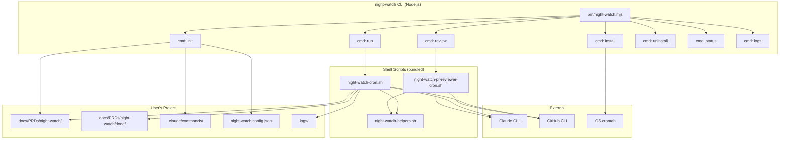
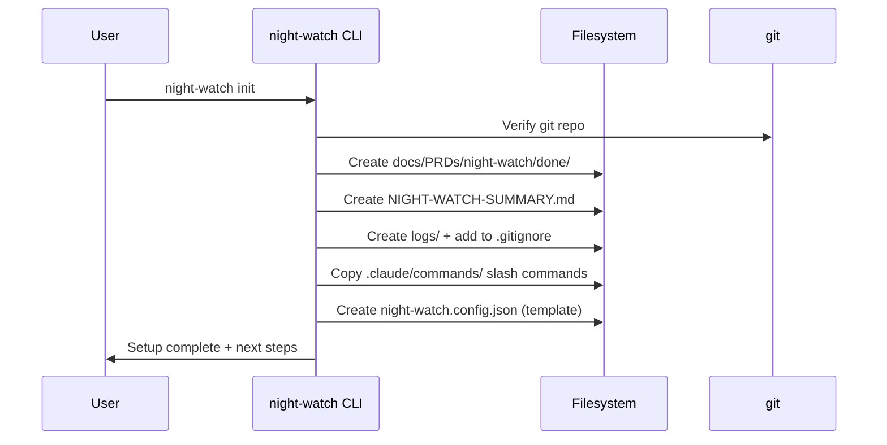
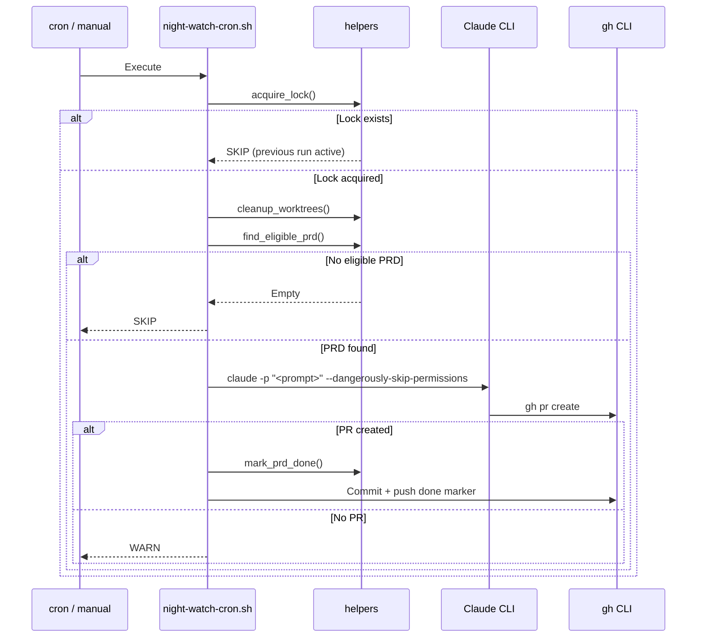

# PRD: Night Watch CLI — Standalone npm Package

**Status:** Draft
**Created:** 2026-02-14
**Author:** Principal Architect
**Complexity:** HIGH (Score: 8)

---

## 0. Project Fundamentals

**Package name:** `night-watch-cli`
**Project root:** `/home/joao/projects/night-watch-cli/` (this IS the npm package — no monorepo nesting)
**Runtime:** Node.js (via nvm)
**Language:** TypeScript (compiled to `dist/`)
**Package manager:** npm
**Test framework:** Vitest
**CLI framework:** Commander.js
**Shell core:** Bash (bundled scripts, battle-tested — NOT rewritten in JS)

### Tech Stack

| Layer | Choice | Rationale |
|-------|--------|-----------|
| CLI parsing | `commander` | Lightweight, zero-config subcommands, widely adopted |
| Build | `tsc` | Simple TS → JS compilation, no bundler needed |
| Tests | `vitest` | Fast, native TS support, no transform config |
| Shell execution | `child_process.spawn` | Stream stdout/stderr, pass env vars, capture exit codes |
| Config | JSON + env vars | No runtime deps — `fs.readFileSync` + `process.env` |
| Distribution | npm | Global install or `npx`, standard toolchain |

### Project Structure (Target)

```
night-watch-cli/
├── package.json
├── tsconfig.json
├── vitest.config.ts
├── night-watch-cli.md              # This PRD
├── bin/
│   └── night-watch.mjs             # ESM entry point shim
├── src/
│   ├── cli.ts                      # Commander.js CLI entry
│   ├── constants.ts                # Default config values, paths
│   ├── config.ts                   # Config loader (file + env + CLI)
│   ├── types.ts                    # TypeScript interfaces
│   ├── commands/
│   │   ├── init.ts
│   │   ├── run.ts
│   │   ├── review.ts
│   │   ├── install.ts
│   │   ├── uninstall.ts
│   │   ├── status.ts
│   │   └── logs.ts
│   ├── utils/
│   │   ├── shell.ts                # Bash script execution
│   │   └── crontab.ts              # Crontab read/write
│   └── __tests__/
│       ├── cli.test.ts
│       ├── config.test.ts
│       ├── commands/
│       │   ├── init.test.ts
│       │   ├── run.test.ts
│       │   ├── review.test.ts
│       │   └── status.test.ts
│       ├── utils/
│       │   └── crontab.test.ts
│       └── package.test.ts
├── scripts/                        # Bundled bash scripts (from ~/scripts/night-watch/)
│   ├── night-watch-cron.sh
│   ├── night-watch-pr-reviewer-cron.sh
│   └── night-watch-helpers.sh
├── templates/                      # Copied to target project during `init`
│   ├── night-watch.md              # Claude slash command (executor)
│   ├── night-watch-pr-reviewer.md  # Claude slash command (reviewer)
│   └── night-watch.config.json     # Config template
└── dist/                           # Compiled output (gitignored)
```

---

## 1. Context

### Problem

Night Watch is a battle-tested autonomous PRD executor that uses Claude CLI + cron to implement PRD tickets, open PRs, and fix CI failures — all while the developer sleeps. It currently exists as a set of bash scripts (`~/scripts/night-watch/`) that must be manually copied and configured per machine.

**Current pain points:**

- **Not distributable** — lives as loose bash scripts in `~/scripts/night-watch/`, must be manually cloned or copied
- **No versioning** — changes to the scripts require manual propagation to all machines
- **Setup is manual** — the `setup.sh` script works but requires users to know where it lives and how to run it
- **No discoverability** — other developers can't find or install it; it's not on npm
- **Hardcoded assumptions** — mother-ai specific references baked into the project-specific scripts
- **Configuration fragile** — env file must be manually created with exact variable names

### What Night Watch Does Today

Night Watch has two cron-driven modes:

1. **PRD Executor** (`night-watch-cron.sh`):
   - Scans `docs/PRDs/night-watch/` for `.md` files
   - Checks dependencies (`Depends on:` lines) against `done/` directory
   - Skips PRDs with open PRs already
   - Launches Claude CLI to implement the PRD on a feature branch using git worktrees
   - Verifies PR was created, moves PRD to `done/`, commits to default branch
   - Handles timeouts (2h), lock files, log rotation, cleanup

2. **PR Reviewer** (`night-watch-pr-reviewer-cron.sh`):
   - Finds open PRs on `night-watch/` or `feat/` branches
   - Checks CI status (failed checks) and review scores (< 80/100)
   - Launches Claude CLI with `/night-watch-pr-reviewer` slash command to fix issues
   - Handles lock files, timeouts (1h), cleanup

Supporting infrastructure:
- `night-watch-helpers.sh` — shared functions (logging, locking, PRD scanning, worktree cleanup, dependency resolution)
- `setup.sh` / `uninstall.sh` — crontab management per project
- `.env.night-watch` — Claude auth credentials
- `.claude/commands/night-watch.md` — Claude slash command for PRD implementation
- `.claude/commands/night-watch-pr-reviewer.md` — Claude slash command for PR review

### Files Analyzed

```
~/scripts/night-watch/
├── night-watch-cron.sh              # Project-agnostic PRD executor
├── night-watch-pr-reviewer-cron.sh  # Project-agnostic PR reviewer
├── night-watch-helpers.sh           # Shared helper functions
├── setup.sh                         # Crontab installer
├── uninstall.sh                     # Crontab remover
└── .env.night-watch                 # Auth credentials

~/projects/mother-ai/scripts/
├── night-watch-cron.sh              # Mother-AI specific version
├── night-watch-pr-reviewer-cron.sh  # Mother-AI specific version
├── night-watch-helpers.sh           # Mother-AI specific helpers
└── .env.night-watch                 # Mother-AI specific auth

~/projects/mother-ai/.claude/commands/
├── night-watch.md                   # Claude slash command (executor)
└── night-watch-pr-reviewer.md       # Claude slash command (reviewer)
```

---

## 2. Solution

### Approach

Extract night-watch into a standalone npm package (`night-watch-cli`) published on npm, installable globally via `npx` or `npm i -g`. The package will:

- Wrap all bash scripts into a single CLI with subcommands
- Provide `init`, `run`, `review`, `install`, `uninstall`, `status`, and `logs` commands
- Auto-generate `.claude/commands/` slash commands during `init`
- Manage crontab entries programmatically
- Support configuration via `night-watch.config.json` or CLI flags
- Keep the core logic in bash (proven, battle-tested) but orchestrate via Node.js CLI

### Architecture



### Key Decisions

- **Keep bash core**: The bash scripts are battle-tested and work. Node.js CLI wraps them for discoverability, config, and distribution — it does NOT rewrite the logic in JS.
- **Single binary**: `npx night-watch <command>` — no global install required (but supported).
- **Config file**: `night-watch.config.json` in project root for project-specific settings. CLI flags override config. Env vars override both.
- **Slash commands bundled**: `init` copies the `.claude/commands/` markdown files into the project so Claude knows how to execute PRDs.
- **Claude provider flexibility**: The `claude` config block allows pointing to alternative API endpoints and models (e.g., `glm-5` via `api.z.ai`). The CLI injects these as env vars (`ANTHROPIC_AUTH_TOKEN`, `ANTHROPIC_BASE_URL`, etc.) when spawning bash scripts, so the `claude` CLI inside picks them up. This replaces the old `.env.night-watch` file pattern.
- **No runtime dependencies**: Only `commander` for CLI parsing. Everything else is bash + Node.js built-ins.
- **Flat package**: Project root IS the npm package (no monorepo / `packages/` nesting). Keeps things simple for a single-purpose tool.

### Data Changes

None — night-watch is file-based (markdown PRDs, log files, lock files).

---

## 3. Sequence Flows

### `night-watch init`



### `night-watch run` (cron or manual)



---

## 4. Execution Phases

### Phase 1: Package Scaffolding + CLI Entry Point

**User-visible outcome:** `npx night-watch --help` shows available commands.

**Files (5):**
- `package.json` — package metadata, bin entry
- `tsconfig.json` — TypeScript config
- `src/cli.ts` — Commander.js CLI with subcommands
- `src/constants.ts` — default config values, paths
- `README.md` — usage docs

**Implementation:**
- [ ] Initialize `package.json` (name: `night-watch-cli`, bin: `night-watch`)
- [ ] Add `commander` as dependency
- [ ] Create CLI entry point with subcommands: `init`, `run`, `review`, `install`, `uninstall`, `status`, `logs`
- [ ] Each command is a placeholder that prints "Not implemented yet"
- [ ] Add `build` script that compiles TS to `dist/`
- [ ] Verify `npx . --help` works from package directory

**Tests Required:**

| Test File | Test Name | Assertion |
|-----------|-----------|-----------|
| `src/__tests__/cli.test.ts` | `should show help text with all commands` | Output contains init, run, review, install, uninstall, status, logs |
| `src/__tests__/cli.test.ts` | `should show version` | `--version` returns package version |

**Verification Plan:**
1. Unit test: CLI parses commands correctly
2. Manual: `npx tsx src/cli.ts --help`

---

### Phase 2: Bundle Bash Scripts + Config System

**User-visible outcome:** Bash scripts are bundled inside the package and config can be loaded from `night-watch.config.json`.

**Files (5):**
- `scripts/night-watch-cron.sh` — bundled cron runner (from `~/scripts/night-watch/`)
- `scripts/night-watch-pr-reviewer-cron.sh` — bundled PR reviewer
- `scripts/night-watch-helpers.sh` — bundled helpers
- `src/config.ts` — config loader (file + env + CLI flags)
- `src/types.ts` — TypeScript interfaces for config

**Implementation:**
- [ ] Copy the generic bash scripts from `~/scripts/night-watch/` into `scripts/`
- [ ] Modify scripts to accept config via environment variables instead of hardcoded paths (they already mostly do this)
- [ ] Remove the `.env.night-watch` sourcing from bash scripts — the Node.js CLI now injects Claude provider env vars into the spawned process environment (from config file / CLI flags / env vars). This is cleaner than a separate dotenv file.
- [ ] Create `INightWatchConfig` interface with all configurable values:
  ```typescript
  interface INightWatchConfig {
    // PRD execution
    prdDir: string;           // default: "docs/PRDs/night-watch"
    maxBudget: number;        // default: 5.00
    reviewerMaxBudget: number;// default: 3.00
    maxRuntime: number;       // default: 7200
    reviewerMaxRuntime: number;// default: 3600
    branchPrefix: string;     // default: "night-watch"
    branchPatterns: string[]; // default: ["feat/", "night-watch/"]
    minReviewScore: number;   // default: 80
    maxLogSize: number;       // default: 524288

    // Cron scheduling
    cronSchedule: string;     // default: "0 0-15 * * *"
    reviewerSchedule: string; // default: "0 0,3,6,9,12,15 * * *"

    // Claude provider configuration
    // Allows using alternative API endpoints/models (e.g., glm-5 via api.z.ai)
    claude: {
      apiKey?: string;        // default: undefined (use Claude CLI's default)
      baseUrl?: string;       // default: undefined (use Claude CLI's default)
      timeout?: number;       // default: undefined (use Claude CLI's default)
      opusModel?: string;     // default: undefined (e.g., "glm-5")
      sonnetModel?: string;   // default: undefined (e.g., "glm-5")
    };
  }
  ```
  The `claude` provider config maps to env vars that the Claude CLI reads:
  - `claude.apiKey` → `ANTHROPIC_AUTH_TOKEN`
  - `claude.baseUrl` → `ANTHROPIC_BASE_URL`
  - `claude.timeout` → `API_TIMEOUT_MS`
  - `claude.opusModel` → `ANTHROPIC_DEFAULT_OPUS_MODEL`
  - `claude.sonnetModel` → `ANTHROPIC_DEFAULT_SONNET_MODEL`

  These env vars are injected into the shell environment when spawning bash scripts, so they're picked up by the `claude` CLI invocations inside the scripts. This replaces the old `.env.night-watch` file pattern — no separate env file needed.
- [ ] Config loader: reads `night-watch.config.json` from project root, merges with defaults, env vars override

**Tests Required:**

| Test File | Test Name | Assertion |
|-----------|-----------|-----------|
| `src/__tests__/config.test.ts` | `should return defaults when no config file` | All values match defaults |
| `src/__tests__/config.test.ts` | `should merge config file with defaults` | File values override defaults |
| `src/__tests__/config.test.ts` | `should let env vars override config file` | Env takes precedence |
| `src/__tests__/config.test.ts` | `should load claude provider config from file` | `claude.apiKey`, `baseUrl`, `opusModel` populated |
| `src/__tests__/config.test.ts` | `should let ANTHROPIC_* env vars override claude config` | Direct env vars win over config file |

**Verification Plan:**
1. Unit tests for config loading
2. Verify bash scripts are included in package build output

---

### Phase 3: `init` Command

**User-visible outcome:** Running `night-watch init` in any git repo sets up all directories, slash commands, and config template.

**Files (4):**
- `src/commands/init.ts` — init command implementation
- `templates/night-watch.md` — Claude slash command template (executor)
- `templates/night-watch-pr-reviewer.md` — Claude slash command template (reviewer)
- `templates/night-watch.config.json` — config template

**Implementation:**
- [ ] Verify current directory is a git repo
- [ ] Verify `gh` CLI is authenticated
- [ ] Verify `claude` CLI is available
- [ ] Create `docs/PRDs/night-watch/done/`
- [ ] Create `NIGHT-WATCH-SUMMARY.md` if missing
- [ ] Create `logs/` and add to `.gitignore`
- [ ] Copy slash command templates to `.claude/commands/` — templates are project-agnostic (use `${PROJECT_DIR}`, `${PROJECT_NAME}`, `${DEFAULT_BRANCH}` placeholders resolved at runtime, not hardcoded paths like `mother-ai`)
- [ ] Create `night-watch.config.json` with defaults + empty `claude` block for user to fill in
- [ ] Print summary of what was created + next steps (including hint about `claude` config for custom providers)
- [ ] Make init idempotent (skip existing files, don't overwrite)

**Tests Required:**

| Test File | Test Name | Assertion |
|-----------|-----------|-----------|
| `src/__tests__/commands/init.test.ts` | `should create PRD directory structure` | dirs exist after init |
| `src/__tests__/commands/init.test.ts` | `should copy slash command templates` | .claude/commands/ files exist |
| `src/__tests__/commands/init.test.ts` | `should be idempotent` | Running twice doesn't error or overwrite |
| `src/__tests__/commands/init.test.ts` | `should fail if not a git repo` | Exits with error |

**Verification Plan:**
1. Unit tests with temp directories
2. Manual: run `night-watch init` in a test git repo, verify all files created

---

### Phase 4: `run` and `review` Commands

**User-visible outcome:** `night-watch run` executes the PRD cron script, `night-watch review` executes the PR reviewer script — both usable manually or from cron.

**Files (3):**
- `src/commands/run.ts` — run command (wraps night-watch-cron.sh)
- `src/commands/review.ts` — review command (wraps night-watch-pr-reviewer-cron.sh)
- `src/utils/shell.ts` — shell execution utility

**Implementation:**
- [ ] `run` command: loads config, sets env vars from config, executes bundled `night-watch-cron.sh` via `child_process.spawn`
- [ ] `review` command: same pattern for `night-watch-pr-reviewer-cron.sh`
- [ ] Both pass project dir as first argument to the bash scripts
- [ ] Support `--dry-run` flag that runs `find_eligible_prd` / PR check without launching Claude
- [ ] Support `--budget` flag to override max budget
- [ ] Support `--timeout` flag to override max runtime
- [ ] Support Claude provider flags: `--api-key`, `--api-url`, `--model` (sets both opus/sonnet)
- [ ] Shell utility: spawns bash scripts with proper env, streams stdout/stderr, returns exit code
- [ ] Shell utility injects Claude provider env vars (`ANTHROPIC_AUTH_TOKEN`, `ANTHROPIC_BASE_URL`, `API_TIMEOUT_MS`, `ANTHROPIC_DEFAULT_OPUS_MODEL`, `ANTHROPIC_DEFAULT_SONNET_MODEL`) from resolved config into the spawned process environment — this is how custom providers (like glm-5 via api.z.ai) get passed to the `claude` CLI invocations inside the bash scripts

**Tests Required:**

| Test File | Test Name | Assertion |
|-----------|-----------|-----------|
| `src/__tests__/commands/run.test.ts` | `should pass project dir to bash script` | Script receives correct path |
| `src/__tests__/commands/run.test.ts` | `should pass config as env vars` | Env vars set correctly |
| `src/__tests__/commands/run.test.ts` | `should inject claude provider env vars` | `ANTHROPIC_AUTH_TOKEN`, `ANTHROPIC_BASE_URL`, etc. set in spawned env |
| `src/__tests__/commands/run.test.ts` | `should respect --dry-run flag` | Claude CLI not invoked |
| `src/__tests__/commands/run.test.ts` | `should respect --model flag` | Sets both `ANTHROPIC_DEFAULT_OPUS_MODEL` and `ANTHROPIC_DEFAULT_SONNET_MODEL` |
| `src/__tests__/commands/review.test.ts` | `should execute reviewer script` | Script spawned correctly |

**Verification Plan:**
1. Unit tests with mocked `child_process`
2. Manual: `night-watch run --dry-run` shows eligible PRDs without executing

---

### Phase 5: `install`, `uninstall`, `status`, and `logs` Commands

**User-visible outcome:** `night-watch install` adds crontab entries, `uninstall` removes them, `status` shows current state, `logs` tails the log file.

**Files (5):**
- `src/commands/install.ts` — crontab installer
- `src/commands/uninstall.ts` — crontab remover
- `src/commands/status.ts` — status dashboard
- `src/commands/logs.ts` — log viewer
- `src/utils/crontab.ts` — crontab read/write utility

**Implementation:**
- [ ] `install`: reads config for schedule, adds crontab entries with project marker comment. Uses `night-watch run` and `night-watch review` as the cron commands (so npm-installed bin is used)
- [ ] `uninstall`: removes crontab entries matching project marker
- [ ] `status`: shows current lock files, last log entries, crontab entries, eligible PRDs count, open PRs count
- [ ] `logs`: tails the night-watch log file with optional `--follow` flag and `--reviewer` flag for PR reviewer logs
- [ ] Crontab utility: safe read/modify/write with backup

**Tests Required:**

| Test File | Test Name | Assertion |
|-----------|-----------|-----------|
| `src/__tests__/utils/crontab.test.ts` | `should parse existing crontab` | Returns entries array |
| `src/__tests__/utils/crontab.test.ts` | `should add entries without duplicates` | Idempotent install |
| `src/__tests__/utils/crontab.test.ts` | `should remove entries by marker` | Clean uninstall |
| `src/__tests__/commands/status.test.ts` | `should show lock file status` | Displays PID or "not running" |

**Verification Plan:**
1. Unit tests with mocked crontab
2. Manual: `night-watch install && crontab -l | grep night-watch`

---

### Phase 6: npm Publish Readiness + Docs

**User-visible outcome:** Package can be published to npm and installed globally with `npm i -g night-watch-cli`.

**Files (4):**
- `package.json` — finalize metadata (repository, keywords, license, files)
- `README.md` — comprehensive usage docs
- `bin/night-watch.mjs` — ESM entry point shim
- `.npmignore` — exclude test files, src (only dist + scripts)

**Implementation:**
- [ ] Finalize `package.json`: name, version, description, keywords, repository, license (MIT), bin, files
- [ ] Create ESM bin shim that imports compiled CLI
- [ ] Write README with: Quick Start, Commands Reference, Configuration, PRD Format, How It Works, Troubleshooting
- [ ] `.npmignore`: exclude `src/`, `__tests__/`, `tsconfig.json`, keep `dist/` and `scripts/`
- [ ] Add `prepublishOnly` script that runs build + test
- [ ] Test `npm pack` produces clean tarball

**Tests Required:**

| Test File | Test Name | Assertion |
|-----------|-----------|-----------|
| `src/__tests__/package.test.ts` | `should include scripts in package` | `npm pack --dry-run` lists scripts/ |
| `src/__tests__/package.test.ts` | `should have valid bin entry` | bin path resolves to existing file |

**Verification Plan:**
1. `npm pack` and inspect tarball contents
2. `npm install -g ./night-watch-cli-*.tgz && night-watch --help`

---

## 5. CLI Reference (Target API)

```bash
# Setup
night-watch init                    # Initialize night-watch in current project
night-watch install                 # Add crontab entries
night-watch uninstall               # Remove crontab entries

# Execution
night-watch run                     # Run PRD executor now
night-watch run --dry-run           # Show what would be processed
night-watch run --budget 3.00       # Override budget
night-watch run --timeout 3600      # Override max runtime (seconds)
night-watch review                  # Run PR reviewer now
night-watch review --dry-run        # Show PRs needing work

# Claude provider overrides (run & review commands)
night-watch run --api-key "key"     # Custom API key
night-watch run --api-url "url"     # Custom API endpoint
night-watch run --model "glm-5"    # Sets both opus and sonnet model

# Monitoring
night-watch status                  # Show current state
night-watch logs                    # Tail executor log
night-watch logs --reviewer         # Tail reviewer log
night-watch logs --follow           # Follow log in real-time

# Help
night-watch --help                  # Show all commands
night-watch <command> --help        # Command-specific help
```

---

## 6. Config File Format

`night-watch.config.json` in project root:

```json
{
  "prdDir": "docs/PRDs/night-watch",
  "maxBudget": 5.00,
  "reviewerMaxBudget": 3.00,
  "maxRuntime": 7200,
  "reviewerMaxRuntime": 3600,
  "cronSchedule": "0 0-15 * * *",
  "reviewerSchedule": "0 0,3,6,9,12,15 * * *",
  "branchPrefix": "night-watch",
  "branchPatterns": ["feat/", "night-watch/"],
  "minReviewScore": 80,
  "claude": {
    "apiKey": "your-api-key-here",
    "baseUrl": "https://api.z.ai/api/anthropic",
    "timeout": 3000000,
    "opusModel": "glm-5",
    "sonnetModel": "glm-5"
  }
}
```

**Precedence order:** CLI flags > Environment variables > Config file > Defaults

### Environment variable overrides (prefixed with `NW_`):

**Execution config:**
- `NW_MAX_BUDGET` → `maxBudget`
- `NW_REVIEWER_MAX_BUDGET` → `reviewerMaxBudget`
- `NW_MAX_RUNTIME` → `maxRuntime`
- `NW_REVIEWER_MAX_RUNTIME` → `reviewerMaxRuntime`
- `NW_CRON_SCHEDULE` → `cronSchedule`
- `NW_REVIEWER_SCHEDULE` → `reviewerSchedule`

**Claude provider config (direct env vars — same ones Claude CLI reads):**
- `ANTHROPIC_AUTH_TOKEN` → `claude.apiKey`
- `ANTHROPIC_BASE_URL` → `claude.baseUrl`
- `API_TIMEOUT_MS` → `claude.timeout`
- `ANTHROPIC_DEFAULT_OPUS_MODEL` → `claude.opusModel`
- `ANTHROPIC_DEFAULT_SONNET_MODEL` → `claude.sonnetModel`

These env vars use the standard Claude CLI names (not `NW_` prefixed) so existing setups (like the `gclaude` alias pattern) work seamlessly. If both an `NW_` config and a direct env var are set, the direct env var wins (it's what Claude CLI actually reads).

---

## 7. Acceptance Criteria

- [ ] `npm i -g night-watch-cli && night-watch --help` works
- [ ] `night-watch init` sets up a project from scratch
- [ ] `night-watch run --dry-run` shows eligible PRDs
- [ ] `night-watch run` executes PRD implementation via Claude CLI
- [ ] `night-watch run --model glm-5 --api-url https://api.z.ai/api/anthropic --api-key KEY` uses custom provider
- [ ] `night-watch review --dry-run` shows PRs needing work
- [ ] `night-watch review` fixes CI failures and low review scores
- [ ] `night-watch install` adds crontab entries
- [ ] `night-watch uninstall` removes crontab entries
- [ ] `night-watch status` shows current state
- [ ] `night-watch logs` shows log output
- [ ] Config file is respected for all settings (including `claude` provider block)
- [ ] Claude provider env vars from config are injected into spawned bash processes
- [ ] All tests pass
- [ ] Package publishes to npm cleanly
